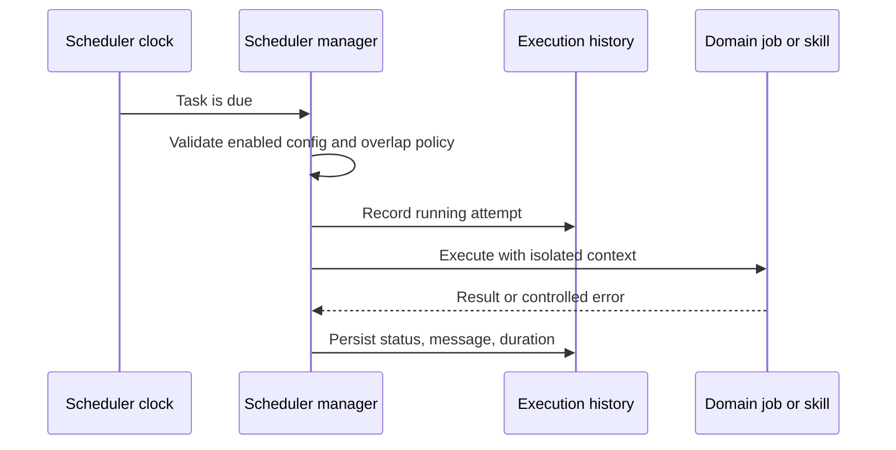

# Automatització i planificació

## Responsabilitat

El planificador executa les tasques configurades, conserva l'historial i exposa
l'estat operatiu de la sincronització, publicació, ingestió, manteniment i
actualització de la planificació.

La funcionalitat d'automatitzacions conté la pantalla del planificador i la
conversió d'intervals. El centre de control conté el tauler operatiu, l'historial,
els membres i els diàlegs de directives. Les entrades de ruta es carreguen sota
demanda i els adaptadors compartits preserven identificadors, unitats, permisos i
payloads. Moure una pantalla no habilita tasques ni inicia treballs.

Les metadades, l'estat persistent i la frontera opcional de notificacions tenen
contractes tipats. El gestor valida les definicions heretades abans de construir
tasques d'execució i es manté dins del límit de mida de codi.

## Model de tasca

Cada definició té identitat estable, estat habilitat, planificació, operació,
configuració i política d'execució. L'historial registra inici, finalització,
estat, missatge i durada. Les definicions s'alineen amb les connexions abans
d'executar-se per evitar utilitzar integracions eliminades o equivocades.

## Flux d'execució

Les operacions han de ser idempotents quan es puguin repetir. El gestor controla
els solapaments segons la política de tasca i utilitza contextos nous de base de
dades o proveïdor. Després d'un reinici, reconcilia la configuració persistent.

L'arrencada nativa activa el planificador per defecte. Les proves deterministes
i els diagnòstics amb dades locals poden establir `GNOSI_DISABLE_SCHEDULER=1`
per comprovar API i interfície sense executar integracions pendents. Aquest
interruptor no modifica la configuració desada.

El gestor conserva el cicle de vida, la persistència, els solapaments i
l'historial; `task_handlers.py` conté el despatx i les operacions grans,
inclòs el manteniment, sense acoblar-les al fil del planificador.

Les notificacions passen per una frontera de plataforma independent del
proveïdor. La persistència en base de dades i Markdown funciona a tots els hosts;
les alertes natives de macOS són opcionals. Els logs Markdown viuen sota
`GNOSI_DATA_DIR`, no dins d'un Vault de OneDrive, Google Drive, Nextcloud,
Dropbox o altres proveïdors. La fallada d'un canal no bloqueja els altres.
L'antic camí de l'habilitat de notificacions és una façana de compatibilitat.

## Sincronització acadèmica i actualitzacions de revisions

`academic_repository_sync` és un treball persistent i reprenable per als índexs
OAI locals. Conserva cursor, recomptes, error, cancel·lació i darrera sincronització
correcta fora de la petició. Un administrador inicia la primera recol·lecció;
després, la tasca incremental diària continua des del darrer punt complet i
aplica les marques d'eliminació OAI.

Les estratègies desades poden programar `academic_review_update`. Cada execució
reprodueix l'estratègia versionada, registra activitat i errors parcials per font
i afegeix només candidats amb una identitat nova per a aquella revisió. La
propera execució es desa amb la configuració de la revisió.

La cua exigeix una arrel `LOCAL_DATA` explícita i falla abans d'obrir SQLite si
falta configuració. Els adaptadors validen els payloads abans de despatxar-los i
rebutgen registres sense una funció executable. La sincronització de contactes
passa explícitament base de dades, workspace i integració per evitar confondre
els arguments.

Els treballs acadèmics resolen el Vault actiu abans d'accedir a literatura. Sense
Vault, registren una omissió estructurada amb zero treballs en lloc de construir
`Path(None)`. La recuperació de la cua del Reader comprova que el document del
treball existeix; els registres orfes no creen fils que fallaran repetidament.

## Automatitzacions del Vault

Les regles combinen desencadenants, condicions i accions. Les fórmules i els
rollups s'avaluen de manera determinista, no com a codi arbitrari. Les accions
externes o destructives mantenen els mateixos límits d'autorització i confirmació
que les accions interactives.

## Treball autònom de qualitat

Les tasques programades poden diagnosticar, generar informes o aplicar canvis
dins del seu àmbit. La programació no amplia els permisos sobre fitxers, secrets,
Git o publicacions.

## Límit del manteniment per dispositiu

`system_maintenance` buida la memòria cau de l'aplicació i trunca únicament el
fitxer ordinari `logs/gnosi.log`, amb un sol enllaç físic, sota el
`GNOSI_DATA_DIR` canònic, només si és el `LOG_FILE` configurat.
Conserva l'inode perquè el logger continuï escrivint.
Ni els directoris ni el fitxer poden ser enllaços simbòlics. Si el camí és invàlid
o la plataforma no disposa d'operacions segures relatives a un directori, omet la
neteja de disc.

No neteja codi font, bytecode, logs configurats en altres ubicacions, bústies
privades del workspace, bases de dades, secrets, documents del Vault ni carpetes
sincronitzades. Els comptadors heretats de bústia, temporals i bytecode es
conserven amb valor zero. Retirar checkouts antics és una operació separada i
revisada del workspace, no una tasca programada de l'aplicació.

## Generació diària d'àudio

El servei de pòdcast del Reader selecciona model i idioma amb contractes tipats,
limita els treballadors TTS per frase i substitueix l'MP3 atòmicament. Captura el
Vault seleccionat abans de començar i rebutja l'arrencada sense Vault actiu.

## Invariants

- Les tasques deshabilitades o invàlides no s'executen.
- Cada execució té un resultat persistent a l'historial.
- Els reintents no dupliquen efectes externs sense una estratègia d'idempotència.
- Eliminar o reassignar connexions actualitza les planificacions dependents.
- Les zones horàries tenen semàntica explícita.
- Les excepcions no interrompen el bucle del planificador.
- Els treballs no reutilitzen sessions de base de dades d'una petició.
- Cancel·lar una recol·lecció OAI conserva el cursor per reprendre-la.
- Repetir una revisió no duplica resultats ja identificats.

## Verificació

Comproveu configuració, connexions, intervals, historial, solapaments, zones
horàries, reintents, represa i cancel·lació OAI, marques d'eliminació, detecció de
nous resultats i confinament del manteniment. Executeu també les proves
d'automatització de Playwright i una integració representativa de principi a fi
amb dades sintètiques o un compte de proves.
