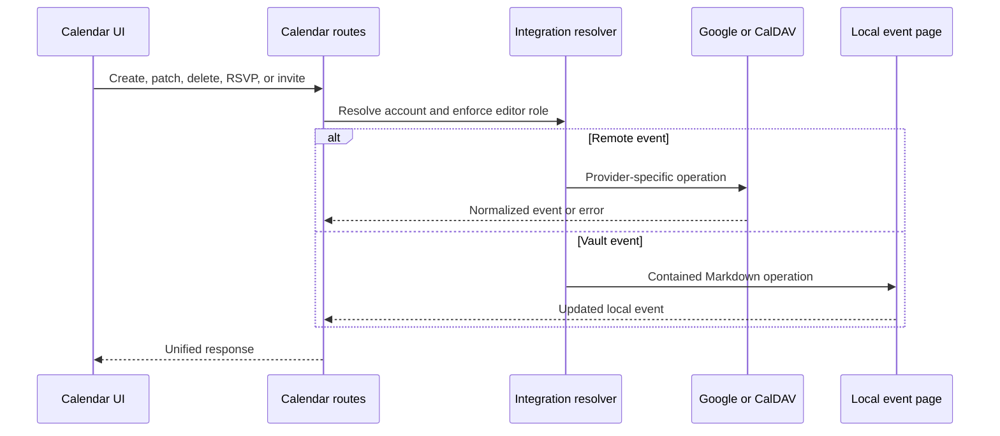

# Calendari i reunions

## Reversió

Els esdeveniments de calendari agrega els esdeveniments locals amb contactes de Google Calendar i CalDAV. Permet la selecció de calendari, les invitacions de l' esdeveniment, les explondes, les consultes de lliure/buss, geocoding, recordatoris, estat ocult, exportació d' exportació, la reunió, la transcripció i les notes de l' IA- validades.

## Esdeveniment agregregació

La capa de ruta resol el context de l' espai de treball i les integració seleccionades, després normalitza els esdeveniments del proveïdor i els esdeveniments locals Markdown en una resposta compartida. Els identificadors del proveïdor es troben aparellats amb el seu origen del compte/calendar, un ID únic no és prou únic globalment per a la mutació.

Els esdeveniments ocults són registres de recobriment locals. Ocultar no esborra un esdeveniment del proveïdor. El no Oculta elimina el recobriment de manera que la següent acceleració ho inclogui de nou.

## Flux de la mutació

Els esdeveniments de dia complet de Google utilitzen una data de finalització exclusiva, mentre que el formulari de Gnosi presenta l'últim dia de manera inclusiva. La conversió es fa una sola vegada al límit del proveïdor: les peticions afegeixen un dia abans d'escriure a Google i les respostes en resten un abans de renderitzar. Les ocurrències d'aniversari s'actualitzen mitjançant el seu esdeveniment recurrent mestre; les dates gestionades per Google Contacts continuen sota control del proveïdor, mentre que els camps compatibles, com el títol, encara es poden actualitzar.

## Recordatoris i notes de reunió@ info: whatsthis

Els arranjaments del recordatori seleccionen el temps i el comportament. La col· lecció fusionarà els esdeveniments propers i despensi els requeriments recurrents per tal que els recordatoris duplicats no siguin creats. El visor de la botiga mostra recordatoris actius i pot navegar fins al calendari o rebutjar- los. @ info

S' han vinculat les pujades d' àudio a un flux de treball de fons. Les enquestes d' estat a part de gravació, transcripcions, sumatori, creació de notes, compleció i fallada. Les notes generades s' escriuen a través d' operacions de seguretat de la terminal Vulta i es manté el context de l' esdeveniment/ font.

## Invariants

- El proveïdor d' esdeveniments inclou compte i context del calendari.
- Els finals exclusius dels esdeveniments de dia complet no arriben mai al model inclusiu de la interfície.
- Les dates d'aniversari gestionades pels contactes es conserven en actualitzar esdeveniments recurrents.
- El calendari escriu que requereix un context executable.
- Els esdeveniments locals basats en camins es queden dins de la volta activa.
- Ocultar és local i reversible; l' eliminació utilitza el proveïdor autoriu.
- Els recordatoris són de seguretat racial i no duplicats pel mateix esdeveniment/ window. @ info
- Falta la transcripció o els proveïdors de l'AI han fallat la feina de reunió, no el calendari.
- La sortida ICS utilitza zones horàries normalitzades i no exposen credencials privades.

## Concentrat de verificació

Prova el contenidor de la ruta local, esdeveniment normalització, repetició, estat ocult, dependències de recordatori, selecció de comptes, zones horàries i crea/ info/ repetició de la ruta local. S' hauria de gravar o pujar un estat de fons d' anàlisi, observar l' estat resultant de la pàgina Vulta.
