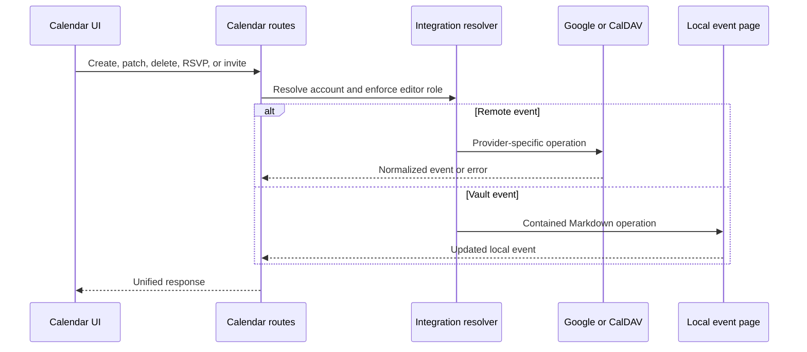

# Calendari i reunions

## Responsabilitat

Calendari agrega els esdeveniments locals del vault amb els comptes connectats
de Google Calendar i CalDAV. Permet seleccionar calendaris, crear, llegir,
actualitzar i eliminar esdeveniments, gestionar invitacions i respostes RSVP,
consultar disponibilitat, geocodificar, generar recordatoris, ocultar esdeveniments,
exportar ICS, gravar reunions, transcriure-les i generar notes amb IA.

El frontend amb tipatge estricte `features/calendar/` gestiona la pàgina de
calendari, la selecció de fonts, la cerca, la coordinació de recurrències i els
diàlegs. L'entrada pública conserva el límit de càrrega diferida original.
Els renderitzadors utilitzats també per Vault i Correu es mantenen compartits
fora de la funcionalitat de ruta; els adaptadors de proveïdor, els observadors
de recordatoris i els payloads d'esdeveniment no canvien.

`features/meetings/` gestiona la gravadora flotant, el controlador de captura
i pujada i la presentació de recordatoris. La seva entrada pública difereix
independentment els mòduls de gravació i recordatoris. L'estructura principal
els munta amb els mateixos controls de plugins; el trasllat no canvia permisos
de gravació, sondeig, navegació ni payloads.

La frontera HTTP està tipada estrictament i conserva el contracte de resposta
existent. La normalització d'etiquetes de Photon, el rebuig d'URL, la validació
de resultats i la deduplicació pertanyen al domini de geocodificació de
Calendar, no al mòdul de rutes; els payloads dels proveïdors es validen en
aquesta frontera d'adaptació.

El servei híbrid de proveïdors està estrictament tipat i manté Google com un
adaptador al costat del CalDAV genèric. La detecció de comptes CalDAV admet així
Nextcloud, iCloud, Fastmail, Radicale i servidors compatibles mitjançant URL
configurats, sense comportament lligat al proveïdor d'emmagatzematge.

La còpia opcional de Google al vault concreta els payloads de calendari i
esdeveniment abans d'accedir al sistema de fitxers, exigeix un vault configurat,
utilitza els identificadors del proveïdor com a noms estables de fitxer i
confina les carpetes de compte i calendari sota `Calendar/External`. Omet les
identitats absents i cada carpeta de calendari només elimina les files Markdown
obsoletes de la finestra acotada de sincronització.

## Agregació d'esdeveniments

La capa de rutes resol el context de l'espai de treball i les integracions
seleccionades i normalitza els esdeveniments dels proveïdors i del Markdown
local en una resposta compartida. Els identificadors del proveïdor es mantenen
vinculats al compte i calendari d'origen; un ID sol no és prou únic globalment
per fer una mutació.

Els esdeveniments ocults són registres d'una capa local superposada. Ocultar
no elimina l'esdeveniment del proveïdor. Tornar-lo a mostrar elimina aquesta
capa perquè l'agregació següent el torni a incloure.

## Flux de mutació

## Recordatoris i notes de reunió

La configuració dels recordatoris selecciona l'antelació i el comportament.
La recollida combina els esdeveniments propers i deduplica peticions concurrents
per evitar recordatoris duplicats. L'observador del frontend mostra els actius
i permet navegar al calendari o descartar-los.

La persistència dels recordatoris concreta el seu estat JSON en configuració,
claus ja notificades i objectes de recordatori actiu explícits. Les dades
temporals del proveïdor s'interpreten en un únic límit, les etiquetes dels
assistents es normalitzen a cadenes i la sortida d'IA es converteix abans de
desar-la. El bloqueig de tot el cicle i la fusió amb l'estat actualitzat
continuen governant les curses entre planificador i API.

La gravació puja àudio de mida acotada a un flux en segon pla. El sondeig
d'estat distingeix gravació, transcripció, resum, creació de notes, finalització
i fallada. Les notes generades s'escriuen amb operacions segures del vault i
conserven el context d'esdeveniment i font. El servei en segon pla normalitza
el resultat de la ruta antiga de Vault a un mapatge concret abans de llegir
l'identificador de pàgina creada; els gestors dinàmics de compatibilitat no
arriben al límit tipat del treball. Les respostes de gravació i sondeig passen
per models Pydantic específics i retornen els mateixos diccionaris directament
indexables que utilitzen els consumidors existents.

## Invariants

- La identitat d'esdeveniment del proveïdor inclou el compte i el calendari.
- Les escriptures de calendari requereixen un context amb permisos d'edició.
- Els esdeveniments locals basats en rutes es mantenen dins del vault actiu.
- Ocultar és local i reversible; eliminar utilitza el proveïdor autoritatiu.
- Els recordatoris toleren la concurrència i no es dupliquen per al mateix esdeveniment i finestra temporal.
- L'absència de proveïdors de transcripció o IA fa fallar el treball de reunió, no el calendari.
- La sortida ICS utilitza zones horàries normalitzades i no exposa credencials privades.

## Aspectes que cal verificar

Proveu el confinament de rutes locals, la normalització d'esdeveniments, les
recurrències, l'estat ocult, les curses de recordatoris, la selecció de comptes,
les zones horàries i els fluxos de creació, edició i eliminació amb Playwright.
La QA de reunions ha de gravar o pujar un fitxer de prova, observar l'estat en
segon pla i verificar la pàgina resultant del vault.
