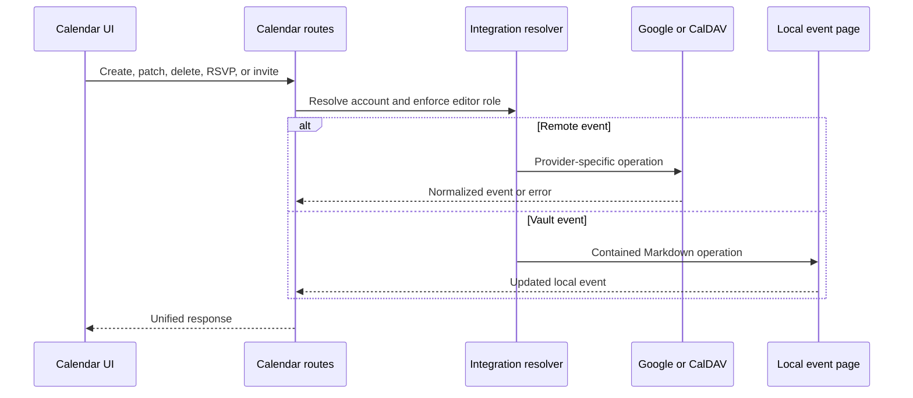

# Calendari i reunions

## Reversió

Els esdeveniments de calendari agrega els esdeveniments locals amb contactes de Google Calendar i CalDAV. Permet la selecció de calendari, les invitacions de l' esdeveniment, les explondes, les consultes de lliure/buss, geocoding, recordatoris, estat ocult, exportació d' exportació, la reunió, la transcripció i les notes de l' IA- validades.

El escrit estrictament `features/calendar/` El frontal és propietari de la pàgina de calendari, selecció d' origen, cerca, coordinació i diàlegs de la pàgina. La seva entrada pública manté el límit d' enviament mandrós original. Els renderitzadors de calendari també consumeixen per Vulta i correu que es comparteixen fora de la característica de ruta; els proveïdors d' adaptadors, els vigilants de recordatoris i els esdeveniments no canvien.

`features/meetings/` El seu controlador de captura/ droga, i presentació de recordatoris. La seva entrada pública de registre i mòduls de recordatori independentment. L' intèrpret d' ordres els munta a través de les mateixes portes de connectors que abans; la relocalització no canvia els permisos de gravació, l' enquestament, la navegació o els carregadors.

El límit HTTP és estrictament teclejat mentre es preserva el contracte de resposta existent. L' etiqueta Photon etiqueta normalization, rebuig d' URL, validació de resultats i desenganyació pertanyen al domini de calendari en comptes del mòdul de ruta; els proveïdors de proveïdors encara segueixen validats en aquest límit d' adaptador.

El servei de proveïdor híbrid és estrictament escrit i manté Google com un adaptador al costat de la detecció genèrica de comptes CalDAV. CalDAV, per tant, implementa el Nextcloud, iCloud, Fmail ràpid, els servidors radicals i compatibles mitjançant URL configurats, sense bodefinar el comportament específic de l' espai de treball d' emmagatzematge.

La ruta híbrid consultes externes directament als proveïdors. Obrir el calendari no inicia un segon mirall de proveïdor a Vulta, de manera que les actualitzacions de pàgina no poden duplicar o retardar Google i CalDAV llegeix. La marca existent a sota `Calendar/External` Encara hi ha dades d'usuari i mai s' esborra aquesta transició, però el temps d' execució web ja no refresca el mirall antic.

## Esdeveniment agregregació

La capa de ruta resol el context de l' espai de treball i les integració seleccionades, després normalitza els esdeveniments del proveïdor i els esdeveniments locals Markdown en una resposta compartida. Els identificadors del proveïdor es troben aparellats amb el seu origen del compte/calendar, un ID únic no és prou únic globalment per a la mutació.

Els esdeveniments ocults són registres de recobriment locals. Ocultar no esborra un esdeveniment del proveïdor. El no Oculta elimina el recobriment de manera que la següent acceleració ho inclogui de nou.

## Flux de la mutació

## Recordatoris i notes de reunió@ info: whatsthis

Els arranjaments del recordatori seleccionen el temps i el comportament. La col· lecció fusionarà els esdeveniments propers i despensi els requeriments recurrents per tal que els recordatoris duplicats no siguin creats. El visor de la botiga mostra recordatoris actius i pot navegar fins al calendari o rebutjar- los. @ info

El recordatori persisteix a l' estat JSON en arranjaments explícits, claus no confirmades i objectes de recordatori actius. L' anàlisi del temps accepta els valors del proveïdor a un límit, les etiquetes de l' assistent són normalitzades a cadenes, i la sortida de l' IA s' ha convertit abans d' emmagatzemar. La blocació de cicle i el flux d' estat fresc romanen l' autoritat per al planificador/ racesAPI.

Les pujades de la junta han lligat àudio a un flux de treball de fons. Els col· legis electorals de l' estat s' apliquen, la transcripció, la suma de notes, la creació de la compleció i el fracàs. Les notes generades s' escriuen a través de les operacions de seguretat Vulta i es mantenen en el context de l' esdeveniment/ codi. El servei de fons normalitza el resultat de la ruta de la crida a un mapatge de formigó abans de llegir l' identificador creat de pàgina; els gestors dinàmics de compatibilitat no es filtra en el límit de treball teclejat. Enregistra i les respostes electorals passen per models Pytant mentre tornen a la mateixa índex directament emprada pels diccionaris que es poden llegir els existents.

## Invariants

- El proveïdor d' esdeveniments inclou compte i context del calendari.
- El calendari escriu que requereix un context executable.
- Els esdeveniments locals basats en camins es queden dins de la volta activa.
- Ocultar és local i reversible; l' eliminació utilitza el proveïdor autoriu.
- Els recordatoris són de seguretat racial i no duplicats pel mateix esdeveniment/ window. @ info
- Falta la transcripció o els proveïdors de l'AI han fallat la feina de reunió, no el calendari.
- La sortida ICS utilitza zones horàries normalitzades i no exposen credencials privades.

## Concentrat de verificació

Prova el contenidor de la ruta local, esdeveniment normalització, repetició, estat ocult, dependències de recordatori, selecció de comptes, zones horàries i crea/ info/ repetició de la ruta local. S' hauria de gravar o pujar un estat de fons d' anàlisi, observar l' estat resultant de la pàgina Vulta.
