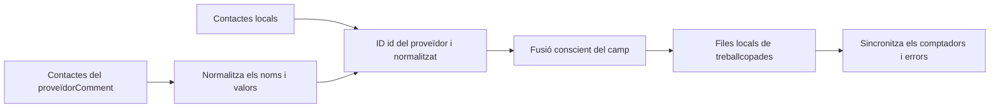

# Contactes

## Reversió

Contactes proveeix d' una llibreta d' adreces normalitzada local sobre registres manuals i connectats a Google, CardDAV i fonts compatibles. Proporciona cerca i destinatari/ attegene autocompletat amb el correu i el calendari.

## Model de dades

Un contacte té una identitat local estable, espai de treball, tipus, nom de pantalla, correus electrònic primari, camps d' organització, notes, correus electrònics estructurats, telèfons i adreces, identificadors del proveïdor, font, foto, etiquetes, marques de temps i estat de sincronització.

Els carregadors específics del proveïdor es normalitzen abans de fusionar. El processament de vCard es fa realitat, els valors descodificats i escapar dels separadors sense canviar les dades de l' usuari.

## Sincronització i fusió

La regla crítica de fusió és la preservació de nomésriment local. Una sincronització remota pot actualitzar els valors propietat del proveïdor però no ha de posar- se en blanc, notes, valors afegits manualment, o la identitat d' un altre proveïdor simplement perquè la càrrega actual els exploqui. La política d' esborrat és específica del proveïdor i no és referenciada a una llista parcial.

## Ús del domini creuat

Cerca contactes de correu per als destinataris i els enllaços a les cerques d' entitats. Els contactes del calendari pels assistents. Aquests consumidors reben dades normals de pantalla i no accedeixen a les credencials del proveïdor o a la sincronització en brut paguen carregadors.

## Invariants

- Totes les consultes i mutacions estan entrellaçades.
- Els identificadors remots són espais de nom per proveïdor/ font.
- Els sincronitzadors repetits no creen duplicats per al mateix registre del proveïdor.
- La inversió local sobreviu al proveïdor.
- Camps multivalors conservant etiquetes de tipus i valors preferits.
- L' esborrat i l' esborrat de contactes són efectes separats a menys que un explícit
S' ha seleccionat una política bidireccional.

## Concentrat de verificació

Executeu fusió, vCardGim/Grop, proveïdor normalització, correu sensible a caixa, i proves de l' espai de treball. Llista d' rollrightsifica, detall, crea/edit, cerca i navegació creuades sense funció d' un compte de proveïdors de veritat.
