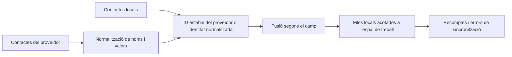

# Contactes

## Responsabilitat

Contactes ofereix una llibreta d'adreces local normalitzada a partir de registres
manuals i fonts connectades de Google, CardDAV i altres compatibles. Proporciona
cerca i autocompleció de destinataris i assistents a Correu i Calendari.

El frontend amb tipatge estricte `features/contacts/` gestiona la pàgina de
contactes, el catàleg d'integracions i els components de llista, detall i
formulari. La composició de l'aplicació utilitza la seva entrada pública diferida;
els adaptadors API compartits són independents de la pantalla. El trasllat
preserva la identitat de les fonts, els camps i el comportament de sincronització
sense deixar components duplicats als camins anteriors.

Les rutes HTTP i la frontera dels proveïdors de sincronització estan tipades
estrictament. Les credencials d'integració es validen abans de construir un
proveïdor Google o CardDAV, i els comptadors i errors heterogenis de
sincronització mantenen un contracte explícit sense canviar el payload públic.

## Model de dades

Un contacte té identitat local estable, espai de treball, tipus, nom visible,
correu i telèfon principals, camps d'organització, notes, múltiples correus,
telèfons i adreces estructurats, identificadors del proveïdor, font, foto,
etiquetes, marques temporals i estat de sincronització.
El model SQLAlchemy utilitza declaracions `Mapped[]` per a totes les columnes
i la relació amb l'espai de treball. Així, les assignacions dels serveis, rutes
i sincronitzacions es comproven contra l'esquema persistent. Els models
Pydantic de petició i resposta conserven els valors predeterminats històrics
i la representació OpenAPI idèntica byte a byte.

Els payloads específics de proveïdor es normalitzen abans de fusionar-los.
El processament de vCard uneix les línies de continuació, descodifica valors
i escapa separadors sense canviar les dades de l'usuari.

## Sincronització i fusió

La regla crítica de fusió és preservar l'enriquiment exclusivament local.
Una sincronització remota pot actualitzar valors del proveïdor, però no ha de
buidar etiquetes, notes, valors afegits manualment ni la identitat d'un altre
proveïdor només perquè el payload actual els ometi. La política d'eliminació
depèn del proveïdor i no s'infereix d'una llista parcial.

## Ús entre dominis

Correu cerca contactes per triar destinataris i enllaçar entitats. Calendari
en cerca per als assistents. Aquests consumidors reben dades de visualització
normalitzades i no accedeixen a credencials ni als payloads bruts de sincronització.

## Invariants

- Totes les consultes i mutacions queden acotades a l'espai de treball.
- Els identificadors remots tenen un espai de noms per proveïdor o font.
- Repetir sincronitzacions no crea duplicats del mateix registre del proveïdor.
- L'enriquiment local sobreviu a l'actualització del proveïdor.
- Els camps multivalor conserven les etiquetes de tipus i els valors preferits.
- L'eliminació del contacte i l'eliminació remota són efectes separats, tret
  que s'hagi seleccionat explícitament una política bidireccional.

## Aspectes que cal verificar

Executeu proves de fusió, continuacions i escapament vCard, normalització de
proveïdors, correu insensible a majúscules i espais de treball. Playwright
verifica la llista, el detall, la creació i edició, la cerca i la navegació
entre pantalles sense dependre d'un compte real de proveïdor.
