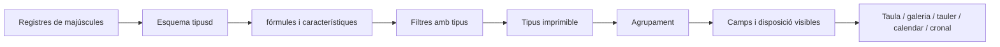

# Vistes de base de dades i planificació del projecte

## Model de coneixement estructurat

Una base de dades Gnosi és un esquema i una capa de vista sobre pàgines, normalment arrelada en una carpeta Vult. La pàgina del davant conté valors de registre. Les dades de registre defineix els tipus de camp, vistes de valors, fórmules, característiques, relacions, opcions, preferències i accions.

Com a mínim una vista principal és una vista invariciant. L' inici i les rutes de reparació de temps de lectura, restaurar- la quan el llegat o interrompre escriu deixar una taula sense vista vàlida.

## Higiene dels noms de taules i vistes

Els noms de les taules i de les vistes desades del registre es normalitzen en
carregar i en escriure. S'eliminen els emoticones i símbols pictogràfics
decoratius, però es conserven els accents i la puntuació significativa. La
vista principal bloquejada sempre té exactament el nom de la taula propietària,
i el marcador `is_main` continua sent l'autoritat.

## Jerarquia de navegació de les taules

La barra lateral del Vault presenta cada taula com un node pare amb dos grups
fills independents: `Contingut` conté els registres de la taula i `Vistes`
conté les vistes desades. Tots dos grups apareixen col·lapsats per defecte,
igual que els nodes de taula i les seccions de navegació de primer nivell, de
manera que una taula amb molts registres o vistes continua sent fàcil de
consultar. Expandir un grup no ha d'expandir implícitament l'altre; cada
secció conserva el seu propi estat persistent i totes les etiquetes passen pel
catàleg de localització del frontend.

## Visualitza canonada

Els valors amb tipus de camp declarat han de ser comparats com el seu tipus de camp declarat. L' entrada de text només pot representar tots els valors de filtre; data, caixa de selecció, número, relació, seleccioneu i multivalor normalitzar els camps mitjançant operadors de camp compatible amb el camp.

L' avaluació derivada del camp té una ordre explícita. Les fórmules que depenen dels valors en brut que s' executen abans de que les relacions agregades i dependre de fórmules es resolin sense permetre que els cicles es repeteixin indefinidament. El dorsal i les representacions dels frontals han d' estar d' acord amb la veritat, percentatges, valors buits i identificadors d' opció.

Quan `VaultDashboard` renderitza una pestanya de taula, passa les funcionalitats habilitades del registre de la taula a través de `VaultViewBody` fins a `VaultTable`. Per tant, la pestanya de taula, la taula independent, el panell dividit i la vista incrustada exposen les mateixes accions de fila configurades. Si s'omet aquesta cadena de propietats, l'acció queda oculta encara que el registre i l'API la retornin com a habilitada.

## Evolucionació d' esquemes i d'acordència

Les revisions d' esquema protegeixen un client per a desar una llista de camp més antiga. Reanomenar un camp actualitzacions de filtres, tipus, fórmules, accions i referències de vista desades. Reanomenant una taula detecta col· lisions de fitxers pla abans de moure contingut.

Els Registres s' escriuen atòmiques i es refrescen després de canviar les metadades per lots. Les instantànies Cacheades són validades quan els registres d' origen o els canvis de revisió de l' esquema.

## Planificació de projecte

Planificació consumeix camps de tasques estructurades i produeix una planificació autoritiva en comptes de duplicar la lògica de planificació a la IU. El motor normalitza les dependències, calendaris, restriccions, recursos, data, progrés i direcció de planificació. Calcula dates, puntuacions crítiques, avisos i assignacions de recursos.

El frontal representa els resultats i els controls d' edició. No gestiona independentment les semàntices del camí crític. Les planificacions cronitzades són claus de l' estat d' entrada rellevant i viuen en dades locals, no els registres de codi font de la càmera.

## Comportament erroni

- Les fórmules no vàlides retornen un error de camp controlat en comptes de cancel· lar la
Resposta de taula.
- Les relacions trencades romandran visibles com a valors no resolts quan sigui possible.
- Falta vistes que ubiquin una reparació de vista determinant.
- cicles de planificació, restriccions impossibles, o que produeixen calendaris que falten
Els diagnòstics i els resultats parcials, on són segurs.
- Una revisió d' esquema obsolet retorna un conflicte i requereix recàrrega/ allunyador.

## Concentrat de verificació

Prova la paritat de filtre escrita, conflictes de revisions d' esquema, camp i la taula reanomena, ordenació de fórmula/rollup, sincronització relacionada, ordenació de la instantània, accions de catàleg, restriccions de planificació, rutes crítiques, i representació del tauler E2E.
