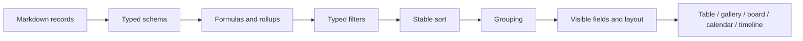

# Vistes de bases de dades i planificació de projectes

## Model de coneixement estructurat

Una base de dades de Gnosi és una capa d'esquema i de vistes sobre pàgines,
normalment arrelada en una carpeta de Vault. El frontmatter de les pàgines
conté els valors dels registres. Les dades del registre defineixen els tipus
de camp, les configuracions de les vistes, les fórmules, les agregacions,
les relacions, les opcions, els paràmetres de visualització i les accions.

Cada Vault actiu es resol en un únic motor SQLite emmagatzemat localment i una
fàbrica de sessions tipada. El registre de motors s'indexa per ruta de Vault,
utilitza una base declarativa tipada de SQLAlchemy, executa la migració de
l'esquema abans de la primera connexió i allibera les connexions del pool quan
s'elimina el Vault. Els fitxers SQLite es mantenen fora de l'emmagatzematge de
Vault sincronitzat amb el núvol.

L'existència d'almenys una vista principal és un invariant. Els mecanismes de
reparació en arrencar i en llegir la restauren quan les escriptures heretades
o interrompudes deixen una taula sense cap vista vàlida.

## Dates d'auditoria del sistema

Cada taula té propietats de creació i d'última modificació de només lectura.
Les taules noves localitzen les seves etiquetes segons l'idioma de la petició
o l'idioma actual de la interfície als ajustos, i mantenen totes dues
propietats al final de l'esquema. La creació d'un registre assigna tots dos
valors; els desaments posteriors preserven el de creació i actualitzen el
de modificació.

La migració idempotent només reconeix tipus de sistema explícits i etiquetes
heretades conegudes, de manera que els camps `date` no relacionats i les
metadades internes `created_at` o `last_edited_at` es mantenen intactes.
Les clonacions deterministes de Notion poden completar les marques de temps
d'auditoria amb els valors de la font de veritat mitjançant el mapatge dels
UUID configurats de bases de dades i pàgines, sense coincidències per títol.
L'índex complet de Notion s'obté abans d'escriure, i es fa una còpia de
seguretat de cada registre o fitxer Markdown modificat.

## Normalització dels noms de taules i vistes

Les etiquetes de les taules i de les vistes desades del registre es
normalitzen als punts de càrrega i escriptura. S'eliminen els emojis
decoratius i els símbols pictogràfics, però es conserven els accents i la
puntuació significativa. La vista principal bloquejada sempre té exactament
el mateix nom que la taula a la qual pertany, i el seu marcador `is_main`
continua sent la font de veritat.

## Jerarquia de navegació de les taules

La barra lateral de Vault presenta cada taula com un node pare amb dos grups
fills independents: `Content` conté els registres de la taula i `Views`
conté les seves vistes desades. Tots dos grups estan plegats per defecte,
igual que els nodes de taula i les seccions de navegació de primer nivell,
de manera que una taula amb molts registres o vistes continuï sent fàcil de
consultar. Desplegar un grup no ha de desplegar implícitament l'altre; cada
secció conserva el seu propi estat persistent i totes les etiquetes passen
pel catàleg de localització del frontend.

## Flux de processament de les vistes

`VaultTable.tsx` delega en el controlador i la composició visual tipats de
`vault-table`. L'adaptador de taula compartit de `VaultViewBody` preserva
la identitat dels arrays de files vàlids, les extensions de metadades
desconegudes i les funcions de retorn de selecció. L'edició de cel·les, la
navegació amb teclat, les files virtualitzades i les actualitzacions
d'opcions d'esquema continuen en mòduls separats amb proves de regressió.
`SchemaConfigModal.tsx` delega l'edició de l'esquema i el desament automàtic
a `schema-config`, tot conservant els identificadors de camp, els colors
d'opció i els valors per defecte. Aquests canvis interns no alteren les
vistes desades ni les metadades portables de les pàgines.

Els valors tipats s'han de comparar segons el tipus declarat del camp.
L'entrada de text per si sola no pot representar tots els valors de filtre;
els camps de data, casella de selecció, número, relació, selecció i múltiples
valors es normalitzen mitjançant operadors que tenen en compte el tipus
de camp.

L'avaluació dels camps derivats té un ordre explícit. Les fórmules que
depenen de valors en brut s'executen abans de les agregacions de relacions,
i les fórmules dependents es resolen sense permetre que els cicles provoquin
recursió indefinida. Les representacions del backend i del frontend han de
coincidir en la interpretació booleana de les caselles de selecció, els
percentatges, els valors buits i els identificadors d'opció.

Els camps virtuals calculats en llegir utilitzen projeccions del graf i
contextos de càlcul tipats. Les arestes estructurals exclouen els nodes no
resolts i els de propostes semàntiques; els tipus de les mètriques de NetworkX
es concreten quan entren a la memòria cau compartida, mentre que els valors
de grau, node concentrador, node orfe i progrés invers de tasques exposen
resultats primitius estables. La clau canònica del frontmatter continua
sent el nom de la propietat al registre, sense convertir-lo en slug.

El comportament canònic de les bases de dades es divideix per responsabilitat.
`tables/rules/` és responsable d'avaluar fórmules, agregacions, cerques i
automatitzacions; `tables/catalogs/` és responsable de la normalització
d'opcions, els rols semàntics i el catàleg global d'estats; i els mòduls petits
de `vault/views/` són responsables de la sintaxi de les instantànies,
la materialització, els filtres, l'ordenació i les unions. Els imports
històrics de `rule_engine.py`, `option_catalogs.py` i `view_snapshot.py`
continuen sent façanes mínimes de compatibilitat, inclosos els punts de
substitució de rutes i d'enriquiment de relacions amb vinculació tardana
utilitzats per les proves.

El límit HTTP de les taules consumeix directament aquests contractes estrictes
de col·lecció, cicle de vida, esquema, opcions, vistes i rutes confinades.
Ja no torna a forçar el tipus dels seus resultats, de manera que cada mòdul
de domini continua sent l'únic responsable del seu tipus de retorn, mentre
que l'inventari històric pla de rutes i el document OpenAPI no canvien.

El graf transitori de composició de taules ara injecta llistes d'opcions
concretes, definicions d'unió tipades i un rematerialitzador de Markdown
compatible amb el protocol. L'adaptador preserva l'enriquiment heretat amb
vinculació tardana i rebutja els resultats d'instantània no textuals abans
que puguin arribar a la persistència.

`tables/formula_recalculation.py` serialitza per taula els canvis que afecten
diversos registres. Les peticions concurrents s'agrupen en una passada pendent;
es recalculen totes les files visibles, s'escriu el Markdown modificat i
l'índex de pàgines i la memòria cau de respostes només s'actualitzen després
d'escriptures correctes.

Els criteris d'ordenació de les vistes desades s'apliquen en l'ordre de
l'array amb una comparació estable de múltiples claus. Els valors de
propietat buits sempre van després dels valors informats, tant en ordre
ascendent com descendent, d'acord amb la semàntica de les vistes importades
de Notion. Les vistes del frontend i les instantànies Markdown del backend
utilitzen la mateixa regla perquè l'ordre dels registres no divergeixi.

Quan `VaultDashboard` renderitza una pestanya de taula, passa les
funcionalitats habilitades del registre de la taula a través de
`VaultViewBody` fins a `VaultTable`. Així, la pestanya de taula, la taula
independent, el panell dividit i la vista incrustada exposen les mateixes
accions de fila configurades. Si s'omet aquesta cadena de propietats,
una acció queda oculta encara que el registre i l'API indiquin correctament
que està habilitada.

## Evolució de l'esquema i concurrència

Les revisions d'esquema impedeixen que un client desi una llista de camps
antiga sobre una de més nova. Canviar el nom d'un camp actualitza els
filtres, les ordenacions, les fórmules, les accions i les referències de
les vistes desades. El canvi de nom d'una taula detecta les col·lisions de
noms de fitxer en carpetes planes abans de moure el contingut.

Els registres s'escriuen atòmicament i s'actualitzen després dels canvis
massius de metadades. Les instantànies en memòria cau s'invaliden quan
canvien els registres d'origen o la revisió de l'esquema.

Les rutes de vistes per pàgina validen l'arrel del registre, la taula
d'origen, el camp de filtre i la identitat de la pàgina al disc abans de
modificar res. El seu cicle de lectura, modificació i escriptura comparteix
el bloqueig canònic del registre i actualitza la memòria cau de la façana
després d'un desament atòmic; la sincronització opcional de seccions
d'Obsidian continua sent un adaptador tipat que actua en la mesura del
possible. L'identificador estable `view_id` té prioritat sobre els
encapçalaments durant la inserció o actualització, de manera que les vistes
incrustades en paral·lel no es puguin sobreescriure entre si. Els resultats
de lectura, inserció o actualització i eliminació passen per models
Pydantic específics abans de retornar els mateixos diccionaris heretats;
l'esquema de petició i el document OpenAPI congelat no canvien.

Les edicions massives de camps, la promoció de Zotero Extra i l'aplicació
de plantilles comparteixen un únic servei tipat de mutació de pàgines.
Cada destinació s'aïlla, comprova un ETag opcional, actualitza l'índex de
pàgines després d'una escriptura i informa d'omissions, conflictes i errors
sense interrompre les files restants.

Els editors de propietats de pàgina utilitzen controls adaptats al tipus
de camp. Els camps `select` i `status` es mostren com a selectors
d'opcions d'un sol valor; els catàlegs d'estats són estrictes i no permeten
crear ni eliminar opcions directament des del selector. La graella de la
taula i el panell de propietats de pàgina han de preservar el mateix tipus
de camp i la mateixa semàntica d'opcions.

Els valors d'estat introduïts per regles d'acció es persisteixen de manera
idempotent a través del domini de taules. Les fallades del registre es
deixen al log, però mai no converteixen la regla que les ha originat en
una acció d'usuari fallida.
El límit pur de regles resol els camps per identificador, nom actual o àlies,
avalua els prerequisits declarats sense interpretar les dades absents com
una denegació, preserva la clau de frontmatter que ja s'utilitza i
inicialitza de manera determinista les opcions d'estat que falten.
Les regles de botó es mantenen diferenciades de les automatitzacions
activades per canvis.

El límit HTTP de Planning té tipatge estricte i preserva el seu contracte
OpenAPI congelat. La resolució del vault actiu falla explícitament quan no
n'hi ha cap de seleccionat, i la materialització de recurrències consumeix
de manera acotada els iteradors d'ocurrències RRULE, tot preservant els
identificadors estables de tasca i les comprovacions d'ETag.

## Planificació de projectes

El frontend amb tipatge estricte de `features/planning/` és responsable de
la pàgina de planificació i de les seves proves de comportament, accessibles
a través d'un punt d'entrada públic de càrrega diferida. El renderitzador
de la cronologia continua sent compartit amb les vistes de Vault. La
responsabilitat sobre les rutes no altera les peticions de planificació,
la creació de línies base, els registres de treball ni l'aprovació explícita
de propostes d'anivellament.

Planning consumeix camps de tasques estructurats i produeix un calendari
de referència, en lloc de duplicar la lògica de planificació a la interfície.
El motor normalitza les dependències, els calendaris, les durades, les
restriccions, els recursos, les dates límit, el progrés i la direcció de
planificació. Després calcula dates, marges, tasques crítiques, avisos i
assignacions de recursos.

El motor determinista ara separa la normalització de dades de fet, la
planificació endavant d'una tasca, els diagnòstics de restriccions, la
indexació de successors, la passada enrere per calcular marges, la
col·locació ALAP i la serialització del payload. Això manté immutables les
dades de fet persistides i preserva els calendaris parcials i els
diagnòstics davant d'errors recuperables del graf.

El planificador que agrupa les peticions manté l'anàlisi i el desament de
Markdown i les comprovacions d'ETag darrere d'un port acotat de Vault amb
vinculació tardana, amb registres d'origen tipats per a cada escriptura
candidata. Valida l'estructura de l'estat dels plugins abans de llegir-ne
la configuració i només escriu els límits automàtics si l'ETag d'origen
no ha canviat. Els tipus de l'historial de tarifes dels recursos i de les
sobreescriptures d'assignació es concreten al límit del magatzem de
planificació, de manera que els càlculs d'assignació i anivellament
mantenen el tipatge estricte sense canviar els números persistits ni la
semàntica de planificació.

Les durades dels períodes conserven tant el valor numèric com la unitat
configurada (`hours`, `days` o `years`). Els anys naturals se sumen com
a desplaçaments d'any natural, de manera que un any inicial més vuit anys
dona l'any final corresponent, inclosos els anys negatius. L'editor de
propietats elimina els camps redundants de dates reals, recalcula el final
sempre que canvia l'inici, la durada o el predecessor, i utilitza un
selector múltiple amb cerca per als predecessors. Els valors heretats de
`durationDays` continuen disponibles per mantenir la compatibilitat amb
els registres antics i les instantànies de planificació.

El frontend renderitza el resultat i els controls d'edició. No recalcula
de manera independent la semàntica del camí crític. Els calendaris en
memòria cau s'indexen segons l'estat d'entrada rellevant i es desen a les
dades locals, no als registres d'origen del vault.

## Comportament davant de fallades

- Les fórmules no vàlides retornen un error de camp controlat en lloc
  d'interrompre la resposta de la taula.
- Les relacions trencades es mantenen visibles com a valors no resolts
  sempre que és possible.
- La manca de vistes activa una reparació determinista de la vista principal.
- Els cicles de planificació, les restriccions impossibles o la manca de
  calendaris produeixen diagnòstics i resultats parcials quan és segur.
- Una revisió d'esquema obsoleta retorna un conflicte i requereix recarregar
  o fusionar els canvis.

## Aspectes que cal verificar

Proveu la paritat dels filtres tipats, els conflictes de revisió d'esquema,
els canvis de nom de camps i taules, l'ordre d'avaluació de fórmules i
agregacions, la sincronització de relacions, l'ordenació d'instantànies,
les accions dels catàlegs d'opcions, les restriccions de planificació,
els camins crítics i la renderització E2E dels quadres de comandament.
