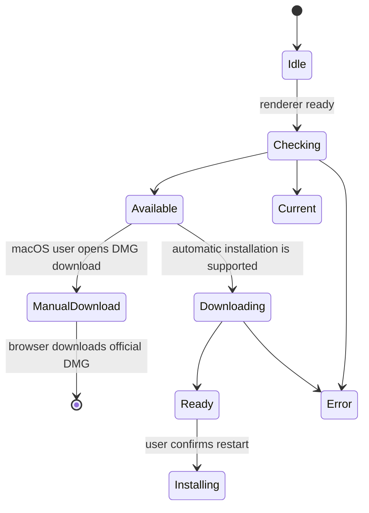

# Aplicació d’escriptori i clients complementaris

## Distribució només de candidats

`Build Release Candidate` no crea esborranys de GitHub, no publica releases ni
modifica els seus fitxers. El token només pot llegir el contingut del repositori.
Primer comprova la identitat del tag; després crida la CI existent al mateix
commit. La construcció de cada arquitectura espera que aquesta CI passi.
La CI reutilitzable no hereta secrets.

La CI del candidat inclou documentació, frontend, backend, prova nativa bàsica
i construcció d'imatges Docker. Les PR es comproven contra la seva base exacta;
els candidats validen els catàlegs actuals i els portals estrictes de tots els
idiomes contra el seu SHA, sense simular una revisió d'impacte d'una PR.
Aquests controls no acrediten arrencada i persistència dels contenidors,
tots els fluxos autenticats, instal·lació neta, signatura ni actualització real 2.x.

Després de construir totes les plataformes i validar els fitxers, l'execució
puja un artefacte d'Actions `candidate-<tag>-<sha>-<attempt>`, conservat cinc dies.
Conté instal·ladors, manifests d'actualització, índexs i notes. Només es baixen
els quatre artefactes d'arquitectura identificats pel nom, de manera que una
reexecució no incorpora un candidat anterior. Els artefactes d'Actions no són
emmagatzematge confidencial: mai no han de contenir credencials ni dades personals.

La distribució pública queda desactivada fins a completar la matriu nativa,
Docker, instal·ladors i actualització 2.x i revisar un procés de publicació
separat. Un candidat correcte no autoritza publicar 3.0.0. Aquest workflow no
canvia les releases públiques existents ni els canals d'actualització.

## Identitat del codi de release

Després de preparar la versió fixada de Node, la comprovació prèvia exigeix que
el tag sol·licitat existeixi localment i es resolgui exactament al commit
`github.sha`, que també ha de ser HEAD. Es recuperen els refs dels tags sense
canviar el checkout. La comprovació cobreix tags anotats i lleugers, enviaments
de tags i execucions manuals. Un tag absent, un destí que no sigui un commit,
una entrada incorrecta o qualsevol discrepància atura el procés abans
d'instal·lar dependències del projecte i empaquetar.

`desktop/scripts/release-source-identity.cjs` només usa Git local i no mou refs,
no canvia al tag ni recupera dades pel seu compte. Aquesta comprovació no
valida Docker, instal·ladors ni actualitzacions des de 2.x, ni impedeix que
després es mogui un tag remot. Aquestes validacions i la protecció de tags
continuen sent requisits separats; les proves locals no acrediten una
execució reeixida a GitHub.

## Aplicació d’escriptori Electron

Electron empaqueta Gnosi com a aplicació d’escriptori. El procés principal gestiona l’arrencada i l’aturada del backend, les finestres, els recursos del paquet, les actualitzacions i les accions privilegiades. La interfície accedeix a una API limitada de preload, no directament a Node.js.

Els menús i l’avís d’actualització de la interfície pertanyen a `app/desktop/`. Les notes de versió pertanyen a la funcionalitat del centre de control i consumeixen el mateix JSON de releases. Es conserven els mètodes de preload, els esdeveniments i les destinacions de descàrrega.

## Arrencada del procés propi i recursos revisats

El llançador espera el procés que ha creat, no qualsevol servei al port 5002.
Cada arrencada substitueix `GNOSI_DESKTOP_INSTANCE` per un marcador nou.
`/api/health` el retorna a `x-gnosi-desktop-instance` només si la resposta és
correcta; el JSON i l’API pública no canvien. El marcador identifica el procés,
no autentica l’usuari. Cal un procés viu i una resposta completa, limitada i
coincident. Redireccions, respostes HTTP 200 alienes, JSON malformat, temps
exhaurit o sortides prematures avorten l’arrencada i aturen el procés propi.
Si falta l’executable empaquetat, no s’utilitza el Python del sistema.

L’activació, Nova finestra, Configuració i les comprovacions d’actualització no
poden esquivar aquesta espera ni l’aturada. Sortir durant l’arrencada no pot
obrir una finestra tardana. El diàleg anterior a React ofereix instruccions en
anglès, català, castellà i francès segons l’idioma del sistema; els detalls
tècnics queden al registre de l’aplicació.

Set gestors IPC tenen contractes de petició i resposta comprovats i validen
l’emissor abans de llegir arguments o fer accions privilegiades. El gestor
d’autocompletat continua a `main.js`: l’extracció no implica que tot el procés
principal tingui cobertura de tipatge.

`backend_resources.py` selecciona fitxers de runtime revisats i descobreix
mòduls Python sense importar l’aplicació. Conserva migracions i plantilles
d’Alembic, instruccions de l’agent, habilitats de traducció dinàmiques,
complements d’exemple i estils de citació. No copia recursivament configuració
local, vaults, bases de dades, secrets ni eines generades. Recursos absents o
modificats, fitxers no revisats dins dels arbres seleccionats, rutes insegures
o contingut prohibit fan fallar l’empaquetat.

La política comprova l’anàlisi real de PyInstaller abans de recollir fitxers,
el resultat abans i després de copiar-lo i els recursos `python/` finals
d’Electron abans de signar. Les rutes amb espais es passen com arguments
separats. Aquestes comprovacions no certifiquen instal·ladors: abans de la
release cal provar l’arrencada congelada, la instal·lació i l’actualització
des de 2.x a cada plataforma, a més de la matriu nativa i Docker.

El generador d’OpenAPI també activa `GNOSI_VALIDATION_ROOT` abans d’importar
la configuració de l’aplicació. Els mateixos selectors temporals validats
impedeixen llegir fitxers d’entorn, configuració del repositori i credencials
durant aquest pas del build; generar l’esquema no ha de consultar dades personals.

## Màquina d’estats de les actualitzacions

Les comprovacions estan deshabilitades en desenvolupament. Les descàrregues només comencen per una acció explícita. A macOS, les signatures ad hoc actuals requereixen obrir el DMG oficial de l’arquitectura corresponent; no s’ofereix reinici i instal·lació automàtics fins que hi hagi una signatura Developer ID estable i notarització. Windows i Linux mantenen el flux automàtic amb confirmació. L’estat més recent es pot recuperar per IPC encara que la interfície s’hi subscrigui tard. Ni l’arrencada ni un canvi de versió obren les notes de versió automàticament; són accessibles des del centre de control.

Els artefactes de llançament inclouen instal· lats i metadades actualitzadores per a MacOS, Windows i Linux. La versió de preparació manté la Frontal i els manifests electrònica alineats; les etiquetes només es creen des de revisades. `main` Comencions.

El workflow canònic de release empaqueta macOS Intel i Apple Silicon en jobs
separats d'una matriu. Cada job s'executa sobre l'arquitectura corresponent de
macOS 15 i construeix un únic backend natiu amb PyInstaller abans d'invocar
electron-builder per al mateix objectiu. Això evita copiar un executable Python
natiu del host dins l'aplicació de l'altra arquitectura.
La matriu de macOS està tancada per arquitectura: cada runner local passa una
única arquitectura per CLI i els objectius compartits de macOS
d'electron-builder no poden declarar cap llista d'arquitectures. Això evita
empaquetar un backend Python congelat natiu del host dins una aplicació Electron
de l'arquitectura contrària.
Les releases manuals fan checkout del commit de l'execució (`github.sha`), i
el tag sol·licitat s'ha de resoldre al mateix commit. Les correccions
d'empaquetatge posteriors a un tag requereixen un nou tag de release revisat;
no publiqueu codi diferent sota el tag antic. El job de Windows
exposa la instal·lació estàndard `Program Files\\Git\\cmd` abans del checkout si
el servei del runner no l'hereta mitjançant `PATH`, i evita el fallback al ZIP
REST.
Els scripts generats del job fan servir una excepció de política d'execució de
PowerShell limitada al job. Així, els valors restrictius del servei no rebutgen
els `.ps1` efímers i no es debilita la política global de la VM.
La release de Linux també queda tancada per arquitectura: el runner local i el
backend de PyInstaller són ARM64, i electron-builder rep `--arm64`
explícitament. Aquest runner no pot generar cap paquet etiquetat com a x64,
perquè contindria un executable de backend de l'arquitectura contrària.
Els runners de release estan fixats en comptes d'usar `macos-latest`, perquè la seva migració a macOS 26
va canviar la creació del DMG a APFS i va trencar la fase de muntatge i
personalització d'electron-builder.
Cada job de release també passa explícitament al constructor del backend el
comandament Python proporcionat per `actions/setup-python`. Això manté les
extensions binàries i les biblioteques OpenSSL recopilades sobre un únic ABI
d'intèrpret i evita que un Python més nou del runner substitueixi l'entorn de
release.
Com que `cryptography` 49 i posteriors ja no publiquen wheels macOS x86_64, el
paquet Intel usa l'última línia universal2 compatible (`48.0.1`) i la resta de
plataformes mantenen el requisit actual. L'instal·lador del backend congelat
exigeix una distribució binària de `cryptography`: ha de fallar en comptes de
compilar contra un OpenSSL del runner que pugui col·lidir amb la biblioteca
recopilada per PyInstaller.

La llista de fitxers del constructor d'Electron és un límit explícit del runtime.
El hook multiplataforma `afterPack` inspecciona l'`app.asar` final i rebutja un
paquet que ometi el procés principal, el preload, el mòdul del menú natiu,
l'iniciador del backend o la política d'actualització. Aquesta comprovació de l'artefacte instal·lat
complementa les proves de codi font i evita que un arbre de fonts vàlid produeixi
una aplicació que falla abans d'obrir la primera finestra.

El camí del backend empaquetat resol l'executable de PyInstaller mateix a macOS
i Linux, i el seu equivalent `.exe` a Windows. El procés principal executa
directament aquest fitxer resolt i no el tracta com un nivell de directori més.
La construcció neta instal·la els requisits canònics del runtime E2E, incloses
les dependències de proveïdors i API, i inicia l'executable congelat com a prova
de fum multiplataforma abans de continuar amb el paquet d'escriptori.

El procés d’escriptori usa `GNOSI_DATA_DIR` dins la carpeta de dades de l’usuari
d’Electron per defecte; `GNOSI_LOCAL_DATA` és un àlies compatible durant 3.x.
Les sobreescriptures explícites es conserven. Això evita el valor per defecte
de Docker `/data`. La comprovació d’arrencada consulta el punt
públic `/api/health` i no queda bloquejada per un punt protegit de l'aplicació.
El backend congelat desactiva el vigilant de recàrrega de fitxers d'Uvicorn; el
desenvolupament natiu des del codi font conserva la recàrrega.

## Preparació de versions

`frontend/src/features/control-center/releases/releases.json` és l'historial canònic de versions inclòs
al paquet. L’eina de versions manté alineats els manifests arrel, frontend i
desktop, les metadades Python i els locks pnpm/uv.
Una entrada estable preparada abans de publicar-se omet expressament
`downloadUrl`; aquest camp només s'afegeix quan existeixen l'etiqueta immutable
i els artefactes de cada plataforma.
Com que la versió del manifest del frontend és un límit d'escriptori d'alt
impacte, cada pull request de preparació d'una release també actualitza aquest
contracte revisat i els seus miralls localitzats, encara que el patch no canviï
el comportament en temps d'execució.
La validació del changelog normalitza els finals de línia abans de comparar-los,
de manera que un checkout Windows amb CRLF equivalent no faci fallar el gate
d'empaquetatge multiplataforma.

Abans de crear l'etiqueta, la PR de release ha de superar la validació del
frontend, els tests backend, la QA nativa al navegador i la porta de
documentació d’enginyeria. Després de la integració, el workflow públic canònic
construeix el commit revisat i recull artefactes multiplataforma, catàlegs signats
i notes. No crea tags ni esborranys de GitHub; la distribució pública continua
desactivada segons el límit descrit més amunt.

La preparació de la v2.0.0 segueix aquest límit: les notes localitzades
incloses i el changelog generat es publiquen amb els manifests sincronitzats,
mentre que l'etiqueta immutable i l'enllaç de descàrrega de cada plataforma
només s'afegeixen després que el commit revisat de main superi el workflow
oficial de release.

El patch v2.0.1 manté completes les dependències canòniques del backend
congelat i envia els tags oficials a la matriu de runners locals configurada.
Així el workflow valida els mateixos entorns que generen els artefactes.

La preparació de la v2.0.5 afegeix una comprovació obligatòria de metadades
abans de l'empaquetatge per plataforma. Rebutja un tag si els manifests
d'Electron i del frontend, el lockfile del monorepo, els quatre catàlegs de
release localitzats i el changelog generat no descriuen la mateixa versió.

Els jobs actuals utilitzen Node 22.22.2 i locks congelats. La CI compartida
segueix la comprovació d'identitat. Les dues arquitectures de macOS s'executen
en sèrie; Windows espera macOS i Linux pot executar-se alhora. La concurrència
es limita per ref Git, no amb un bloqueig global del host; això no acredita
capacitat disponible ni absència d'altres tasques als runners.

## clipper web

L' extensió del navegador extraieu el títol de la pàgina actual, URL, seleccionat o llegibles, i les metadades acceptades, després envia una sol· licitud limitada a l' API del Gnosi. El dorsal realitza autenticació, sanitització, desuplicació i Vault escriu. L' extensió no rep accés a sistema de fitxers arbitraris.

## Clients de citació de LibreOffice i Words

L' extensió LibreOffice registra un gestor de protocol i crida als punts finals de citació del Gnosi del procés d' oficina. El Word helper manté el paginador de tasques i l' estat requerit per accedir al mateix servei local. Ambdós clients tracten la inserció de cita i la bibliografia com a mutacions explícites del document.

Les API específiques de l' oficina estan aïllats darrere dels traverals i les seves transversions per tal que les proves puguin simular el límit de l'ONU o afegir-ne sense necessitat de l'aplicació completa de cada prova d'unitat.

## Invariants

- El codi Render no té cap capacitat de nocicle.js o sistema de fitxers.
- El PCP expos les operacions amb entrades validades.
- Actualitza les baixades i instal·lacions requereix accions explícites d' usuari.
- Els camins de recursos empaquetats difereixen dels camins del desenvolupament i es resolen a
Temps d' espera.
- Autenticació de clients de composició per al dorsal i segueixen- lo en el seu estret
Captura o àmbit de citació.
- Els candidats mai no publiquen ni modifiquen una release pública automàticament.

## Acceptació local de la distribució

La prova del backend empaquetat exigeix una resposta HTTP 200 de `/api/health`
amb `status: ok`, `mode: FastAPI` i la identitat única de la prova a `gnosi_mode`.
Un procés viu, un port ocupat, una redirecció o una altra instància de Gnosi no
poden superar-la. La prova utilitza directoris de vault i dades temporals, un
port local i un entorn filtrat; desactiva les tasques programades i tanca i recull
el procés fill tant si té èxit com si falla. `GNOSI_VALIDATION_ROOT` és exclusiu
d'aquestes proves: totes les rutes de dades han de quedar dins l'arrel temporal;
no es llegeixen fitxers d'entorn locals o compartits ni s'accedeix als gestors de
credencials. No s'ha de configurar en desenvolupament normal ni en instal·lacions.

Les proves amb subprocessos ficticis i FastAPI executat des del codi font
validen aquest contracte, però no certifiquen l'executable empaquetat ni
l'instal·lador. Cada plataforma encara necessita les seves proves reals.

El control documental de les PR utilitza dependències congelades i mode de
comprovació contra el commit base exacte, amb permisos de només lectura.
No repara catàlegs ni desplega documentació; la publicació continua separada a main.

## Concentrat de verificació

Abans de pujar el candidat, el workflow instal·la les dependències de producció de desktop
segons el lock, sense executar scripts d'instal·lació, baixa cada arquitectura
a una carpeta separada i executa `release-artifacts.cjs collect`. Aquest pas
comprova que el tag coincideix amb la versió del codi, verifica referències i
hashos SHA-512, rebutja fitxers absents o duplicats i agrupa les dues arquitectures
de Mac en un sol `latest-mac.yml`. La generació d'índexs i la pujada del candidat només
s'executen si la comprovació passa. Les proves locals amb dades fictícies no
substitueixen la matriu real de construcció i actualització per plataforma.

Executa les comprovacions de sintaxi electrònica/build, proves de fum de dorsal empaquetades, proves d' estat actualitzats, validació de l' extensió, proves de citació i plataforma CI. local de MacOS no poden provar defectes de Windows o Linux.
