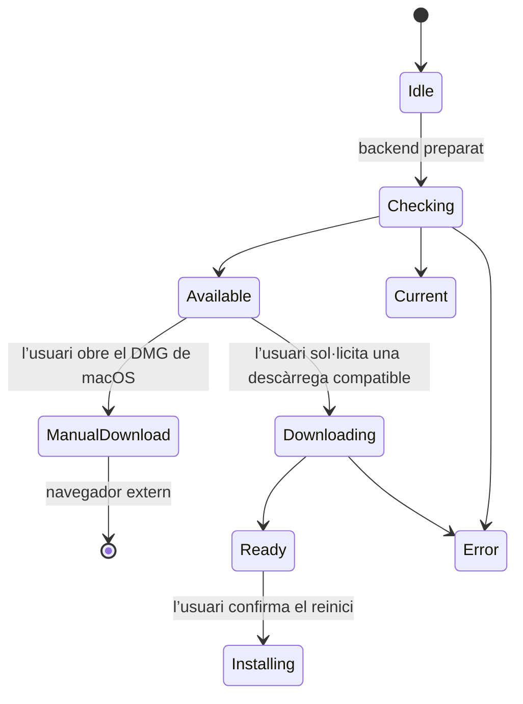

# Clients d’escriptori i complementaris

## Responsabilitats i modes de desenvolupament

Electron empaqueta el frontend React i el backend Python en una sola aplicació
d’escriptori. El procés principal gestiona el procés fill del backend, les finestres,
el protocol de l’aplicació, l’estat de les actualitzacions i les accions privilegiades.
El renderer utilitza una API de preload limitada, mai accés sense restriccions a
Node.js o al sistema de fitxers.

El desenvolupament natiu al navegador i el desenvolupament amb Electron tenen
punts d’entrada diferents:

| Mode | Frontend | Responsable del backend |
| --- | --- | --- |
| Navegador natiu | Vite a `http://localhost:5173` | `pnpm dev`, des de l’arrel, inicia Vite i uvicorn |
| Desenvolupament amb Electron | Vite iniciat de manera independent a `http://localhost:5173` | `pnpm desktop:dev` inicia el seu propi procés fill d’uvicorn al port 5002 |
| Electron empaquetat | Frontend inclòs al paquet a `app://gnosi/index.html` | `python/cervell_backend` inclòs al paquet, o `cervell_backend.exe` a Windows |

No executis el backend natiu alhora que el desenvolupament amb Electron: el
supervisor d’escriptori no adopta cap altre procés al port 5002. El desenvolupament
amb Electron no inicia Vite ni sol·licita la recàrrega d’uvicorn. Inicia’l amb
`uv run --frozen --no-sync pnpm desktop:dev` després de sincronitzar l’entorn
Python, perquè el seu `python3`, o `python` a Windows, es resolgui dins d’aquest
entorn. L’origen de confiança per al desenvolupament és localhost:5173 amb HTTP;
configura `VITE_DEV_HTTPS=false` per a aquella sessió de Vite. Una sessió HTTPS
del complement de Word és una configuració separada i no és intercanviable amb
l’origen d’escriptori.

El [README d’escriptori](https://github.com/ismigar/Gnosi/blob/main/desktop/README.md)
conté instruccions de configuració i recuperació. Les vinculacions dels menús
React i l’avís d’actualització pertanyen a `frontend/src/app/desktop/`; la
presentació de les notes de versió pertany a la funcionalitat del centre de
control. Canviar la distribució interna de responsabilitats no ha d’alterar els
noms IPC, les accions d’actualització ni les destinacions de descàrrega.

## Arrencada, finestres i IPC

Abans d’obrir Chromium o iniciar serveis, `profile-startup.js` obté el bloqueig
d’instància única i prepara el perfil existent. Un conflicte o un estat de
recuperació ambigu atura l’arrencada; no autoritza a esborrar fitxers.

Cada arrencada del backend proporciona un valor nou de `GNOSI_DESKTOP_INSTANCE`.
El supervisor exigeix que el procés fill propi continuï actiu i que la resposta
de salut sigui completa, acotada i satisfactòria, amb una capçalera
`x-gnosi-desktop-instance` coincident. Aquesta capçalera permet correlacionar el
procés; no autentica cap usuari ni modifica el JSON públic de salut. Els temps
d’espera exhaurits, les redireccions, les respostes malformades, la finalització
prematura i les respostes HTTP 200 alienes fan fallar l’arrencada i provoquen
l’aturada i la neteja del procés fill propi. Si falta l’executable empaquetat,
mai no es recorre al Python del sistema.

Nova finestra, Configuració, l’activació des del Dock i la visualització diferida
de finestres no poden eludir la comprovació que el backend estigui preparat ni
l’aturada. Tancar l’última finestra a macOS no tanca l’aplicació; sortir de
l’aplicació atura el seu backend. A les altres plataformes, tancar totes les
finestres tanca l’aplicació. Els missatges d’error d’arrencada estan disponibles
en anglès, català, castellà i francès abans que es carregui React; els detalls
tècnics queden als registres.

Les finestres principals utilitzen `contextIsolation: true`, `sandbox: true` i
`nodeIntegration: false`. Només el marc de nivell superior actual d’una finestra
registrada, a l’origen de confiança de desenvolupament o del paquet, pot invocar
IPC privilegiat. La navegació i les redireccions no poden conservar aquest pont
en un altre origen. Els enllaços HTTP(S) que se sol·liciten en una finestra nova
s’obren externament.

L’emplenament de formularis només accepta una URL inicial HTTPS sense
credencials i en fixa l’origen exacte abans de carregar-la. Els controls de
navegació i redirecció s’instal·len abans d’iniciar la càrrega; es bloquegen les
destinacions sense xifrar i les d’un altre origen. La URL final de `webContents`
es torna a comprovar immediatament abans de cada injecció del perfil sintètic,
de manera que el contingut redirigit no rep cap byte del perfil.

El protocol del paquet serveix els recursos del frontend i fa de proxy de
`/api/` cap al backend local. Valida l’autoritat de l’aplicació, impedeix recórrer
el sistema de fitxers fora de les rutes permeses i utilitza el magatzem de galetes
de la sessió en lloc de reenviar les capçaleres de galetes en brut del renderer.
Conserva aquest comportament quan canviïs l’encaminament o els adaptadors de
transmissió en continu.

Els vuit gestors extrets tenen contractes de petició i resposta comprovats.
L'emplenament de formularis és a `ipc-handlers.js`, que ja s'empaquetava; el procés
principal aporta la fàbrica nativa de finestres i el registre de missatges.
La validació de l'emissor continua precedint l'accés al payload i l'obertura d'una
finestra separada i aïllada sense pont de preload. La validació d'URL, l'ordre dels
esdeveniments, la serialització del perfil i el programa injectat no canvien i
tenen proves diferencials sintètiques. El programa dins la cadena no es comprova
estàticament. Això no acredita el comportament en webs reals, el tipatge complet
del procés principal, l'acceptació d'instal·ladors ni l'autorització de destinacions
arbitràries de formularis.
Les subscripcions de preload retornen funcions de cancel·lació
idempotents; els mètodes de cancel·lació per compatibilitat continuen disponibles
per als renderers antics.

## Dades locals i recuperació del perfil

El backend empaquetat selecciona el primer valor no buit en aquest ordre:
`GNOSI_DATA_DIR`, `GNOSI_LOCAL_DATA`, `LOCAL_DATA_DIR` i, finalment, el directori
`userData` existent d’Electron. Estableix la variable canònica i conserva un àlies
de compatibilitat existent. El valor per defecte d’escriptori no és necessàriament
el valor natiu de Python per a la plataforma i no trasllada una instal·lació
antiga. Utilitza rutes absolutes per als valors explícits i conserva tant el perfil
d’Electron com qualsevol directori separat de dades del backend abans d’una
actualització.

El nom de paquet amb àmbit `@gnosi/desktop` es torna a mapar al nom històric
d’execució `gnosi`; les ubicacions explícites de perfil i sessió es continuen
utilitzant. L’identificador del paquet continua sent `com.gnosi.cervell-digital`.

La protecció del perfil conserva els directoris obsolets `databases` com a bytes
opacs a `.<profile-name>.gnosi-electron-recovery/databases.saved`, al costat de
cada perfil. Els moviments atòmics sense substitució i els registres de
recuperació impedeixen sobreescriure una destinació existent. Es comproven els
perfils separats de dades d’usuari i de sessió. Les operacions primitives del
sistema de fitxers no compatibles, els mòduls natius absents, les rutes de dades
superposades o els registres de recuperació ambigus aturen l’arrencada. Això
conserva els bytes, no la funcionalitat WebSQL eliminada. No restauris aquest
arbre amb el nom antic mentre executis una versió més nova d’Electron, ni
esborris els registres de recuperació per forçar l’arrencada.

Per als esquemes de galetes coneguts 19–22, la migració prepara només la base de
dades de galetes, en valida la integritat, l’esquema, el nombre de files i un
resum criptogràfic de la projecció que té en compte els bytes, i després activa
l’esquema 23 abans que Chromium l’obri. L’original exacte es conserva a
`.Cookies.gnosi-cookie-recovery/original.sqlite`, al costat de `Cookies`.
Els magatzems desconeguts, corruptes, amb conflictes o amb xifratge personalitzat
provoquen una aturada segura. No es copia tot el perfil, no s’endevina cap clau
de desxifratge ni es recorre a text en clar.

La reversió explícita de galetes exigeix que els clients estiguin aturats i que
la migració inicial s’hagi completat. Conserva les galetes més noves a
`rollback.current.sqlite`, restaura un original verificat mitjançant el seu
propi registre de recuperació i impedeix que es repeteixi automàticament la
migració. Conserva tots els fitxers de recuperació fins a l’acceptació; no forcis
mai els números de versió dels esquemes ni esborris bases de dades de galetes.
El README descriu la recuperació interrompuda i les proves aïllades
antiga → objectiu → objectiu. L’èxit amb dades de prova no demostra la migració
real del perfil, del magatzem de secrets del sistema operatiu o de la base de
dades de l’aplicació en una altra màquina.

## Actualitzacions i accions de l’usuari

`update-policy.js` selecciona la instal·lació manual a macOS i el flux de
descàrrega i instal·lació automàtiques a les altres plataformes. En
desenvolupament es desactiven les comprovacions d’actualització. En producció
es comprova si hi ha actualitzacions després d’una arrencada correcta, però tant
`autoDownload` com `autoInstallOnAppQuit` són false: que hi hagi una versió nova
disponible o que es tanqui l’aplicació no inicia cap instal·lació no sol·licitada.

A macOS, l’acció explícita obre l’URL del DMG oficial de l’arquitectura
corresponent. L’empaquetatge actual utilitza signatura ad hoc; el reinici i la
instal·lació automàtics continuen desactivats fins que es revisi una configuració
estable de Developer ID i notarització. Una verificació correcta amb `codesign`
no constitueix, per si sola, l’acceptació del sistema d’actualització.
La política de Windows/Linux tampoc no demostra que la instal·lació funcioni
amb tots els formats d’artefacte; prova la destinació real instal·lada.

El procés principal conserva l’estat d’actualització més recent per als renderers
que s’hi subscriuen tard. Les comprovacions en segon pla no obren l’historial de
versions. Els usuaris l’obren explícitament des del centre de control; els canvis
de versió no l’obren durant l’arrencada.

## Cadena d’eines i límits de l’empaquetatge

L’espai de treball fixa Node 22.22.2 i pnpm 11.19.0. Les dependències
d’escriptori fixen actualment Electron 43.4.1, electron-builder 26.15.3 i
ASAR 4.3.0. L’entorn d’execució Node integrat a Electron és independent de
l’entorn de construcció de l’espai de treball. La comanda explícita
`install:runtime` instal·la el binari d’Electron; no habilitis tots els scripts
d’instal·lació de dependències per corregir l’absència de l’entorn d’execució.

Construeix el frontend abans d’empaquetar l’aplicació d’escriptori.
`build-python.sh` exigeix exactament Python 3.11, accepta `GNOSI_PYTHON_CMD`
quan es configura explícitament i crea un entorn temporal únic amb el fitxer
`uv.lock` congelat de l’arrel i el grup de dependències `desktop`. Genera una
especificació de PyInstaller, valida l’anàlisi i el paquet, copia el resultat
verificat a `desktop/dist-python/` i executa la prova bàsica aïllada del backend
empaquetat. No utilitza cap fitxer de requisits separat ni l’entorn existent del
desenvolupador.

La política de recursos llegeix el codi font sense importar l’aplicació. Conserva
els recursos d’Alembic, les instruccions dels agents, les skills de traducció
dinàmiques, els complements d’exemple i els estils de citació. Rebutja recursos
absents, modificats, no revisats o insegurs, en lloc d’incloure recursivament
vaults, bases de dades, configuració, secrets o eines generades. El hook
`afterPack` comprova l’ASAR i els recursos Python reals abans de signar. L’escaneig
complet en fred continua sent fail-closed i té un límit de procés de deu minuts
perquè els paquets Windows acabats de copiar no morin durant la primera inspecció.
Els recursos gràfics pertanyen a `desktop/assets/`; els paquets generats
pertanyen a `desktop/dist/` i `desktop/dist-python/`.

El projecte arrel declara els `required-environments` d’uv per a macOS arm64 i
x64, Linux arm64 i Windows x64. Regenera `uv.lock` amb uv perquè els marcadors
de resolució puguin seleccionar versions de dependències diferents i compatibles
amb els wheels de cada destinació; no editis mai el lock manualment. Cada
dependència binària seleccionada ha de publicar un wheel per a la destinació
abans de començar l’empaquetatge.

PyInstaller informa dels paquets d’espai de noms implícits amb l’origen `-`. La
política de recursos només accepta aquest sentinella per a arrels de tercers. Un
espai de noms desconegut sota les arrels pròpies `backend`, `pipeline`, `config`,
`frontend` o `extensions` continua fallant de manera tancada, mentre que un espai
de noms d’una dependència com `jaraco` no es classifica erròniament com a codi
del repositori.

El verificador de plugins empaquetat importa l’arrel pública de confiança immutable
des de `backend/security/plugin_trust_root.py`. Les eines de release del marketplace
reutilitzen aquesta constant, però el carregador de la clau privada queda fora del
pla de recursos desktop. L’anàlisi de PyInstaller ha de fallar si el mòdul de
signatura del marketplace entra al paquet de runtime.

| Destinació configurada | Arquitectura del runner | Instal·lador i artefactes d’actualització |
| --- | --- | --- |
| macOS arm64 | macOS ARM64 autoallotjat | `Gnosi-<version>-arm64.dmg`, ZIP, `latest-mac.yml` |
| macOS x64 | macOS X64 autoallotjat | `Gnosi-<version>-x64.dmg`, ZIP, `latest-mac.yml` |
| Linux arm64 | Linux ARM64 autoallotjat | AppImage, DEB, `latest-linux-arm64.yml` |
| Windows x64 | Windows X64 autoallotjat | `Gnosi-<version>-Setup.exe`, `latest.yml` |

Fes que el backend congelat coincideixi amb l’arquitectura de destinació. Les
destinacions macOS no han d’empaquetar silenciosament totes dues arquitectures
amb un únic backend natiu de l’amfitrió. Linux passa `--arm64`; Windows utilitza
NSIS x64. Aquests jobs no fixen cap versió del sistema operatiu macOS i no
cobreixen Linux x64 ni Windows arm64. Els dos jobs de macOS s’executen en sèrie;
Windows espera macOS, mentre que Linux pot executar-se alhora. La concurrència
es limita per referència Git, no mitjançant un bloqueig global que acrediti la
capacitat de l’amfitrió.

Windows rep una excepció de la política d’execució de PowerShell limitada al
job i prepara Git abans del checkout quan cal; no debilitis la política de tota
la màquina. La construcció del backend utilitza arguments de l’intèrpret entre
cometes, estructures d’entorns virtuals temporals específiques de cada plataforma
i una neteja que s’intenta fer sense garantir-ne l’èxit. El manifest Python
restringeix actualment `cryptography` a la sèrie 48.x per a macOS x86_64; la
invocació actual d’uv no imposa una instal·lació exclusivament binària. Verifica
la procedència dels wheels i de l’ABI al runner real, en lloc de donar per feta
aquesta restricció o substituir-ne el Python/OpenSSL.

Tots els scripts de construcció d’escriptori, inclosos els àlies
`package:desktop` i `build:desktop` de l’arrel, desactiven la publicació del
constructor amb `--publish never`. Preparen artefactes locals; no certifiquen
ni publiquen cap versió.

## Preparació de versions i distribució només de candidats

L’historial inclòs al paquet és
`frontend/src/features/control-center/releases/releases.json`.
Els manifests de l’arrel, del frontend i de l’escriptori, les metadades Python,
els fitxers de bloqueig, les notes localitzades i el registre de canvis han de
coincidir abans de publicar una versió. `sync-release-version.cjs` prepara les
quatre entrades abans d’escriure només els camps de versió. Les entrades
il·legibles, les assignacions no compatibles i els duplicats ambigus provoquen
un error abans de qualsevol escriptura. Es conserven les versions dins d’objectes
JSON, els comentaris i els finals de línia; una versió idèntica no reescriu cap
fitxer. El localitzador TOML admet `[project].version` entre cometes en una sola
línia, però no valida tot el TOML. L’actualització del fitxer de bloqueig encara
ha de validar el projecte Python. Les escriptures separades no són una
transacció resistent a interrupcions: un error d’entrada/sortida o un tall pot
deixar canvis parcials. Revisa les diferències respecte de la base registrada
de la branca de preparació abans de reintentar-ho. Encara cal validar el catàleg
i el registre de canvis i revisar els fitxers de bloqueig actualitzats.

`desktop/release.sh` té els modes explícits `prepare`, `package` i `promote`.
La preparació exigeix un arbre net, només actualitza la versió revisada i les
metadades pendents, genera el registre de canvis transaccionalment i no altera
cap lock. L’empaquetatge exigeix l’arbre net i commitat, consumeix els locks de
pnpm i uv en mode congelat i fora de línia, i no pot mutar versions, locks,
catàleg ni registre de canvis. Les caches s’han de preparar fora d’aquest pas
immutable. La promoció és un commit de metadades posterior a la publicació:
exigeix el tag local coincident, els quatre grups d’artefactes verificats i l’URL
exacte de la release publicada abans de marcar-la com a estable i afegir-hi
l’enllaç. Així, el paquet etiquetat mai anuncia una release estable inexistent.

`desktop/release-version.js` és la frontera compartida de versió de release per
a l’actualitzador i el col·lector d’artefactes. Utilitza la implementació SemVer
fixada amb `electron-updater`, accepta metadades de build canòniques i rebutja
espais adjacents, prefixos `v` i versions invàlides o no canòniques. La política
d’actualització i l’empaquetatge no han d’introduir un segon parser.

`Build Release Candidate` és un workflow opcional i exclusivament manual.
Enviar una etiqueta de versió no inicia Actions allotjades. Quan s’executa
explícitament, verifica que l’etiqueta sol·licitada existeixi i es resolgui al
commit exacte del checkout, `github.sha`. Una entrada malformada, etiquetes absents,
destinacions que no siguin commits o discrepàncies aturen el procés abans
d’instal·lar dependències. L’eina auxiliar d’identitat utilitza Git local i no
mou referències ni recupera dades remotes pel seu compte. La protecció de les
etiquetes remotes continua sent un requisit separat.
La publicació sense pressupost allotjat construeix i verifica localment els quatre
grups de plataforma i publica només aquells artefactes exactes; no executis el
workflow allotjat opcional sense una aprovació explícita de pressupost.
El mateix preflight també exigeix que la versió de l’etiqueta coincideixi amb
els manifests de l’arrel, del frontend, de l’escriptori i de Python abans
d’iniciar la CI o qualsevol construcció per arquitectura.

A continuació, el workflow crida la CI existent al mateix commit sense heretar
secrets. Les construccions per arquitectura exigeixen que aquesta CI passi.
La CI inclou documentació, frontend, backend, proves bàsiques natives i
construcció d’imatges Docker. La documentació de les PR es comprova contra la
base exacta de la PR; els candidats comproven els catàlegs actuals i tots els
portals d’idioma en mode estricte al seu propi SHA, no una revisió fictícia de
l’impacte d’una PR.

La recollida baixa només els quatre artefactes d’arquitectura identificats pel
nom i exclou els candidats anteriors en les reexecucions. Instal·la les
dependències congelades del procés de recollida amb els scripts de cicle de
vida desactivats, comprova la versió, les referències i els resums SHA-512,
rebutja fitxers absents o amb col·lisions i fusiona els dos manifests
d’actualització de macOS. La generació d’índexs, la generació de les notes de
versió i la pujada del candidat es fan després de la validació.
La generació del marketplace és obligatòria i falla tancada: la clau de
signatura ha de correspondre a la clau pública `gnosi-official` inclosa. Un
verificador independent previ a la pujada comprova les dues signatures
separades dels índexs, totes les signatures i els resums SHA-256 dels paquets,
el conjunt exacte de ZIP anunciats i unes notes de versió no buides.

L’artefacte final d’Actions és `candidate-<tag>-<sha>-<attempt>` i es conserva
durant cinc dies. Conté instal·ladors, metadades d’actualització, índexs i notes
de versió. No és un emmagatzematge confidencial i no ha de contenir mai dades
d’usuari ni secrets. El workflow té permisos de només lectura sobre el
repositori i no crea esborranys de GitHub, no publica versions ni modifica
recursos públics existents o canals d’actualització.

La distribució pública continua desactivada fins a completar l’acceptació
nativa, de Docker, dels instal·ladors i de l’actualització des de 2.x, i fins
que es revisi separadament un procés de publicació. Un candidat correcte no
autoritza a publicar 3.0.0.

## Clients web i ofimàtics

El capturador web envia `POST /api/public/clip` amb un token d’accés personal
i llegeix la configuració dels camps sol·licitats i del destí des de
`GET /api/public/clip/config`. El backend tria la destinació al vault;
l’extensió no obté accés arbitrari al sistema de fitxers. El seu token i l’URL
del backend es desen a l’emmagatzematge local de l’extensió. L’empaquetatge per
al navegador i l’acceptació a les botigues són independents de l’acceptació
dels instal·ladors d’escriptori.

El panell de tasques de Word és a `frontend/public/word-addin/` i utilitza
Office.js. Les seves crides a l’API utilitzen l’origen del panell i un token
bearer configurat explícitament; un endpoint públic que respon correctament no
demostra que l’accés a les citacions estigui autoritzat. L’origen HTTPS del
manifest i el certificat de confiança han de coincidir amb el desplegament.
Les eines d’`extensions/office/word-cite/` modifiquen les referències del
document o del paquet, o la plantilla de Word de l’usuari, per permetre la
persistència opcional del panell. Són modificacions explícites de documents
o de configuració, no una acció normal d’arrencada de Gnosi.

El client de LibreOffice és un gestor de protocol Python/UNO que utilitza
`urllib` de la biblioteca estàndard. Llegeix `api_token` de la seva pròpia
configuració o de `GNOSI_API_TOKEN`; no pressuposis que comparteix la sessió
del navegador. Tots dos clients utilitzen els endpoints de format de citacions
del vault i el pipeline Pandoc/CSL del backend. El format sensible al context
requereix les claus del document en ordre, incloses les citacions repetides.
L’actualització de Writer recorre les taules imbricades; les capçaleres i els
peus de pàgina aporten claus bibliogràfiques, però l’actualització ordenada no
els reescriu. El comportament d’Office s’ha de provar a l’aplicació amfitriona
real compatible, no deduir-lo de les dades de prova dels recorreguts.

## Acceptació i resolució de problemes

La prova bàsica del backend empaquetat exigeix una resposta de salut HTTP 200
acotada, amb `status: ok`, `mode: FastAPI` i la identitat nova de la prova a
`gnosi_mode`. Utilitza rutes de dades i de vault d’un sol ús, desactiva les
automatitzacions operatives i finalitza i recull el seu procés fill tant si
té èxit com si falla. `GNOSI_VALIDATION_ROOT` valida tots els selectors i
bloqueja els fitxers d’entorn locals i compartits i l’accés als magatzems de
credencials. La generació d’OpenAPI utilitza el mateix aïllament. No estableixis
mai aquest indicador per al desenvolupament normal ni per a aplicacions
instal·lades.

Els contractes del codi font, els amfitrions simulats i una execució de FastAPI
des del codi font no acrediten un instal·lador amb el backend congelat ni una
actualització real. Abans de la distribució pública, verifica en cada
destinació real la instal·lació, la primera arrencada, l’IPC, la conservació de
galetes i perfils, la integritat de la base de dades, el procés d’actualització
i la recuperació, a més dels fluxos autenticats del navegador i l’arrencada i
la persistència de Docker. L’èxit local a macOS no pot certificar cap altra
destinació.

| Símptoma | Què cal revisar a continuació | Què no s’ha de fer |
| --- | --- | --- |
| El desenvolupament amb Electron es queda en blanc | Origen HTTP de Vite, PATH de l’entorn Python congelat, registre d’arrencada del backend propi | Iniciar un segon backend al port 5002 |
| La protecció del perfil atura l’arrencada | Error exacte, rutes originals i de recuperació, clients aturats | Esborrar registres de recuperació, galetes o dades antigues |
| Falta el backend empaquetat | Resultat de PyInstaller i política final de recursos | Recórrer al Python del sistema |
| macOS ofereix un DMG | Política actual d’instal·lació manual i arquitectura | Tractar la verificació de la signatura com a acceptació de l’actualització automàtica |
| Office arriba a l’endpoint de salut però fallen les citacions | Token bearer, origen de l’API i resposta protegida real | Desactivar l’autenticació per amagar una fallada del client |

Executa les proves de contracte d’escriptori del repositori, la comprovació
estricta d’IPC, el control de documentació i les comandes pertinents de proves
bàsiques aïllades. Inspecciona el resultat al navegador i a l’escriptori i els
registres, no només els codis de sortida. Mantén separades les evidències de
cada plataforma de destinació i les proves sintètiques.
