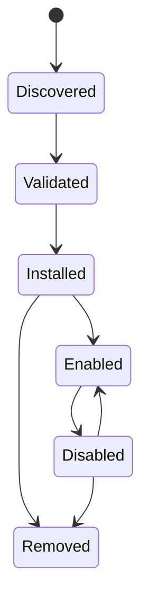

# Integracions i connectors

## Responsabilitat

Les integracions connecten comptes d'usuari i sistemes externs. Els connectors
amplien Gnosi amb contribucions declaratives i comportament executable acotat.
Els servidors MCP aporten eines d'agent a través d'un límit de protocol separat.

La frontera HTTP d'integracions està tipada estrictament sense canviar els
payloads públics. Les proves de connexió Mail i DAV validen les credencials de
text obligatòries abans d'obrir sockets. Les URL DAV poden apuntar a xarxes
privades autoallotjades com Nextcloud, però es bloquegen loopback, link-local,
multicast, adreces reservades i no especificades.

## Persistència de les integracions

El gestor d'integracions desa la configuració no secreta dels comptes i les
referències a secrets a les dades locals. Cada màquina reconnecta els comptes
independentment. Les API de Configuració mostren l'estat de connexió emmascarat,
validen la configuració, proven la connectivitat, trien valors predeterminats
i desconnecten proveïdors sense exposar tokens en brut.

Els callbacks OAuth de Google i Microsoft creen o actualitzen registres de
proveïdor. Els adaptadors IMAP, SMTP, CalDAV, Drupal, Notion i similars
normalitzen la seva configuració al registre comú d'integracions quan és possible.

OAuth de Google manté els verificadors PKCE pendents en un mapa d'estat acotat
amb caducitat i rebutja callbacks amb estat absent o caducat abans de l'intercanvi
de tokens. La configuració i els payloads de compte es tipen al límit de
l'adaptador. Els diccionaris d'estat i salut es validen amb models Pydantic
abans de retornar la forma històrica de mapatge; els gestors de redirecció
exposen tipus de resposta explícits. `response_model=None` conserva els
esquemes OpenAPI byte a byte i les excepcions de tipatge queden limitades a
les crides sense tipatge del SDK de Google.

L'adaptador Google People concreta les respostes de descobriment com a
registres de contacte de Gnosi, renova i desa tokens d'accés mitjançant el
gestor d'integracions, preserva les actualitzacions amb ETag i normalitza
noms principals, adreces, organitzacions, fotos i marques temporals del
proveïdor. Els objectes SDK sense tipatge queden confinats a l'adaptador i
no travessen les seves funcions de servei tipades.

OAuth de Microsoft aplica la mateixa regla d'estat acotat: els estats
d'autorització generats caduquen al cap de deu minuts i es consumeixen abans
de l'intercanvi de tokens. El JSON del token i del perfil Graph es concreta
dins de l'adaptador de ruta; el mapatge d'estat es valida amb Pydantic i els
gestors de redirecció tenen tipus explícits. Això bloqueja la configuració
obsoleta abans de fer crides de xarxa i conserva la forma històrica del compte
de correu sense canviar redireccions ni OpenAPI.

El MCP allotjat de Notion utilitza registre dinàmic de clients OAuth 2.1 i
PKCE. El límit tipat valida els objectes de descobriment i registre, exigeix
un identificador de client retornat, preserva l'origen del frontend iniciador
i desa els valors d'accés, renovació, client i estat pendent només mitjançant
les operacions d'IntegrationManager que gestionen secrets. La desconnexió
elimina els tres registres OAuth de Notion.

## Responsabilitats del backend i compatibilitat

El domini de configuració gestiona les 23 operacions HTTP de connectors
integrats i de tercers. `backend/domains/configuration/api/plugins.py` tradueix
les peticions HTTP; `plugin_lifecycle.py` gestiona l'activació segons dependències
i les transicions d'execució; `plugin_models.py`, els contractes Pydantic; i
`plugin_state.py` és l'únic responsable dels bloquejos per procés i del magatzem
d'estat normalitzat de cada vault.

El paquet tipat `backend/domains/plugins/` és responsable de validar els
manifests, contenir les rutes d'instal·lació, preparar i revertir els ZIP,
exportar paquets de manera determinista, normalitzar permisos i executar el
sandbox Node amb JSON per línies. Els mòduls històrics
`backend/services/plugin_system.py` i `plugin_sandbox.py` continuen sent façanes
primes. Són els únics propietaris de les constants compatibles, el registre de
gestors del host injectats, la ruta del runner i els punts de substitució
tardana; l'estat del lifecycle i del sandbox no es duplica entre les capes.

La integració de Notion és propietat de `backend/domains/notion`. Els mòduls
tipats separen la conversió de la importació REST, la recreació de vistes
incrustades, les fases del clon exacte, la descoberta del workspace, la
persistència de fitxers i registre de la ruta i la verificació de només lectura.
`backend/api/notion_routes.py` conserva la traducció HTTP i l'estat de progrés
del clon. Els tres camins històrics
`backend/services/notion_{importer,clone,view_recreator}.py` són façanes de
compatibilitat explícites: els imports, les globals i els punts de substitució
monkeypatch amb vinculació tardana continuen disponibles, mentre que la
implementació canònica resideix al paquet de domini.
Les preferències d'importació de Notion exigeixen l'arrel `LOCAL_DATA`
configurada; les dependències de clonació i verificació utilitzen directament
l'accessor tipat opcional del vault actiu, sense tornar a forçar-ne el tipus
a cada ruta. L'ordre, els mètodes, els camins, els esquemes de payload, les
descripcions i el document OpenAPI determinista de Notion es mantenen byte a byte.

`backend/api/vault_routes.py` continua sent una façana temporal de composició
per als imports antics. Injecta col·laboradors de rutes, persistència, execució,
selecció de models i bloquejos de mutació, i reexporta els models i gestors
històrics. Els punts de càrrega, desament, cicle de vida, model de resum i
bloquejos de mutació continuen sent substituïbles dinàmicament per connectors
i proves. Alguns mòduls de pàgina extrets encara importen aquesta façana
dinàmicament, i els límits de pàgines i registre mantenen excepcions al tipatge.
Eliminar aquestes dependències antigues continua pendent; passar una comprovació
estricta de tipus no demostra una separació tipada completa. L'ordre de rutes,
els camins, els mètodes, els codis d'estat, els esquemes de payload, els
identificadors d'operació i el contracte OpenAPI generat es mantenen congelats
durant aquesta migració estructural.

El domini de connectors i el dispatcher comparteixen un contracte tipat de
gestor del host amb dos arguments: arguments acotats i identificador del
connector que crida. La façana històrica del sandbox conserva la seva anotació
pública introspectable d'un sol argument per compatibilitat i l'adapta una
única vegada al punt intern d'injecció. Les proves de contracte congelen aquesta
signatura. Els RPC de Vault importen sota demanda els responsables canònics
de pàgines, registre i configuració, evitant cicles i eliminant crides a la
façana dinàmica de compatibilitat.

El capturador web integrat manté pura la lògica de mapatge. Les columnes de
destinació es resolen per identificador immutable, nom actual o àlies antic;
les exclusions explícites es distingeixen de la detecció automàtica de rols.
Només s'accepten camps desats que es puguin demanar a l'usuari, els valors de
l'extensió es converteixen segons el tipus d'esquema i les columnes obsoletes
o derivades es descarten abans del límit normal d'escriptura de Vault.

## Cicle de vida dels connectors

Els paquets de connectors declaren identitat, versió, compatibilitat, permisos,
contribucions i informació d'integritat. La instal·lació valida les rutes,
l'estructura del manifest, les signatures quan es requereixen i els efectes
declarats. Activar reconcilia idempotentment la configuració gestionada, els
perfils d'IA, les habilitats o les eines. Desactivar suspèn les contribucions
gestionades i preserva les personalitzacions de l'usuari.

La capa de composició de configuració de Vault consumeix directament els tipus
de retorn estrictes dels serveis d'estat, cicle de vida i resum dels connectors.
Conserva punts de façana de vinculació tardana per a proves i extensions, però
ja no força el tipus de l'estat tipat: els contractes de persistència i
actualització en execució tenen un únic responsable. Les transicions dels
connectors integrats no resolen cap ruta de fitxers. La validació de manifests
de tercers resol sota demanda el directori de connectors del vault actual,
només després d'identificar una destinació externa. Això manté deterministes
la selecció de vault de la petició i les crides aïllades de cicle de vida.

Les capacitats secundàries integrades utilitzen el mateix límit de cicle de
vida per vault. El registre autoritatiu declara dependències, rutes, superfícies
d'interfície i destinacions de Configuració. La versió 2 de l'esquema
`.gnosi/plugins.json` desa les llistes explícites `enabled_builtin` i
`enabled_third_party`, conservant `disabled` per als clients antics. Migrar
des d'un esquema antic o absent és atòmic i idempotent: totes les capacitats
opcionals comencen desactivades i es conserven la configuració, els permisos
i els registres desconeguts compatibles amb versions futures.

Els canvis passen pel contracte general `POST /api/vault/plugins/{id}/lifecycle`.
Un canvi amb prerequisits o dependents activats retorna primer un conflicte
estructurat; un administrador confirma després l'activació agrupada o en
cascada. Les rutes desactivades fallen abans d'executar la implementació i
les tasques externes programades consulten el mateix registre. El manteniment
bàsic, Markdown, les vistes de calendari de bases de dades, els camps de
contactes, els adjunts multimèdia i els dibuixos no depenen d'aquests connectors.

La secció Connectors de Configuració gestiona instal·lació, activació,
concessió de permisos, actualitzacions i eliminació. Les capacitats actives
es configuren a Connexions, Coneixement o Avançat. L'acció de configurar obre
directament la destinació; les capacitats sense configuració global no creen
pàgines buides.

El comportament executable dels connectors passa per un sandbox amb entorn
restringit i temps d'espera. Els connectors no reben l'entorn complet del host
ni accés arbitrari als secrets.

L'accés directe a la xarxa continua desactivat als dos entorns dels connectors.
Concedir la capacitat `network` només exposa el RPC del host, que rebutja
destinacions privades i limita mètodes, redireccions, temps i mida de resposta.
Els marcs de la interfície mantenen `connect-src 'none'`; el pare crida el
mateix límit del backend després de comprovar els permisos declarats i concedits.

Els connectors de tercers poden declarar el permís addicional `ui:settings` i
cridar `gnosi.registerSettingsPanel(...)`. Els panells actius amb permís apareixen
al grup dinàmic Extensions, es renderitzen dins del sandbox iframe existent
d'origen opac i desapareixen quan el connector es desactiva, es revoca o
s'elimina. Llegir o escriure la configuració pròpia requereix, a més, el permís
`settings` existent. L'API del host es manté a la versió major 2.

El pont d'interfície es divideix en un host tipat, adaptadors de mètodes
protegits per permisos, gestió del cicle de vida dels marcs i un runtime
TypeScript independent del sandbox. Aquest només se serialitza després de
compilar; les proves també executen la sortida minificada de Vite per evitar
que dependències capturades del host trenquin l'iframe. Tots dos costats
verifiquen la finestra emissora, no només el marcador de missatge o l'origen
opac. Es descarten respostes de marcs retirats o generacions anteriors del
document; les mutacions no es reprodueixen mai en un document substitut.

Moure un iframe actiu amb inserció DOM ordinària recarrega el document. El
host de Configuració utilitza moviment que preserva l'estat quan està disponible,
o espera que el panell es registri de nou abans de renderitzar. La neteja de
muntatge pertany a una instància de panell; actualitzar la instantània de
contribucions no remunta un panell inalterat. Les proves cobreixen els dos
moviments, denegacions de permisos, respostes obsoletes i registres repetits.
La QA amb navegador real també ha de comprovar obrir, tancar, reobrir i
substituir el connector contra una API de prova aïllada.

## Distribució al marketplace

L'índex oficial de connectors i la signatura separada es publiquen com a
artefactes de GitHub Release. Instal·lar des del catàleg remot requereix un
índex signat de confiança; cada paquet seleccionat exigeix integritat SHA-256
i una signatura separada Ed25519 de confiança. La procedència instal·lada
registra l'URL d'origen, la suma de verificació i l'editor verificat. La
instal·lació ZIP local continua disponible per desenvolupar, però comença
desactivada i sense permisos concedits.

El JSON del catàleg, l'estat per vault, els permisos i el magatzem local de
confiança es normalitzen als seus límits dinàmics abans d'arribar als serveis
tipats de cicle de vida i signatura. Els camps desconeguts compatibles amb
versions futures es preserven; els mapes de claus malformats es recuperen
com una col·lecció buida de claus d'usuari sense substituir la confiança inclosa.

Els connectors instal·lats es poden exportar com a ZIP deterministes. L'enviament
públic és una operació administrativa adreçada a un intermediari de moderació
configurat explícitament; Gnosi no incorpora mai un token d'escriptura de
GitHub. L'intermediari posa el paquet en quarantena i només el publica després
de la CI i la revisió humana.

## Límit MCP

Els servidors MCP configurats són processos independents o endpoints remots.
L'arrencada descobreix els esquemes d'eines i els normalitza al catàleg d'agent.
Els reintents i la gestió de `Retry-After` són acotats. La fallada d'un servidor
es registra sense descartar les eines dels servidors que funcionen.

## Exemples i integracions complementàries

El repositori inclou exemples d'empaquetatge de connectors, un proxy MCP de
Drupal, l'extensió de citacions de LibreOffice i un auxiliar de citacions de
Word. Són clients separats amb contractes acotats de backend; no comparteixen
automàticament l'accés als seus fitxers ni a les credencials.

## Invariants

- Els secrets d'integració es mantenen fora de Git i del vault sincronitzat.
- Desconnectar elimina o revoca coherentment la referència local de credencials
  i els valors predeterminats seleccionats.
- Els valors gestionats pel connector i per l'usuari es mantenen distingibles.
- L'extracció d'arxius i les rutes dels connectors no poden sortir de l'arrel d'instal·lació.
- La compatibilitat i els permisos es validen abans de l'activació.
- Els índexs oficials i els paquets remots es rebutgen si falten metadades d'integritat.
- Els sockets directes dels connectors i les connexions del navegador no eludeixen mai el RPC del host.
- Una capacitat desactivada no pot iniciar rutes, sincronitzacions, automatitzacions ni efectes externs nous.
- Desactivar o migrar mai no elimina dades, configuració, credencials ni perfils dels connectors.
- L'origen i l'efecte de les eines MCP es mantenen visibles després de normalitzar el catàleg.

## Aspectes que cal verificar

Executeu proves de manifest, signatura, sandbox, curses d'estat, contribucions
d'IA, encaminament MCP, reintents i connectors. Les proves d'integració reals
utilitzen comptes de prova dedicats i no han de modificar involuntàriament
dades de producció.
