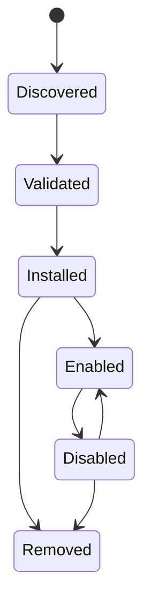

# Integració i connectors

## Reversió

Les Integració connecten els comptes d' usuari i sistemes externs. Els connectors s' expandeixen Gnosi amb contribucions Declatives i amb comportament executables declarats. Els servidors MC contribueixen eines agent a través d' un límit de protocol separat.

La frontera HTTP d'integracions està tipada estrictament sense canviar els
payloads públics. Les proves de connexió Mail i DAV validen les credencials de
text obligatòries abans d'obrir sockets. Les URL DAV poden apuntar a xarxes
privades autoallotjades com Nextcloud, però es bloquegen loopback, link-local,
multicast, adreces reservades i no especificades.

## Integració persisteix

El gestor d' integració desa la configuració de comptes no secret i referències a secrets sota dades locals. Cada màquina reconnecta els comptes independentment. Arranjament Les API llistaven l' estat de connexió emmascarada, validant la configuració, trieu la connexió per omissió, i desconnecteu proveïdors sense mostrar fitxes en brut.

Google i Microsoft OAuth Callbacks crea o actualitza registres de proveïdors. IMAP, SMTP, CalDAV, Drupal, Noion, i els adaptadors similars s' apliquen les seves pròpies opcions en el registre d' integració comú on és possible.

## El propietari del dorsal i la compatibilitat

La integració de Notion és propietat de `backend/domains/notion`. Els mòduls
tipats separen la conversió de la importació REST, la recreació de vistes
incrustades, les fases del clon exacte, la descoberta del workspace, la
persistència de fitxers i registre de la ruta i la verificació de només lectura.
`backend/api/notion_routes.py` conserva la traducció HTTP i l'estat de progrés
del clon. Els tres camins històrics
`backend/services/notion_{importer,clone,view_recreator}.py` són façanes de
compatibilitat explícites: imports, globals i costures `monkeypatch` resoltes
tardanament continuen disponibles. L'ordre, els mètodes, els paths, els
payloads, les descripcions i el document OpenAPI de Notion es mantenen
byte-a-byte.

El domini de configuració té les operacions HTTP de 23 en grup i tercera part. `backend/domains/configuration/api/plugins.py` tradueix peticions HTTP, `plugin_lifecycle.py` El propietari d'activació i transitacions en temps d'execució, `plugin_models.py` Té els contractes pidantics, i `plugin_state.py` és l' únic propietari dels panys per procés i normalitzat per l' estat de per a la sortida.

El paquet tipat `backend/domains/plugins/` és responsable de validar els
manifests, contenir les rutes d'instal·lació, preparar i revertir els ZIP,
exportar paquets de manera determinista, normalitzar permisos i executar el
sandbox Node amb JSON per línies. Els mòduls històrics
`backend/services/plugin_system.py` i `plugin_sandbox.py` continuen sent façanes
primes. Són els únics propietaris de les constants compatibles, el registre de
gestors del host injectats, la ruta del runner i els punts de substitució
tardana; l'estat del lifecycle i del sandbox no es duplica entre les capes.

`backend/api/vault_routes.py` Encara hi ha una façana temporal per a les importacions heretats. Injecta el camí, persisteix, l' hora, la combinació de models i els col· mutacions en cadena de bloqueig i els re- ports dels models històrics i els gestors històrics. La càrrega, desa, el cicle vital, el resum i els línies de substitució de la mutació segueixen sent substituïts dinàmicament per als connectors i proves. Els mòduls de domini mai importa la façana. L' ordre de la ruta, els mètodes d' estat, els codis d' execució, els esquemes, l' identificador, l' operació i el contracte OpenAPI generats durant aquesta migració estructural.

El dispatcher i la façana del sandbox comparteixen un contracte tipat de host
handler amb dos arguments: arguments acotats i identificador del plugin. Els RPC
de Vault importen mandrosament els propietaris canònics de pàgines, registre i
configuració, evitant cicles i eliminant crides a la façana dinàmica.

## Ciccle de vida d' endollat

Els paquets de connectors declaren la identitat, la versió, la compatibilitat, els permisos, les contribucions i la informació de la integritat. La instal· lació valida camins, estructura de manifest, signatures on es sol· liciten, i els efectes declarats. Activant els arranjaments gestionats, els perfils de l' IA, les habilitats o eines impoten. S' ignoren les contribucions gestionades mentre es preservaven les anul· lacions d' usuari.

Capacitats integrats que usen el mateix límit de cicle de vida perforació. El registre autoritza les dependències, rutes, superfícies IU i Arranjament destí. `.gnosi/plugins.json` s' està actualitzant la versió 2 registres explícits `enabled_builtin` i `enabled_third_party` llista mentre s' està retenint `disabled` Per als clients més antics. La migració d' un esquema antic o que falta és atòmic i i i i i i i i i i i i i i i i i i i immepotable: cada possibilitat opcional comença a deshabilitar i tots els arranjaments, permisos i registres compatibles amb el futur.

Els canvis de cicle vital passen pel general `POST /api/vault/plugins/{id}/lifecycle` contracte. Un canvi amb prerecquisits o regles dependents primer retorna un conflicte estructurat; un administrador confirma l' activació agrupades o en cascada. Les rutes deshabilitades no funcionen abans de que s' executin la implementació de la funcionalitat i les comprovacions de treball externes programades. El manteniment, les vistes de calendari de base de dades, els camps de contacte, els fitxers i els dibuixos de suports no depenen d' aquests connectors.

Els connectors són instal· lats, activació, permisos de permís, actualitzacions i eliminació. La configuració per a capacitats actives està exposada sota connexions, coneixement o Avançat. Una acció de configuració obre directament aquest destí i capacitats sense configuració global no crea pàgines buides.

El comportament dels connectors executables executa un límit de proves amb un entorn i temps constret. Els connectors no reben l' entorn complet d' ordinador o accés secret arbitrari.

La xarxa directa es continua deshabilitada en ambdós temps d' execució dels connectors. Un fet `network` La possibilitat només indica la màquina RPC, que rebutja els destins i els mètodes de destí privats, redireccionats, temps i mida de resposta. Els marcs de la IU segueixen `connect-src 'none'`; el pare crida al mateix límit de dorsal després de comprovar el connector ha declarat i amb permisos concedits.

Els connectors de tercers poden declarar l' additiu `ui:settings` permís i crida `gnosi.registerSettingsPanel(...)`Els plafons actius i concedits apareixen en el grup d' extensions dinàmiques, mostren dins de la carpeta local de l' iglogin opac existent i desapareixen tan aviat com el connector està deshabilitat, revocat o eliminat. Llegint o escrivint la configuració del connector requereix addicionalment la configuració existent `settings` permís. L' API de la màquina queda a la versió 2.

## distribució de mercat

L' índex oficial del connector i la seva signatura separada es publica com a actius de llançament de GitHub. La instal· lació del catàleg remot requereix un índex signat de confiança i cada paquet seleccionat requereix la integritat SHA- 256 i una signatura de confiança separada per Ed 25519. Instal· lant la provació de l' URL de la font, suma de verificació i editor verificat. La instal· lació local de ZIP continua disponible per al desenvolupament, però comença amb sense concedir.

Els connectors instal· lats es poden exportar com a ZIPs determinants. La submissió pública és una operació d' administrador enviada a un mode de conversió explícitament configurat; Gnosi mai s' encastarà a un testimoni d' escriptura de GtHub. El sistema d' errors en quarantena el paquet i el publica només després de la revisió de CI i humana.

## Límit MCP

Els servidors MCP són processos independents o punts remots finals. L' inici descobreix els seus esquemes d' eina i les normalitza en el catàleg de l' agent. Torneu a provar i `Retry-After` S' ha vinculat la gestió. Un servidor ha fallat es registra sense descartar eines des de servidors sans.

## Exemple i integració de company

El repositori inclou un exemple de paquets de connectors, un intermediari de Drupal MCP, l' extensió de citació LibreOffice, i un auxiliar de cita de paraules. Aquests són clients separats amb contractes de dorsal estrets; no comparteixen automàticament el sistema de fitxers de dorsal o l' accés de " credencial."

## Invariants

- Els secrets d'integració viuen fora de la Git i la caixa sincronitzada.
- Desconnectar l' eliminació o redefineix la referència de credent local i seleccionada
Per omissió és consistent.
- Els valors de connectors i edat d' usuari continuen sent indistingibles.
- No es poden escapar de l' administrador de la instal· lació d' arxiu i de rutes de connectors.
- La validació de la tecnologia i els permisos succeeix abans d'activació.
- Els índexs oficials i els paquets remots no s' han tancat quan falten les metadades d'integritat.
- Sockets de connectors directes i connexions de navegador mai eviten l' ordinador RPC.
- Una possibilitat deshabilitada no pot iniciar una nova ruta, sincronització, automatació o efecte extern.
- Deshabilitar o desactivar mai esborrar les dades dels connectors, arranjaments, credencials o perfils.
- L' origen i l' efecte MCP romanen visibles després de la normalització del catàleg.

## Concentrat de verificació

Executeu manifest, signat, proves de proves de proves, accions de l' estat, contribució a l' IA, ECP rout, reintentar i connectors. Una prova d' integració en directe usa un compte de prova dedicat i no ha de mutar les dades de producció sense voler.
