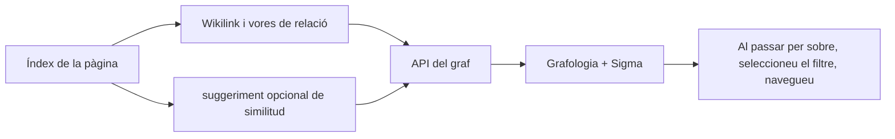

# Gràfic coneixement

## Reversió

`backend/domains/graph/` gestiona l'escaneig, els nodes, les arestes, la projecció,
els adaptadors i l'orquestració. `graph_service.py` és la façana estable que fan
servir l'API, l'agent i el planificador.

El gràfic projectes de relacions explícites del coneixement i suggeriments opcionals semàntics en una xarxa interactiva. Permet la navegació i el descobriment; es deriva de la Vaulta i no és una font de veritat separada.

## Disseny de graf

Nodes originares de pàgines indexades. Els límits s'originen de wikilinks, relacions, etiquetes o altres resultats de metadades configurades, i opcionals de la semblança. El servei gràfic prefereix l' accés a les metadades índex i l' accés directe al fitxer de manera que un directori no disponible produeix un gràfic parcial en comptes d' un fracàs total.

Els objectius sense resoldre de wikilinks es poden representar com a nodes diferents. No són en silenci descartes o fusionats per etiqueta de visualització perquè ho fan, per tant, s' amagarien les relacions de coneixement trencades.

## El recobriment semàntic

Els suggeriments semàntics que comparen les representacions dels documents i produeixen candidats puntosos. Els suggeriments són un recobriment: acceptar o materialitzar una relació ha d' usar un flux d' escriptura explícit. Model no transparent deshabilita el recobriment sense canviar el gràfic explícit.

## Representació per a la interfície

`GraphViewer` Mapa de dades de gràfics en Graphologia i Sigma. Les opcions de control de la disposició de la simulació de força, la repulsió, l' atracció, la gravetat, la prevenció, els llindar de l' etiqueta, la gruix, els colors del cúmul, i el lloc de nodes aïllats.

L' èmfasi en el ratolí està limitada intencionadament a un salt. Multi- ho èmfasi en els gràfics illegibles i obscurs el barri seleccionat. Els nodes isolats reben prou farciment i la posició estable per a romandre visibles.

## Invariants

- La identitat del node utilitza la identitat de pàgina estable, no només el títol.
- Mostra les etiquetes pot col· lir; els identificadors no poden.
- Les vores semàntices derivades són indistingibles de les relacions explícites.
- L' estat de la disposició no pot modificar el contingut de laulta.
- Es poden etiquetar escàners parcialment i no es desen la memòria cau com a complet.
- Nivell de directori `EDEADLK` i `EAGAIN` Els errors estan aïllats.

## Concentrat de verificació

Prova els nodes no resolts, nodes aïllats, llegenda del clúster, alternativa frontal-matter, llindars semàntics, errors de subdirectori en núvol, comportament d' una banda per passar, i navegació gràfica de nou a la pàgina correcta.
