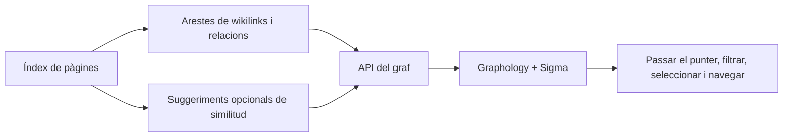

# Graf de coneixement

## Responsabilitat

`backend/domains/graph/` gestiona l'escaneig, els nodes, les arestes, la projecció,
els adaptadors i l'orquestració. `graph_service.py` és la façana estable que fan
servir l'API, l'agent i el planificador.

El graf projecta relacions explícites de coneixement i suggeriments semàntics
opcionals en una xarxa interactiva. Permet navegar i descobrir contingut;
deriva del vault i no és una font de veritat separada.

La feature amb tipatge estricte `features/graph/` gestiona l'estat de ruta, els filtres i la
composició de pàgina mitjançant una entrada pública de càrrega diferida.
Els panells i models interns són privats. `shared/graph/` gestiona el renderer,
el minimapa, la geometria, el teclat, les arestes i la capa semàntica
reutilitzables. Les rutes de graf i els grafs incrustats del Vault importen el
mateix renderer directament, sense agregador de càrrega immediata.
El trasllat revisat situa els filtres reutilitzables de graf a
`shared/graph/filtering/` i els filtres de Vault a `shared/filtering/`.
El codi compartit no depèn de features ni d'app, tampoc mitjançant imports de
tipus. Les projeccions, la configuració, la navegació, els controls de càmera
i els estils es conserven; el trasllat requereix verificació d'integració.

## Construcció del graf

Els nodes provenen de pàgines indexades. Les arestes provenen de wikilinks,
relacions, etiquetes o altres metadades configurades i, opcionalment, de
resultats de similitud. Les lectures del servei de graf prioritzen les
metadades de l'índex i protegeixen l'accés directe a fitxers perquè un directori
no disponible produeixi un graf parcial en lloc d'una fallada total.

Les destinacions no resoltes dels wikilinks es poden representar com a nodes
diferents. No es descarten ni es fusionen silenciosament per l'etiqueta visible,
perquè això amagaria relacions de coneixement trencades.

## Capa semàntica

Els suggeriments semàntics comparen representacions de documents i produeixen
candidats amb puntuació. Són una capa superposada: acceptar o materialitzar una
relació requereix un flux explícit d'escriptura de contingut. Si el model no
està disponible, es desactiva aquesta capa sense canviar el graf explícit.

## Renderització al frontend

`GraphViewer` transforma les dades del graf per a Graphology i Sigma. La
configuració de disposició controla la simulació de forces, la repulsió,
l'atracció, la gravetat, la prevenció de col·lisions, els llindars d'etiquetes,
el gruix d'arestes, els colors dels grups i la posició dels nodes aïllats.

El ressaltat en passar el punter es limita intencionadament a un salt.
Ressaltar diversos salts fa il·legibles els grafs densos i amaga el veïnat
seleccionat. Els nodes aïllats tenen prou marge i una posició estable per
continuar sent visibles.

## Invariants

- La identitat del node utilitza la identitat de pàgina estable, no només el títol.
- Les etiquetes visibles poden coincidir; els identificadors no.
- Les arestes semàntiques derivades es distingeixen de les relacions explícites.
- L'estat de disposició no pot modificar el contingut del vault.
- Els escanejos parcials s'etiqueten i no es desen com a memòria cau completa.
- Les fallades `EDEADLK` i `EAGAIN` a nivell de directori s'aïllen.

## Aspectes que cal verificar

Proveu els nodes no resolts i aïllats, la coherència de la llegenda dels grups,
la lectura alternativa del frontmatter, els llindars de suggeriments semàntics,
les fallades de directoris al núvol, el ressaltat d'un sol salt i la navegació
del graf cap a la pàgina correcta.
