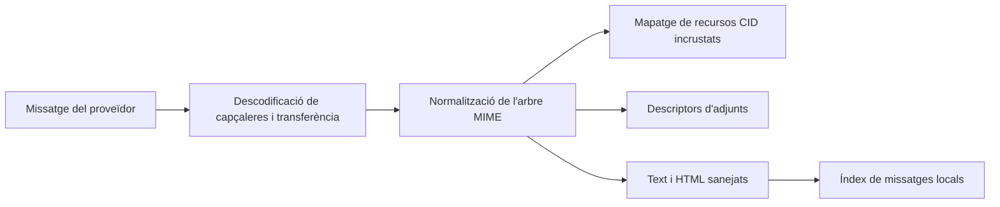

# Correu

## Responsabilitat

Correu integra comptes IMAP/SMTP, indexació local de missatges, carpetes, cerca,
etiquetes, vistes desades, esborranys, adjunts, respostes, consulta de contactes,
redacció amb IA i extracció d'entitats. Les credencials dels proveïdors es
mantenen locals a cada màquina.

El domini amb tipatge estricte `frontend/src/features/mail/` gestiona la
composició de la bústia, els components de correu, els hooks d'etiquetes i
vistes desades i les seves proves. Les rutes utilitzen l'entrada pública
diferida sense carregar immediatament la bústia ni el compositor. Els adaptadors
HTTP compartits conserven els contractes API existents. L'editor de correu
BlockNote i el seu adaptador pertanyen a aquest domini. Configuració consumeix
l'editor mitjançant la seva entrada pública revisada explícitament; no hi ha
implementacions copiades ni façanes de compatibilitat. El trasllat de
responsabilitats no canvia l'enviament,
el desament d'esborranys, la identitat de carpetes, la privacitat ni les
operacions dels proveïdors.

## Sincronització

Les integracions de compte descriuen el protocol i les referències OAuth o de
credencials. Una sincronització completa o incremental llegeix els missatges
del proveïdor, normalitza identificadors i contingut MIME i escriu files de
l'índex local. Els processos IMAP IDLE mantenen una connexió per compte elegible
i activen una actualització incremental quan el servidor anuncia canvis.

Els adaptadors de Google i Microsoft exposen els mateixos límits tipats de
missatges, adjunts, esborranys, etiquetes i enviament. Els payloads dinàmics dels
SDK es validen dins de cada adaptador; les úniques excepcions locals de tipatge
són les crides concretes de descobriment de tercers sense tipatge, mai l'API de
servei que consumeix Gnosi.
La renovació OAuth només accepta un token concret no buit abans de desar-lo.
El constructor de credencials i la crida de renovació de Google, sense tipatge,
queden aïllats i documentats dins de l'adaptador; IMAP i SMTP reben tipus de
connexió de la biblioteca estàndard al límit XOAUTH2.

La ingestió per lots utilitza savepoints perquè un missatge malformat no
reverteixi els anteriors. La identitat dels missatges i fils ha de ser estable
entre sincronitzacions. Les metadades d'interfície de cada fil es desen com a
objecte JSON validat dins del límit local de secrets i dades. Les operacions
de lectura, modificació i escriptura comparteixen un bloqueig perquè les
pestanyes concurrents no descartin camps mútuament. Les entrades malformades
de l'arrel o d'un fil es rebutgen sense afectar registres vàlids.
Els noms de carpetes són valors del proveïdor; la interfície tradueix les
carpetes semàntiques conegudes sense canviar els valors desats de comparació.

L'exportador antic de Gmail al vault concreta els payloads de descobriment al
límit del servei, exigeix un directori Mail configurat abans d'accedir a fitxers
i deduplica per identificador de missatge del proveïdor. El text multipartits,
l'HTML, les categories, les etiquetes i la presència d'adjunts conserven la
representació històrica en Markdown i frontmatter; si falta el vault, l'operació
es rebutja sense crear fitxers en altres ubicacions. Cada nota sincronitzada
conserva `database_table_id: mail`, i el frontmatter se serialitza amb
`yaml.dump` en lloc d'escapar cadenes manualment.

## Seguretat del MIME i del contingut

L'HTML es saneja abans de renderitzar-lo. Les imatges CID incrustades es resolen
contra la part MIME correcta i es conserven quan les respostes inclouen contingut
citat. Les imatges remotes i els adjunts continuen sent recursos explícits,
sense donar a l'HTML accés arbitrari a rutes locals.

La frontera d'imatges inline utilitza descriptors MIME tipats i una arrel
`Message` comuna per als arbres de text, related i mixed. Només accepta payloads
descodificats en bytes, normalitza tipus de contingut opcionals i conserva els
URL dels assets si no hi ha Vault actiu o el fitxer no està materialitzat.

Els mateixos contractes `MimeAsset` i `InlineImage` es mantenen entre Gmail,
Microsoft Graph i els remitents SMTP. Els recursos citats es converteixen en
imatges incrustades omplint explícitament tots els camps obligatoris i generant
un Content-ID nou.

## Redacció i enviament

L'editor de blocs crea un esborrany que es converteix en HTML i text adequats
per al correu. El servidor valida la identitat del remitent, els destinataris,
les capçaleres de resposta, el contingut citat, els adjunts i el compte del
proveïdor. Desar un esborrany i enviar-lo són efectes diferents; l'enviament
travessa un límit extern i retorna diagnòstics del proveïdor si falla.

## Estat relacional local

La base de dades de correu desa missatges, etiquetes, associacions entre
missatges i etiquetes i vistes desades. Les vistes contenen camps visibles,
filtres tipats, lògica, agrupació, ordenació i accions disponibles com a JSON
dins de files SQLite.
Els esquemes de creació i actualització parcial continuen sent contractes
Pydantic separats: una actualització pot ometre el nom sense debilitar-ne
l'obligatorietat en crear. Les formes HTTP i OpenAPI conserven la
compatibilitat amb els clients 2.x.

## Invariants

- La sincronització és idempotent per a un identificador de missatge del proveïdor.
- Un missatge fallit utilitza un savepoint i no interromp el lot del compte.
- Les etiquetes i vistes desades són estat local de l'aplicació, no etiquetes
  del proveïdor, tret que hi hagi un mapatge explícit.
- Les capçaleres de resposta conserven la identitat del fil.
- Les referències CID apunten a la part incrustada correcta després de citar o reenviar.
- Eliminar o moure un missatge del proveïdor exigeix el compte autenticat i una
  destinació de carpeta i missatge validada.
- Els secrets mai no entren a les files de missatges ni a les respostes de configuració del frontend.

## Aspectes que cal verificar

Proveu la descodificació MIME, el sanejament HTML, la renderització CID i les
respostes, els savepoints d'ingestió, les etiquetes, els filtres de vistes, els
esborranys, la resolució d'identitat i un enviament amb proveïdor real o simulat.
Playwright verifica enganxar contingut, redactar i respondre amb contingut citat.
