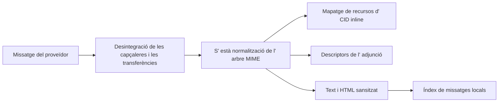

# Correu

## Reversió

El correu integra els comptes IMAP/ MTP, indexat de missatges locals, carpetes, cerca, etiquetes, vistes desades, esborranys, adjunts, respostes, cerca de contactes, esborranys d' AATP i extracció d' entitats. Les credencials del proveïdor romandran locals per màquina.

## Sincronització

Els programes d' integració del compte descriuen les referències de protocol i OAuth/credial. Una sincronització completa o incremental llegeix els missatges del proveïdor, l' identificador normalitza i el contingut MIME, i escriu files d' índex locals. Els treballadors IMAP tenen una connexió per compte i desencadenen la sincronització incremental quan el servidor anuncia canvis.

Els adaptadors de Google i Microsoft exposen els mateixos límits tipats de
missatges, adjunts, esborranys, etiquetes i enviament. Els payloads dinàmics dels
SDK es validen dins de cada adaptador; les úniques excepcions locals de tipatge
són les crides exactes de tercers sense stubs, mai l'API de servei de Gnosi.

La ingestió usa punts de desat de manera que un missatge incorrecte no pot desfer els missatges anteriors. El missatge i la identitat dels fils han de romandre estables a través de les sincronitzacions. Els noms de les carpetes són valors dels proveïdors; les carpetes semàntices conegudes de la IU sense canviar els valors de comparació persisteix.

## Seguretat del MIME i del contingut

HTML està salititzat abans de renderitzar. Les imatges CID inlinees es resolen contra la part MIME correcta i conservades quan el contingut citat s' inclou en respostes. Les imatges remotes i els adjunts romandran explícites en comptes d' accedir a les rutes locals.

La frontera d'imatges inline utilitza descriptors MIME tipats i una arrel
`Message` comuna per als arbres de text, related i mixed. Només accepta payloads
descodificats en bytes, normalitza tipus de contingut opcionals i conserva els
URL dels assets si no hi ha Vault actiu o el fitxer no està materialitzat.

## Compon i enviï

L' editor de blocs crea una representació d' esborrany que es converteix en HTML i text segur. La identitat del remitent, capçaleres de resposta, citant, adjunts i compte del proveïdor són validades al servidor. Els esborrany estalvien i envien són diferents efectes; enviant creus a un límit extern i retorna els proveïdors de diagnosi en fallada.

## Estat relacional local

La base de dades de correu desa missatges, etiquetes, associacions de missatge i vistes desades. Les vistes desades contenen camps visibles, filtres escrits, lògica, agrupant, ordenant i disponibles accions com a JSON dintre de les files SQLite.

## Invariants

- La sincronització és idempotent per a un identificador de missatge del proveïdor.
- Un missatge ha fallat usa un punt de desat i no ha cancel· lat el lot de comptes.
- Les etiquetes i les vistes desades són estat locals de l' aplicació, no les etiquetes del proveïdor a menys que
Existeix un mapatge explícit.
- Respon a les capçaleres de les capçaleres de fil que es conserva la identitat.
- CID fa referència a la part correcta en línia després de citar o reenviar.
- L' esborrat o moure un missatge del proveïdor requereix el compte autenticat i
un destí validat per carpeta/ missatge.
- Els valors secrets mai entren en files de missatge o respostes de configuració per al frontal.

## Concentrat de verificació

Prova la descodificació MIME, la Santura HTML, la representació de la CID i les respostes, la ingestió de punts, etiquetes, filtres de vista, accions d' identitat, i un proveïdor de codi intern real o erroni. S' envia el joc de versifica, compondre i cita el comportament de resposta.
