# Quaderns fonamentats en fonts

## Responsabilitat

`backend/domains/notebooks/` gestiona ara el repositori, el catàleg, les fonts,
la ingestió, les evidències, l'anàlisi, el xat i l'estat. El servei històric es
manté com una façana compatible per a l'API i els workers existents.

Els quaderns fonamentats ofereixen un espai `/notebooks` dedicat a preguntar
sobre els adjunts i els URL dels registres seleccionats a la taula Referències
configurada. Combinen una biblioteca cercable, un panell de fonts paginat, la
configuració i el mateix transport de conversa en streaming que l'assistent
flotant.

El cos, el títol, les etiquetes i la resta de metadades del registre no són
evidència. Gnosi només llegeix les metadades per localitzar camps definits com
a adjunt/fitxer o URL. Un quadern mai no modifica ni elimina el registre font,
l'adjunt o l'URL original.

La primera versió no inclou resums d'àudio, Studio, notes generades ni edició
de les fonts.

## Actors i accés

| Actor | Quadern privat | Quadern de workspace |
| --- | --- | --- |
| Creador | Descobrir, llegir, conversar i gestionar fonts i configuració | Descobrir, llegir, conversar i gestionar fonts i configuració |
| Editor del workspace | No visible | Descobrir, llegir i conversar |
| Lector del workspace | No visible | Descobrir i llegir la conversa i les fonts |

Cada petició queda limitada al Vault i al workspace actius. L'accés privat no
s'estén implícitament als administradors amb un altre principal d'usuari. Només
el creador pot modificar els membres, la configuració o eliminar el quadern.

## Flux de fonts i revisions

```mermaid
flowchart LR
    Selection["Taula Referències configurada\nidentificadors seleccionats"] --> Fields["Camps d'adjunt i URL\nexclusivament"]
    Fields --> Fingerprint["Empremtes del registre\ni de les fonts"]
    Fingerprint --> Queue["Treball durable\nd'ingestió"]
    Queue --> Extract["Extractors segurs\nexistents"]
    Extract --> Draft["Revisió SQLite\ninactiva"]
    Draft --> Index["FTS5 i vectors locals\ndeterministes"]
    Index --> Switch["Activació atòmica\nde la revisió"]
    Switch --> Tools["Eines del quadern\nde només lectura"]
    Tools --> Chat["Resposta fonamentada\namb citacions"]
```

En crear un quadern es desa la identitat de la taula Referències activa. Les
creacions i addicions posteriors utilitzen la taula configurada actualment,
mentre que un quadern existent continua vinculat a la seva taula original.

Obrir el quadern, formular-hi una pregunta o demanar un refresc manual compara
les fonts actuals amb la revisió activa. La cua durable fusiona els disparadors
repetits. Les fonts sense canvis reutilitzen els fragments; només es tornen a
extreure les modificades. Una revisió incompleta mai no es fa visible. Després
de la primera revisió correcta, la conversa continua utilitzant l'última revisió
completa mentre s'executa el refresc.

Les fonts URL només es revaliden després de
`GNOSI_NOTEBOOK_URL_REFRESH_TTL_SECONDS` (sis hores per defecte). Gnosi envia
els validadors ETag i Last-Modified desats mitjançant el mateix descarregador
protegit contra SSRF i amb redireccions validades. Si el servidor no ofereix
validadors, compara un hash acotat del contingut. Una comprovació sense canvis
queda registrada, però no activa una revisió nova d'evidència.

YouTube, Vimeo i els altres adaptadors de streaming compatibles fan una
comprovació de metadades sense descarregar el contingut. Gnosi compara una
empremta determinista de la identitat, durada, marques temporals, estat en
directe i mida; només torna a descarregar i transcriure si canvia. Un reintent
per Recurs força només el Recurs seleccionat i copia la resta de la revisió
activa.

Retirar un Recurs n'elimina immediatament la pertinença. La recuperació i
l'anàlisi global comproven els membres actuals, de manera que l'evidència
retirada queda exclosa abans que una revisió nova estigui preparada.

## Persistència i recuperació

L'estat és local a la instància a `LOCAL_DATA/system/notebooks.sqlite3`. El
repositori conté definicions, ACL, pertinença de Recursos, revisions, fonts,
fragments, files FTS5, anàlisis durables i els principals de conversa de cada
mode. Les files s'aïllen amb un hash del camí del Vault i l'identificador del
workspace.

El worker durable registra `notebook_ingest` i `notebook_analysis`. Els
treballs pendents o amb el lloguer caducat es reprenen després de reiniciar el
procés. L'activació d'una revisió és transaccional. Si falla el refresc d'una
font ja indexada, l'última versió vàlida continua disponible amb l'estat
`stale`; una font nova fallida mostra l'error i queda exclosa.

La neteja conserva la revisió activa, les tres revisions completes i els vint
resultats d'auditoria més recents per defecte, totes les revisions fixades per
converses i les que utilitzen anàlisis durables. Les revisions anteriors a
aquesta política es protegeixen conservadorament. Els límits es poden ajustar
amb `GNOSI_NOTEBOOK_COMPLETED_REVISION_RETENTION` i
`GNOSI_NOTEBOOK_AUDIT_REVISION_RETENTION`.

Els adjunts reutilitzen la materialització, el preescalfament de OneDrive, la
contenció de camins, els límits de mida i els extractors de documents, OCR i
multimèdia. La recuperació web manté la protecció SSRF, valida cada redirecció i
tracta el contingut com a dades no fiables, mai com a instruccions per al model.

## Recuperació, anàlisi i citacions

La barra de context permet triar fonts concretes d'adjunts o URL del quadern
actual i afegir altres quaderns accessibles. Un quadern afegit aporta totes les
seves fonts disponibles, però el quadern actual continua sent el propietari de
l'historial compartit o privat.

Cada torn fixa al servidor una revisió positiva i completa de cada quadern
seleccionat. Els identificadors de font es validen contra la revisió immutable,
la pertinença actual, l'estat, el Vault, el workspace i l'ACL. Aquest límit
s'aplica a la inspecció, la cerca, la lectura d'evidència i l'anàlisi durable. El
workflow només permet inspeccionar fonts, cercar fragments amb FTS5 i el vector
local determinista, llegir evidència exacta i executar una anàlisi jeràrquica
durable sobre la revisió fixada.

Les preguntes dependents de fonts han de fer una cerca real abans que el model
respongui. No s'exposen eines de mutació del Vault, MCP, canvis d'habilitats ni
accions externes. L'anàlisi jeràrquica processa lots acotats en lloc de posar
centenars de fonts en un sol prompt.

Les citacions inclouen el Recurs, la revisió, la font, el fragment i el
localitzador. Cada afirmació fonamentada del xat es vincula des del seu
`chunk_id`, validat pel servidor, a un enllaç visible. Els adjunts utilitzen
`gnosi-cite` i l'endpoint autoritzat de la revisió fixada per obrir l'adjunt, la
pàgina o el fragment exactes fins i tot després d'una actualització posterior;
els enllaços d'adjunts antics s'actualitzen en llegir-los perquè els quaderns
existents no s'hagin de reindexar. Les fonts web enllacen amb l'URL original
validat.

## Espais de noms de conversa

El mode privat per membre deriva un principal de checkpoint per usuari. El mode
compartit deriva un principal comú autoritzat i serialitza torns concurrents.
Els missatges compartits inclouen l'autor i l'historial és append-only; només el
creador el pot buidar. Canviar de mode no fusiona historials: tornar a un mode
anterior en restaura l'espai de noms.

Eliminar un quadern esborra els threads de checkpoint derivats abans d'eliminar
en cascada índexs, revisions i anàlisis. Les dades originals del Vault queden
fora d'aquest límit.

Les rutes HTTP de quaderns estan estrictament tipades i consumeixen helpers
públics de checkpoints del domini Agent en lloc de símbols privats de la façana
compatible. L'absència de Vault actiu o d'emmagatzematge de checkpoints falla
explícitament; l'eliminació i lectura de converses conserva els mateixos fils
aïllats i les respostes OpenAPI congelades.

## Contractes HTTP

| Endpoint | Finalitat |
| --- | --- |
| `GET/POST /api/notebooks` | Biblioteca paginada i creació des d'identificadors de Recursos |
| `GET/PATCH/DELETE /api/notebooks/{id}` | Detall, configuració i eliminació de dades derivades |
| `GET /api/notebooks/resources` | Selector paginat alfabètic amb facetes de tipus, autor i etiquetes de la taula Referències |
| `GET/POST /api/notebooks/{id}/sources` | Inspeccionar o afegir Recursos |
| `GET /api/notebooks/{id}/chat-sources` | Opcions autoritzades de fonts i quaderns per al context de conversa |
| `DELETE /api/notebooks/{id}/sources/{resource_id}` | Excloure immediatament un Recurs |
| `POST /api/notebooks/{id}/sources/{resource_id}/refresh` | Reintentar només un Recurs |
| `POST /api/notebooks/{id}/refresh` | Refresc explícit fusionat del quadern |
| `POST /api/notebooks/{id}/refresh/cancel` | Cancel·lar cooperativament la ingestió activa |
| `GET /api/notebooks/{id}/evidence/{chunk_id}?revision={revision}` | Resoldre una citació autoritzada dins la seva revisió immutable |
| `GET /api/notebooks/{id}/conversation` | Conversa canònica del mode actiu |
| `POST /api/chat` | Conversa en streaming amb context de quadern autoritzat |

El servidor deriva les revisions, el principal de checkpoint i l'espai de noms
després de l'autorització. Accepta fins a setze quaderns autoritzats, manté el
quadern de la pàgina com a propietari de la conversa i rebutja contextos que no
siguin de quadern, adjunts, mencions i substitucions d'habilitats.

## Comportament de la interfície d'usuari

L'acció múltiple només apareix quan la identitat de la taula oberta coincideix
amb la de Referències; mai per un nom o ID fix. El diàleg accepta títol,
visibilitat, mode de conversa i fins a mil identificadors de Recursos. Els
selectors de creació i d'addició ordenen alfabèticament tot el catàleg abans de
paginar i ofereixen filtres de tipus, autor i etiquetes derivats de l'esquema.
Aquestes metadades només serveixen per seleccionar i mai entren a l'evidència.
Les pàgines marcades com a plantilles de taula s'exclouen del selector, de la
validació de peticions i de les instantànies d'ingestió.
També s'exclouen els registres sense adjunts ni URL HTTP públiques; el selector
indica quants se n'han omès en lloc d'oferir una opció inutilitzable.

A l'escriptori, fonts, conversa incrustada i configuració es mostren juntes. Al
mòbil es converteixen en pestanyes. Només se sondeja el quadern actiu i visible:
un interval curt segueix la ingestió i un interval acotat actualitza la conversa
col·laborativa.

El progrés mostra el Recurs actual i permet al creador cancel·lar la indexació.
Cada Recurs mostra la darrera comprovació i el motiu acotat de l'error; les
fonts fallides també mostren el seu propi motiu. El reintent individual queda
desactivat mentre hi ha una altra revisió en curs.

Els lectors del workspace veuen la conversa canònica en un xat clarament de
només lectura, sense compositor ni accions de reintent, edició o rebobinat.
Només els editors poden enviar torns i només el creador veu el refresc manual i
la resta de controls de gestió.

## Errors, operacions i verificació

La primera conversa queda bloquejada fins que una revisió activa completa conté
una font. Els estats són `pending`, `indexing`, `available`, `stale` i
`error`; el refresc manual permet reintentar. Un error mai no substitueix una
revisió completa.

La cancel·lació és cooperativa i durable: el worker comprova l'estat abans de
cada Recurs i abans de l'activació atòmica. La transacció en curs es desfà i
l'última revisió completa continua disponible; si es cancel·la la primera
ingestió, la conversa resta bloquejada fins que un refresc acabi correctament.

El repositori SQLite i la cua durable romanen sota `LOCAL_DATA`, mai dins d'un
Vault compartit. Els mateixos camins funcionen en desplegaments natius i Docker.

Les proves cobreixen exclusió de camps no font, reutilització incremental,
retirada immediata, citacions, ACL, checkpoints, eines de només lectura,
filtres del selector i anàlisi durable. També cobreixen PDF, URL, OCR, fragments
grans, recuperació de lloguers caducats, validació web condicional i una
ingestió real de 300 Recursos. Vitest i Playwright verifiquen els permisos de
només lectura, l'exclusió de Recursos buits, la conversa fonamentada, una cita
navegable i el refresc automàtic. Els límits actuals són mil Recursos per petició, dues-centes
files de selector per pàgina, cinquanta resultats de recuperació i lots
d'anàlisi acotats. La configuració i els índexs són locals a una instància i no
se sincronitzen entre instal·lacions.
