# Quaderns fonamentats en fonts

## Responsabilitat

Els quaderns fonamentats ofereixen un espai `/notebooks` dedicat a preguntar
sobre els adjunts i els URL dels registres seleccionats a la taula Referències
configurada. Combinen una biblioteca cercable, un panell de fonts paginat, la
configuració i el mateix transport de conversa en streaming que l'assistent
flotant.

El cos, el títol, les etiquetes i la resta de metadades del registre no són
evidència. Gnosi només llegeix les metadades per localitzar camps definits com
a adjunt/fitxer o URL. Un quadern mai no modifica ni elimina el registre font,
l'adjunt o l'URL original.

La primera versió no inclou resums d'àudio, Studio, notes generades ni edició
de les fonts.

## Actors i accés

| Actor | Quadern privat | Quadern de workspace |
| --- | --- | --- |
| Creador | Descobrir, llegir, conversar i gestionar fonts i configuració | Descobrir, llegir, conversar i gestionar fonts i configuració |
| Editor del workspace | No visible | Descobrir, llegir i conversar |
| Lector del workspace | No visible | Descobrir i llegir la conversa i les fonts |

Cada petició queda limitada al Vault i al workspace actius. L'accés privat no
s'estén implícitament als administradors amb un altre principal d'usuari. Només
el creador pot modificar els membres, la configuració o eliminar el quadern.

## Flux de fonts i revisions

```mermaid
flowchart LR
    Selection["Taula Referències configurada\nidentificadors seleccionats"] --> Fields["Camps d'adjunt i URL\nexclusivament"]
    Fields --> Fingerprint["Empremtes del registre\ni de les fonts"]
    Fingerprint --> Queue["Treball durable\nd'ingestió"]
    Queue --> Extract["Extractors segurs\nexistents"]
    Extract --> Draft["Revisió SQLite\ninactiva"]
    Draft --> Index["FTS5 i vectors locals\ndeterministes"]
    Index --> Switch["Activació atòmica\nde la revisió"]
    Switch --> Tools["Eines del quadern\nde només lectura"]
    Tools --> Chat["Resposta fonamentada\namb citacions"]
```

En crear un quadern es desa la identitat de la taula Referències activa. Les
creacions i addicions posteriors utilitzen la taula configurada actualment,
mentre que un quadern existent continua vinculat a la seva taula original.

Obrir el quadern, formular-hi una pregunta o demanar un refresc manual compara
les fonts actuals amb la revisió activa. La cua durable fusiona els disparadors
repetits. Les fonts sense canvis reutilitzen els fragments; només es tornen a
extreure les modificades. Una revisió incompleta mai no es fa visible. Després
de la primera revisió correcta, la conversa continua utilitzant l'última revisió
completa mentre s'executa el refresc.

Retirar un Recurs n'elimina immediatament la pertinença. La recuperació i
l'anàlisi global comproven els membres actuals, de manera que l'evidència
retirada queda exclosa abans que una revisió nova estigui preparada.

## Persistència i recuperació

L'estat és local a la instància a `LOCAL_DATA/system/notebooks.sqlite3`. El
repositori conté definicions, ACL, pertinença de Recursos, revisions, fonts,
fragments, files FTS5, anàlisis durables i els principals de conversa de cada
mode. Les files s'aïllen amb un hash del camí del Vault i l'identificador del
workspace.

El worker durable registra `notebook_ingest` i `notebook_analysis`. Els
treballs pendents o amb el lloguer caducat es reprenen després de reiniciar el
procés. L'activació d'una revisió és transaccional. Si falla el refresc d'una
font ja indexada, l'última versió vàlida continua disponible amb l'estat
`stale`; una font nova fallida mostra l'error i queda exclosa.

Els adjunts reutilitzen la materialització, el preescalfament de OneDrive, la
contenció de camins, els límits de mida i els extractors de documents, OCR i
multimèdia. La recuperació web manté la protecció SSRF, valida cada redirecció i
tracta el contingut com a dades no fiables, mai com a instruccions per al model.

## Recuperació, anàlisi i citacions

Cada torn queda fixat al servidor a una revisió positiva i completa. El
workflow només permet inspeccionar fonts, cercar fragments amb FTS5 i el vector
local determinista, llegir evidència exacta i executar una anàlisi jeràrquica
durable sobre la revisió fixada.

Les preguntes dependents de fonts han de fer una cerca real abans que el model
respongui. No s'exposen eines de mutació del Vault, MCP, canvis d'habilitats ni
accions externes. L'anàlisi jeràrquica processa lots acotats en lloc de posar
centenars de fonts en un sol prompt.

Les citacions inclouen el Recurs, la revisió, la font, el fragment i el
localitzador. Els PDF utilitzen `gnosi-cite` per obrir la pàgina o el fragment;
les fonts web enllacen amb l'URL original validat.

## Espais de noms de conversa

El mode privat per membre deriva un principal de checkpoint per usuari. El mode
compartit deriva un principal comú autoritzat i serialitza torns concurrents.
Els missatges compartits inclouen l'autor i l'historial és append-only; només el
creador el pot buidar. Canviar de mode no fusiona historials: tornar a un mode
anterior en restaura l'espai de noms.

Eliminar un quadern esborra els threads de checkpoint derivats abans d'eliminar
en cascada índexs, revisions i anàlisis. Les dades originals del Vault queden
fora d'aquest límit.

## Contractes HTTP

| Endpoint | Finalitat |
| --- | --- |
| `GET/POST /api/notebooks` | Biblioteca paginada i creació des d'identificadors de Recursos |
| `GET/PATCH/DELETE /api/notebooks/{id}` | Detall, configuració i eliminació de dades derivades |
| `GET /api/notebooks/resources` | Selector paginat de la taula Referències |
| `GET/POST /api/notebooks/{id}/sources` | Inspeccionar o afegir Recursos |
| `DELETE /api/notebooks/{id}/sources/{resource_id}` | Excloure immediatament un Recurs |
| `POST /api/notebooks/{id}/refresh` | Refresc o reintent explícit fusionat |
| `GET /api/notebooks/{id}/conversation` | Conversa canònica del mode actiu |
| `POST /api/chat` | Conversa en streaming amb context de quadern autoritzat |

El servidor deriva la revisió, el principal de checkpoint i l'espai de noms
després de l'autorització. Rebutja contextos mixtos, adjunts, mencions i
substitucions d'habilitats.

## Comportament de la interfície d'usuari

L'acció múltiple només apareix quan la identitat de la taula oberta coincideix
amb la de Referències; mai per un nom o ID fix. El diàleg accepta títol,
visibilitat, mode de conversa i fins a mil identificadors de Recursos.

A l'escriptori, fonts, conversa incrustada i configuració es mostren juntes. Al
mòbil es converteixen en pestanyes. Només se sondeja el quadern actiu i visible:
un interval curt segueix la ingestió i un interval acotat actualitza la conversa
col·laborativa.

## Errors, operacions i verificació

La primera conversa queda bloquejada fins que una revisió activa completa conté
una font. Els estats són `pending`, `indexing`, `available`, `stale` i
`error`; el refresc manual permet reintentar. Un error mai no substitueix una
revisió completa.

El repositori SQLite i la cua durable romanen sota `LOCAL_DATA`, mai dins d'un
Vault compartit. Els mateixos camins funcionen en desplegaments natius i Docker.

Les proves cobreixen exclusió de camps no font, reutilització incremental,
retirada immediata, citacions, ACL, checkpoints, eines de només lectura i
anàlisi durable. Els límits actuals són mil Recursos per petició, dues-centes
files de selector per pàgina, cinquanta resultats de recuperació i lots
d'anàlisi acotats. La configuració i els índexs són locals a una instància i no
se sincronitzen entre instal·lacions.

