# Llibretes roïnes

## Reversió

Llibretes Stateed proporcionen una dedicat `/notebooks` Espai de treball per a preguntar sobre els adjunts i URL que s' han usat per registres seleccionats a la taula de referències configurades. Combinant una biblioteca de llibres cercables, un plafó font paginat, arranjament i el mateix transport de xat usat per l' assistent flotant.

El cos discogràfic, el títol, etiquetes i altres metadades no són proves. El Gnosi llegeix les metadades de registre només per a localitzar valors en camps de l' esquema de taula és un adjunt/ fitxer o tipus URL. Un llibre mai edita o esborra el seu registre de codi font, adjunt o URL original.

La primera versió no proporciona resums d' àudio, Studio, notes generades o edició del codi font.

## Actors i accés

| Actor | Llibreta privada | Llibreta d' espai de treball |
| --- | --- | --- |
| Creador | Descobriment, lectura, conversacions, gestió de fonts i arranjaments | Descobriment, lectura, conversacions, gestió de fonts i arranjaments |
| Editor de treball | No és descobreixble | Discover, read, conversa |
| Visualitzador d'espais | No és descobreixble | Descobreix i llegeix la transcripció i les fonts |

Cada petició també s' ha pogut trobar a la ronda activa i a l' espai de treball. L' accés privat no s' extensegui implícitament als administradors d' un usuari diferent. Només el creador pot canviar l' afiliació, els arranjaments, o esborrar la llibreta.

## Font i revisió del flux

```mermaid
flowchart LR
    Selection["Taula de referències configurats\ no identificades"] --> Fields["Adjunt i URL\ nfields"]
    Fields --> Fingerprint["Enregistra i codi font\ imprimeix"]
    Fingerprint --> Queue["S' ha perdut la llibreta d' adreces\ningd' autoritzable"]
    Queue --> Extract["Exterctors existents"]
    Extract --> Draft["SQLite inactiu\ nrevision"]
    Draft --> Index["FTS5 i determinant\ n vectors locals"]
    Index --> Switch["Atòmic actiu-revision\ nswitch"]
    Switch --> Tools["Llibretes de només lectura\ no eines"]
    Tools --> Chat["Resposta màxima\ namb citacions"]
```

La creació de llibres de notes desa la identitat de la taula de referències que estava activa en aquell moment. Més tard crea i addició de codi usen la taula actualment configurada, mentre que una llibreta d' adreces existent s' adjunta a la seva taula original.

Obrir una llibreta, fent una pregunta de notes o sol· licitar un refresc manual compara els valors de codi amb la revisió activa. Els disparadors repetits són carbóitzats per la cua de treball durable. Les fonts sense canvis reutilitzacions són re- exagerades. Una revisió incompleta mai no es fa visible. Després de la primera revisió correcta, el xat continua contra la darrera revisió completa mentre s' executa.

Eliminant immediatament una llibreta de notes de recurs. Recepció i anàlisi de llibres sencers s' uneixen contra l' afiliació actual, així que les proves eliminades són exclosos abans que una revisió de substitució estigui preparada.

## Persistència i recuperació

L' estat del llibre de notes és local de la instància de sota `LOCAL_DATA/system/notebooks.sqlite3`El repositori conté definicions de notes, entrades ACL, accions de recursos, revisions, trossos, files FTS5, anàlisis i els principals de les converses creats per cada mode. Les files estan afinades per un resum de la ruta Vault i l' identificador de l' espai de treball.

Els registres d'assistents durables `notebook_ingest` i `notebook_analysis` Gestors. En cua o treballs de lloguer caducats represa després de reiniciar el procés. L' activació de la revisió és la transacció. Si un origen indexat prèviament falla en refrescar, la seva última representació vàlida segueix disponible `stale` estat; s' informa una nova font i exclosionada.

Adjunts usen la materialització existent, OneDritiu, contenidor de camins, límits de mida, extracció del document, ROC i límits d' extracció dels mitjans. La recuperació web manté protecció SSRF, valida totes les redireccionats i tracta contingut de pàgina com a dades no fiables en comptes de les instruccions del model.

## Recepció, anàlisi i citacions

Cada torn de xat està arraconat a una revisió positiva i completada en el servidor. El flux de treball de notes expos només aquestes operacions contextuals:

- inspeccioneu metadades font lligades;
- Cerca trossos de llibre amb FTS5 i el vector local determinant existent;
- Llegeix les proves exactes per l' identificador de tros estable;
- start, inspeccioneu i llegiu una anàlisi jeràrquica molt difícil sobre el punt màxim
Revisió.

Les preguntes font-dependents han de realitzar una cerca de llibre abans que el model pugui sintetitzar una resposta. El flux de treball no rep mutació Vulta, MCP, mutacions o eines externes d' anàlisi. Els mapes d' anàlisi jeràrquica sobre lots d' prova lligades i redueixen els seus resums en comptes de col· locar centenars de fonts en una sola pregunta.

Les Citacions porten el recurs de notes, revisió, font, tros i localitzador. Les proves PDF usen el `gnosi-cite` El contracte de navegació per tal que el lector pugui obrir la pàgina citada o fragment. L' evidència web enllaça a l' URL validat original.

## Espais de noms de la conversa

El mode privat- per a recordar deriva un punt de control principal per a l' usuari. El mode compartit deriva d' un dels principals llibres autoritzats i en sèrieitza el bloqueig actual amb el bloqueig de fils. Els missatges compartits inclouen el seu autor i la història afegeix només de només lectura; només el creador pot netejar. El canvi de modes no fusionarà les històries: tornar a una restauració anterior de mode que revers el espai de noms.

Eliminació del llibre de notes enumera tots els principals derivats i esborra els seus fils de control abans de que els indexis de notes en cascada, revisions i anàlisis. Les dades originals són fora d' aquest límit d' eliminació.

## contractes HTTP

| Punt final | Purposa |
| --- | --- |
| `GET/POST /api/notebooks` | S' han programat la biblioteca i la creació de les ID del recurs |
| `GET/PATCH/DELETE /api/notebooks/{id}` | Detalls, arranjaments i esborrat de dades derivats |
| `GET /api/notebooks/resources` | Selector de referència a la taula de referència configurada |
| `GET/POST /api/notebooks/{id}/sources` | Inspecciona o afegeixi una membre de recurs |
| `DELETE /api/notebooks/{id}/sources/{resource_id}` | Exclou un recurs immediatament |
| `POST /api/notebooks/{id}/refresh` | Refresca o torna a provar explícita de Coescenes |
| `GET /api/notebooks/{id}/conversation` | Ccripció activa del mode Canonical |
| `POST /api/chat` | S' està connectant amb un context autoritzat a la llibreta d' adreces |

El xat de notes ignora els intents del client per a triar la revisió, el director de comprovació o l' espai de noms de sessió. El servidor derivirà tots tres després de l' autorització i rebutja els contexts mixtos de notes, adjunts, esmenta i les habilitats anul· lades.

## Comportament de la interfície d' usuari

L' acció multi- selecció només apareix quan la identitat de taula oberta és igual a la identitat de la taula de referències configurades. Mai està habilitada per un nom fix o identificador. El diàleg de creació accepta un títol, visibilitat, mode de conversa, i fins a un miler d' ID de recursos seleccionats.

La disposició de l' escriptori mostra fonts, xat encastat i arranjament juntes. La disposició mòbil presenta els mateixos plafons que pestanyes. Les enquestes de l' IU només són visibles la llibreta d' adreces: en la gestió de progrés usa un interval curt mentre una tasca està activa, i la transcripció usa un interval lligat per a actualitzacions de col· laboratives. Les notes inactives no s' organitzen.

## Comportament i operacions erroni

La primera conversa es manté bloquejada fins que almenys existeix una font en una revisió activa completa. Per-Reesource i els estats per font s' exposen `pending`, `indexing`, `available`, `stale`, i `error`La refresc manual proveeix reintentar- ho. Els errors no substitueixen una revisió activa completa.

Els operadors poden inspeccionar el repositori SQLite de notes i cua de treball durable a sota `LOCAL_DATA`, però no s' ha de moure a una ronda compartida. El codi del dorsal torna a carregar en el desenvolupament natiu; les dependències encara requereixen un comandament de dorsal que reinicii l' agent d' execució. Les mateixes rutes de configuració s' usen en els països natius i els desplegaments de Docker.

## Límits de verificació

La cobertura d' unitats prova l' exclusió del camp font, reutilització incremental, eliminació immediata de l' afiliació, identitat de citació, aïllament ACL, noms de control, validació positiva, eines de notes de només lectura i anàlisi adversa. La cobertura de la Frontal prova la reajustació de la massa en gran velocitat i el contracte de creació exacta d' ID seleccionat. La verificació de llançament també requereix un dorsal d' inici net, construcció i navegador mòbil a més d' escriptori.

Els límits de càrrega actuals són mil recursos per a crear/ afegir, dues centes files de selector per pàgina, cinquanta resultats de recuperació i els resultats relacionats amb les instal· lacions. La configuració dels llibres de notes i els índexs derivats són locals a una instància del Gnosi i no es sincronitzaran a través de les instal· lacions.
