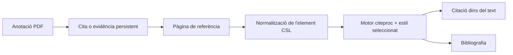

# Lector, referències i citacions

Els dominis de frontend amb tipatge estricte `features/reader/` i
`features/literature/` gestionen les seves pàgines, components locals, estat
i proves. Cadascun exposa una entrada pública diferida, de manera que la
lectura de canals i la cerca bibliogràfica es carreguen independentment.
Els estils de Literatura mantenen l'ordre de cascada existent dins de la
funcionalitat. Els adaptadors compartits de peticions, la integració Zotero,
la configuració de proveïdors i la renderització de citacions no es dupliquen
en aquests dominis.

Les rutes, l'emmagatzematge, l'anàlisi i les fonts del Reader viuen ara a
`backend/domains/reader/`; els repositoris, la cerca, la sincronització i
l'emmagatzematge bibliogràfic, a `backend/domains/literature/`. Els mòduls antics
es mantenen com a façanes compatibles.

L'anàlisi del Reader que depèn del vault, l'accés a resultats, la represa,
la cancel·lació, la recuperació d'articles antics i la generació de pòdcasts
passen per una única comprovació de vault actiu. Si falta context, retornen
una resposta recuperable de servei no disponible abans de crear treballs o
fils; les rutes vàlides del vault i els payloads existents es mantenen estables.
La generació de pòdcasts consumeix directament el generador canònic tipat de
sessions de base de dades i el tanca al bloc `finally` existent; no hi ha cap
conversió de tipus ni fàbrica duplicada de sessions entre l'orquestració del
Reader i la persistència.

Les rutes HTTP, els models canònics i els serveis de revisió sistemàtica estan
tipats estrictament. El recompte PRISMA, les transicions de cribratge,
l'evidència d'accés obert i les exportacions CSV/JSON/Markdown/SVG viuen al
domini pur `review_logic.py`; les funcions històriques continuen com a façanes.

## Responsabilitat

Aquest domini combina la lectura de canals i butlletins amb un gestor de
referències compatible amb Zotero, renderització de citacions CSL, importació
per identificadors i web, lectura PDF/EPUB i anotacions que poden esdevenir
evidència citable.

## Ingestió de referències

Crossref, Open Library, arXiv, PubMed i les metadades HTML tenen normalitzadors
tipats separats a `backend/domains/vault/citations/normalizers/`. Conserven els
payloads canònics de Zotero i el comportament de funció pura, mentre que
`backend/services/lookup_normalizers.py` continua sent la façana compatible.

Les referències entren per DOI, ISBN, arXiv, PMID, BibTeX, RIS, fitxers o URL
web. Els resolutors d'identificadors i Zotero translation-server produeixen
metadades específiques del proveïdor. Els normalitzadors les mapen a l'esquema
configurat, generen una clau de citació estable, dedupliquen candidats i
escriuen un registre al vault.

`backend/services/references_io.py` és el límit tipat i determinista de BibTeX/RIS.
Els seus ajudants petits d'anàlisi, normalització, mapatge de camps i serialització
preserven l'ordre, l'escapat, la resolució del tipus i el contracte públic
d'importació/exportació, sense persistència ni xarxa ocultes.
El deduplicador pur d'importacions utilitza estructures explícites de metadades
i índexs d'identificadors. Manté la prioritat clau de citació, DOI, ISBN i
títol normalitzat; una entrada creada en la mateixa importació s'afegeix
idempotentment als mateixos índexs. Les entrades del catàleg CSL i el mapatge
declaratiu de Zotero a Recursos exposen contractes serialitzables explícits,
preservant els extres arbitraris del proveïdor al límit JSON extern. Els
ressaltats de citacions gestionats per Brain utilitzen mapatge tipat SQLAlchemy;
l'única excepció sense tipatge queda a l'adaptador opcional `pypdfium2`, que
no publica el marcador `py.typed`.

L'orquestració de consulta, que és només de lectura, viu al domini de citacions,
manté la prioritat DOI → arXiv → PMID → ISBN → URL i fa passar les URL aportades
per l'usuari pel descarregador protegit contra SSRF abans de suggerir cap camp.
La taula de Recursos designada es llegeix d'una configuració canònica única;
només els vaults heretats que mai no s'han configurat poden adoptar automàticament
la primera taula amb Citation Key, sota el mateix bloqueig que Configuració.

El servidor de traducció és un servei auxiliar opcional. L'execució nativa pot
prescindir-ne; els resolutors específics d'identificador i les referències
existents continuen funcionant. Les fallades de traducció web retornen errors
que orienten la resolució, en lloc de presentar un registre buit com un èxit.

`citations/pdf_fallback.py` deriva un registre citable de les metadades PDF quan
falla la resolució d'identificadors. `citations/web_capture.py` selecciona i
mapeja resultats Zotero, i `platform/translation_server.py` gestiona el transport HTTP.

## Descobriment acadèmic federat

El connector integrat Recursos gestiona la configuració de repositoris;
`/api/vault/reference-table` continua sent l'única font de veritat de la taula
Recursos de destinació. `/literature` executa cada connector seleccionat
independentment i transmet resultats parcials; els errors de quota o proveïdor
s'associen a aquella font sense descartar els resultats correctes.

`backend/domains/literature/connectors/` gestiona el transport HTTPS acotat,
l'auditoria de peticions, la normalització canònica, OAI-PMH i JSON personalitzat,
els grafs de citacions i els adaptadors per família de proveïdors.
`backend/services/academic_connectors.py` és només una façana de compatibilitat.
El port tipat resol els col·laboradors de la façana en cada crida perquè les proves
i integracions puguin substituir transport, validació, parsers i dispatch sense
duplicar estat mutable.

`AcademicWork` és el contracte canònic dels connectors. Les unions deterministes
utilitzen, per ordre, DOI normalitzat, PMID o PMCID, identificador arXiv sense
versió, ISBN-13 i títol normalitzat més any i cognom del primer autor. Una
coincidència aproximada de títol només és un avís. Les obres fusionades conserven
totes les aparicions a les fonts, ubicacions obertes, recomptes de citacions
per proveïdor, procedència de cada camp i variants en conflicte.

La previsualització és de només lectura. Adjuntar el text complet és una acció
manual separada, disponible només per a una ubicació oberta verificada. La
importació passa l'obra fusionada pel mapatge compartit de Recursos compatible
amb Zotero i repeteix la comprovació d'identitat sota un bloqueig atòmic. Si
ja hi ha un registre de Recursos coincident, l'API el retorna sense duplicar-lo.

L'adaptador d'importació concreta tots els objectes imbricats del proveïdor
—publicació, identificadors, dates, ubicacions d'accés obert i extres Zotero—
en un únic límit de mapatge abans de convertir-los. Els payloads de creadors
només es mantenen intencionadament heterogenis al punt de connexió amb Zotero;
les claus deterministes d'obra, la injecció de claus de citació, la pertinença
als quaderns i la reutilització de duplicats mantenen el comportament existent.

## Revisions de literatura

L'estat de revisió sistemàtica es desa en quatre taules del vault gestionades
idempotentment: `Literature Reviews`, `Literature Activities`,
`Literature Candidates` i `Literature Decisions`, aquesta última només amb
addicions. Les estratègies de cerca, les consultes exactes als proveïdors, els
errors parcials, les operacions d'IA, les decisions de cribratge i les
exportacions continuen sent auditables i sincronitzades amb el vault principal.

El cribratge amb un revisor i el doble cec comparteixen el mateix model de
fases. En mode cec, la decisió d'un revisor s'oculta fins que tots dos l'han
enviada; els conflictes passen a consens explícit. La IA pot proposar consultes
editables, reordenar, cribrar o sintetitzar metadades recuperades, però no pot
excloure candidats ni afirmar evidència més enllà del títol, resum o text
complet efectivament proporcionat.
Tant l'alternativa per coincidència de tokens com el reordenador opcional
d'embeddings locals utilitzen un mateix registre tipat de classificació,
preservant l'ordre per puntuació i posició original entre les implementacions.

Els índexs OAI i l'estat temporal de cerca es poden reconstruir i resideixen
sota `LOCAL_DATA`; protocols, historials, candidats, decisions i artefactes
d'auditoria es mantenen al vault principal. Les credencials de repositori
utilitzen Keychain natiu o l'entorn de desplegament i mai no s'escriuen al
vault ni a l'estat del connector.
Les files OAI filtrades conserven la llista canònica tipada d'obres del
connector sense conversions posteriors. L'OCR PDF opcional i l'anàlisi EPUB
limiten les excepcions de tipatge als imports exactes de `pypdfium2` i
`ebooklib`, paquets que no publiquen `py.typed`; els objectes dinàmics no
surten de l'adaptador de documents.

## Flux de citació

Els valors CSL deriven del frontmatter de referències amb mapatges de camps
explícits. Les llistes de noms, dates, tipus d'element, escapament BibTeX/LaTeX
i metadades `extra` de Zotero requereixen normalització. L'esquema fixat
protegeix els tipus i camps compatibles davant dels canvis del projecte d'origen.

`backend/domains/vault/citations/exporting.py` gestiona la neteja del Markdown,
la resolució del subconjunt de citacions, els marcadors de bibliografia,
l'execució de Pandoc i el paquet de descàrrega. La ruta de compatibilitat
conserva la signatura pública i injecta els ports de fitxers, CSL i processos.

## Lector i anotacions

El lector Zotero inclòs mostra PDF i EPUB. Gnosi gestiona el pont que localitza
fitxers, serveix intervals de bytes segurs, rep anotacions i enllaça l'evidència
seleccionada amb registres del vault. Les anotacions inclouen URI d'origen,
pàgina, tipus, geometria, text, comentari, etiquetes, clau gestionada estable
i marques temporals.

Els endpoints de fitxers validen el confinament i gestionen la hidratació del
núvol. Els identificadors persistents d'anotació impedeixen duplicar una cita
generada cada vegada que es reobre el document.

## Canals i butlletins

Els models del Reader desen fonts, articles, estat de lectura, contingut
complet extret i un compte de butlletins. La ingestió de canals utilitza
savepoints de transacció perquè una entrada malformada no reverteixi tot el
lot. Els extractes i l'extracció de text complet són separats; truncar durant
la ingestió no ha de descartar permanentment contingut d'origen recuperable.

## Invariants

- Les claus de citació són estables tret que l'usuari canviï explícitament dades d'identitat.
- La importació deduplica per identificadors autoritatius i metadades normalitzades.
- La fallada d'una font federada no pot invalidar resultats ja retornats per altres fonts.
- La similitud aproximada no fusiona mai obres acadèmiques automàticament.
- Les mètriques de citacions es mantenen separades per proveïdor i no se sumen mai entre si.
- Els suggeriments d'IA no es converteixen en decisions finals de cribratge sense acció humana.
- Les rutes de fitxers del lector no poden sortir de les arrels permeses.
- La identitat del document i la geometria de pàgina d'una anotació sobreviuen als reinicis.
- Els components interns del lector inclòs es tracten com a codi del projecte
  d'origen; els canvis locals d'integració són explícits i reproduïbles.
- Les contrasenyes de configuracions antigues de butlletins es tracten com a
  secrets encara que un model antic exposi un camp de compatibilitat.

## Aspectes que cal verificar

Executeu proves de claus de citació, PubMed, tipus d'element, estils CSL,
escapament BibTeX, entrada/sortida de referències, anotacions, confinament de
rutes, deduplicació d'importacions i savepoints de canals. Afegiu proves de
normalització de connectors, tokens i marques d'eliminació OAI, SSRF/XML,
errors parcials, cegament de revisions, importacions concurrents i recomptes
PRISMA. La validació al navegador ha d'obrir un document de prova real i
comprovar un cicle de citació o anotació; després ha de fer una cerca progressiva
de literatura, inspeccionar-ne la procedència i importar un resultat deduplicat.
