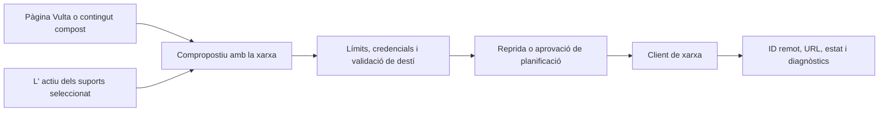

# Publicació social i suport

## Responsabilitat

Les instruccions històriques de publicació a Drupal específiques del mantenidor
no formen part de l'aplicació pública. Retirar aquell paquet del pipeline no
elimina la publicació social: les rutes i els adaptadors indicats més amunt
continuen sent la via compatible.

Aquest domini prepara, planifica, publica i observa contingut a través de les xarxes socials configurades. El centre de mitjans de comunicació proporciona actius visuals i metadades. La publicació sempre és un efecte extern.

## Adaptadors de xarxa

Clients de serveis aïllar Mastodon, Bluesky, Telegram, i altres semàntics de xarxa configurades: autenticació, límits de text, pujada de mitjans, identificadors de publicació, fils de resposta, i informe d' error. Les entrades de xarxa emmagatzemades a les credencials locals; les respostes no retornen mai els valors secrets.

Les etiquetes API exposen xarxes configurades, fluxos, publicacions i arranjaments relacionades. Les pestanyes de l' IU estan claus per identificadors de xarxa estables mentre es mostren noms i etiquetes usen cadenes localitzats.

El JSON dels proveïdors es valida i normalitza a la frontera de l'adaptador. Les
rutes HTTP estan tipades estrictament i conserven el contracte OpenAPI existent;
el JSON de missatges emmagatzemat es descodifica amb helpers tipats abans d'usar
previsualitzacions, URL o publicacions programades.

## Publica flux

La preparació pot traduir o tornar a establir contingut però no publicar- se per si mateixa. La publicació immediata requereix una acció explícita d' usuari; la publicació programada requereix un horari emmagatzemat en el qual l' execució de la política autoritza el mateix objectiu.

## Gestió dels suports

Puja el tipus de fitxer validant, mida, arrels permeses i noms generats. Els actius de les vistes de suports sense tractar les cau o miniatures com a originals. Es pot regenerar una miniatura que falta; perdre l' actiu de la font no pot.

## Invariants

- Només es resol una credent de xarxa en el dorsal en el moment d' execució.
- Vista prèvia/preparació i publicació són diferents estats.
- Els límits de text i de mitjans es validen per destí abans de la crida externa.
- Un error parcial de múltiples xarxes informa de cada resultat i no reclama el global
Que tingui èxit.
- Una publicació interactiva i interactiva utilitza el mateix contracte adaptador.
- Els identificadors d' post remot i URL es desen per a la auditoria i accions següents.

## Concentrat de verificació

Prova el contenidor de la pujada, l' alineació de la planificació/ connexió, la resposta de la xarxa normalització, reintentar els límits, l' error parcial de múltiples objectius, i una carpeta local o una publicació en línia 'apped'. La publicació en temps en temps real no s' usa mai com a un efecte secundari de l' incident.
