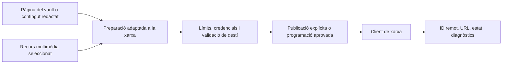

# Publicació social i multimèdia

## Responsabilitat

Aquest domini prepara, programa, publica i observa contingut a les xarxes
socials configurades. El centre multimèdia proporciona recursos visuals
reutilitzables i metadades. Publicar sempre és un efecte extern.

Les instruccions històriques de publicació a Drupal específiques del mantenidor
no formen part de l'aplicació pública. Retirar aquell paquet del pipeline no
elimina la publicació social: les rutes i els adaptadors indicats més amunt
continuen sent la via compatible.

La funcionalitat social gestiona el tauler, el compositor, el calendari de
contingut programat, l'historial i els components privats de la interfície.
La funcionalitat multimèdia gestiona separadament l'exploració de recursos,
els filtres, les vistes desades i les metadades. Totes dues exposen entrades
de ruta diferides; importar l'entrada social no avalua cap de les pantalles.
La icona de xarxa continua compartida amb Configuració. Els adaptadors HTTP
i els permisos de publicació no canvien; els consumidors d'altres funcionalitats
no importen fitxers privats d'implementació.

## Adaptadors de xarxa

Els clients de servei aïllen la semàntica de Mastodon, Bluesky, Telegram i
altres xarxes configurades: autenticació, límits de text, pujada de multimèdia,
identificadors de publicació, fils, normalització de respostes i errors. Les
entrades desades de xarxa fan referència a credencials locals; les respostes
no retornen mai secrets.

L'API exposa xarxes configurades, fluxos, accions de publicació i configuració
relacionada. Les pestanyes de la interfície utilitzen identificadors estables
de xarxa com a claus; els noms visibles i les etiquetes utilitzen cadenes
localitzades.

El JSON dels proveïdors es valida i normalitza a la frontera de l'adaptador. Les
rutes HTTP estan tipades estrictament i conserven el contracte OpenAPI existent;
el JSON de missatges emmagatzemat es descodifica amb helpers tipats abans d'usar
previsualitzacions, URL o publicacions programades.

L'historial de publicacions es desa com a files Markdown ordinàries a la taula
estable `Publicacions Socials` del vault. El servei conserva els noms de camps
llegibles i fusiona els resultats de cada xarxa amb el text original. Els ports
tipats de Vault amb vinculació tardana aïllen les operacions de registre,
pàgina i frontmatter perquè els imports circulars de compatibilitat es puguin
substituir sense propagar tipus dinàmics al domini social.

## Flux de publicació

La preparació pot traduir o adaptar el contingut, però no publica per si sola.
La publicació immediata exigeix una acció explícita de l'usuari; la programada
exigeix una planificació desada amb una política d'execució que autoritzi la
mateixa destinació.

## Gestió de multimèdia

Les pujades validen el tipus de fitxer, la mida, les arrels permeses i els noms
generats. Les vistes multimèdia indexen recursos sense tractar memòries cau ni
miniatures com a originals. Una miniatura absent es pot regenerar; la pèrdua
del recurs original no es pot reparar així.

## Invariants

- Les credencials de xarxa només es resolen al backend en el moment de l'execució.
- La previsualització o preparació i la publicació són estats diferents.
- Els límits de text i de mitjans es validen per destí abans de la crida externa.
- Una fallada parcial en diverses xarxes informa de cada resultat sense afirmar un èxit global.
- La publicació programada i la interactiva utilitzen el mateix contracte d'adaptador.
- Els identificadors remots de publicació i els URL es desen per a l'auditoria i les accions posteriors.

## Aspectes que cal verificar

Proveu el confinament de pujades, l'alineació de planificacions i connexions,
la normalització de respostes, els límits de reintents, les fallades parcials
en diverses destinacions i una publicació en un entorn de proves o simulada.
Una publicació real no s'utilitza mai com a efecte secundari incidental d'una
prova unitària.
