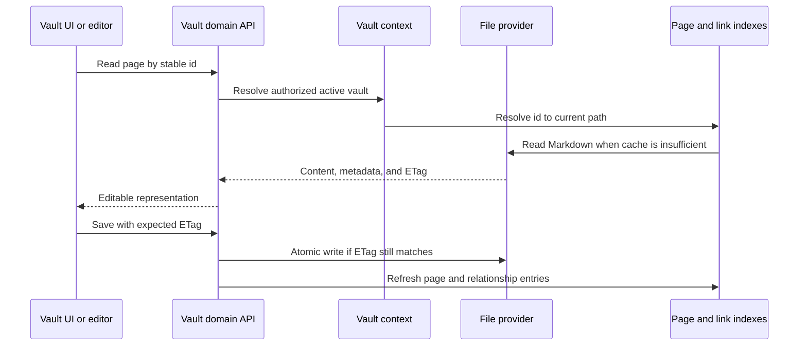

# Vault i fitxers

## Responsabilitat

El domini Vault relaciona el Markdown portable i els recursos amb pàgines,
carpetes, adjunts, cerques, esquemes, historials, paperera, exportacions,
citacions i selecció entre múltiples vaults. És el domini més gran i el
principal responsable de la sobirania de les dades.

El reconeixement local de text manuscrit és un adaptador d'ingestió opcional al
límit del domini Vault. Els objectes del model i del processador es mantenen
aïllats com a valors de tercers en temps d'execució; el servei exposa un resultat
tipat que conté el text, el reconeixement en brut, els valors de les línies, la
identitat del model i l'estat de correcció, sense canviar el contracte públic de
pujada. Models de resposta Pydantic específics validen els diccionaris d'estat,
preescalfament i reconeixement abans de conservar-ne l'estructura històrica per
als consumidors directes i la superfície OpenAPI estable byte a byte.

## Cicle de vida de les pàgines

La identitat d'una pàgina és independent del títol i de la ruta. El frontmatter
es normalitza als punts d'escriptura i es conserven les claus creades per
l'usuari. L'estat exclusivament intern es desa en fitxers auxiliars de
`.gnosi` quan exposar-lo al frontmatter contaminaria o desestabilitzaria el
contingut portable.

Les lectures i escriptures dels fitxers auxiliars utilitzen un únic contracte
explícit de mapatge de metadades, que inclou els resultats de separació, fusió
i persistència portable. El mecanisme alternatiu compartit de lectura tolerant
del frontmatter retorna els valors escalars del primer nivell com a objectes
tipats quan cal recuperar YAML; el contingut niat mal format s'ignora
deliberadament. Aquests contractes no forcen conversions dels valors de
l'usuari ni canvien les proteccions existents dels fitxers del núvol.

`pages/markdown_writer.py` és el límit canònic de serialització: recupera o crea
l'identificador estable si falta, transforma les claus de l'esquema en noms
d'emmagatzematge, elimina els camps virtuals, escriu l'estat intern al fitxer
auxiliar, enriqueix les relacions portables i materialitza instantànies de les
vistes abans de l'escriptura atòmica del fitxer.
`services/field_resolver.py` és responsable d'aquest contracte de mapatge de
claus d'esquema. Accepta identificadors de camp immutables, noms actuals i àlies
històrics, resol els conflictes de manera determinista i emet només els noms
actuals llegibles per humans als límits d'emmagatzematge i resposta, tot
preservant les metadades locals que no hi estan relacionades.

`pages/save_helpers.py` és responsable de preparar les metadades dels desaments
complets, seleccionar la destinació, reutilitzar els identificadors existents
i crear una versió abans d'escriure.
`pages/patch_helpers.py` és responsable de les lectures amb ETag, la preparació
de metadades PATCH, la reubicació de fitxers i les actualitzacions coordinades de
les memòries cau de pàgines, cossos, citacions i documents analitzats. Els vuit
noms històrics de funcions auxiliars privades es mantenen com a façanes mínimes
de compatibilitat, i cada col·laborador substituïble o memòria cau mutable es
resol mitjançant un port tipat amb vinculació tardana.

## Límits del backend

La lectura i escriptura de pàgines, les previsualitzacions, la duplicació,
l'historial i la paperera s'implementen a `backend/domains/vault/pages`, mentre
que la pujada de recursos, les icones i el servei d'imatges són a
`backend/domains/vault/assets`. El servei de fitxers restringit a les rutes
permeses, les rutes Library/raw/thumbnail, els tokens de fitxers locals, les
pujades associades a propietats, els enllaços portables i l'eliminació física
són a `backend/domains/vault/files`. Aquests paquets separen els esquemes
estrictes de petició, els adaptadors de rutes, els serveis d'aplicació, els
repositoris i els responsables únics dels bloquejos mutables, les memòries cau
i els magatzems de tokens. El nou comportament de Vault pertany al límit de
domini corresponent.

El límit transitori `pages/runtime.py` preserva l'estat dinàmic del mòdul
històric de rutes i exigeix un Vault actiu abans de construir rutes del sistema
de fitxers o motors de regles. Els seus models de petició ara es vinculen
directament a Pydantic, cosa que evita classes base dependents del temps
d'execució sense canviar la seva identitat pública de mòdul ni el contracte
HTTP generat.

`backend/domains/media` és responsable de resoldre les arrels multimèdia,
de l'escaneig recursiu adaptat al proveïdor i la seva memòria cau derivada
persistent, dels fitxers auxiliars de metadades sincronitzades i vistes desades,
dels filtres, la paginació, l'arbre de carpetes de càrrega diferida, les pujades
restringides a les rutes permeses, l'extracció EXIF i la serialització estable
dels fitxers. `backend/services/media_service.py` continua sent la façana Python
compatible: conserva la classe històrica, la instància única, la forma
d'invocació, els descriptors, l'estat i els errors, i resol amb vinculació
tardana l'estat mutable i els col·laboradors substituïbles. El seu constructor
intern ara té una anotació explícita de retorn `None`, que elimina l'última
excepció de tipatge del codi del backend escrit a mà sense canviar el
comportament de construcció. La façana valida que hi hagi un vault actiu abans
de travessar un límit del sistema de fitxers i utilitza els contractes multimèdia
tipats per a arrels, escanejos, consultes, pujades, dades EXIF i informació
serialitzada dels fitxers. Els mòduls de domini no importen mai l'encaminador
HTTP ni la façana de compatibilitat.

El mòdul HTTP transitori de multimèdia concreta una sola vegada el tipus de
l'encaminador heretat importat dinàmicament com a `APIRouter`. Els decoradors
de rutes i els registres delegats de recursos, fitxers, icones i propietats
utilitzen aquesta mateixa instància tipada, cosa que manté estables l'ordre de
registre i el contracte OpenAPI sense dispersar excepcions de tipus entre
gestors individuals.

El límit dels dibuixos aplica la mateixa concreció de tipus d'un únic
encaminador al CRUD de dibuixos i al registre delegat de l'historial. Les còpies
de seguretat dels dibuixos, l'eliminació lògica, els terminis de recuperació,
els permisos i l'ordre de les rutes continuen sota la responsabilitat dels
serveis de domini existents, mentre que la superfície de composició HTTP té
tipatge estricte.

La composició de previsualització i desament de pàgines també comparteix un
únic encaminador de tipus concret per resoldre títols i delegar el registre de
previsualitzacions i escriptures. La identitat de les memòries cau, la
coincidència d'àlies, les comprovacions de vault actiu i els esquemes generats
de les rutes no canvien.

Les rutes de traducció i sincronització amb Drupal també concreten el tipus del
seu encaminador de vinculació tardana al límit del mòdul. Les operacions sobre
una sola fila, en bloc, de coincidència, de botons generats i de traducció de
pàgines preserven les comprovacions de rols, la feina en segon pla i el mapatge
d'errors externs, alhora que continuen sent visibles per al tipatge estricte.

L'emmagatzematge vinculat a les taules té responsables explícits.
`assets/table_paths.py` és responsable de les rutes de recursos restringides
als límits permesos, els directoris per propietat, les revisions i les funcions
de canvi de nom segures davant de col·lisions; `assets/persistence.py` és
responsable de la ingestió recursiva de metadades i de l'eliminació de recursos
de registres dins dels límits permesos; `assets/quarantine.py` és responsable
de l'eliminació de taules resistent a fallades i de la recuperació en arrencar.
`tables/folders.py` és responsable de crear i migrar el directori físic
`BD/<database>/<table>` de la taula. Aquests mòduls reben ports acotats del
sistema de fitxers i del registre des de la façana de compatibilitat i no
importen mai l'encaminador HTTP.

`tables/routes.py` és ara responsable de les 23 operacions històriques de
bases de dades, taules, catàlegs d'opcions, vistes desades i esquemes de carpetes,
en l'ordre original. Els seus gestors estrictes deleguen en els serveis
existents de files, cicle de vida, propietats, opcions i vistes;
`tables/composition.py` és el conjunt immutable de dependències d'aquestes
rutes i de la consulta de files i l'enriquiment de metadades.
`tables/security.py` exposa només les dues fàbriques tipades d'autorització
d'espais de treball, evitant una dependència estàtica del domini de taules
respecte de l'àmplia composició d'autenticació heretada. L'encaminador heretat
registra les rutes de domini en una estructura plana per mantenir la
compatibilitat amb els consumidors de l'inventari de rutes i reexporta els
elements invocables de Python admesos.

`backend/api/vault_routes.py` és ara un mòdul d'arrencada de compatibilitat de
283 línies, en lloc de ser responsable de la implementació. Els mòduls tipats
de `backend/domains/vault` són responsables del comportament restant d'API,
anotacions, citacions, dibuixos, Drupal, fitxers, coneixement, enllaços,
multimèdia, pàgines, registre, taules i traducció. El mòdul d'arrencada carrega
i registra aquests responsables en l'ordre històric del codi font, mentre que
`facade_bridge.py` preserva els imports admesos, les variables globals mutables
i els punts de substitució per a monkeypatch amb vinculació tardana.
L'encaminador pare continua exposant el mateix inventari pla d'`APIRoute`
i un OpenAPI determinista idèntic byte a byte. Per tant, la façana no necessita
cap excepció als controls del codi font.

El comportament del cicle de vida de les traduccions pertany a
`backend/domains/vault/translation`: la càrrega opcional de proveïdors,
la recuperació de fitxers del núvol, la traducció de files i de pàgines
completes, els efectes mínims sobre les metadades i la propagació de
l'obsolescència als elements fills són serveis tipats separats. El límit
compartit de funcions auxiliars pures canonitza les identitats d'origen, detecta
canvis traduïbles i camps d'idioma, reutilitza les etiquetes d'opció existents
i tradueix només els subcamps textuals de les imatges tot conservant-ne el
recurs original. La publicació de files a Drupal pertany a
`backend/domains/vault/drupal`, que separa el mapatge de camps i identitats,
la preparació de recursos multimèdia locals, la conversió de Markdown i
wikilinks, les memòries cau d'idiomes, la coincidència per títol i la
sincronització idempotent de nodes. L'encaminador de compatibilitat conserva
els decoradors FastAPI originals, les docstrings de les rutes i els punts de
substitució Python amb vinculació tardana, mentre que el connector de Drupal
continua sent el límit de transport extern. Aquests trasllats no canvien les
rutes, els payloads, els codis d'estat, les tasques en segon pla ni l'ordre
de les rutes.

## Índexs i memòries cau

L'índex de pàgines accelera el llistat, la resolució d'identificadors, l'accés al
frontmatter i la cerca. L'índex de wikilinks resol els enllaços entrants perquè
els canvis de nom de les pàgines puguin actualitzar les referències. Les
memòries cau de cossos i documents analitzats eviten lectures repetides.
Totes les memòries cau són derivades i han de tolerar una reconstrucció des
de zero.

`links/document_inventory.py` és responsable de l'inventari amb TTL per vault
que utilitzen els enllaços globals. Exclou l'historial i la paperera, aïlla els
fitxers il·legibles, inclou els quadres de comandament JSON i recorre el disc
com a alternativa mentre l'índex del proveïdor no està disponible.
`links/document_cache.py` és responsable de les memòries cau persistents del
cos Markdown i del frontmatter analitzat, indexades per mtime. L'encaminador
només proporciona les rutes actives de les memòries cau, l'analitzador i
l'escriptor JSON segur, de manera que el comportament de la memòria cau és
independent del proveïdor de fitxers.
`links/relation_sync.py` és responsable de les actualitzacions idempotents del
sistema de fitxers i de les memòries cau quan els canvis en una relació directa
afecten la inversa. La correspondència pura d'esquemes continua sent un port
tipat de regles separat: resol els camps de relació a partir dels noms actuals
normalitzats i dels àlies, exigeix un únic camp invers inequívoc i emet només
operacions d'addició o eliminació sobre identificadors canònics de relació.
L'encaminador de compatibilitat proporciona l'entrada/sortida de pàgines amb
vinculació tardana.

L'arrencada carrega primer les instantànies vàlides del disc i després inicia
les tasques d'actualització. Un escaneig parcial del proveïdor de fitxers es
marca com a parcial i no pot substituir una memòria cau que se sap que és
completa. Les fallades s'aïllen per fitxer perquè un únic marcador de posició
només disponible en línia o orfe no faci desaparèixer la resta del vault
d'una resposta.

`pages/index_entries.py` és responsable de les lectures acotades de
frontmatter, els reintents davant de bloquejos del núvol i la normalització
d'entrades de memòria cau. `pages/index_service.py` és responsable del
descobriment, l'actualització, els mapes inversos d'identificadors i les
instantànies deduplicades. `pages/resolver.py` és responsable de resoldre
identificadors estables, UUID canònics, títols indexats i escanejos acotats
sense memòria cau prèvia.
`pages/tags.py` és responsable de l'agregació independent del proveïdor de les
etiquetes del frontmatter i de les etiquetes semàntiques de taula, inclosa la
deduplicació per pàgina. L'encaminador de compatibilitat injecta els ports de
vault actiu, registre, calendari i memòria cau, de manera que cap d'aquests
serveis importa la façana HTTP.

El mòdul d'execució del registre concreta una sola vegada el tipus del seu
encaminador amb vinculació tardana, utilitza el decorador estàndard tipat de
gestor de context per als cicles de mutació i tracta l'absència d'un Vault
actiu com l'absència d'una arrel d'adjunts del núvol. L'ordre de les rutes de
registre i taules, els bloquejos, les memòries cau i els candidats d'adjunts
específics de cada proveïdor no canvien.

L'API principal de Vault reutilitza un únic encaminador tipat per als camps
virtuals, l'estat de l'índex, les notes diàries i l'agregació d'etiquetes. Les
etiquetes de visualització d'usuari travessen el límit dels descriptors de
l'ORM heretat com a cadenes concretes, tot preservant l'alternativa existent:
del nom al correu electrònic i, finalment, a l'identificador.

El format de citacions i el registre d'exportacions ara passen per un únic
encaminador tipat, mentre que la detecció del format de referències, la
serialització i la normalització retornen directament els seus contractes
natius estrictes de cadena. Els formats d'exportació, la resolució de citacions
i el comportament davant d'errors de Pandoc es mantenen estables.

La consulta de metadades, el reconeixement de PDF, la traducció d'URL, la
promoció de Zotero, les actualitzacions massives i el registre del catàleg i
la cerca de citacions comparteixen aquest mateix límit HTTP de tipus concret.
Les alternatives de proveïdor, els permisos d'edició i la unicitat de les claus
de citació continuen resolent-se amb vinculació tardana i preserven el
comportament compatible.

La importació de Markdown, els comentaris en línia, els blocs sincronitzats,
la navegació per enllaços i les mencions sense enllaç comparteixen un
encaminador tipat de sincronització de pàgines. Els models de petició
utilitzen Pydantic directament i conserven la seva identitat històrica de
mòdul, preservant els noms dels esquemes, el comportament SSE i la sortida
OpenAPI.

El CRUD d'anotacions PDF segueix el mateix model: classes base de petició
directament de Pydantic i un únic encaminador tipat, amb la identitat històrica
dels esquemes preservada. El filtratge per URI d'origen, l'ordre de les
pàgines, els permisos d'edició i la serialització d'anotacions no canvien.

L'administració de Vault ara falla explícitament amb una resposta de servei
no disponible quan falta la ruta del Vault principal, en lloc de construir una
ruta a partir de `None`. Les anotacions de resposta heretades continuen
congelades, i el canvi de nom lògic travessa l'antic límit dels descriptors
de l'ORM sense modificar les carpetes del disc, els slugs, les regles de purga
ni les comprovacions de confinament de rutes.

El catàleg, la instal·lació, l'exportació i l'enviament moderat de plantilles
de Vault exposen límits tipats de petició i resposta. Els gestors validen cada
mapatge abans de retornar-lo i desactiven la publicació del model de resposta
a les rutes de compatibilitat, de manera que els esquemes FastAPI congelats i
el contracte de diccionari de les crides directes no es desvien. Les
comprovacions de signatures, les troballes de privadesa, els paquets
deterministes i la reversió en cas de fallada del registre no canvien.

## Proveïdors de fitxers

L'abstracció de proveïdor selecciona el comportament local o l'adaptat al
File Provider genèric de macOS, OneDrive, iCloud Drive, Google Drive, Nextcloud
o Dropbox. El codi habitual del domini continua treballant amb `Path`;
l'adaptador hi afegeix detecció de marcadors de posició, hidratació,
disponibilitat i mapatge de rutes. Establiu `GNOSI_FILES_PROVIDER`
explícitament quan la detecció automàtica de rutes sigui ambigua.

El sistema d'execució de fitxers a demanda és independent del proveïdor.
Google Drive, iCloud i Nextcloud no hereten el comportament de recuperació de
OneDrive; només `OneDriveProvider` pot reiniciar el client OneDrive després
d'una fallada d'hidratació amb intents acotats. Els proveïdors natius de macOS
utilitzen per defecte una acció `open` en una sessió gràfica. Els desplegaments
Docker poden utilitzar un auxiliar configurat a l'amfitrió perquè les lectures
del contenidor travessen un altre límit.

Les rutes de Dropbox File Provider es detecten explícitament. Un servei
desconegut sota `~/Library/CloudStorage` de macOS utilitza l'adaptador
`fileprovider`, sense efectes secundaris; qualsevol carpeta completament
sincronitzada o muntada de manera ordinària utilitza `local`. Només cal un nou
adaptador amb nom propi quan hi ha un senyal diferent de marcador de posició
o un mecanisme d'hidratació específic del proveïdor. `GNOSI_DATA_DIR` es manté
local independentment del proveïdor del vault.

Només el Markdown portable de Vault i els adjunts poden residir en un arbre
sincronitzat. Les bases de dades SQLite, els bloquejos, les memòries cau
derivades, els secrets i `GNOSI_DATA_DIR` es mantenen a l'emmagatzematge local
de l'aplicació. Una carpeta Nextcloud completament sincronitzada es comporta
com a `local`; els desplegaments amb fitxers virtuals utilitzen el proveïdor
corresponent o l'adaptador genèric `fileprovider`. WebDAV i les API directes
del núvol són transports de transferència o de còpia de seguretat, no
emmagatzematge actiu per a SQLite. La destinació de les còpies de seguretat
i el proveïdor de Vault es configuren de manera independent.

## Adjunts i propietats amb fitxers com a valor

Les escriptures trien una destinació permesa dins del vault actiu, normalitzen
els noms, eviten col·lisions i retornen metadades portables. L'arrel dels
enllaços a fitxers es reajusta en llegir-los per adaptar-la a l'amfitrió actual.
Les operacions de pujada i eliminació comproven el confinament de les rutes;
una ruta proporcionada pel client mai no és autorització suficient.

Els gestors de rutes de recursos i fitxers són exportacions canòniques del
domini. L'encaminador heretat de Vault els registra en les posicions històriques
i injecta ports acotats per a consultes del registre, resolució de rutes i
selecció del proveïdor. No ha de mantenir un segon mapatge de tokens locals,
bloqueig d'icones personalitzades o semàfor de fluxos de fitxers. Els
decoradors repetits `/local-file/{token}` conserven el seu ordre original de
rutes, de baix a dalt, i qualsevol canvi estructural ha de preservar les
capçaleres de transmissió en flux i el document OpenAPI exacte.

Les metadades amb fitxers com a valor es normalitzen recursivament sense canviar
la seva estructura de llista o objecte. Les rutes `Assets/` existents i els
URL HTTP remots continuen sent referències; els URL de dades i els fitxers
locals autoritzats es copien atòmicament al directori de recursos de la
propietat. La neteja física resol cada candidat dins de l'arrel `Assets` del
Vault actiu abans d'eliminar-ne l'enllaç, de manera que una cadena de
recorregut de directoris al frontmatter no pugui sortir del Vault.

## Paperera i operacions destructives

`drawings/service.py` és responsable del descobriment de Tldraw i de
l'Excalidraw heretat, les lectures, les instantànies d'historial limitades per
un interval mínim, les escriptures atòmiques i l'eliminació recuperable. La
feina del sistema de fitxers s'executa fora del bucle d'esdeveniments, i
l'eliminació reutilitza el mateix contracte de fitxers auxiliars de la
paperera de Vault que les pàgines.

L'eliminació ordinària és recuperable: les pàgines i els recursos relacionats
passen pel model de paperera de Vault. La purga és diferent i elimina el
contingut, les metadades derivades i les relacions inverses.
`trash/purge.py` és responsable del pas irreversible sobre el sistema de
fitxers i de la neteja de l'historial, els fitxers auxiliars de metadades i els
comentaris mitjançant ports de la façana amb vinculació tardana. L'eliminació
del registre de Vault suprimeix per defecte la fila lògica del registre;
l'eliminació física de la carpeta requereix un senyal explícit separat i
comprovacions de confinament més estrictes.

En eliminar una taula, primer es mou atòmicament cada arbre de recursos que
li pertany a `.gnosi/pending-cleanup/table-assets/in-progress-*` i s'escriu un
manifest restringit als límits permesos. La confirmació de la transacció del
registre canvia llavors el nom d'aquest directori a `ready-*` abans d'una
purga en segon pla. La recuperació en arrencar restaura una quarantena en curs
quan la taula encara existeix, la purga quan el registre persistent acredita
l'eliminació i deixa intactes les entrades il·legibles o desconegudes. Les
revisions dels recursos inclouen els enllaços simbòlics sense seguir-ne les
destinacions i impedeixen l'eliminació després d'una previsualització obsoleta.

## Plantilles de Vault

El repositori de plantilles és un catàleg signat disponible en temps
d'execució; els recursos dels paquets no es versionen al repositori Git de
l'aplicació. La creació a partir d'una plantilla verifica la signatura
separada de l'índex, el SHA-256 del paquet, la signatura de l'editor, el
manifest, l'inventari de fitxers, els límits de l'arxiu, les rutes, els tipus
de fitxer i els enllaços abans d'escriure. L'extracció es fa en un directori
temporal germà sota l'arrel de Vaults. El directori complet es mou atòmicament
a la seva ubicació definitiva i només llavors es registra a la base de dades
de gestió, de manera que una fallada no pugui exposar un Vault parcial.

La validació de l'arxiu es descompon en validació acotada d'entrades,
descodificació del manifest, comparació de l'inventari i comprovacions
d'integritat del payload. Aquests passos purs i tipats conserven el mateix
contracte de paquet, que rebutja l'operació davant d'errors, i mantenen cada
funció auxiliar per sota del límit de complexitat del backend.

L'exportació es basa en una llista d'elements permesos i és determinista.
Exclou `.gnosi`, plugins, magatzems de confiança, correu, paperera, historial,
contingut executable, fitxers d'entorn, enllaços, fitxers il·legibles i
contingut de mida excessiva. Una previsualització enumera tots els fitxers
inclosos i exclosos i analitza fitxers de text de mida acotada per detectar
valors que semblin credencials. Les troballes requereixen confirmació explícita.
Els plugins recomanats són identificadors al manifest; el codi executable
dels plugins mai no es transporta dins d'una plantilla de Vault.

L'enviament públic és independent de l'exportació i requereix accés
d'administrador. Utilitza un intermediari de moderació opcional en lloc d'una
credencial de GitHub incrustada a Gnosi. Els camps addicionals del justificant
específics de l'intermediari es conserven sense pèrdues mitjançant un model de
resposta que admet camps extres; els payloads de fallada del catàleg conserven
la seva estructura heretada per a la recuperació sense connexió i davant
d'errors de signatura.

## Invariants de concurrència

`daily/service.py` és responsable del descobriment de carpetes i taules
independent del proveïdor, la normalització de dates, la inicialització a
partir de plantilles, el llistat i el flux atòmic d'obtenció o creació de
notes diàries. L'encaminador de compatibilitat manté els decoradors FastAPI
públics i injecta ordres de pàgina amb vinculació tardana perquè els plugins
i les proves existents conservin els seus punts de substitució.

- Els ETags obsolets impedeixen les sobreescriptures.
- La creació de registres i de notes diàries utilitza comprovacions repetides
  segures davant de condicions de cursa.
- Les actualitzacions de pàgines, registres, índexs d'enllaços i fitxers auxiliars
  es mantenen coherents després d'un canvi de nom o d'una eliminació.
- Les rutes absolutes rebudes d'un client es resolen dins d'arrels autoritzades.
- Els enllaços simbòlics i el recorregut de directoris no poden sortir dels
  límits del vault seleccionat.
- L'extracció de plantilles no pot publicar un directori parcial ni registrar-lo
  abans d'hora.
- Les exportacions de plantilles no poden incloure estat d'execució ni
  contingut executable de plugins.
- Els cicles d'anada i tornada de Markdown preserven el contingut sensible als
  caràcters d'escapament i la sintaxi de wikilinks.

## Frontend

`VaultDashboard` és responsable de l'historial de navegació i selecciona les
interfícies de pàgina, taula, dibuix, galeria, tauler, calendari, cronologia,
canal o lector. `VaultShell` proporciona l'estructura; els components
especialitzats implementen els editors i les vistes. El frontend desa en
memòria cau l'estat d'interacció, però considera el contingut de les pàgines
del backend i els ETags com a font de veritat.

Els punts d'entrada públics `VaultDashboard.tsx`, `VaultTable.tsx`,
`SchemaConfigModal.tsx` i `BlockEditor.tsx` componen mòduls TypeScript estrictes.
La navegació i els catàlegs de registres són a `pages/vault-dashboard`; la
selecció, la virtualització i l'edició de cel·les de taula, a `Vault/vault-table`;
els camps i les opcions d'esquema, a `Vault/schema-config`. L'editor separa
les propietats de pàgina, els documents enriquits, els efectes, els controls i
la persistència a `Vault/block-editor`. Aquests límits interns preserven les
rutes d'API i els formats d'emmagatzematge existents; la reorganització final
a `features/` és un pas separat.

Les transicions de Markdown a la vista visual publiquen els esborranys pendents
abans de muntar l'editor enriquit, evitant que el contingut obsolet del
component pare substitueixi una edició encara no desada. Els desaments només
de metadades ometen el cos; les fórmules per defecte preserven els valors niats
de relacions i plugins. Les proves de regressió cobreixen aquests traspassos,
a més dels identificadors d'opció de l'esquema, la identitat de les files de
taula i les extensions de metadades desconegudes.

## Aspectes que cal verificar

Executeu proves de concurrència amb ETag, confinament de rutes, entrada/sortida
segura, condicions de cursa del registre, canvis de nom, paperera i purga,
numeració d'adjunts, relacions, actualització de l'índex i fluxos representatius
de Vault amb Playwright. Els incidents dels proveïdors del núvol també
requereixen llegir un marcador de posició real, perquè les proves amb dades
locals de prova no poden reproduir el comportament de File Provider.
