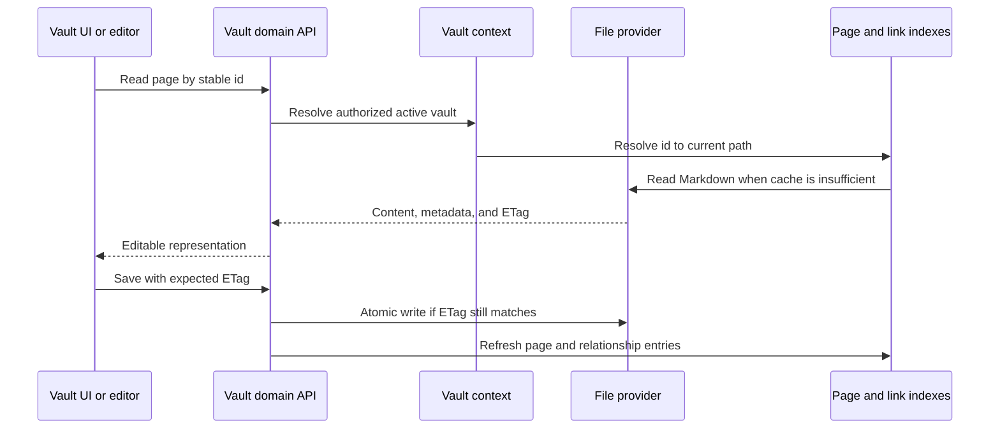

# Aprofita i fitxers

## Reversió

Els mapes de domini Vulta portàtils Markdown i actius a les pàgines, carpetes, adjunts, recerques, esquemes, històries, escombraries, exports, citacions i selecció multi-vulta. És el domini més gran i el propietari principal de la sobirania de dades.

## cicle de vida de pàgina

La identitat de pàgina està separada del títol i del camí. La matèria frontal està normalitzada en la recerca d' escriptura mentre que les claus de l' usuari- author són preservades. L' estat intern només pertany a `.gnosi` Els llocs secundaris quan l'exposassin al tema d'entrada contaminarien o contaminarien contingut portàtil.

`pages/markdown_writer.py` és el límit canònic de serialització: recupera o crea
l'identificador estable, transforma les claus d'esquema, elimina camps virtuals,
desa l'estat intern al sidecar, decora relacions portàtils i materialitza les
vistes abans de l'escriptura atòmica.

`pages/save_helpers.py` és responsable de preparar les metadades dels desats
complets, seleccionar la destinació, reutilitzar fitxers per ID i crear la
versió abans d'escriure. `pages/patch_helpers.py` és responsable de les lectures
amb ETag, la preparació de metadades PATCH, la reubicació de fitxers i
l'actualització coordinada de les memòries cau de pàgines, cossos, citacions i
documents analitzats. Els vuit noms privats històrics continuen sent façanes
primes de compatibilitat, i cada col·laborador substituïble o memòria cau mutable
es resol mitjançant un port tipat late-bound.

## Límit del dorsal

La pàgina llegeix i escriu vistes prèvies, duplicació, història i escombraries s' accepten sota `backend/domains/vault`. Aquest paquet separa esquemes de sol· licitud estrictes, adaptadors de ruta, serveis d' aplicació, repositoris i el únic propietari de les cau de pàgines i panys. El nou comportament Vult pertany al límit de domini.

`backend/domains/media` gestiona la resolució de les arrels multimèdia,
l'escaneig recursiu conscient del proveïdor i la seva cau derivada persistent,
els sidecars sincronitzats de metadades i vistes, els filtres, la paginació,
l'arbre mandrós de carpetes, les pujades contingudes, l'EXIF i la serialització
estable dels fitxers. `backend/services/media_service.py` continua sent la
façana Python compatible: conserva la classe, el singleton, les signatures, els
descriptors, l'estat i els errors històrics, i resol tard l'estat mutable i els
col·laboradors substituïbles. Els mòduls de domini no importen l'encaminador
HTTP ni la façana de compatibilitat.

L'emmagatzematge de taules té propietaris explícits: `assets/table_paths.py`
controla les rutes i revisions; `assets/persistence.py`, la ingestió i supressió
contingudes; `assets/quarantine.py`, la supressió recuperable; i
`tables/folders.py`, les carpetes físiques. Tots reben ports estrets de la façana.

`tables/routes.py` és ara el propietari de les 23 operacions històriques de
bases, taules, catàlegs d'opcions, vistes desades i esquemes de carpeta, en el
mateix ordre. Els handlers estrictes deleguen als serveis existents de files,
cicle de vida, propietats, opcions i vistes; `tables/composition.py` agrupa de
manera immutable les dependències de les rutes i de l'enriquiment de files.
`tables/security.py` exposa només les dues fàbriques tipades d'autorització de
workspace. La façana històrica registra les rutes de domini en una llista plana
i reexporta els callables Python compatibles.

`backend/api/vault_routes.py` és ara un bootstrap de compatibilitat de 283 línies,
no un propietari d'implementació. Els mòduls tipats de
`backend/domains/vault` són propietaris del comportament restant d'API,
anotacions, citacions, dibuixos, Drupal, fitxers, coneixement, enllaços,
multimèdia, pàgines, registre, taules i traducció. El bootstrap carrega i
registra aquests propietaris en l'ordre històric del codi font, mentre
`facade_bridge.py` preserva els imports compatibles, els globals mutables i els
seams de `monkeypatch` resolts tard. El router pare continua exposant el mateix
inventari pla d'`APIRoute` i un OpenAPI determinista idèntic byte a byte. Per
això, la façana ja no necessita cap excepció al guardrail de codi font.

El cicle de vida de les traduccions pertany a
`backend/domains/vault/translation`: la càrrega opcional de proveïdors, la
recuperació de fitxers del núvol, la traducció de files i pàgines, els efectes
mínims de metadades i la propagació d'obsolescència són serveis tipats
separats. La publicació de files a Drupal pertany a
`backend/domains/vault/drupal`, que separa el mapatge de camps i identitat, la
preparació de mitjans locals, la conversió de Markdown i wikilinks, les cau de
llengües, la coincidència per títol i la sincronització idempotent de nodes. La
façana conserva els decoradors i docstrings FastAPI originals i els seams
Python resolts tard, mentre el connector Drupal continua sent el límit de
transport extern. No canvien rutes, payloads, codis d'estat, tasques de fons ni
l'ordre de les rutes.

## Índexs i registres

L' índex de pàgina accelera el llistat, resolució d' identificador, accés frontal- minatter i cerca. La resolució d' índex del wikilink resol els enllaços que s' enganxen per tal que la pàgina reanomena referències. Els cossos i els registres analitzats no es repeteixen. Cada cau es deriva i ha de tolerar una refució freda.

`links/document_inventory.py` gestiona l'inventari TTL per vault dels enllaços
globals. Exclou historial i paperera, aïlla fitxers il·legibles, inclou els
dashboards JSON i recorre el disc si l'índex del proveïdor encara no està disponible.
`links/document_cache.py` gestiona les memòries cau persistents del cos Markdown
i del frontmatter analitzat, invalidades per mtime. La façana només hi injecta
les rutes actives, el parser i l'escriptor JSON segur; el comportament no depèn
del proveïdor de fitxers.
`links/relation_sync.py` gestiona les actualitzacions idempotents de fitxers i
caches quan una relació directa canvia la inversa. Les regles pures d'esquema
continuen separades i la façana hi injecta l'entrada/sortida de pàgines.

Primer s' inicia un carrega les instantànies de disc vàlides, després comença a refrescar el treball. Es marca un escàner parcial de fitxer i no es pot reemplaçar un cau complet. Els errors de fitxer s' aïllaran de manera que un únic espai de substitució en línia o orfe no elimina la resta de la caixa volta d' una resposta.

`pages/index_entries.py` és responsable de la lectura limitada del frontmatter,
dels reintents davant bloquejos del proveïdor i de normalitzar les entrades de
cau. `pages/index_service.py` gestiona el descobriment, l'actualització, el mapa
invers d'identificadors i els snapshots deduplicats. `pages/resolver.py` resol
identificadors estables, UUID canònics, títols indexats i escanejos en fred
acotats. `pages/tags.py` agrega les etiquetes del frontmatter i de les columnes
semàntiques de les taules, deduplicades per pàgina. La façana injecta els ports
de vault actiu, registre, calendari i cau;
aquests serveis no importen les rutes HTTP.

## Proveïdors de fitxers

L' abstracció del proveïdor selecciona el proveïdor local, proveïdor de fitxers genèric, iClod Drive, Google Drive, Nextcloud, o el comportament de la caixa desplegable. El codi de domini normal encara funciona `Path`; l' adaptador afegeix detecció de marcadors de posició, hidratació, disponibilitat i mapa de rutes. Establiu `GNOSI_FILES_PROVIDER` explícitament quan la detecció de la ruta automàtica és ambigua.

El temps d' execució dels fitxers i d' execució és proveïdor de proveïdor. Google Drive, iCold i Nextcloud no hereta només el comportament de recuperació d' Onevariva; `OneDriveProvider` Pot reiniciar el client OneDive després d' un fracàs de hidratació. Els proveïdors natius de macOS usen una sessió gràfica `open` Per omissió, els desplegaments Dockers poden usar un auxiliar de remot configurat perquè el recipient llegeix la creu d' un altre límit.

Les rutes del proveïdor de fitxers de sortida de caixa són detectades explícitament. Un servei desconegut sota el " macOS " `~/Library/CloudStorage` Usa l' efecte secundari lliure `fileprovider` adaptador; qualsevol carpeta completa sincronitzada o muntada utilitza `local`Un nou adaptador de noms només cal per a un senyal de posició diferent o un mecanisme d' hidratació específic del venedor. `GNOSI_DATA_DIR` Encara és local sense importar el proveïdor de la caixa forta.

Només el Markdown portable i els adjunts del vault poden viure dins un arbre
sincronitzat. Les bases SQLite, els bloquejos, les memòries cau derivades, els
secrets i `GNOSI_DATA_DIR` es mantenen a l'emmagatzematge local de l'aplicació.
Una carpeta Nextcloud completament sincronitzada funciona com a `local`; si usa
fitxers virtuals cal l'adaptador corresponent o `fileprovider`. WebDAV i les API
directes del núvol són transports d'importació, exportació o còpia de seguretat,
no emmagatzematge viu per a SQLite. El destí dels backups és independent del
proveïdor del vault.

## Propietats dels adjunts i de fitxer amb valor

Escriu un objectiu permès sota la caixa de seguretat activa, normalitza els noms, evita col· lisions i retorna les metadades portàtils. Els enllaços de fitxer es rerooten en temps de lectura per a la màquina actual. Puja i esborra operacions validades per a la contenció; un camí que no és prou apable.

## Operacions Paperera i destructiu

`drawings/service.py` gestiona el descobriment Tldraw i Excalidraw heretat, les
lectures, les versions d'historial amb temps de refredament, les escriptures
atòmiques i l'eliminació recuperable. La feina de fitxers s'executa fora del
bucle d'esdeveniments i reutilitza el mateix contracte de paperera que les pàgines.

L' eliminació normal es recuperable: pàgines i actius relacionats es mouen a través del model de brossa Vulta. La freqüència és diferent i elimina contingut més metadades derivades i relacions inverses. `trash/purge.py` gestiona el pas irreversible sobre fitxers i la neteja d'historial, metadades laterals i comentaris mitjançant ports injectats. L' eliminació del registre elimina la fila de registre lògica per omissió; l' eliminació física requereix un senyal explícit i comprovacions de contenció més fortes.

## Plantilles d' anticipació

El repositori de plantilles és un catàleg d' execució; els actius de paquets no es troben en el repositori d' aplicacions Git. La creació d' una plantilla verifica la signatura d' índex separada, paquet SHA- 256, signatura de l' editor, manifest, l' inventari, els límits de l' arxiu, rutes, tipus de fitxers i enllaços abans d' escriure. L' extracció es produeix en un directori d' arc de sisiging sota l' arrel de Vultes. El directori completat es mou a lloc atòmic i només s' ha registrat a la gestió de bases de dades, de manera que un fracàs no pot exposar a una Culta parcial.

L' exportació està permetent la llista basada en els noms i els determinants. Exclosiona `.gnosi`, connectors, botigues de confiança, correu, paperera, historial, contingut d' entorn, enllaços, fitxers illegibles i continguts de mida. Una llista de vistes prèvies totes i excloses i explora fitxers de text lligats per a valors credents com ara credents. Cercar requereix informació explícita. Els connectors recomanats són identificadors en el codi d' executables no es mouen mai dins d' una plantilla Vault.

La submissió pública està separada d' exportació i requereix accés d' administrador. Usa un moderació opcional en comptes d' un " gtHub credential encastat en el Gnosi.

## Conculència envaris

`daily/service.py` gestiona, sense dependre del proveïdor, el descobriment per
carpeta o taula, la normalització de dates, les plantilles, el llistat i la
creació atòmica de notes diàries. La façana conserva els decoradors FastAPI
públics i hi injecta les ordres de pàgina resoltes tard.

- Modifica els sobreescriure de Stale ETag Type
- Recepta i creació diària de notes utilitza les comprovacions de carreres.
- Pàgina, registre, captura d' enllaços i actualitzacions del dipòsit lateral segueixen consistents després d'un
Un nom o supressió.
- S' han rebut camins absoluts d' un client sota arrels aprovades.
- Els enllaços de Symlinks i el camí del traversal no poden escapar del límit de la volta seleccionada.
- L' extracció de la plantilla no pot publicar un directori parcial o registrar- lo aviat.
- Els exportaciós de la plantilla no poden incloure el contingut de l' estat d' execució o de l' executable del connector.
- Marca els viatges rodó conservant contingut sensible a l'escapament i la sintaxi wikilink.

## Frontal

`VaultDashboard` la seva història de navegació i selecciona la pàgina, taula, dibuix, galeria, tauler, calendari, cronologia, fonts o superfícies lectores. `VaultShell` proveeix del marc; components especialitzats que implementen editors i vistes. L' estat d' interacció frontal de la memòria cau però tracta el contingut de la pàgina de dorsal i els ETags com autoritiu.

## Concentrat de verificació

Executeu ETagDigention, contenidor de rutes, raça segura d' E/O, registre, reanomenant, paperera/purge, numeració, relació amb l' índex, refresc de Playwright Vultigce. Els incidents de núvol també requereixen un primer cop de substitució perquè el local d' arranjar les proves no pot reproduir el comportament del proveïdor de fitxers.
