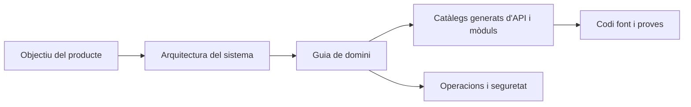

# Documentació d'enginyeria de Gnosi

Aquest portal explica Gnosi des de l'objectiu del producte fins a la implementació
al nivell del codi font. Està escrit per a enginyers que necessiten operar,
revisar, ampliar o auditar el sistema sense dependre del coneixement oral.

## Què és Gnosi

Gnosi és un espai de treball de coneixement local-first i autoallotjable. Els
fitxers Markdown d'un vault controlat per l'usuari són la font de veritat
duradora per a les notes i el coneixement estructurat. Un frontend React i un
backend FastAPI hi afegeixen edició, vistes de base de dades, navegació pel graf,
referències i lectura, comunicacions, automatització, treball assistit per IA,
integracions i controls multiusuari opcionals.

El sistema admet tres modalitats de distribució:

- Desenvolupament i operació natius: uvicorn al port `5002` i Vite al `5173`.
- Autoallotjament amb Docker: backend, frontend i servidor de traducció de Zotero.
- Paquets d'escriptori Electron: el frontend més un backend local gestionat.

## Com llegir aquest portal

Comenceu per [l'objectiu i l'abast](product/purpose-and-scope.md) i llegiu
després el [context del sistema](architecture/system-context.md). Seleccioneu la
guia del domini corresponent a la capacitat que voleu modificar. Els catàlegs
generats permeten navegar exhaustivament per rutes, mòduls, variables d'entorn,
proves i habilitats.

## Model d'evidències

La documentació aplica aquesta prioritat quan les fonts discrepen:

1. Codi font executable i esquemes d'execució.
2. Proves que demostren el comportament observable.
3. Definicions actuals de desplegament i configuració.
4. Directives d'enginyeria actives.
5. Historial de Git per entendre la motivació i la cronologia.

Les pàgines revisades expliquen responsabilitats i decisions. Les pàgines
generades descriuen què hi ha present estàticament. Cap de les dues coses
substitueix l'execució de les proves i dels fluxos corresponents.

## Índex de la implementació actual

- [Inventari del repositori](generated/repository-inventory.md)
- [Operacions FastAPI](generated/api-catalog.md)
- [Mòduls del backend](generated/backend-modules.md)
- [Rutes i components del frontend](generated/frontend-catalog.md)
- [Taules i columnes relacionals](generated/data-model.md)
- [Noms de configuració i consumidors](generated/configuration.md)
- [Fitxers de proves](generated/tests.md)
- [Habilitats d'execució](generated/skills.md)
- [Cobertura dels dominis](generated/coverage.md)

## Regla de canvi

Un canvi és incomplet si altera un contracte visible externament, un límit
arquitectònic, un invariant, una clau de configuració, un procediment operatiu o
un mode d'error sense actualitzar la guia revisada corresponent i regenerar els
catàlegs de referència.
