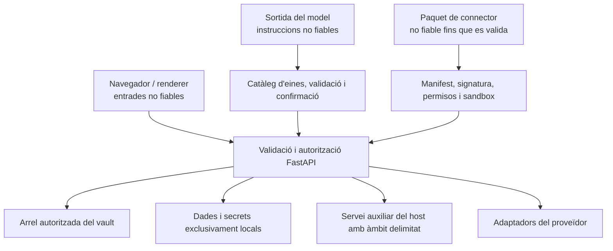

# Model de confiança

## Actius protegits

- Pàgines, adjunts, metadades internes, historials i paperera del vault.
- Identitats, pertinences, rols, permisos de vault, hashes de PAT i comparticions.
- Tokens de renovació OAuth, credencials de correu, claus d'IA, claus de
  signatura i secrets dels connectors.
- Bases de dades locals, índexs, punts de control d'agent, registres i accions programades.
- Sistema de fitxers del host i aplicacions d'escriptori accessibles a través d'API auxiliars.
- Comptes externs amb capacitat d'enviar, publicar, eliminar o modificar dades remotes.

## Límits de confiança

Les entrades del navegador, la sortida del model, els fitxers importats, l'HTML
remot, les respostes dels proveïdors, els paquets de connectors i les descripcions
MCP no són de confiança. Iniciar sessió no fa segurs els camins, l'HTML, els
arguments d'eines ni els identificadors d'espai de treball.

## Autenticació i autorització

Les sessions JWT utilitzen una galeta HttpOnly; els mecanismes bearer donen
suport als clients API. La seguretat del secret de signatura es comprova en
arrencar els desplegaments exposats. Les contrasenyes es desen com a hashes;
el text en clar dels PAT no es desa mai.

L'autorització combina la identitat efectiva, la pertinença a l'espai de
treball, el rol ordenat, el permís de vault i l'operació. Les dependències de
ruta imposen els requisits generals; els serveis repeteixen les comprovacions
de confinament i propietat quan el mateix recurs determina l'àmbit.

## Confinament del sistema de fitxers

Les rutes es resolen abans de comparar-les i es comproven respecte de les arrels
permeses. Les pujades, importacions, exportacions, peticions del lector, accessos
a fitxers d'eines generades, obertura nativa, cerca i paperera utilitzen límits
específics. Els enllaços simbòlics, `..`, els URL de fitxer, els mapatges de rutes
del núvol i la codificació percentual no poden sortir de l'arrel autoritzada.

Es prefereix l'eliminació recuperable. La purga permanent i l'eliminació física
del vault són operacions explícites separades.

## Seguretat de la xarxa

La ingestió d'URL i la recuperació de context extern utilitzen una protecció
contra SSRF. Es limiten els hosts resolts, les redireccions, els esquemes i les
mides de resposta; es rebutgen destinacions privades o link-local, tret que una
integració de confiança específica sigui responsable de l'endpoint. L'HTML
remot es saneja abans de renderitzar-lo o convertir-lo.

Els clients dels proveïdors utilitzen temps d'espera i reintents acotats. Les
respostes d'error mostrades al navegador exclouen credencials i rutes internes
detallades.

## Seguretat de la IA i les eines

La sortida del model és una dada fins que s'accepta una invocació d'eina validada.
Es cataloguen l'origen de l'eina, l'esquema, l'efecte, la compatibilitat amb
habilitats i la política de confirmació. Les eines generades passen una validació
del codi i no poden accedir a valors d'entorn, imports arbitraris, escriptures
sense restriccions al sistema de fitxers ni introspecció perillosa.

Un registre de confirmació vincula arguments exactes i caduca. El sistema no
reutilitza una confirmació si hi ha canvis, si l'usuari o la sessió no coincideixen
o si s'ha exhaurit el termini.

## Cicle de vida dels secrets

Els secrets es desen al magatzem de credencials del sistema operatiu o al
directori de secrets de les dades locals. Les variables d'entorn s'admeten per
a l'arrencada del desplegament i les migracions antigues. Les respostes API
emmascaren l'estat dels secrets; la documentació en cataloga noms i consumidors,
però oculta els valors predeterminats.

Els secrets no han de ser a Git, al vault Markdown, a la documentació generada,
a captures de pantalla, registres, dades de prova ni paquets de connectors compartits.

## Controls principals d'amenaces

| Amenaça | Controls principals |
| --- | --- |
| Accés a dades d'altres espais de treball | Dependència d'autenticació, consulta de pertinences, context de vault i comprovacions de propietat als serveis. |
| Sortida dels límits mitjançant rutes o enllaços simbòlics | Resolució canònica, arrels permeses, mapatge del proveïdor i proves de confinament. |
| XSS des de correu, web o contingut importat | Sanejament d'HTML, escapament de React i recursos del lector restringits. |
| SSRF | Validació d'esquema, host i IP, comprovació de redireccions i límits de mida i temps. |
| Revelació de credencials | Magatzem local de secrets, emmascarament, errors genèrics i disciplina de registre. |
| Acció no desitjada de l'agent | Llista d'eines permeses, classificació d'efectes, validació d'arguments i confirmacions. |
| Connector maliciós | Comprovacions de manifest i signatura, permisos, arrel d'instal·lació delimitada, sandbox i temps d'espera. |
| Paquet maliciós del marketplace | Índex signat, suma de verificació, signatura de l'editor, extracció provisional acotada i publicació atòmica. |
| Filtració de dades privades a través d'una plantilla | Llista d'exportació permesa, exclusions obligatòries, cerca de possibles secrets, previsualització, confirmació i enviament administratiu. |
| Sobreescriptura amb dades obsoletes | ETags, revisions d'esquema, escriptures atòmiques i respostes de conflicte. |
| Corrupció SQLite | Emmagatzematge exclusivament local, sense sincronització al núvol. |

## Verificació de seguretat

Els canvis sensibles a la seguretat requereixen proves d'autenticació central,
espais de treball, PAT, compartició, confinament de rutes, XSS, SSRF, eines
generades, sandbox de connectors i concurrència. Quan canvien superfícies
públiques, la QA al navegador utilitza una sessió autenticada i un context
anònim net.
