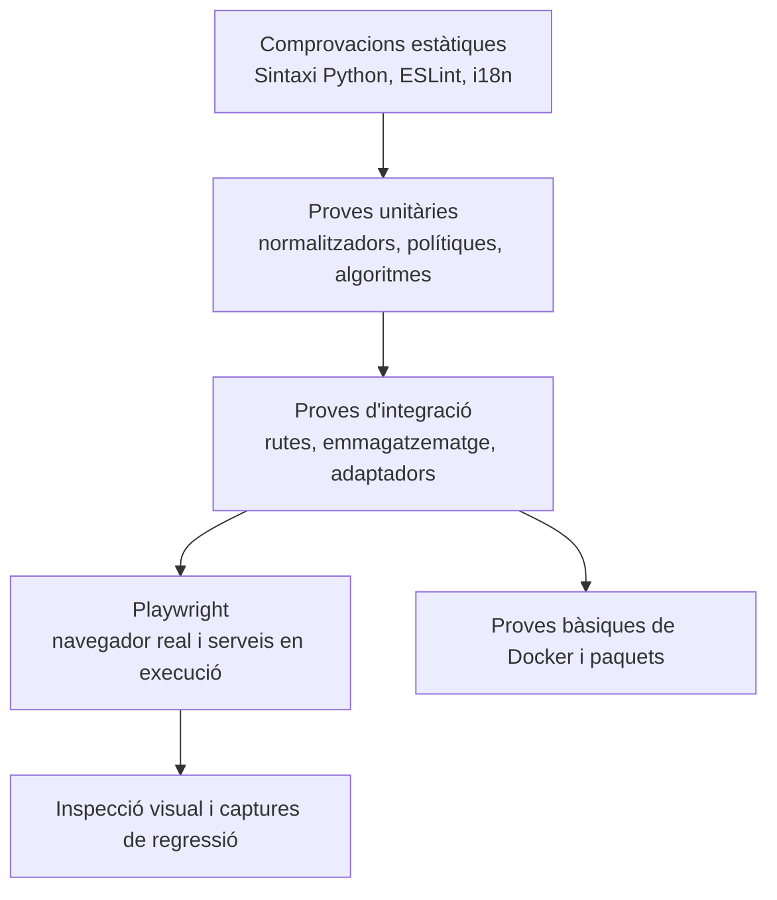

Els treballs pesants de CI segueixen aquest ordre: backend, frontend i Docker. El Mac i la MV Linux comparteixen recursos físics; el frontend utilitza un sol procés de proves. La fallada anterior no omet les comprovacions següents, però es mantenen la cancel·lació i les restriccions dels forks. Les suites aïllades de dibuixos i citacions disposen de cinc minuts per procés, incloses les importacions inicials i totes les assercions. Les proves integrades d’eines generades utilitzen el límit de producció sense modificar-lo; una regressió separada verifica el límit explícit.

Les pull requests públiques del mateix repositori executen `backend` en una MV
nova `ubuntu-24.04-arm` allotjada a GitHub, afegint capacitat Linux ARM64 sense
compartir la CPU, la memòria, els ports dels serveis ni el motor Docker de
l’amfitrió natiu. `native-smoke` i `docker` conserven l’executor Linux ARM64
autoallotjat existent. Les pujades de commits, la validació de versions, els
repositoris privats i l’absència de metadades de visibilitat pública utilitzen
l’executor autoallotjat del backend; les assignacions dels executors de
documentació i empaquetament no canvien.

La mateixa condició de PR pública del mateix repositori també assigna `frontend`
a un executor ARM64 `macos-15` nou allotjat a GitHub, evitant les descàrregues
lentes de l’amfitrió natiu. Els repositoris privats, l’absència de metadades de
visibilitat, les pujades i la validació de versions conserven l’executor macOS
ARM64 autoallotjat. Es mantenen el heap de Node de 4 GiB, un sol procés de proves,
totes les comprovacions i l’ordre backend-frontend. Totes dues etiquetes
allotjades són executors estàndard, gratuïts per a repositoris públics; no
s’introdueixen executors ampliats de pagament ni accés a dades de l’aplicació
nativa o serveis de l’amfitrió.

Els grups de `concurrency` del flux de treball utilitzen un prefix específic de
CI, el nom del flux i el número de PR. Un commit nou cancel·la els treballs
anteriors en execució i en cua només d’aquella PR. La cancel·lació només s’activa
per als esdeveniments `pull_request`; els altres utilitzen el `github.run_id`
únic, de manera que les pujades i les comprovacions reutilitzables de versions
no es cancel·len entre si ni entren en conflicte amb el bloqueig de versions
del flux que les crida. Els noms de les comprovacions obligatòries, els àmbits
complets de proves, els permisos de només lectura i les restriccions dels forks
es mantenen. Afegir capacitat no elimina les dependències existents entre treballs.

El treball de frontend desactiva la memòria cau remota de
dependències a `setup-node`: omet `cache` i estableix explícitament
`package-manager-cache: false`. Això evita esperar restauracions opcionals
encallades i omet les pujades de memòria cau remota, tot conservant el magatzem
local de pnpm. `pnpm install --frozen-lockfile` continua instal·lant i verificant
les dependències, i totes les comprovacions de frontend i escriptori continuen
sent obligatòries. Això no elimina l’accés a la xarxa necessari per obtenir les
dependències que faltin.

El treball de frontend natiu demana explícitament Python 3.11 gestionat per a
macOS ARM64 amb `UV_PYTHON=cpython-3.11-macos-aarch64-none` i verifica
`platform.machine()` abans d’instal·lar dependències. Un intèrpret Intel
instal·lat no ha de seleccionar silenciosament les dependències x86_64 amb
Rosetta. Les descàrregues Python utilitzen un límit de lectura HTTP de 120 segons,
tres reintents HTTP, un màxim de quatre descàrregues simultànies i dos fils
d’instal·lació. La comprovació prèvia de l’intèrpret té un pressupost de cinc
minuts; `uv sync --frozen`, sense canvis, en té quaranta-cinc per admetre
descàrregues sense memòria cau a l’executor local alternatiu. Aquests límits conserven
els entorns nous per treball, l’aïllament de la memòria cau i totes les proves;
no amaguen errors d’instal·lació ni garanteixen la disponibilitat de la xarxa.
La configuració d’empaquetament de versions i dels altres treballs no canvia.

# Estratègia de proves

## Capes de qualitat

Cap capa és suficient per si sola. Un build del frontend detecta errors d'importació
i sintaxi, però no una interacció trencada. Una prova unitària de ruta no demostra
la integració amb el navegador. Una captura no prova persistència ni autorització.

## Comprovació unificada de tipus

Executeu `pnpm typecheck` des de l'arrel del repositori. Comprova, en aquest
ordre, TypeScript del frontend, mypy estricte de tot el backend (excloent-ne
les proves), mypy estricte de tots els fitxers Python públics indexats del
pipeline i, finalment, la sintaxi Python de backend, pipeline, scripts i
extensions. Qualsevol error atura les etapes següents i conserva el codi de sortida.

Les ordres individuals `typecheck:backend-boundaries` i
`typecheck:pipeline` continuen disponibles. És una comprovació estàtica:
no substitueix lint, proves unitàries, builds, fluxos de navegador ni validació
del desplegament. Passar-la no acredita que s'hagin eliminat tots els límits
amb `Any` explícit. La regressió verifica els àmbits complets i usa executables
simulats aïllats en POSIX per comprovar l'ordre i la propagació dels errors;
no acredita l'execució a Windows.

## Proves del backend

Pytest cobreix serveis, dependències de ruta, normalització, emmagatzematge,
seguretat, concurrència i regressions. Les proves utilitzen directoris temporals
de vault i dades locals. Els proveïdors externs se simulen, tret que una prova
estigui marcada explícitament com a real/E2E.

Hi ha suites importants que inclouen:

- Autenticació, PAT, inicialització de workspace, rols i superfícies públiques.
- Confinament de rutes, escriptures segures, ETags, condicions de cursa, registre i sidecars.
- Fórmules, rollups, filtres tipats, relacions, planificació i programació de tasques.
- MIME/CID del correu, fusió de contactes/vCard, confinament del calendari i recordatoris.
- Encaminament d'IA, habilitats, resiliència MCP, confirmacions i eines generades.
- Plugins, importacions, citacions, normalització del lector, XSS i SSRF.

## Proves del frontend

Vitest cobreix components, hooks, registres, utilitats de format, lògica de vistes
tipada i comportament de l'estat. ESLint i el build de producció de Vite són
obligatoris. `check:i18n` verifica que les claus visibles per l'usuari referenciades
existeixin a tots els idiomes.

El build ha d'acabar sense errors. Els avisos existents no autoritzen a afegir-ne
de nous sense revisió.

Els límits de propietat es comproven amb `gnosi/feature-boundaries` a ESLint.
L'ampliació revisada preveu un manifest d'entrades públiques exactes a
`frontend/feature-public-entries.json`, amb un motiu per camí.
Els consumidors externs a una feature usen l'arrel/`index` o una entrada
explícitament revisada; els fitxers veïns no llistats continuen privats.
Cal comprovar imports estàtics, reexports, imports diferits literals i imports
de tipus TypeScript. El manifest no ha de crear un agregador de càrrega
immediata ni alterar els límits de càrrega diferida.

Les regles `shared` → cap feature/`app` i features → cap `app` són
incondicionals, també per als tipus i les entrades del manifest. Els mòduls
interns d'una feature poden usar imports locals. Els contractes globals de codi
són a `frontend/tests/contracts/`; el guardrail complementa el lint AST.
Cal verificar la implementació després del trasllat; aquesta documentació no
acredita que la verificació global hagi passat.

En màquines amb recursos limitats, executeu els builds i les comprovacions de
tipus intensives en CPU separadament de la suite completa amb DOM real. Si el
paral·lelisme provoca que caduquin proves, repetiu la suite afectada aïlladament
i després la suite completa amb workers limitats, per exemple
`pnpm --filter @gnosi/frontend exec vitest run --maxWorkers=2 --minWorkers=2`.
Manteniu les assercions i els temps límit; una passada aïllada no acredita que
tota la suite passi.

## Límits de mida de producció

El build del frontend executa `scripts/check-bundle-size.ts` després de Vite.
Els límits fixos, en bytes JavaScript sense comprimir, són: fitxer d'entrada
1.400.000; fragment més gran 1.800.000; editor vendor 1.550.000; tldraw vendor
1.350.000; ruta de configuració 600.000. Un fragment revisat absent o duplicat
fa fallar la comprovació. Les proves cobreixen URL de desplegament relatives,
d'arrel i amb prefix, creixement i fragments absents. La mida del fitxer
d'entrada no mesura tot el graf inicial de dependències, la transferència
comprimida ni el temps d'arrencada. L'avís existent de Vite de 1.500 kB
continua visible; aquests límits eviten creixement, no acrediten rendiment òptim.

## Proves d'extrem a extrem i visuals

Playwright s'executa com a projecte del host contra l'aplicació nativa. La
preparació anònima cobreix l'arrencada i el comportament públic; l'autenticada,
la funcionalitat del workspace. Les proves de domini exerciten Vault, tauler,
correu, calendari, contactes, dibuixos, automatització, xat d'agent i navegació.

Les captures visuals cobreixen pàgines representatives d'escriptori i mòbil.
Si canvia la interfície, inspeccioneu la pàgina real, cliqueu el control
modificat, reviseu la consola i feu una captura. Confirmeu que diàlegs,
superposicions, avisos emergents i menús utilitzen el sistema z-index registrat
i no bloquegen la interacció.

## Porta d’accessibilitat

El projecte `accessibility` de Playwright és una porta bloquejant de WCAG 2.2
AA. Executa axe sobre dotze rutes seleccionades del producte en els
temes clar i fosc, incloent-hi contrast de color, etiquetes, regions i relacions
ARIA. El marcatge propi de l’aplicació sempre queda dins l’auditoria i no es manté
una llista permanent d'excepcions de violacions. La dada
de prova determinista activa els mòduls opcionals de la matriu de rutes, i cada
ruta també falla si el navegador genera un error de pàgina no gestionat; una
superfície trencada no pot superar axe.

Abans de l’anàlisi, cada cas exigeix l’URL canònic esperat i una superfície
visible pròpia de la funcionalitat, sense esquelet de càrrega ni avís de
complement desactivat. No recarrega la pàgina per reintentar una arrencada
fallida. La prova de l’enllaç de salt verifica la vora visible de dos píxels
i el subratllat de teclat; la navegació al graf segueix l’enllaç del vault.
Les captures de multimèdia i del centre de control conserven evidència del
contrast en clar i fosc. Un resultat verd cobreix aquests casos i estats, no
totes les interaccions, tecnologies d’assistència, dades personals ni la
conformitat completa amb WCAG.

Les proves d’interacció complementen axe amb navegació de salt, focus visible i
ordenat, teclat complet, focus roving de les pestanyes mòbils, Escape als
diàlegs cancel·lables, focus trap i retorn del focus, noms accessibles i anuncis
de canvi de ruta. Els canvis compartits de focus, diàlegs, navegació o tokens de
color han de superar aquest projecte abans de publicar una release.

L’estil global de focus utilitza l’atribut `data-focus-modality` a l’arrel del
document. L’activació amb punter elimina els contorns genèrics; amb teclat
s’apliquen indicadors contextuals: la vora existent als camps, subratllat als
enllaços i contorn als controls sense vora. Els títols editables del Vault
conserven només el cursor d’escriptura. Les proves unitàries cobreixen els
canvis de modalitat i les proves de navegador, el focus amb punter i teclat en
els temes clar i fosc.

## Comprovacions de desplegament

Actualment, la CI de Docker valida Compose i construeix les imatges del backend
i del frontend; no arrenca contenidors ni verifica el seu estat i la persistència.
Aquestes proves d'execució continuen sent necessàries abans d'una release.
El job de frontend autoallotjat aplica el pressupost revisat de 4 GiB de heap de
Node a tot el job perquè lint, comprovació de tipus, proves i build de producció
comparteixin el mateix contracte de memòria previsible.

La CI d'Electron configura paquets per a macOS arm64/x64, Linux arm64 i Windows
x64. Configurar aquesta matriu, passar proves unitàries desktop o comprovar una
migració sintètica del perfil del navegador no valida els instal·ladors ni el
backend congelat. Cada arquitectura requereix evidència d'instal·lació,
arrencada, persistència i actualització des de 2.x. Actualment, macOS utilitza
actualitzacions manuals mitjançant l'instal·lador. Una execució local a macOS
no acredita les altres plataformes: no publiqueu 3.0 abans de superar tota
la matriu de release.

## Mapatge de canvi a prova

| Canvi | Evidència mínima |
| --- | --- |
| Només documentació revisada | Comprovació del generador, validador, build estricte i prova bàsica del portal al navegador. |
| Lògica dels catàlegs generats | Proves unitàries del generador, determinisme en dues execucions, validador i build estricte. |
| Comportament del backend | Regressió acotada de pytest i suite d'integració afectada. |
| Comportament del frontend | Vitest quan sigui viable, comprovació i18n, build de producció, acció al navegador i captura. |
| Accessibilitat o token compartit d’interfície | Vitest de la primitiva, paritat dels quatre idiomes, matriu axe en clar i fosc, proves de teclat i captura del navegador. |
| Autenticació, seguretat o rutes | Proves negatives i intents entre àmbits, no només el camí correcte. |
| Desplegament o dependències | Verificació nativa i CI de Docker o paquets segons correspongui. |

## Catàleg de proves

El [catàleg de proves](../generated/tests.md) generat enumera els fitxers propis
i senyals de navegació. La recollida del runner continua sent l'autoritat per
comptar les proves executables.
