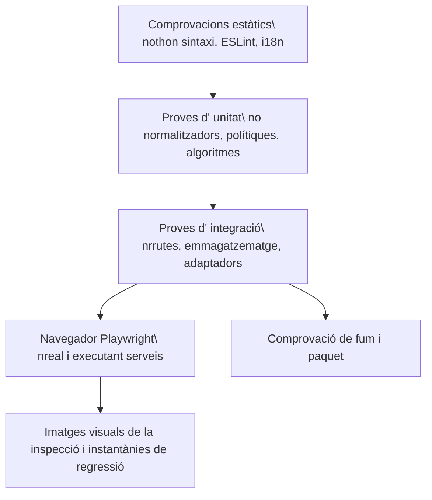

# Eina de proves

## capes de qualitat

No hi ha cap sola capa suficient. Un frontal construeix captura les importacions i la sintaxi però no una interacció incorrecta. Una prova d' unitat de ruta no prova la integració del navegador. Una instantània no prova persisteix o l' autorització.

## Comprovació unificada de tipus

Executeu `pnpm typecheck` des de l'arrel del repositori. Comprova, en aquest
ordre, TypeScript del frontend, mypy estricte de tot el backend (excloent-ne
les proves), mypy estricte de tots els fitxers Python públics indexats del
pipeline i, finalment, la sintaxi Python de backend, pipeline, scripts i
extensions. Qualsevol error atura les etapes següents i conserva el codi de sortida.

Les ordres individuals `typecheck:backend-boundaries` i
`typecheck:pipeline` continuen disponibles. És una comprovació estàtica:
no substitueix lint, proves unitàries, builds, fluxos de navegador ni validació
del desplegament. Passar-la no acredita que s'hagin eliminat tots els límits
amb `Any` explícit. La regressió verifica els àmbits complets i usa executables
simulats aïllats en POSIX per comprovar l'ordre i la propagació dels errors;
no acredita l'execució a Windows.

## Comprovacions del dorsal

Pytest cobreix serveis, dependències de ruta, magatzem, seguretat, probabilitat de tenir característiques i casos de regressió. Les proves usen directoris de volta temporal i local- data. Els proveïdors externs s' han quedat lligats a menys que una prova està marcada explícitament com a " emissió/ E2E2E."

Hi ha suites importants que inclouen:

- Autentifica, PAT, Hock Hock, rols i superfícies públiques.
- Un contenidor de camins, un senyal segur, ETS, curses, registre i comportament dels laterals.
- fórmules, flexions, filtres escrits, relacions, planificació i planificació.
- Mail MIME/CID, contactes fusionats/vCard, contenidor de calendari i recordatoris.
- IAterbuent, habilitats, resistència MCP, confirmació i eines generades.
- Connectors, importacions, citacions, lectors normalització, XSS, i SSRF.

## Comprovacions de la Frontal

Vitest cobreix components, ganxos, registes, utilitats de format, lògica de vista i comportament estatal. ESLint i la construcció de producció de Vite són obligatoris. `check:i18n` versifica que les claus referenciades a l' usuari existeixen en cada lloc local.

La construcció ha d' acabar amb errors zeros. Els avisos existents no són permís per afegir nous avisos sense revisar.

Els límits de propietat es comproven amb `gnosi/feature-boundaries` a ESLint.
L'ampliació revisada preveu un manifest d'entrades públiques exactes a
`frontend/feature-public-entries.json`, amb un motiu per camí.
Els consumidors externs a una feature usen l'arrel/`index` o una entrada
explícitament revisada; els fitxers veïns no llistats continuen privats.
Cal comprovar imports estàtics, reexports, imports diferits literals i imports
de tipus TypeScript. El manifest no ha de crear un agregador de càrrega
immediata ni alterar els límits de càrrega diferida.

Les regles `shared` → cap feature/`app` i features → cap `app` són
incondicionals, també per als tipus i les entrades del manifest. Els mòduls
interns d'una feature poden usar imports locals. Els contractes globals de codi
són a `frontend/tests/contracts/`; el guardrail complementa el lint AST.
Cal verificar la implementació després del trasllat; aquesta documentació no
acredita que la verificació global hagi passat.

## Límits de mida de producció

El build del frontend executa `scripts/check-bundle-size.ts` després de Vite.
Els límits fixos, en bytes JavaScript sense comprimir, són: fitxer d'entrada
1.400.000; fragment més gran 1.800.000; editor vendor 1.550.000; tldraw vendor
1.350.000; ruta de configuració 600.000. Un fragment revisat absent o duplicat
fa fallar la comprovació. Les proves cobreixen URL de desplegament relatives,
d'arrel i amb prefix, creixement i fragments absents. La mida del fitxer
d'entrada no mesura tot el graf inicial de dependències, la transferència
comprimida ni el temps d'arrencada. L'avís existent de Vite de 1.500 kB
continua visible; aquests límits eviten creixement, no acrediten rendiment òptim.

## Comprovacions visuals final a fi

Playwright s' executa com a un projecte de nivell remot contra l' aplicació nativa. Un arranjament anònim cobreix l' arrencada i el comportament públic; autenticat cobreix funcionalitats de l' espai de treball. Les proves de domini executen Vulta, tauler, correu, contactes, dibuixos, automatació, xat d' agent i navegació.

Les instantànies de cobertura visual cobreix el representant d' escriptori i pàgines mòbils. Per a un canvi de IU, inspeccioneu la pàgina de renderitzat real, cliqueu el control canviat, mireu la consola i feu una instantània. Confirmau aquesta instantània, retorzes, torrades i menús usen el sistema de fitxers i no auto interacció.

## Porta d’accessibilitat

El projecte `accessibility` de Playwright és una porta bloquejant de WCAG 2.2
AA. Executa axe sobre dotze rutes seleccionades del producte en els
temes clar i fosc, incloent-hi contrast de color, etiquetes, regions i relacions
ARIA. El marcatge propi de l’aplicació sempre queda dins l’auditoria. La dada
de prova determinista activa els mòduls opcionals de la matriu de rutes, i cada
ruta també falla si el navegador genera un error de pàgina no gestionat; una
superfície trencada no pot superar axe.

Abans de l’anàlisi, cada cas exigeix l’URL canònic esperat i una superfície
visible pròpia de la funcionalitat, sense esquelet de càrrega ni avís de
complement desactivat. No recarrega la pàgina per reintentar una arrencada
fallida. La prova de l’enllaç de salt verifica la vora visible de dos píxels
i el subratllat de teclat; la navegació al graf segueix l’enllaç del vault.
Les captures de multimèdia i del centre de control conserven evidència del
contrast en clar i fosc. Un resultat verd cobreix aquests casos i estats, no
totes les interaccions, tecnologies d’assistència, dades personals ni la
conformitat completa amb WCAG.

Les proves d’interacció complementen axe amb navegació de salt, focus visible i
ordenat, teclat complet, focus roving de les pestanyes mòbils, Escape als
diàlegs cancel·lables, focus trap i retorn del focus, noms accessibles i anuncis
de canvi de ruta.

L’estil global de focus utilitza l’atribut `data-focus-modality` a l’arrel del
document. L’activació amb punter elimina els contorns genèrics; amb teclat
s’apliquen indicadors contextuals: la vora existent als camps, subratllat als
enllaços i contorn als controls sense vora. Els títols editables del Vault
conserven només el cursor d’escriptura. Les proves unitàries cobreixen els
canvis de modalitat i les proves de navegador, el focus amb punter i teclat en
els temes clar i fosc.

## Comprovacions de desplegament

Actualment, la CI de Docker valida Compose i construeix les imatges del backend
i del frontend; no arrenca contenidors ni verifica el seu estat i la persistència.
Aquestes proves d'execució continuen sent necessàries abans d'una release.

La CI d'Electron configura paquets per a macOS arm64/x64, Linux arm64 i Windows
x64. Configurar aquesta matriu, passar proves unitàries desktop o comprovar una
migració sintètica del perfil del navegador no valida els instal·ladors ni el
backend congelat. Cada arquitectura requereix evidència d'instal·lació,
arrencada, persistència i actualització des de 2.x. Actualment, macOS utilitza
actualitzacions manuals mitjançant l'instal·lador. Una execució local a macOS
no acredita les altres plataformes: no publiqueu 3.0 abans de superar tota
la matriu de release.

## Mapatge de canvi a prova

| Canvia | Prova mínima |
| --- | --- |
| Documentació de revisada pura | Comprovador del generador, validador, mestres estrictes, documentació de navegador. |
| lògica de catàleg generat | Proves de generadors, dos vegades determinant, validador, Docs estrictes construeixen. |
| Comportament del dorsal | Una regressió inversa de pytest més afectat del paquet d'integració. |
| Comportament del Frontal | Vitest on factible, i18n, construeix, acció del navegador i captura de pantalla. |
| Accessibilitat o token compartit d’interfície | Vitest de la primitiva, paritat dels quatre idiomes, matriu axe en clar i fosc, proves de teclat i captura del navegador. |
| Comportament d' autorització/ seguretat/path | Proves i intents de creu negatiu, no només pel camí daurat. |
| Difuminat/dependència | Verificació nativa més amarrada o paquet CI com a aplicable. |

## Catàleg de proves

El generat [catàleg de proves](../generated/tests.md) llista els fitxers de proves i els senyals de navegació. La col· lecció del llançador continua autoritzada per als comptadors de proves executables.
