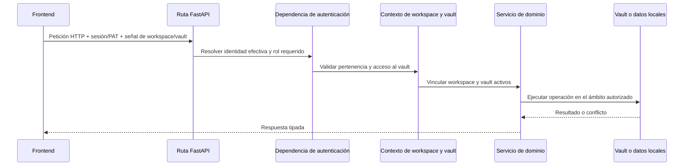

# Flujos transversales

## Contexto de petición y autorización

El modo personal puede resolver un usuario local efectivo sin iniciar sesión. El modo organización exige una sesión válida o un mecanismo bearer admitido. El backend toma la decisión; el control de autenticación del frontend mejora la experiencia de uso, pero no es un límite de seguridad.

Las variables de contexto propagan el vault activo a través de las llamadas anidadas a servicios sin convertir su ruta en una configuración global mutable. El código que se ejecuta fuera de una petición debe proporcionar un vault explícito o utilizar el procedimiento documentado de resolución predeterminada.

## Enrutamiento por Vault

Los enlaces privados del navegador identifican el slug estable del vault antes
del área del producto y del recurso: `/@{vaultSlug}/{app}/{resourceType}/{resourceId}`.
Las páginas de entrada de cada aplicación terminan después del segmento de la
aplicación. Los nombres de los vaults pueden editarse, pero sus slugs de URL se
guardan por separado y no cambian al renombrarlos. Las páginas compartidas
públicamente y las áreas globales de gestión de cuentas o vaults quedan fuera
de este espacio de nombres.

Las API de datos del vault reflejan el mismo límite de responsabilidad bajo
`/api/v1/vaults/{vaultSlug}/{app}/...`. `ActiveVaultMiddleware` resuelve el
slug antes del despacho normal de FastAPI, vincula el identificador inmutable
y la ruta del vault y reutiliza la implementación del endpoint existente.
La ruta canónica prevalece sobre una cabecera, un parámetro de consulta o una
cookie heredados que entren en conflicto, pero las dependencias de workspace
y acceso al vault siguen tomando la decisión de autorización.

El análisis de estas señales se aísla en helpers tipados para cabeceras,
parámetros de consulta y cookies. El middleware solo reescribe el ámbito
canónico, instala el token de contexto, despacha y lo restablece; así, HTTP y
WebSocket comparten un único límite de propagación.

El frontend separa la construcción de rutas del transporte de red. El HTTP
ordinario pasa por el cliente tipado `openapi-fetch` o por el adaptador de
compatibilidad; ambos delegan en `transportFetch`, que añade el contexto de
workspace, usuario y Vault, y convierte las peticiones expresadas como cadena
o URL a su forma canónica sin sustituir `window.fetch`. TanStack Query gestiona
la caché del servidor y su invalidación en el proveedor de la aplicación.
SSE, streaming, descargas y WebSockets de colaboración usan adaptadores
especializados explícitos porque OpenAPI no describe por completo sus contratos
en el navegador.

El artefacto OpenAPI y las operaciones TypeScript se generan de forma
determinista desde la aplicación FastAPI canónica en un entorno de ejecución
efímero. Una comprobación del código prohíbe Axios, `fetch` directo en producción, monkeypatches globales y
transportes especiales no revisados; la allowlist mínima documenta solo los
límites del navegador que no pueden importar el cliente de la aplicación.
Los enlaces heredados almacenados se siguen sustituyendo por ubicaciones
canónicas del navegador, y las rutas API heredadas permanecen como alias de
compatibilidad para los clientes antiguos.

## Flujo de configuración

1. Los archivos de entorno y el almacén de credenciales del sistema operativo proporcionan los valores de arranque.
2. El YAML base de la aplicación proporciona valores predeterminados versionados.
3. Los parámetros del directorio personal o del vault activo proporcionan la configuración persistida del usuario.
4. Las variables de entorno sobrescriben las rutas y políticas que dependen del despliegue.
5. Las rutas de configuración validan y guardan los cambios admitidos.

Los proveedores de IA eliminados dejan una marca de eliminación para impedir que una variable de entorno heredada los recree silenciosamente al cargar de nuevo la configuración.

## Manejo de errores

Las rutas convierten los fallos de dominio conocidos en códigos de estado explícitos. Un manejador global registra las excepciones inesperadas con un identificador de error y devuelve una respuesta genérica para no filtrar al cliente rutas de archivos, fragmentos SQL ni tokens.

Las operaciones opcionales de larga duración informan de su estado o progreso y se degradan sin bloquear otros dominios. Las tareas en segundo plano deben gestionar sus propias sesiones de base de datos y los límites de sus bucles de eventos; las sesiones vinculadas a una petición no pueden reutilizarse tras finalizar el ciclo de vida de la respuesta.

## Observabilidad

Los módulos del backend utilizan el sistema estándar de logging. Los LaunchAgents capturan los logs de la ejecución nativa en el directorio de logs de Gnosi del usuario. Las notificaciones operativas y el historial de tareas residen en los datos locales. Los endpoints de salud informan del comportamiento efectivo, no solo de los valores de entorno en bruto.

Los logs están dirigidos a desarrolladores y se escriben en inglés. No deben contener credenciales, respuestas de proveedores sin ocultar los datos sensibles ni contenido sensible completo del usuario.

## Internacionalización

Las cadenas del frontend visibles para el usuario pasan por `react-i18next` y existen en los cuatro catálogos de idioma: catalán, inglés, español y francés. Los comentarios de código, docstrings, logs para desarrolladores, documentación técnica pública e identificadores se escriben en inglés, salvo los identificadores o valores de compatibilidad que ya estén persistidos.

## Accesibilidad

El shell de la aplicación es responsable de la única región principal, la
navegación de salto, los tokens de foco visible y los anuncios discretos de
cambio de ruta. Los dominios heredan estas primitivas y mantienen los nombres
accesibles en los mismos cuatro catálogos de idioma que las etiquetas visuales.

Los diálogos cancelables usan la capa compartida de teclado: solo el diálogo
superior gestiona Escape, Tab queda atrapado en su interior y el foco vuelve al
elemento que lo abrió. Las pestañas adaptables exponen relaciones completas con
sus paneles y un foco de teclado desplazable entre pestañas. Playwright combina
análisis de axe WCAG 2.2 AA en la matriz de rutas del producto con comprobaciones
explícitas de teclado, porque ninguna de las dos capas demuestra lo que verifica
la otra.

## Política de efectos externos

Las herramientas de agente y las acciones de aplicación clasifican efectos como leer, escribir, comunicación externa o cambio destructivo. Las comprobaciones de roles, servicios con alcance, registros de confirmación y operaciones recuperables se aplican de acuerdo con el efecto. La confirmación del cliente por sí sola no autoriza la acción backend.
