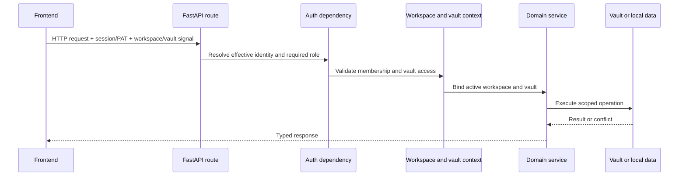

# Corrientes intersectoriales

## Solicitar contexto y autorización

El modo personal puede resolver un usuario local efectivo sin un inicio de sesión. El modo organización requiere una sesión válida o un mecanismo de portador aceptado. El motor es el propietario de la decisión; la puerta de autenticación de frontend mejora UX pero no es un límite de seguridad.

Las variables de contexto llevan la bóveda activa a través de llamadas de servicio anidadas sin convertir la ruta en una configuración mutable global. Codificar fuera de una solicitud debe proporcionar una bóveda explícita o utilizar la ruta de resolución predeterminada documentada.

## Enrutamiento por Vault

`ActiveVaultMiddleware` resuelve primero la ruta canónica y después aplica la
prioridad cabecera → consulta → cookie. Helpers tipados comparten la resolución
entre HTTP y WebSocket, y el contexto siempre se restaura al finalizar.

## Flujo de configuración

1. Archivos de entorno y los valores de la fuente de alimentación de credencial del sistema operativo.
2. Base de aplicaciones YAML suministra versiones predeterminadas.
3. La oferta de parámetros de la válvula activa o de la casa persistió en la configuración del usuario.
4. Las variables ambientales anulan las rutas y políticas sensibles al despliegue.
5. Las rutas de configuración validan y persisten los cambios soportados.

Los proveedores de IA eliminados usan una lápida para que una variable de entorno legado no pueda recrear silenciosamente a un proveedor durante una posterior carga de configuración.

## Manejo de errores

Rutas traducen fallos de dominio conocidos en códigos de estado explícitos. Un controlador global registra excepciones inesperadas con un identificador de error y devuelve una respuesta genérica para que las rutas de archivos, fragmentos SQL o tokens no se filtren al cliente.

Las operaciones opcionales de larga duración informan de estado o progreso y se degradan sin bloquear dominios no relacionados. Las tareas de fondo deben poseer sus sesiones de base de datos y límites de bucle de eventos; las sesiones con alcance de petición no pueden ser reutilizadas después del ciclo de vida de respuesta.

## Observabilidad

Los módulos de backend utilizan el registro estándar. Los registros nativos de tiempo de ejecución son capturados bajo el directorio de registro Gnosi del usuario por LaunchAgents. Las notificaciones operacionales y el historial de tareas viven en datos locales.

Los registros están orientados al desarrollador y escritos en inglés. No deben contener credenciales, respuestas del proveedor no redactas, o contenido de usuario totalmente sensible.

## Internacionalización

Las cadenas de interfaz visibles para el usuario pasan por `react-i18next` y existen en los cuatro catálogos locales: catalán, inglés, español y francés. Los comentarios de código, docstrings, registros de desarrolladores, documentación técnica pública e identificadores son en inglés a menos que se persista un identificador o valor de compatibilidad.

## Accesibilidad

La carcasa de la aplicación es responsable de la única región principal, la
navegación de salto, los tokens de foco visible y los anuncios discretos de
cambio de ruta. Los dominios heredan estas primitivas y mantienen los nombres
accesibles en los mismos cuatro catálogos de idioma que las etiquetas visuales.

Los diálogos cancelables usan la capa compartida de teclado: solo el diálogo
superior gestiona Escape, Tab queda atrapado en su interior y el foco vuelve al
elemento que lo abrió. Las pestañas adaptables exponen relaciones completas con
sus paneles y foco roving. Playwright combina axe WCAG 2.2 AA con pruebas
explícitas de teclado.

## Política de efectos exteriores

Las herramientas de agente y las acciones de aplicación clasifican efectos como leer, escribir, comunicación externa o cambio destructivo. Las comprobaciones de roles, servicios con alcance, registros de confirmación y operaciones recuperables se aplican de acuerdo con el efecto. La confirmación del cliente por sí sola no autoriza la acción backend.
