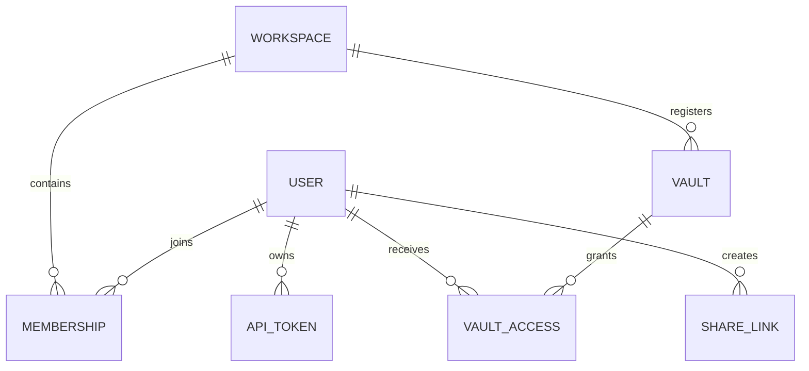

# Datos y almacenamiento

## Configuración bibliográfica

`GNOSI_DATA_DIR/config/references.json` contiene la designación de la tabla
bibliográfica, la desactivación explícita y los ajustes de adjuntos enlazados.
Las copias dentro del código se migran explícitamente con
`scripts/migrate-reference-config.py`, nunca mediante una petición API ni una copia
implícita al arrancar. El migrador conserva el original y los campos desconocidos,
verifica los bytes JSON UTF-8, publica sin sustituir otros archivos y conserva un
diario privado de recuperación. El arranque rechaza configuraciones antiguas no
migradas antes de actualizar bases de datos o iniciar tareas en segundo plano.

## Mapa de propiedad

| Datos | Almacenamiento persistente responsable | Regla de reconstrucción o recuperación |
| --- | --- | --- |
| Contenido de página y frontmatter | Vault Markdown | Hacer copias de seguridad y versionar como archivos ordinarios. |
| Adjuntos y archivos de biblioteca | Vault activo | Preservar referencias relativas o portátiles. |
| Metadatos internos de página | Archivos auxiliares `.gnosi` del vault | Migrar con la página; mantener los campos internos fuera del contenido del usuario. |
| Índices de páginas y wikilinks | Cachés de datos locales | Reconstruir desde el vault; los escaneos parciales no deben reemplazar cachés completas. |
| Usuarios, espacios de trabajo, miembros, accesos al vault, PAT y comparticiones | SQLite de gestión | Hacer copias como estado local de la aplicación; nunca sincronizar la base activa en la nube. |
| Índices de correo, lector, notificaciones, anotaciones y ejecuciones | SQLite local | Según el dominio, recuperar de proveedores o datos de origen cuando sea posible. |
| Tokens OAuth y secretos de integración | Secretos locales o gestor de credenciales del sistema | Reconectar cada máquina si se pierden; no copiarlos a un vault compartido. |
| Puntos de control del agente | Datos locales | Memoria de ejecución de cada instancia, no contenido del vault. |

## Formato del vault

Una página es un archivo Markdown con frontmatter YAML. Los identificadores
estables permiten que enlaces y relaciones sobrevivan a los cambios de título.
Los enlaces visibles usan sintaxis wikilink; los adjuntos y las propiedades de tipo
archivo usan rutas portátiles o metadatos estructurados, no rutas absolutas
específicas de una máquina.

Las vistas de tipo base de datos son proyecciones sobre páginas y registros. No
sustituyen Markdown por un almacén relacional opaco. La capa de servicios del
vault resuelve las definiciones de vistas, esquemas, fórmulas, rollups, relaciones
y estado de presentación.

## Concurrencia de escritura

Las lecturas de página exponen un ETag derivado de la representación actual. Los
clientes que modifican datos devuelven el ETag esperado; una discrepancia rechaza
la escritura obsoleta en lugar de sobrescribir un cambio concurrente. Las utilidades
de escritura atómica sustituyen el archivo solo cuando la nueva versión está completa.

Cambiar un nombre requiere el índice de wikilinks para actualizar enlaces entrantes.
La operación afecta a la identidad de página, nombre de archivo, registro, archivos
auxiliares e índices de enlaces; debe ejecutarse de forma coordinada.

## Base de datos de gestión

Los modelos SQLAlchemy representan:

Todos los modelos de gestión heredan de una misma `DeclarativeBase` tipada de
SQLAlchemy. Las factorías de motor y sesión se inicializan atómicamente y devuelven
tipos concretos `Engine` y `Session`. Los metadatos y nombres de tabla siguen siendo
la referencia de Alembic y de las instalaciones SQLite existentes.

Antes de iniciar trabajadores, el coordinador de esquemas localiza la base de
gestión, cada vault dinámico y los almacenes auxiliares persistentes de Gnosi.
Líneas de revisiones Alembic independientes reconocen huellas estructurales 2.x
revisadas, crean copias verificadas y aplican migraciones hacia delante. Los esquemas
desconocidos o divergentes provocan una parada sin modificaciones. Las cachés
derivadas y las bases de datos externas quedan fuera de estas migraciones.

Solo se guardan los hashes de los PAT y un prefijo reconocible. Los tokens de
compartición pública son identificadores opacos; sus filas conservan el creador,
el vault, los permisos, la caducidad y el estado de revocación.

## Aislamiento de datos locales

`GNOSI_DATA_DIR` apunta a la raíz de cada instancia. El resolutor de rutas crea
directorios de caché, sistema, puntos de control, registros, audio, salidas, copias
de seguridad y secretos. Docker utiliza `/data`; los valores nativos siguen la
convención de datos de aplicación del sistema operativo. `GNOSI_LOCAL_DATA` sigue
siendo un alias obsoleto admitido durante la serie 3.x.

Los archivos SQLite no deben situarse en OneDrive, iCloud Drive, Dropbox ni otra
capa de sincronización de archivos. Esta sincronización no ofrece los bloqueos
que necesita SQLite y puede corromper la base o crear versiones divergentes.

## Vaults con archivos en la nube

Los adaptadores separan el comportamiento ordinario del sistema de archivos de la
descarga local bajo demanda y la disponibilidad. Las lecturas gestionan errores
transitorios por archivo y continúan cuando una respuesta parcial es útil. Un
escaneo parcial se marca y nunca se guarda como caché completa. En macOS, la
descarga bajo demanda usa una acción de la sesión gráfica porque un LaunchAgent
puede recibir `EDEADLK` al acceder a contenido disponible solo en línea.
OneDrive, iCloud Drive, Google Drive, Nextcloud y Dropbox tienen adaptadores y
prefijos de configuración independientes. Un servicio desconocido montado bajo
`~/Library/CloudStorage` usa el adaptador genérico `fileprovider`. Las carpetas
montadas ordinarias o totalmente sincronizadas usan el sistema de archivos local.

## Propiedad de la configuración

La configuración combina recursivamente los parámetros base con los del usuario o
del vault activo en `.gnosi/params.yaml`. El entorno tiene prioridad sobre las rutas
de despliegue y algunos comportamientos de arranque. Las credenciales son referencias
al gestor local de secretos, no valores en bruto dentro de la configuración del vault.

Las variables del proceso tienen prioridad sobre el `.env` local de Gnosi. El
archivo compartido solo se carga si `GNOSI_SHARED_ENV_FILE` lo indica explícitamente
y es de solo lectura para la app. Las credenciales gestionadas por la interfaz van
al gestor del sistema, con alternativa cifrada bajo `GNOSI_DATA_DIR/secrets`.
