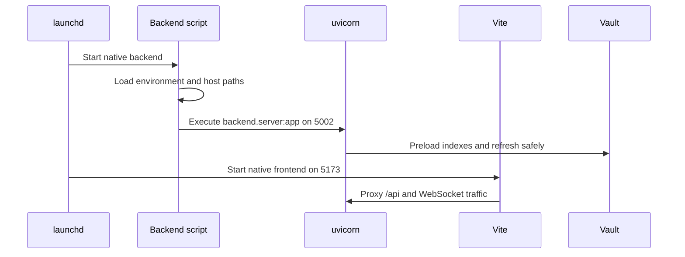

# Duración de la ejecución y despliegue

## Tiempo de ejecución nativo

La operación nativa es la arquitectura de desarrollo predeterminada. LaunchAgents administra dos scripts de repositorio:

| Proceso | Límite de órdenes | Dirección | Recargar el comportamiento |
| --- | --- | --- | --- |
| Motor | `uv run uvicorn backend.server:app` | `127.0.0.1:5002` | Relojes `backend/`; los cambios de dependencia necesitan reiniciarse. |
| Interfaz | `pnpm dev:frontend` | HTTPS `:5173` | Fuente de recargas calientes. |

`run_native_dev.sh` carga la entrada de entorno compartido sin buscarlo como código de shell, establece rutas nativas de bóveda y datos locales, selecciona por defecto host-safe e inicia vivicorn. `run_native_frontend.sh` selecciona el objetivo proxy del motor y las superficies cuando la compra servida es un antepasado ya fusionado de `origin/main`.

El entorno virtual del repositorio es autoritativo. Intel macOS utiliza tapas validadas para su pila de aprendizaje automático; los cambios de paquete deben comenzar inspeccionando el entorno real en lugar de asumir el conjunto de dependencia de Apple Silicon.

## Docker auto-anfitrión

Docker Compose proporciona backend, frontend y el servidor de traducción Zotero. El motor ve la bóveda activa en `/vault`, el padre multi-vault en `/vaults`y estado local-solamente en el `gnosi_local_data` volumen. Las rutas de host se pasan explícitamente para traducir acciones de archivo a través del límite del contenedor.

La imagen de backend usa vivicorn en `5002`; la interfaz está expuesta en `5173` y los proxys al servicio de backend. Traducción-servidor sigue siendo interna en `1969`Docker requiere un secreto de firma JWT no predeterminado porque se considera un despliegue expuesto.

El contenedor del backend instala la versión fijada de PyTorch solo para CPU antes de los requisitos generales de Python. La inferencia con Docker usa la CPU; así, las compilaciones Linux ARM64 no descargan bibliotecas CUDA innecesarias ni agotan el disco del runner.

Docker es un objetivo de implementación compatible, no un retroceso para esta máquina de desarrollo. El código debe seleccionar por defecto Docker-específica a través de la detección de tiempo de ejecución y mantener el comportamiento nativo.

## Paquetes de electrones

El electrón posee el ciclo de vida de la aplicación empaquetada. Comienza el motor Python empaquetado, expone una superficie IPC estrecha a través de la precarga, abre el renderizador y gestiona el estado de actualización manual. El renderizador se suscribe a las actualizaciones y puede consultar el estado más reciente para evitar eventos faltantes emitidos antes de que React se monte.

Crear y liberar trabajos producen instaladores de plataformas más los metadatos de actualización requeridos por `electron-updater`. Los borradores de la liberación permanecen inéditos hasta que un encargado inspecciona todos los artefactos de la plataforma.

## Servicios auxiliares de acogida

- Ayudante de host-open: abrir archivos, búsqueda con foco, recolectores nativos, y
mover archivos a la Papelera sin conceder acceso ilimitado al contenedor.
- Calentamiento OneDrive: recuperación e hidratación de marcadores de posición on-line.
- Native Watchdog: detecta procesos nativos fallidos y reinicia dentro de su
ámbito de aplicación documentado.

## Invariantes de puerto y proceso

- Exactamente un motor posee puerto `5002`.
- Exactamente una interfaz posee puerto `5173`; mudando silenciosamente a `5174` es una QA
fracaso.
- Las instancias nativas y Docker no deben ejecutarse simultáneamente en los mismos puertos.
- La recarga de origen de motor no instala dependencias Python cambiadas.
- La recarga en caliente de Frontend no reemplaza una versión de compilación inyectada por arranque.
- Los árboles de trabajo temporales necesitan acceso a los certificados de desarrollo existentes para
QA válido del navegador HTTPS.

## Puertas sanitarias

`/api/health` prueba el modo de proceso de backend y reportes, la política de autenticación efectiva y la configuración de bóveda. `/api/config` y `/api/vault/pages`; la salud de los procesos por sí sola no puede demostrar la legibilidad del almacenamiento.
