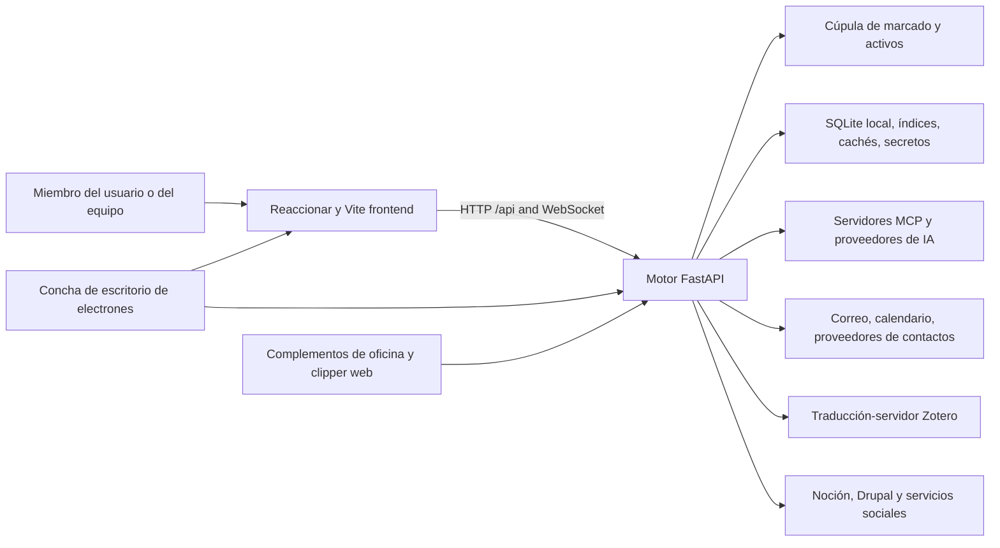

# Contexto del sistema

## Vista del contenedor

## Límite del frontend

El frontend es una aplicación React de una sola página. `app/App.tsx` gestiona
la autenticación y el shell global; `app/routes.tsx` compone rutas, ámbito del
Vault, redirecciones y carga diferida de páginas, mientras Home se carga al inicio.
`app/bootstrap.tsx` prepara el enrutamiento y el idioma;
`app/AppProviders.tsx` conserva el orden StrictMode → API → router → autenticación.
El traslado sitúa la entrada CSS y la llamada a bootstrap en `app/main.tsx`,
con estilos ordenados en `app/styles/index.css`. Vite actúa como proxy de `/api`
y WebSocket durante el desarrollo nativo.

### Organización de los módulos

El traslado revisado asigna composición, navegación e integración global a
`app/`; dominios de producto a `features/`; infraestructura, UI, registros,
enrutamiento y adaptadores API reutilizables a `shared/`; y contratos generados
a `generated/`. Los contratos generados se regeneran, nunca se editan a mano.
El proveedor de autenticación pertenece a `features/auth/context/AuthProvider.tsx`
y su contexto reutilizable a `shared/auth/auth-context.ts`.

El manifiesto `frontend/feature-public-entries.json` recoge rutas
públicas exactas revisadas y sus motivos. Las entradas `index` de la raíz de
cada feature siguen admitidas; un módulo vecino no listado sigue siendo privado.
Los consumidores acceden directamente a una entrada raíz o explícitamente
revisada, incluidos imports diferidos separados, sin introducir un agregador de
carga inmediata. El manifiesto describe el acceso; no importa módulos.

Las dependencias pueden ir de `app` hacia las features y la infraestructura
compartida. Las features no dependen de `app`; `shared` no depende de features
ni de `app`, tampoco en imports solo de tipos. Trasladar la previsualización
Markdown/wikilink a la infraestructura compartida no resuelve su ciclo interno.
El traslado debe conservar carga diferida, estilos, rutas y payloads; la
estructura por sí sola no acredita una integración ni una release completas.

Los componentes llaman al backend mediante adaptadores API tipados en `shared/api/`.
El backend sigue autorizando usuarios, workspaces, vaults y operaciones destructivas.

## Límite del motor

`backend/server.py` crea la aplicación FastAPI y registra routers de dominio. Los módulos de ruta traducen los contratos HTTP en llamadas de servicio. `backend/services/`; las entidades relacionales persistidas viven en `backend/models/`; La orquestación de AI vive en `backend/agent/`; vidas laborales programadas en `backend/scheduler/` y habilidades de tiempo de ejecución.

La vida útil de la aplicación comienza infraestructura compartida, construye capacidades de agente, calienta índices seguros, inicia trabajadores IDLE de correo y luego cierra esos recursos. El inicio de integración opcional está aislado para que un proveedor no disponible no aborte el servidor completo.

## Límites de almacenamiento

La bóveda y los datos locales tienen deliberadamente diferentes propiedades de durabilidad y sincronización:

- Vault: contenido portátil del usuario; puede vivir en disco local o en un archivo respaldado por la nube
proveedor.
- Datos locales: SQLite, índices, cachés, secretos, registros, puntos de control y salidas;
Nunca sincronizado con la nube.
- Configuración: fusionado desde parámetros predeterminados de la aplicación, usuario o almacén,
el entorno anula, y las tiendas de credenciales locales.

Ver [datos y almacenamiento](data-and-storage.md) para la propiedad y la reconstrucción de las reglas.

## Sistemas externos

Todos los servicios externos son dependencias opcionales de dominio. OAuth y credenciales se gestionan localmente. Los adaptadores normalizan el comportamiento específico del proveedor para Google, Microsoft, IMAP/SMTP, CalDAV, Notion, Drupal, proveedores de IA, redes sociales, proveedores de archivos y traducción Zotero.

## Navegación hasta la aplicación

- [Catálogo API](../generated/api-catalog.md)
- [Catálogo de la interfaz](../generated/frontend-catalog.md)
- [Catálogo de módulos de motor](../generated/backend-modules.md)
- [Catálogo de configuración](../generated/configuration.md)
