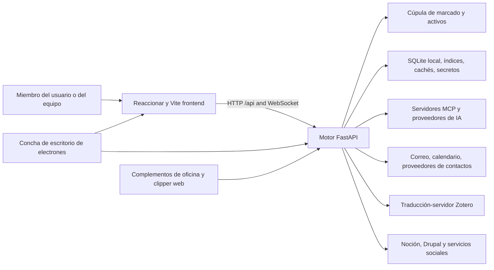

# Contexto del sistema

## Vista del contenedor

## Límite de la frontera

La interfaz es una aplicación de una sola página React. `App.jsx` Posee las rutas de navegador de nivel superior, puerta de autenticación, shell global, carga de ruta perezosa, brindis, chat de agente, paleta de comandos, registrador de reuniones, recordatorios y aviso de actualización de escritorio. `/api` y el tráfico WebSocket al motor durante el desarrollo nativo.

Las páginas componen componentes reutilizables; los componentes llaman al motor a través de ayudantes compartidos o llamadas directas de búsqueda. No se confía en el interfaz para autorizar un espacio de trabajo, bóveda, usuario o operación destructiva. Los identificadores de cliente son señales de que el motor resuelve y valida.

## Límite del motor

`backend/server.py` crea la aplicación FastAPI y registra routers de dominio. Los módulos de ruta traducen los contratos HTTP en llamadas de servicio. `backend/services/`; las entidades relacionales persistidas viven en `backend/models/`; La orquestación de AI vive en `backend/agent/`; vidas laborales programadas en `backend/scheduler/` y habilidades de tiempo de ejecución.

La vida útil de la aplicación comienza infraestructura compartida, construye capacidades de agente, calienta índices seguros, inicia trabajadores IDLE de correo y luego cierra esos recursos. El inicio de integración opcional está aislado para que un proveedor no disponible no aborte el servidor completo.

## Límites de almacenamiento

La bóveda y los datos locales tienen deliberadamente diferentes propiedades de durabilidad y sincronización:

- Vault: contenido portátil del usuario; puede vivir en disco local o en un archivo respaldado por la nube
proveedor.
- Datos locales: SQLite, índices, cachés, secretos, registros, puntos de control y salidas;
Nunca sincronizado con la nube.
- Configuración: fusionado desde parámetros predeterminados de la aplicación, usuario o almacén,
el entorno anula, y las tiendas de credenciales locales.

Ver [datos y almacenamiento](data-and-storage.md) para la propiedad y la reconstrucción de las reglas.

## Sistemas externos

Todos los servicios externos son dependencias opcionales de dominio. OAuth y credenciales se gestionan localmente. Los adaptadores normalizan el comportamiento específico del proveedor para Google, Microsoft, IMAP/SMTP, CalDAV, Notion, Drupal, proveedores de IA, redes sociales, proveedores de archivos y traducción Zotero.

## Navegación hasta la aplicación

- [Catálogo API](../generated/api-catalog.md)
- [Catálogo de la interfaz](../generated/frontend-catalog.md)
- [Catálogo de módulos de motor](../generated/backend-modules.md)
- [Catálogo de configuración](../generated/configuration.md)
