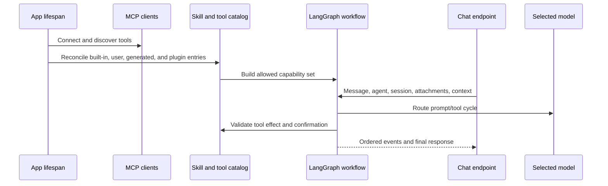

# Agentes de IA, modelos, herramientas y habilidades

## Responsabilidad de la conversación en el frontend

`features/agent` gestiona la composición del chat, las sesiones, las confirmaciones,
las acciones sobre mensajes y la presentación del flujo. Su punto de entrada público
exporta `AgentChat` y el contrato completo de propiedades. La aplicación carga este
punto de entrada dinámicamente; los cuadernos importan el mismo componente dentro
de su módulo de ruta opcional. Ningún consumidor accede a módulos privados del
chat ni fuerza el componente a un tipo más restringido.

Las listas de referencias de contexto se mantienen de solo lectura en toda la
interfaz y se copian únicamente al construir la petición HTTP existente. Así se
preservan los metadatos de origen, el ámbito del cuaderno, las cargas útiles, la
reproducción de eventos del flujo y las claves de persistencia. Los adaptadores
genéricos de HTTP y NDJSON permanecen en `shared/api`; las pruebas que combinan
valoraciones y transporte pertenecen a la funcionalidad del agente, de modo que
el código compartido no dependa de los detalles internos de la interfaz.

## Modelo de capacidades

Gnosi separa modelos, agentes, habilidades y herramientas:

- Modelo: una ruta de proveedor con capacidades, límites, metadatos de coste,
  fiabilidad y credenciales.
- Agente: instrucciones, selección de modelos, política de memoria y puntos de
  control, y habilidades asignadas.
- Habilidad: un paquete de capacidades documentado que aporta instrucciones y
  limita las herramientas compatibles.
- Herramienta: una operación invocable clasificada por efecto y origen.
- Fuente de contexto: Vault, tabla, archivo o material externo seleccionado por
  el usuario que se añade a una conversación con límites explícitos de acceso y
  tamaño.

El conjunto de herramientas de conocimiento del Vault mantiene los objetos
`StructuredTool` de LangChain en el límite de registro y extrae sus funciones
invocables tipadas solo para la composición interna de herramientas. La creación
de páginas se registra a través del responsable canónico del Vault, la búsqueda
del Vault obtiene explícitamente su almacén específico de carga diferida y las
lecturas de rutas y PDF conservan sus restricciones de acceso y los límites
máximos de tamaño definidos por el servidor.

La fuente de datos de Artificial Analysis constituye un límite de comparación
tipado en el servidor. Mantiene privadas las credenciales de la API, valida cada
respuesta paginada, completa solo los metadatos ausentes del catálogo, conserva
las métricas verificadas de la caché y recurre a una caché antigua o a models.dev
indicando explícitamente la procedencia.

## Flujo de inicio y solicitud

Las importaciones históricas de Agent siguen disponibles mediante fachadas
acotadas de compatibilidad, mientras que el paquete de dominio gestiona la
correspondencia y el almacenamiento del contexto, el despacho de herramientas
propias, los contratos de evidencias y citas, el estado del flujo, las
confirmaciones, las sesiones y la composición de rutas. Las rutas del catálogo
y la gobernanza de agentes siguen el mismo patrón en el dominio de configuración,
sin cambiar el orden de las rutas ni los identificadores de operación.

El enrutador de modelos resuelve las combinaciones de proveedor y modelo, los
límites de contexto, la compatibilidad con herramientas, los topes de gasto y la
política de alternativas. Las credenciales se obtienen del almacenamiento local
de secretos o de una migración compatible desde variables de entorno, sin
exponerlas al frontend. Los motivos de fallo se registran por separado de las
respuestas al usuario para que los operadores puedan distinguir los tiempos de
espera agotados, el rechazo del proveedor, las credenciales no válidas, el
desbordamiento del contexto y la incompatibilidad de herramientas.

El cliente híbrido heredado sigue disponible para la composición de contenido
social, la redacción de correo y los analizadores antiguos del pipeline mediante
un límite de compatibilidad estrictamente tipado. Restringe los mapas dinámicos
de proveedores YAML, exige una URL concreta del proveedor antes de cualquier
llamada de red, valida las estructuras de respuesta compatibles con OpenAI,
escribe atómicamente su caché basada en el hash de la entrada al modelo bajo el
directorio de datos de cada dispositivo y conserva el comportamiento establecido
de intentar primero la opción principal y después la alternativa, sin exponer
credenciales.

La transcripción local con Whisper expone un protocolo de modelo y una estructura
de resultado tipados; el audio permanece en el dispositivo y la caché del modelo,
descargado bajo demanda, reside bajo `GNOSI_DATA_DIR`, independiente del proveedor.
La importación opcional sin tipar de `faster-whisper` queda confinada a este
adaptador. La conversión de divisas también restringe el JSON remoto y almacenado
en caché antes de calcular presupuestos, conserva las alternativas de tipos reales
antiguos y tipos estáticos, y siempre devuelve un tipo de cambio tipado positivo
en unidades por USD.

El enrutador normaliza los metadatos desconocidos del registro antes de iterarlos,
compara las cuotas de tokens y las ventanas de contexto como enteros y mantiene
su registro de consumo tras límites tipados de ruta, carga y guardado atómicos.
Los topes monetarios distinguen explícitamente entre la ausencia de un tope y un
valor cero. Esto preserva la política existente de proximidad al tope y recurso
a modelos gratuitos, a la vez que permite recuperarse de datos persistidos
malformados usando un registro vacío.

La observabilidad del agente, la reproducción de eventos, los diarios de flujos,
las reservas de turnos, la calidad revisada, la memoria personal y semántica, las
evaluaciones de modelos, la auditoría de capacidades y su estado de funcionamiento
son estado operativo de cada dispositivo. Sus almacenes SQLite/JSON se ubican
directamente mediante `GNOSI_DATA_DIR`; nunca derivan su ubicación de un Vault
ni de un proveedor de nube. Las pruebas inyectan ese mismo mecanismo canónico de
resolución, y las claves de cifrado de los flujos permanecen en el subdirectorio
`secrets` del directorio de datos local.

La selección de modelos durante la ejecución pertenece al perfil del agente.
`pinned` utiliza solo el proveedor y modelo asignados; `resilient` empieza con
ellos y permite pasar a una alternativa solo ante un error transitorio; y
`adaptive` puede elegir entre el principal y la lista explícita de modelos
permitidos del perfil. Cada alternativa debe ser una entrada habilitada del
registro con la misma condición local o remota; ni las credenciales ni los valores
predeterminados del catálogo amplían la lista permitida. Los errores de
autenticación, política o contenido nunca provocan el paso a una alternativa.
La alternativa seleccionada se indica en los metadatos del mensaje y en el
comprobante del flujo, de modo que un modelo local no pueda enviar inesperadamente
contexto privado a un proveedor remoto.

El cliente MCP por stdio valida los objetos en el límite JSON-RPC, tipa
explícitamente las peticiones asíncronas pendientes y enruta las herramientas
mediante una caché que solo se actualiza cuando no encuentra una entrada. Los
catálogos de herramientas malformados fallan localmente sin propagar valores
no validados al entorno de ejecución del agente.

La configuración de IA mantiene las credenciales de proveedores, las marcas de
conexiones eliminadas, el registro de modelos y las rutas de presupuesto y consumo en una
fachada de compatibilidad estrictamente tipada. La generación y corrección del
editor residen en el dominio de configuración de IA, mientras que las cargas
validadas de mapas YAML y los metadatos explícitos de las respuestas heredadas
preservan exactamente los contratos HTTP y OpenAPI existentes.

## Gobernanza de herramientas

Los descriptores de herramientas declaran efectos de lectura, escritura, externos
o destructivos. Las herramientas generadas pasan una validación basada en AST y
se ejecutan en un entorno restringido. El validador bloquea capacidades peligrosas
como escrituras de archivos sin restricciones, acceso al entorno, recorrido
dinámico de atributos con doble guion bajo e importaciones inseguras.

Las acciones que requieren confirmación crean registros pendientes duraderos.
La confirmación vincula al usuario, la sesión, la herramienta, los argumentos,
el efecto y la caducidad; aceptar una acción caducada o alterada no autoriza una
invocación diferente. El mantenimiento hace caducar y elimina los registros
independientemente del tráfico del chat.

Los metadatos versionados de capacidades se restringen a partir de entradas en
forma de modelo o mapa antes de validarse. Los contratos de la versión 2 deniegan
la operación por defecto salvo que las políticas de tiempo de espera, idempotencia,
privacidad, tráfico saliente y resultados duraderos estén completas y sean válidas;
los descriptores heredados de la versión 1 siguen siendo compatibles. La
cancelación cooperativa envuelve cualquier objeto de Python cuya finalización
pueda esperarse de forma asíncrona en un futuro cancelable, de modo que los
adaptadores de proveedores basados en corrutinas
y futuros compartan la misma semántica del token.

## Habilidades y plugins

Las habilidades de ejecución integradas residen en `pipeline/skills/`. Los
paquetes del usuario y de plugins se validan para incorporarlos a un catálogo,
preservando el origen, la activación, la compatibilidad y la distinción entre
campos gestionados y campos del usuario. La reconciliación de plugins es
idempotente: desactivar un plugin suspende su contribución gestionada sin
eliminar las personalizaciones del usuario.

La habilidad de traducción de filas mantiene el enrutamiento de proveedores y
el ciclo de vida local de OPUS-MT en su propio paquete consolidado. Las estructuras
JSON externas se restringen antes de usarse, la puntuación de idiomas tiene un
orden tipado determinista y la caché de carga diferida de OPUS almacena solo
protocolos mínimos de tokenizador y modelo. Los tipos genéricos concretos de
Transformers no se propagan al contrato de enrutamiento ni alteran el orden
establecido de alternativas: Softcatalà, Apertium, OPUS, DeepL y marcadores de
posición.

La reconciliación de plugins también puede ejecutarse antes de componer las
rutas de FastAPI. Deriva el directorio `.gnosi` del contexto canónico del Vault
activo y lee el estado mediante `backend/domains/configuration/plugin_state.py`;
nunca importa una ruta del Vault solo para resolver rutas de archivo o
configuración. Antes de que exista el almacén compartido de todo el proceso, el
mismo normalizador y escritor atómico se ejecutan bajo un bloqueo de inicialización;
después de la composición, la reconciliación reutiliza el almacén compartido y
los bloqueos de modificación.

La fachada heredada de memoria Chroma mantiene la carga diferida y el tipado
estricto para preservar la compatibilidad de importación. Importarla crea solo
el directorio de almacenamiento configurado; no carga modelos de representaciones
vectoriales. Cuando faltan estas representaciones, las lecturas devuelven
resultados vacíos y las escrituras fallan explícitamente, mientras que la memoria
personal canónica sujeta a gobernanza permanece en el servicio SQLite con ámbito
delimitado del dominio Agent.

## Contexto y memoria

El estado de la conversación se delimita por agente y sesión. El orden de los
mensajes en la interfaz utiliza identificadores estables, no solo la hora de
llegada. Los adjuntos y las fuentes de contexto validan rutas, tamaño, tipo de
archivo y ámbito del espacio de trabajo o Vault. Las fuentes externas grandes
usan representaciones que permiten búsquedas en lugar de insertar texto en bruto
sin límite en cada turno.

El punto de control duradero sigue siendo el registro de auditoría completo,
pero las entradas enviadas al proveedor utilizan una proyección acotada. Los
mensajes anteriores del usuario y las respuestas finales del asistente permanecen
como memoria de conversación, mientras que se omiten los grupos históricos de
llamadas a herramientas y sus cargas útiles en bruto. El turno actual conserva
los grupos completos del protocolo de llamada y resultado, y la proyección
conversacional agregada tiene un límite estricto de caracteres incluso cuando
el modelo seleccionado anuncia una ventana de contexto mucho mayor.

La memoria personal revisada es un almacén local separado y explícito, delimitado
por Vault y agente. Los usuarios pueden crear, editar, desactivar, hacer caducar
y eliminar hechos o preferencias con historial de revisiones en Configuración.
La recuperación es léxica y se limita a cinco elementos; la entrada al modelo
etiqueta el resultado como datos que no pueden cambiar políticas, herramientas
ni autorizaciones. Los puntos de control de conversación y las asociaciones de
vocabulario mantienen sus ciclos de vida separados.

La navegación del Vault aporta contexto de página, tabla y vista activa limitado
al turno. El servidor amplía un panel con una sola vista incrustada a la vista
canónica de la tabla, reaplica sus filtros y ordenación y expone una consulta
exacta y acotada de filas con recuento y paginación. Las lecturas exactas de páginas
y tablas son llamadas a herramientas construidas por el servidor; tras obtener
un resultado completo, la síntesis se ejecuta sin herramientas vinculadas para
que un modelo propenso a usarlas no repita la llamada hasta alcanzar el límite
de recursión del grafo.

La petición canónica de Recursos de autoría propia también se enruta en el
servidor. Gnosi ejecuta la vista guardada de autoría exactamente una vez y da
formato a su recuento y lista acotada de registros directamente a partir del
resultado sujeto a gobernanza. Esta vía no llama al modelo después de que la
herramienta termine con éxito. Las peticiones que requieren interpretación o
generación continúan mediante la síntesis normal del modelo.

El mismo contrato determinista se aplica ahora a inventarios arbitrarios de
Vaults adjuntos, en lugar de limitarse a temas o tablas individuales. Antes de
seleccionar herramientas, el servidor clasifica la operación como conversación,
consulta, inventario, análisis o acción sujeta a gobernanza. Las peticiones de
inventario reciben un examen estructurado exhaustivo con recuento exacto,
identificadores canónicos de registros, resolución de tipos a partir del registro
vigente, agrupación por tipo, metadatos de procedencia seleccionados y paginación
por desplazamiento. El tema es un dato de la consulta: añadir un tema o una tabla
nueva no añade una rama de intención. La primera página y las siguientes se
formatean directamente a partir del resultado de la herramienta sujeto a
gobernanza, sin llamar al modelo.

El modo de petición también impide que el adjunto predeterminado de Conocimiento
desvíe tareas no relacionadas. El modo de conversación no lee fuentes ni vincula
herramientas pasivas. Las peticiones explícitas de correo, calendario, contactos,
Reader, tiempo meteorológico, web, Notion o Zotero omiten las herramientas
predeterminadas del Vault salvo que esa misma petición también nombre un objeto
del Vault; la habilidad asignada pertinente sigue disponible.

Cada petición lleva ahora al grafo un plan universal de turno efectivo. El plan
combina el modo de operación, los dominios de datos explícitos, los descriptores
vigentes de ejecución, las evidencias requeridas, los permisos sujetos a controles,
la condición local o remota del proveedor, la estrategia de ejecución y la de
respuesta. Es un estado propio de la petición que sobrescribe los datos de los
puntos de control de turnos anteriores. El nodo Brain cruza la selección normal
de ejecución con los nombres de herramientas del plan, de modo que los metadatos
mostrados al usuario describen las herramientas realmente disponibles y no una
clasificación meramente orientativa.

La privacidad también se delimita por petición. El plan distingue el procesamiento
local, las evidencias privadas procesadas por el modelo remoto configurado, las
lecturas externas y la conversación ordinaria. Los datos del Vault adjunto no se
consideran utilizados cuando una petición explícita de correo, Reader, Notion,
web u otro dominio excluye sus herramientas. La interfaz informa solo de esta
situación y del número de fuentes; los cuerpos de las fuentes, las entradas al
modelo, los secretos y el razonamiento oculto nunca se incluyen en los metadatos
de transparencia.

Las respuestas finales del modelo pasan por un verificador determinista. Comprueba
únicamente los resultados de herramientas del turno actual y la política de
efectos, bloquea afirmaciones de que una acción sujeta a gobernanza se completó
sin un resultado satisfactorio de la herramienta, bloquea respuestas dependientes
de fuentes que omitieron evidencias obligatorias, registra los fallos de
herramientas como limitaciones y emite recuentos de evidencias y herramientas.
Las respuestas de inventario usan el mismo verificador aunque su texto lo genere
el servidor. La verificación nunca invoca un segundo modelo.

Las respuestas dependientes de fuentes también incluyen citas de afirmaciones
validadas por el servidor. Los resultados de herramientas definen los únicos
identificadores de fuente válidos para el turno actual. Los inventarios
deterministas vinculan cada línea enumerada con su registro canónico del Vault y
las afirmaciones sobre recuentos agregados, agrupación, paginación y método con
el manifiesto exacto del resultado de la herramienta. La síntesis del modelo puede
emitir marcadores `[[cite:SOURCE_ID]]`; el verificador retira los marcadores válidos
de la prosa visible, rechaza los identificadores ausentes de las evidencias del
turno actual y señala como limitación una fundamentación incompleta. El chat
presenta la correspondencia acotada entre afirmaciones y fuentes con enlaces
seguros a Vault, Reader o HTTP(S), y nunca persiste fragmentos ni rutas del sistema
de archivos como metadatos de citas.
Cada fuente citada también incluye una huella breve de versión derivada de su
revisión, etag, fecha de actualización o manifiesto exacto de herramienta del
turno actual. La interfaz distingue entre versiones exactas y versiones basadas
solo en la identidad, sin exponer cuerpos de fuentes ni secretos de conectores.

La búsqueda del Vault utiliza una clasificación híbrida determinista: términos
léxicos multilingües expandidos, mayor peso de títulos exactos y de roles de índice,
y la puntuación vectorial reconstruible. Los resultados se almacenan brevemente
en caché solo por Brain, consulta y k; la caché es acotada y no conserva entradas
al modelo ni cuerpos de fuentes sin límite. Los fragmentos devueltos se delimitan
como evidencias no confiables y se señalan las instrucciones que parecen intentos
de inyección; las instrucciones de Brain tratan cada fuente, conector, adjunto y
resultado web como datos, no como instrucciones.

Los inventarios exhaustivos reutilizan los índices de documentos analizados y
de enlaces persistidos localmente. Los identificadores de relación se amplían
con los títulos de destino indexados, de modo que un registro vinculado a un
proyecto o fuente coincidente siga siendo localizable sin volver a abrir cada
documento sincronizado en la nube. Las escrituras normales de Gnosi actualizan
estos índices; el mantenimiento periódico de índices reconcilia las ediciones
externas. Los registros ausentes de la caché recurren a una lectura directa
acotada. La búsqueda semántica de los k mejores resultados sigue siendo la vía
de descubrimiento de evidencias para consultas y análisis, y nunca se presenta
como un inventario completo.

Las cargas útiles de inventario también informan de la antigüedad de construcción
del índice de enlaces, la cobertura de caché, las lecturas directas alternativas
y el estado de uso de datos antiguos mientras se revalidan. Un índice antiguo o
ausente solicita una reconciliación en segundo plano sujeta a controles sin
retrasar la respuesta; el mensaje conserva la limitación en lugar de dar a
entender que el índice acaba de reconstruirse.

El análisis de una colección completa de Reader se admite como operación en
segundo plano mediante la fachada de trabajos de capacidades independiente del
proveedor. El servidor crea la llamada a la herramienta de trabajos de forma
determinista, devuelve un identificador de trabajo con el espacio de nombres
`reader:` y expone en los detalles del mensaje su estado, la disponibilidad del
resultado, la reanudación tras un fallo o interrupción y la cancelación
cooperativa. La misma fachada puede ampliarse a otros proveedores duraderos
gestionados por el dominio de origen; las peticiones no compatibles permanecen
en primer plano y nunca se presentan como trabajo duradero.

Las herramientas de Reader para el agente exigen un Vault activo concreto antes
de analizar o persistir páginas, exponen cargas útiles de ámbito tipadas y
conservan un decorador identidad solo para entornos mínimos sin LangChain. Las
lecturas y modificaciones de artículos restringen los descriptores ORM heredados
en un único límite y preservan los nombres, efectos y respuestas serializadas
de las herramientas.
Las herramientas de contexto de Reader adjunto aplican la misma protección y
reutilizan un único Vault resuelto para autorizar el acceso al estado y recuperar
resultados, evitando que el contexto cambie entre Vaults durante una llamada a
herramienta. La envoltura de contenido no confiable y los límites de salida no
cambian.
Los proveedores y despachadores de colas registran contratos versionados que
declaran el tipo de trabajo, la idempotencia, la concesión temporal, los
presupuestos de intentos y llamadas al modelo, y el comportamiento de resultados,
reanudación y cancelación. Los tipos de trabajo desconocidos fallan de forma
visible en lugar de entrar en una rama fija del ejecutor.

Los trabajos de Reader persisten una política de recuperación acotada junto a
sus puntos de control. Un tiempo de espera agotado transitorio, un fallo temporal
de red o servicio, o un límite de frecuencia llevan a un estado de espera de
reintento cancelable con demoras exponenciales limitadas. Los intentos y las
llamadas al modelo consumen presupuestos persistidos separados antes de realizar
cualquier llamada nueva. Un temporizador en un hilo de servicio gestiona los
reintentos normales dentro del proceso; la reconciliación de listas y estados de
trabajos inicia un reintento vencido tras reiniciar el backend. Los fallos
permanentes, cancelados, malformados o con presupuesto agotado permanecen en un
estado terminal visible. La reanudación manual utiliza los mismos presupuestos
y, por tanto, no puede eludir el límite del bucle.

Los demás turnos de solo lectura tienen un presupuesto independiente de tres
resultados: si el modelo sigue solicitando herramientas, la siguiente invocación
de Brain recibe las evidencias acumuladas sin herramientas vinculadas y debe
sintetizar la respuesta. Así, el límite de recursión del grafo sigue siendo una
red de seguridad final y no un mecanismo normal de control del flujo.

El plan universal también incluye un presupuesto operativo inmutable para cada
turno: el tiempo máximo de espera HTTP y los máximos de llamadas al modelo,
llamadas a herramientas y resultados de lectura. Los turnos de conversación
reciben un presupuesto breve sin herramientas; los de consulta e inventario,
presupuestos de lectura acotados; y los análisis y acciones sujetas a gobernanza,
un presupuesto mayor pero finito. El grafo aplica estos valores antes de la
siguiente invocación al proveedor o a una herramienta, y el flujo expone los
mismos valores y si se alcanzó algún límite. Un presupuesto de cero herramientas
es una declaración de modo, no una forma de eludir autorizaciones: las lecturas
de contexto obligatorias construidas por el servidor siguen su vía explícita.
Las herramientas dinámicas de contexto no se seleccionan para una pregunta
general salvo que el usuario haya aportado realmente una fuente de contexto.

Las automatizaciones de capacidades persisten el ámbito, la revisión, la
programación y los presupuestos por ejecución en su propia base de datos SQLite
con migraciones, bajo el directorio canónico de datos local. La reserva de una
ejecución es transaccional, rechaza trabajos superpuestos o que excedan el
presupuesto, recupera concesiones temporales caducadas y registra el estado
terminal incluso si falla la ejecución del agente. La falta de configuración de
datos o un fallo en el ciclo de escritura y lectura de persistencia abortan
explícitamente, en lugar de anunciar una automatización que no se ha almacenado.

ToolNode conserva el entorno completo de las habilidades activas para la ejecución
y las comprobaciones de políticas, mientras que cada invocación del modelo vincula
solo herramientas pasivas de lectura y herramientas sujetas a controles que la
petición actual autoriza explícitamente. Los perfiles automáticos heredados también
limitan las lecturas pasivas a las coincidencias multilingües del dominio de la
petición y a una operación exacta de contexto requerida, con un máximo acotado;
las habilidades con ámbito explícito conservan su conjunto ya reducido de lecturas
asignadas. Las lecturas obligatorias de contexto vinculan solo la herramienta de
origen requerida para su primer paso. Esta vinculación por turno deriva del estado
de la petición y nunca se reutiliza como autorización almacenada en caché.

El chat mide cada respuesta desde el envío de la petición hasta la finalización
del flujo. Un contador en vivo de segundos enteros se sustituye por el tiempo
transcurrido guardado en la respuesta completada. El flujo también informa de las
duraciones de preparación del servidor, enrutamiento, herramientas, modelo,
tiempo residual y total, junto con los recuentos de llamadas al modelo y a
herramientas y de tokens; los detalles del mensaje conservan este desglose
diagnóstico acotado. Cada mensaje visible también permite rebobinar la
conversación: tras confirmarlo, el servidor recorta el punto de control canónico
del ámbito en el límite de un turno completo y devuelve su proyección pública.
El rebobinado cambia solo la memoria de conversación; nunca se presenta como
si hubiera revertido confirmaciones completadas o efectos externos.

Durante la ejecución, el flujo emite un marcador acotado de fase de enrutamiento,
generación por el modelo o ejecución de herramientas. El chat muestra la fase activa
junto al contador de segundos transcurridos y la restablece al terminar el turno.
Los códigos estables de fallos transitorios (`agent_loop_exhausted` y variantes
de tiempo de espera agotado, servicio no disponible y límite de frecuencia)
incluyen metadatos orientativos de recuperación. El cliente ofrece un único
reintento deliberado de la petición original tras la revisión del usuario; el
servidor nunca vuelve a ejecutar automáticamente un turno fallido porque puede
haberse preparado ya una acción sujeta a gobernanza. En cambio, los errores
permanentes de configuración o autorización invitan a editar la petición o la
configuración de ejecución.

El flujo posee un token opaco de cancelación. La acción explícita Cancelar llama
a un punto de acceso autenticado y limitado a ese flujo, y llega al puente de
cancelación asíncrona del proveedor. Una desconexión accidental del navegador o
proxy no cancela el turno acotado ya aceptado: un productor independiente continúa
y sus eventos siguen disponibles para reanudar el flujo. Los flujos de trabajo
almacenados en caché no capturan eventos específicos de una petición, y los tokens
se liberan cuando termina el productor. Los fallos del proveedor utilizan un
cortacircuitos acotado, local al proceso y con clave de proveedor y modelo,
mientras que los errores de autenticación y política siguen siendo terminales.
Además, los descriptores de herramientas exponen un estado de funcionamiento de
bajo coste de consulta —operativa, no disponible o en cuarentena temporal— para
que los identificadores, nombres o manejadores ausentes y los adaptadores que
fallan repetidamente no se anuncien como capacidades ejecutables. Dos fallos
dentro de la ventana acotada de supervisión ponen una herramienta brevemente en
cuarentena; una llamada posterior satisfactoria borra el registro de fallos
consecutivos.

El transporte delimitado por saltos de línea se encapsula en la versión 1 del
protocolo. Cada evento lleva un identificador opaco de flujo, un identificador de
evento, una secuencia monótona, un identificador de traza y, opcionalmente, uno de
turno. Una operación pendiente del proveedor sigue activa mientras se emite una
señal periódica de actividad, de modo que el mantenimiento de la conexión de
transporte no cancele a un proveedor lento pero operativo. El cliente ignora los
números de secuencia duplicados. Los eventos se cifran en un diario local vinculado
al ámbito durante un máximo de una hora, y el navegador reanuda desde su última
secuencia durante todo el tiempo máximo del turno. La reproducción de eventos no
repite ninguna llamada al modelo o a herramientas ni ninguna acción sujeta a
gobernanza; solo vuelve a aplicar la estructura original de cada evento.

Las entradas largas al modelo conservan el punto de control completo como registro
de auditoría, pero añaden a la proyección del proveedor un resumen determinista
acotado de los turnos humanos y del asistente que se han omitido. El resumen
contiene solo fragmentos breves y hashes opacos; nunca arrastra cargas útiles
en bruto de herramientas ni cuerpos de fuentes sin límite.

Cada turno transmitido recibe un `trace_id` opaco que se propaga por la
planificación, la selección de modelos, el estado de funcionamiento de la
ejecución, los mensajes, los errores, las métricas y los eventos de finalización.
Esto proporciona a los registros distribuidos y a la interfaz una única clave de
correlación sin persistir entradas al modelo, credenciales ni texto de fuentes.
La disponibilidad de MCP se almacena brevemente en caché por servidor, y el
comprobante de ejecución incluye instantáneas de proveedores y conectores.

La recuperación de Brain combina la puntuación vectorial reconstruible con
expansión léxica multilingüe que normaliza los acentos, mayor peso de títulos e
índices, caché acotada y evidencias con marcas de posibles inyecciones. Las pruebas
HTTP reales de tablas y papelera son opcionales y se ejecutan en CI contra un
Vault desechable y un puerto separado; la batería hermética siempre apunta a un
puerto cerrado para no modificar accidentalmente el backend nativo de un
desarrollador.

Las filas editables del registro de modelos se completan desde el catálogo
canónico antes de llegar a Configuración o al enrutamiento de ejecución. Las
actualizaciones parciales de presupuesto y configuración se fusionan con los
metadatos existentes de capacidades, ventana de contexto, coste y calidad. Los
cambios de proveedor o modelo invalidan los grafos en caché para que la
compatibilidad con herramientas y las credenciales surtan efecto en el siguiente
turno. La cabecera del chat muestra el modelo seleccionado, el número exacto de
herramientas y motivos que permiten actuar ante cualquier degradación del entorno
de ejecución.

Los detalles del mensaje ofrecen una explicación operativa acotada: modo, ruta,
ejecución en primer o segundo plano, herramientas realmente utilizadas, número de
evidencias, situación de privacidad, estado del verificador, vigencia del índice,
estado del trabajo duradero cuando exista y tiempos. Se trata de un comprobante
de ejecución, no de una cadena de razonamiento.

El mismo comprobante incluye una interpretación semántica depurada de información
sensible —operación, confianza, conceptos y estrategia de recuperación—, la
decisión del intermediario de capacidades —recuentos de herramientas candidatas
y sujetas a controles— y el ámbito del punto de control. Los resúmenes de consultas,
los cuerpos de fuentes, las cargas útiles históricas de herramientas, las entradas
al modelo y el razonamiento oculto se excluyen de los metadatos del cliente.

Las métricas del turno incluyen una estimación en USD basada en el catálogo del
proveedor junto con recuentos de tokens y latencia. El registro persistente de
gastos sigue siendo la fuente de verdad; la estimación es un metadato de
visualización acotado y nunca se utiliza por sí sola como autorización. La batería
de evaluación determinista también comprueba que cada plan respete el límite de
latencia de 120 segundos.

El corpus determinista de `backend/agent/evals/` cubre todos los modos de petición,
los cuatro idiomas de la interfaz, los límites de acceso por dominio, el
procesamiento privado local y remoto, las acciones sujetas a gobernanza y la
admisión de trabajos duraderos de Reader. Se ejecuta antes de la batería de pruebas
del backend en las solicitudes de incorporación pertinentes y todos los días;
cualquier caso fallido termina con un código distinto de cero sin llamar a
proveedores ni gastar tokens.

Los errores de producción y las valoraciones positivas o negativas de las
respuestas del asistente alimentan un ciclo local y autenticado de mejora de
calidad. `POST /api/chat/feedback` acepta solo metadatos operativos acotados y
rechaza explícitamente el contenido de las respuestas. El servidor registra los
errores del flujo con códigos estables. El almacén SQLite local conserva las
identidades de turno, sesión y agente transformadas en hashes, los campos del
plan y del verificador, los nombres de herramientas y los intervalos de tiempo;
no tiene columnas para entradas al modelo, respuestas, fuentes, títulos, rutas,
URL, fragmentos, adjuntos ni cargas útiles en bruto de herramientas. Las
valoraciones negativas y los errores crean o actualizan de forma determinista
candidatos de evaluación sintéticos sin duplicados. Los administradores enumeran,
aceptan, rechazan, reabren y ejecutan estos candidatos mediante
`/api/ai/evals/candidates*`. Los casos locales aceptados permanecen separados del
corpus versionado de CI hasta que un mantenedor los incorpore deliberadamente.

Los administradores también pueden ejecutar una evaluación explícita, con coste,
del modelo real principal asignado a un agente. Utiliza tres entradas sintéticas
multilingües y de esquema, y almacena solo la identidad de la ruta, la puntuación,
la latencia, los recuentos de tokens y los códigos estables de fallo. Las entradas
al modelo y las respuestas nunca se persisten. Las puntuaciones revisadas pueden
influir en el orden de `adaptive`, pero no pueden añadir un modelo permitido ni
una capacidad.

## Calidad adaptativa y descubrimiento de capacidades

El estado de funcionamiento de las herramientas sobrevive a los reinicios del
backend en un almacén SQLite local acotado. Cada capacidad conserva contadores de
éxitos y fallos, una ventana de fallos consecutivos, un estado de cuarentena
temporal y la latencia agregada de invocaciones. La construcción del catálogo de
ejecución lee estas filas en una única instantánea de caché de corta duración,
en lugar de abrir la base de datos por cada herramienta. Una invocación posterior
satisfactoria retira la cuarentena, pero conserva totales acotados del servicio
para el diagnóstico.

La recuperación de inventarios del Vault combina frases exactas, tokens léxicos
normalizados, similitud conservadora de caracteres, metadatos, texto de cuerpos
en caché y relaciones canónicas, manteniendo un examen exhaustivo del ámbito
autorizado. Los usuarios pueden añadir o eliminar asociaciones de vocabulario
revisadas mediante `/api/ai/semantic-associations`. El almacén local transforma
en hash el ámbito del Vault y contiene solo pares de términos acotados y una
identidad del autor transformada en hash; nunca almacena entradas al modelo,
respuestas, cuerpos de fuentes, rutas, credenciales ni texto ejecutable.

El verificador determinista final publica ahora una puntuación de calidad de
respuesta basada en la salida visible, las evidencias requeridas, el éxito de las
herramientas, las afirmaciones fundamentadas de finalización, las citas, la
paginación de inventarios y el tratamiento de contradicciones. Los hechos
estructurados con el mismo registro y campo, pero valores incompatibles en el
turno actual, producen un comprobante de conflicto acotado que contiene nombres
de procedencia, pero no los valores privados. La respuesta visible recibe una
advertencia localizada en lugar de fusionar silenciosamente los hechos. Un corpus
de respuestas que no utiliza proveedores complementa al corpus de enrutamiento
y comprueba estos contratos de respuesta final en CI.

Las evidencias de herramientas y adjuntos se examinan en busca de marcadores de
sustitución de instrucciones, suplantación de autoridad, coacción para usar
herramientas y exfiltración de secretos. Solo categorías acotadas de contaminación
llegan a los metadatos de respuesta; el texto de las fuentes sigue siendo un dato
no confiable y el comprobante siempre registra que la autorización no ha cambiado.
El corpus de respuestas adversariales comprueba este límite.

Cada plan expone un umbral flexible de síntesis anterior al tiempo máximo estricto
del turno. Cuando se alcanza el margen reservado y las evidencias requeridas están
disponibles, Brain retira las herramientas vinculadas y sintetiza el resultado
mejor fundamentado; el flujo emite una fase de plazo límite para que el cliente
pueda mostrar esa transición. Si todavía faltan evidencias requeridas, el requisito
de evidencias sigue prevaleciendo y no se produce una respuesta sin fundamento.

El descubrimiento de capacidades forma parte del plan de turno que se aplica
efectivamente. Para cada dominio explícito informa de una capacidad utilizable,
una capacidad asignada pero sujeta a controles, o una conexión o habilidad
ausente. El descubrimiento no puede instalar programas, conceder permisos ni
autorizar una acción sujeta a controles. Configuración → IA → Calidad muestra,
solo mediante metadatos, recuentos de turnos, intervalos de latencia, resultados
de verificación, errores, candidatos de evaluación, estado persistente de
funcionamiento de capacidades y el editor reversible de vocabulario a través de
`/api/ai/quality/dashboard`.

Los contratos de capacidades pueden optar por la versión 2 del esquema mediante
los metadatos del descriptor. La versión 2 deniega la operación por defecto salvo
que el tiempo de espera, la idempotencia, la privacidad, el tráfico saliente y
el comportamiento de resultados duraderos sean válidos. Las herramientas y
habilidades heredadas de la versión 1 siguen visibles como heredadas o parciales
en Configuración durante su migración; los metadatos de conformidad nunca hacen
que un manejador sea ejecutable.

## Configuración de LLM Wiki

`backend/domains/configuration/llm_wiki.py` valida la tabla Brain, las tablas de
origen, las dimensiones categóricas, los campos de archivo o URL, los valores
fijos y los destinos de relaciones antes de modificar el esquema. Después crea
los roles canónicos y las relaciones de origen, revalida los campos aptos para
índice, persiste atómicamente y actualiza las páginas del sistema mediante
puertos de fachada de resolución tardía.
La fachada de configuración por Vault restringe los mapas de propiedades, fuentes
y dimensiones a objetos tipados, conservando deliberadamente las funciones
invocables de resolución tardía de rutas y tablas de referencia de `vault_routes`;
así, las pruebas con Vaults desechables y las integraciones existentes pueden
sustituir esos puntos históricos de conexión sin duplicar su estado mutable.
Su límite HTTP restringe una sola vez el enrutador heredado de resolución tardía
a `APIRouter`, de modo que los puntos de acceso de designación de Brain y
configuración de LLM Wiki mantengan un tipado estricto sin alterar permisos,
esquemas de cargas útiles, orden de rutas ni salida OpenAPI.
El adaptador de rutas importa directamente los servicios canónicos de
configuración, esquema y registros, evitando consultas a fachadas parcialmente
inicializadas durante el arranque independiente de Agent. Las operaciones de
Vault sustituibles en ejecución siguen siendo puertos explícitos, incluido el
puerto tipado `VaultActionsPort` que utilizan las acciones de procesamiento de Brain.
El límite de procesamiento utiliza el mismo enrutador tipado para la ingesta
duradera, la consulta periódica de estado, las evidencias, el mantenimiento, el
diagnóstico de coherencia, la revisión de sugerencias, el dictado y el aprendizaje del
glosario; los servicios de resolución tardía y los errores HTTP recuperables no
cambian.
La planificación de Brain reintenta los fallos transitorios del proveedor,
incluido HTTP 429, con un máximo de cinco intentos por fragmento, 120 segundos de
espera acumulada y un límite total de 360 segundos por llamada. Cada petición
recibe el tiempo límite restante (como máximo 240 segundos). La espera
exponencial incorpora una variación aleatoria y respeta `Retry-After` en segundos,
las fechas HTTP y `retry-after-ms`; si el período de espera supera el límite
disponible, el intento se detiene en lugar de reintentar antes de tiempo. No se
reintentan los errores de autenticación, de validación ni las cuotas de
facturación explícitamente agotadas, y no se cambia de proveedor automáticamente.
El trabajo duradero expone `phase: retrying` durante las esperas. El diálogo de
procesamiento sigue consultando el estado, explica los límites de peticiones y
ofrece un nuevo intento cuando el trabajo se detiene.
Los planes de fragmentos completados se guardan como puntos de recuperación con
el hash exacto del prompt y el fragmento de origen. Un nuevo intento no forzado de
un trabajo con error o parcial reutiliza solo los planes coincidentes, los copia
al nuevo trabajo y continúa con los fragmentos pendientes. Los cambios en la
evidencia de origen o las entradas de planificación invalidan los fragmentos
guardados; el procesamiento forzado explícitamente ignora todos los puntos de
recuperación anteriores. Los trabajos interrumpidos conservan su progreso real y
las notas de origen solo se escriben cuando se completa la planificación.
`backend/domains/configuration/llm_wiki_schema.py` gestiona por separado la
reparación idempotente de campos de Brain y la consolidación de una relación
canónica de origen, incluidos los alias heredados, los metadatos de páginas y las
vistas contextuales incrustadas.
`backend/domains/configuration/llm_wiki_records.py` normaliza las notas gestionadas
existentes, las etiquetas de origen y los títulos localizados de índices de
recursos, sin gestionar rutas HTTP.
La extracción de fuentes se divide entre `backend/domains/llm_wiki/documents.py`,
para adaptadores tipados de documentos y multimedia, y `origins.py`, para la
identidad determinista de evidencias, la deduplicación y la división en fragmentos.
El servicio histórico sigue siendo una fachada compacta de compatibilidad para
que los contratos de cuadernos y plugins conserven sus símbolos actuales.
Las entradas de los extractores incluyen ahora mapas explícitos de metadatos y
configuración, y atraviesan los auxiliares heredados de adjuntos y datos locales
como valores concretos de `Path`. La importación opcional de `yt-dlp` es el único
adaptador de terceros sin tipar, confinado a un punto; las comprobaciones de URL
públicas, las huellas, el orden de fuentes y la procedencia permanecen estables.
El procesamiento se divide además en `planning.py`, para entradas al modelo,
análisis y planes fundamentados; `dimensions.py`, para la correspondencia de
campos fijos, de origen o por IA; `ingestion.py`, para el flujo bloqueante; y
`writing.py`, para la persistencia idempotente. `index_rendering.py` se encarga de
las páginas gestionadas de recursos, dimensiones y generales, mientras que `search_index.py`
gestiona los índices reconstruibles JSON, FTS5 y vectoriales.
`backend/services/llm_wiki.py` y `backend/services/llm_wiki_indices.py` siguen
siendo fachadas de compatibilidad de resolución tardía, de modo que las
importaciones existentes y los puntos de sustitución dinámica de pruebas o plugins
continúen resolviéndose en el momento de la llamada.
`backend/domains/llm_wiki/legacy_ports.py` restringe los colaboradores de rutas,
tablas, análisis de páginas y persistencia sin introducir importaciones inmediatas
de rutas HTTP. El escritor JSON sigue expuesto por la fachada porque es un punto
histórico sustituible; las vías de reconstrucción y de inserción o actualización
incremental conservan su comportamiento de invalidación de caché.
El mismo puerto de rutas de resolución tardía gestiona la resolución del Vault,
de `.gnosi` y de los datos locales para el glosario personal de dictado, la cola de
conexiones y los trabajos duraderos de Brain, las instantáneas, los manifiestos
y los archivos auxiliares sincronizados de páginas. Los exámenes de colas y el
diagnóstico de coherencia utilizan el puerto de páginas de tabla de resolución tardía,
preservando las sustituciones existentes durante la ejecución.
Ese puerto de entrada sigue devolviendo páginas con tipado dinámico; su contrato
de metadatos sigue siendo una deuda de tipado separada.
La fachada de ingesta utiliza los mismos puertos de resolución tardía para
enumerar páginas de Brain, buscar tablas y actualizar el estado de procesamiento.
Se conserva la sustitución mediante plugins en ejecución, pero las anotaciones
amplias `Any` de estos puertos no demuestran un tipado completo.

El diagnóstico determinista de coherencia de Brain se divide en comprobaciones acotadas
de notas huérfanas, revisiones antiguas, referencias cruzadas ausentes, claves de
procedencia duplicadas, notas gestionadas conservadas, citas de evidencias rotas,
reprocesamiento y desajustes del índice de recursos. La estructura del informe y
los límites de hallazgos permanecen estables y no requieren un proveedor de modelos.

`backend/domains/llm_wiki/lint_contracts.py` define en el punto donde se generan
la proyección normalizada de notas, las ocho categorías de hallazgos, los
recuentos y el informe completo. Son diccionarios ordinarios con tipos estáticos
precisos, no modelos de datos en tiempo de ejecución ni esquemas impuestos a metadatos arbitrarios
almacenados. La ruta HTTP puede añadir totales opcionales de sugerencias; el
diagnóstico puro de coherencia no los emite. El orden de salida, el tratamiento de fechas,
la decodificación de citas y el truncamiento no cambian. El límite heredado de
entrada de páginas y la composición de rutas siguen requiriendo un trabajo de
tipado separado.

Las citas PDF fundamentadas utilizan un límite de persistencia determinista
separado. Resuelve la geometría de las citas con un único documento abierto en
caché por adjunto, inserta o actualiza resaltados gestionados estables en una
sola transacción, conserva las anotaciones manuales y elimina únicamente las
entradas obsoletas gestionadas por Gnosi.

## Invariantes ante fallos y de seguridad

- Un fallo del proveedor no enruta silenciosamente a un modelo más caro o menos
  privado fuera de la política configurada.
- Una herramienta no disponible para el modelo o habilidad seleccionados no
  puede invocarse solo por su nombre.
- Los efectos destructivos o externos requieren la política declarada.
- El código generado no puede acceder a secretos ni al sistema de archivos sin
  restricciones.
- El fallo de un servidor MCP no elimina del catálogo los servidores operativos.
- La salida parcial del modelo no se presenta como una acción confirmada y completada.
- Una salida dependiente de fuentes no puede superar la verificación sin
  evidencias de fuentes del turno actual.
- Los identificadores de citas no pueden resolverse salvo que ese mismo turno
  haya devuelto la fuente exacta.
- Los metadatos de transparencia no pueden contener cuerpos de fuentes, entradas
  al modelo ni cargas útiles en bruto de herramientas.
- La recuperación automática y manual de trabajos no puede superar los
  presupuestos persistidos de intentos o llamadas al modelo.
- La telemetría de calidad no puede aceptar ni conservar el contenido de
  entradas al modelo o respuestas.
- Las evidencias de índices antiguos se etiquetan y se actualizan fuera del
  turno en primer plano.
- Los mensajes de agentes permanecen aislados por agente y sesión entre recargas.
- El enrutamiento adaptativo no puede salir de la lista explícita de modelos
  permitidos del agente seleccionado ni de su límite de confianza local o remoto.
- La contaminación de evidencias y la memoria personal no pueden conceder
  herramientas ni cambiar autorizaciones.

## Enfoque de verificación

Ejecuta las pruebas de enrutamiento de modelos, eliminación de proveedores,
fiabilidad, tiempos de espera, reintentos y resiliencia de MCP, catálogo, ejecución
y API de habilidades, validación de herramientas generadas, límites de acceso al
contexto, condiciones de carrera y caducidad de confirmaciones, orden de mensajes
del chat y flujos del chat en el navegador.

## Entorno universal de ejecución del agente

Gnosi enruta cada turno mediante un contrato acotado e independiente del proveedor.
Antes de seleccionar capacidades, el intérprete semántico normaliza la intención
multilingüe, registra una puntuación de confianza y puede abstenerse cuando una
petición no tiene tema. El resultado se incluye en el plan de turno sin almacenar
la entrada original al modelo.

Las capacidades en segundo plano utilizan la cola duradera SQLite local. Un
trabajo tiene una clave de idempotencia, un presupuesto de intentos, una concesión
temporal y una señal periódica de actividad; una concesión caducada puede
recuperarse tras reiniciar un proceso o cuando hay un segundo ejecutor activo.
El análisis de Reader conserva sus instantáneas JSON y sus puntos de control por
lotes, mientras que la cola es la fuente de verdad para la orquestación.

Cada operación de modelo o herramienta emite un registro de tramo acotado,
correlacionado mediante el `trace_id` del turno. Los nombres de atributos de los
registros tienen una lista de permitidos; quienes los generan no deben colocar
entradas al modelo, fuentes, argumentos ni salidas en bruto del proveedor bajo
esos nombres permitidos. Este filtro no examina textos arbitrarios en busca de
secretos. Las llamadas a herramientas también pasan por validación del tamaño de
argumentos, tiempos de espera de descriptores, límites de salida y la política
existente de roles y confirmación.

La búsqueda de Brain mantiene su caché JSON de compatibilidad y un archivo
auxiliar FTS5. Este archivo reduce los candidatos léxicos antes de la clasificación
híbrida vectorial determinista y expone metadatos de vigencia para el diagnóstico.
Si el archivo auxiliar no está disponible, la caché JSON sigue siendo una
alternativa segura.

Los identificadores explícitos de turno se reservan de forma duradera en el
ámbito del espacio de trabajo, usuario y sesión. Una petición duplicada se
rechaza en lugar de ejecutar dos veces la misma acción o trabajo en segundo plano.
El flujo NDJSON emite eventos `progress` con nodo, fase, tiempo transcurrido y
contadores acotados de llamadas, para que los clientes puedan mostrar el progreso
de forma fluida sin leer entradas internas al modelo.

Los límites de seguridad siguen siendo conservadores: las herramientas generadas
se revalidan al cargarlas, las URL de conectores pueden utilizar la política de
tráfico saliente hacia servidores públicos y las credenciales comunes se ocultan
antes de persistir diagnósticos o mensajes de herramientas. El registro de
herramientas generadas declara su ruta SQLite local solo mediante un límite de
inicialización idempotente; las migraciones y la creación de directorios padre
terminan antes de que cualquier búsqueda, aprobación, rechazo o consulta de
estadísticas pueda abrir la base de datos. Los archivos de origen sincronizados
en la nube permanecen separados de este estado local. La protección de simulación
conserva las firmas de las funciones invocables envueltas, genera identificadores
pendientes resistentes a colisiones y nunca invoca una función de escritura externa
antes de la confirmación. Confirmar y cancelar consumen solo el registro pendiente
al que se dirigen; las operaciones no externas conservan su ejecución normal.

El entorno de ejecución de herramientas generadas también mantiene límites
tipados desde los registros hasta las cachés de carga, los esquemas JSON dinámicos,
los resultados del ciclo de aprendizaje y las funciones de retorno de recursos
del entorno aislado. Las cargas útiles de esquemas no confiables se restringen
antes de crear modelos Pydantic; estas anotaciones documentan el contrato
existente de subprocesos sin debilitar la validación ni trasladar la ejecución al
proceso de la aplicación.
El proveedor del registro de aprobaciones construye directamente instancias
validadas de `ToolDescriptor` y expone una función invocable de carga diferida que
conserva la firma, de modo que la política del catálogo y la carga en ejecución
compartan un único límite de registros tipados. Los manejadores de aprobación y
rechazo también validan sus respuestas de modificación con Pydantic, manteniendo
sin cambios las estructuras históricas de diccionario y OpenAPI.
Las contribuciones de plugins de terceros utilizan el mismo contrato de descriptor
tras restringir los esquemas de manifiestos y resolver el Vault activo mediante
el adaptador de dominio tipado. Sus manejadores siguen siendo funciones invocables
en un entorno aislado de Node con exactamente el subconjunto de permisos declarado;
el tipado no importa el Python de los plugins en FastAPI.
El soporte de herramientas propias de Gnosi también restringe los puertos
restantes de fachadas heredadas para analizar el frontmatter, versionar páginas,
actualizar índices y gestionar revisiones de vistas de tablas. Estos adaptadores
mantienen tipadas las instantáneas de confirmación y las comprobaciones de concurrencia optimista,
sin cambiar sus formatos persistidos.
Las herramientas de administración del Vault consumen esos puertos mediante
firmas explícitas de llamada para registros, filas de tablas, actualización de
metadatos e índices de páginas. El descubrimiento de tablas, las vistas guardadas
de autoría, el filtrado determinista y la reubicación de páginas dentro de los
límites permitidos conservan así su contrato JSON de herramientas existente bajo
un tipado estricto.
Las herramientas de contactos vinculan cada operación a una sesión de gestión
tipada y a un `ContactsService` delimitado por espacio de trabajo. La detección de
duplicados, las actualizaciones acotadas y las fusiones destructivas siguen
cerrando la sesión de forma determinista, mientras que la ausencia del contacto
principal tras una actualización concurrente sigue ahora la vía existente de
resultados de error.
Las herramientas de trabajos independientes del proveedor resuelven un Vault
activo concreto antes de enumerar, estimar, leer, reanudar o cancelar trabajo
duradero. La ausencia de contexto de petición provoca un fallo en este límite del
adaptador, mientras que los identificadores de trabajos con espacio de nombres y
todas las cargas útiles de resultados persistidos permanecen sin cambios.
La construcción de herramientas MCP restringe cada descriptor de terceros y
esquema JSON antes de crear su modelo dinámico de argumentos Pydantic. Los campos
obligatorios y opcionales preservan su semántica anterior de llamada, las entradas
malformadas siguen aisladas y el enrutamiento cualificado por servidor continúa
mediante el cliente MCP existente.
Las herramientas de correo utilizan directamente el contrato de herramientas
LangChain instalado y tipan el límite acotado de serialización de mensajes,
hilos y carpetas exactos. El comportamiento remoto de lectura, marcado con
estrella, respuesta y operaciones por lotes, la restricción por cuenta y los
efectos de confirmación no cambian.
Los demás adaptadores sujetos a gobernanza para traducción, contexto de web
pública, calendario, publicación social, clonación de Notion y planificación de
proyectos utilizan firmas concretas de herramientas y rutas canónicas de dominio.
Las consultas web también hacen explícito el estado de ausencia de respuesta,
que de otro modo sería inalcanzable, tras gestionar un número acotado de
redirecciones; las comprobaciones SSRF, los límites de cargas útiles, la política
de cuentas y los efectos de confirmación no cambian.
Las fuentes de contexto del agente exponen ahora un protocolo tipado de fuentes
consultables para BOE y requieren rutas concretas del Vault activo antes de abrir
el estado de Reader o de planificación. El estado de plugins se lee mediante el
dominio canónico de configuración del Vault, mientras que el pequeño grafo de
compatibilidad LangGraph utiliza un tipo de clave API que contiene secretos sin
cambiar sus respuestas alternativas.
El soporte de ejecución tipa ahora los tokens de contexto de confirmación y exige
el directorio configurado de datos local antes de abrir su base de datos de
auditoría. La memoria y la búsqueda del Vault utilizan sus accesores explícitos a
almacenes de carga diferida, mientras que el JSON del catálogo de modelos, los
identificadores de modelos, la clasificación de fiabilidad y los metadatos de
evaluación se restringen en sus límites de entrada sin alterar las evidencias de
enrutamiento.
Los límites de integración de Notion tipan ahora las respuestas del MCP alojado,
los árboles Markdown, las funciones de retorno de localización de adjuntos y la
configuración de verificación de clones. Una primitiva atómica e idempotente de
eliminación de claves de integración retira las credenciales OAuth caducadas de
forma irrecuperable, en lugar de reintentar repetidamente con un token inutilizable;
los esquemas de clones, los cuerpos de páginas, las vistas y los marcadores de
adjuntos conservan sus formatos.
Las contribuciones centrales de flujos de IA utilizan una especificación interna
tipada para identidad, activación, requisitos de fuentes, herramientas e
instrucciones. Así, la creación de descriptores no puede confundir campos de texto
con secuencias de fuentes o herramientas, mientras que el esquema y el orden del
catálogo publicado permanecen sin cambios.
Los lectores de contexto adjunto preservan ahora directamente los contratos
concretos de cadenas de texto de las envolturas de URL, fuentes externas y
registros internos. Ninguna conversión dinámica de tipos oculta una incompatibilidad
del proveedor en estos límites de contenido no confiable.
Los lectores de caché de inventario conservan los puntos heredados de sustitución
dinámica del Vault mediante un adaptador tipado acotado. Esto preserva la
compatibilidad con plugins y pruebas sin permitir que las funciones invocables
reexportadas dinámicamente se propaguen al dominio del agente.
Los despachadores de páginas y tablas confirmadas aplican la misma regla a los
puntos de modificación del Vault: cada manejador reexportado dinámicamente se
restringe en el lugar de la llamada, mientras que la detección de conflictos, la
notificación de resultados parciales, la reversión y la limpieza en segundo plano
conservan su comportamiento histórico.
El almacenamiento de contexto y el catálogo integrado de LLM Wiki también
restringen localmente sus lectores heredados del Vault. La verificación del ciclo
de vida de plugins vincula un Vault activo concreto, incluso en pruebas aisladas,
antes de resolver la configuración almacenada en el sistema de archivos.
Las herramientas MCP admisibles se materializan como instancias validadas de
`ToolDescriptor` en el límite de contribución, con un origen MCP explícito y un
esquema de entrada normalizado. Las anotaciones de solo lectura y de efectos
destructivos siguen determinando la admisión exactamente igual que antes.
Las evidencias de referencia requieren un Vault activo concreto antes de resolver
o leer rutas, y su punto de conexión a páginas de tabla se restringe localmente.
Las envolturas de evidencias de cuadernos devuelven directamente sus cadenas
tipadas de contenido no confiable en las operaciones de búsqueda, lectura exacta
y análisis completo.
El registro del catálogo integrado mantiene separadas las variables de
descriptores de herramientas y de habilidades, de modo que la validación estática
no pueda arrastrar un tipo de herramienta al bucle posterior de habilidades;
el orden de registro y la revisión resultante del catálogo permanecen estables.

El despachador de ejecución activa ahora la cola duradera al arrancar la aplicación,
de modo que el trabajo de Reader se recupera sin una petición de estado. Las
actualizaciones FTS de Brain son incrementales y llevan una marca explícita de
desactualización. Las herramientas generadas aprobadas se cargan como
intermediarios respaldados por subprocesos con límites de recursos; los esquemas
JSON de descriptores se comprueban antes y después de ejecutar, con compensadores
opcionales revisados para fallos parciales. Un punto de acceso de reproducción
que contiene solo metadatos expone eventos acotados de plan, error, tiempos y
verificación por identificador de traza. Las peticiones ambiguas se detienen en
el intérprete semántico y solicitan el tema ausente en el idioma de la petición
en lugar de adivinar una capacidad.

La verificación utiliza el corpus determinista de turnos universales, las pruebas
específicas de la segunda fase, la batería completa de `backend/tests` y el
control de documentación.

## Contratos de los registros locales de diagnóstico

`agent_observability.py` acepta valores arbitrarios de atributos y un contenedor
mutable de contexto. El `SpanRecord` que produce asocia claves de texto con
primitivas `SpanValue`: cadenas, enteros, números de coma flotante y booleanos.
El contrato no es un esquema rígido de eventos: los atributos permitidos pueden
sobrescribir el estado y la duración. El tipado conserva las conversiones de
valores existentes, el comportamiento de las excepciones y la identidad compartida
de los registros.

El servicio examina las primeras 32 entradas antes de filtrarlas con `SAFE_KEYS`.
Normaliza los espacios en blanco de las cadenas y las limita a 240 caracteres;
los booleanos y valores numéricos conservan su representación existente. Descarta
las claves desconocidas. Filtrar por nombre no equivale a ocultar contenido
sensible: nunca escondas contenido privado bajo una clave permitida de proveedor,
modelo o estado.

El búfer en memoria contiene como máximo 2.000 registros de tramo; una consulta
devuelve como máximo 200 y comparte los diccionarios almacenados. Esto no limita
el tamaño ni la retención del archivo de solo anexado `agent_spans.jsonl`. Un
`OSError` al anexar no bloquea la operación ni descarta el registro en memoria;
las demás excepciones mantienen su propagación normal. Los errores del gestor de
contexto registran la clase de la excepción, no su mensaje.

Las pruebas usan registros desechables, relojes controlados e hilos propios. La
envoltura real de políticas se prueba con un modelo inerte para verificar la
identidad de respuestas y excepciones y la ausencia de contenido sintético de
entradas al modelo o errores en los diagnósticos. Estas comprobaciones no
requieren llamadas a proveedores ni registros reales del usuario.
