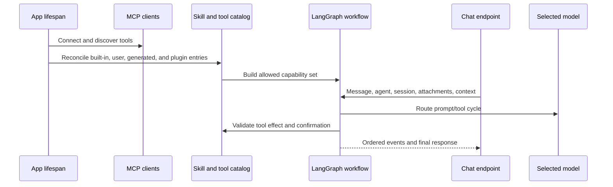

# Agentes de IA, modelos, herramientas y habilidades

## Modelo de capacidad

Gnosi separa modelos, agentes, habilidades y herramientas:

- Modelo: una ruta del proveedor con capacidades, límites, metadatos de costo, fiabilidad,
y credenciales.
- Agente: instrucciones, selección de modelos, política de memoria/punto de verificación y asignación
habilidades.
- Habilidad: un paquete de capacidades documentado que aporta instrucciones y
limita las herramientas compatibles.
- Herramienta: operación callable clasificada por efecto y origen.
- Fuente contextual: Vault, tabla, archivo o material externo seleccionado por el usuario añadido
a una conversación con contención explícita y comportamiento de tamaño.

## Flujo de inicio y solicitud

Las importaciones históricas de Agent siguen disponibles mediante fachadas de
compatibilidad estrechas, mientras que el paquete de dominio gestiona el
contexto, las herramientas propias, la evidencia y las citas, el estado del
flujo, las confirmaciones, las sesiones y las rutas. El catálogo y la gobernanza
de agentes siguen el mismo patrón en el dominio de configuración, sin cambiar
el orden de las rutas ni los identificadores de operación.

El router de modelo resuelve combinaciones de proveedores/modelos, límites de contexto, soporte de herramientas, límites de gasto y política de reserva. Las credenciales se obtienen de la migración de entornos de almacenamiento secreto local o soportado, no expuesta a la interfaz. Las razones de fallo se registran por separado de las respuestas orientadas al usuario para que los operadores puedan distinguir el tiempo de espera, el rechazo del proveedor, las credenciales inválidas, el desbordamiento de contexto y la incompatibilidad de la herramienta.

## Gobernanza de los instrumentos

Los descriptores de herramientas declaran efectos leed/write/external/destructive. Las herramientas generadas pasan la validación basada en AST y se ejecutan en un entorno restringido. El validador bloquea capacidades peligrosas como escrituras de archivos sin restricciones, acceso al entorno, traversal de dunder dinámico e importaciones inseguras.

Las acciones que requieren confirmación crean registros pendientes duraderos. La confirmación vincula al usuario, la sesión, la herramienta, los argumentos, el efecto y la caducidad; aceptar una acción rancio o alterado no autoriza una invocación diferente. El mantenimiento expira y elimina los registros independientemente del tráfico de chat.

## Habilidades y complementos

Las habilidades de ejecución incorporadas viven en `pipeline/skills/`. Los paquetes de usuario y plugin se validan en un catálogo mientras se preserva el origen, activación, compatibilidad y campos gestionados contra usuarios. La reconciliación de plugins es idempotente: desactivar un plugin suspende su contribución administrada sin eliminar las sobreposiciones de usuario.

## Contexto y memoria

El estado de conversación está visionado por agente y sesión. El pedido de mensajes de interfaz de usuario utiliza identificadores estables en lugar de solo la hora de llegada. Los adjuntos y fuentes de contexto validan rutas, tamaño, tipo de archivo y ámbito de trabajo/vault.

La navegación del Vault aporta contexto de página, tabla y vista activa solo para
el turno actual. El servidor amplía un dashboard con una única vista incrustada a
la vista canónica de la tabla, reaplica sus filtros y ordenación y expone una
consulta exacta y acotada con recuento y paginación. Las lecturas exactas de
página y tabla son llamadas de herramienta creadas por el servidor; después de
un resultado completo, la síntesis se ejecuta sin herramientas para que un
modelo insistente no repita la llamada hasta el límite de recursión del grafo.

Los demás turnos de solo lectura tienen un presupuesto independiente de tres
resultados: si el modelo continúa solicitando herramientas, la siguiente
invocación de Cerebro recibe las evidencias acumuladas sin herramientas
vinculadas y debe sintetizar la respuesta. Así, el límite de recursión del
grafo sigue siendo una red de seguridad final y no un control normal del flujo.

El chat mide cada respuesta desde el envío de la petición hasta el final del
flujo. Un contador en vivo de segundos enteros se sustituye por el tiempo
transcurrido guardado en la respuesta completada. Cada mensaje visible también
permite rebobinar la conversación: tras confirmarlo, el servidor recorta el
checkpoint canónico del ámbito en el límite completo del turno y devuelve su
proyección pública. El rebobinado solo cambia la memoria de conversación;
nunca se presenta como si hubiera revertido confirmaciones completadas o
efectos externos.

Los registros editables de modelos se hidratan desde el catálogo canónico antes
de llegar a Configuración o al enrutamiento de ejecución. Las actualizaciones
parciales de presupuesto y configuración se fusionan con las capacidades, la
ventana de contexto, el coste y la calidad existentes. Los cambios de proveedor
o modelo invalidan los grafos en memoria para que el soporte de herramientas y
las credenciales surtan efecto en el turno siguiente. La cabecera del chat
muestra el modelo seleccionado, el número exacto de herramientas y motivos
accionables para cualquier degradación.

## Configuración de LLM Wiki

`backend/domains/configuration/llm_wiki.py` valida la tabla Brain, las fuentes,
las dimensiones categóricas, los campos de archivo/URL, los valores fijos y las
relaciones antes de modificar el esquema. Después crea roles y relaciones
canónicos, revalida los campos de índice, guarda atómicamente y actualiza las
páginas del sistema.
`backend/domains/configuration/llm_wiki_schema.py` gestiona por separado la
reparación idempotente de los campos Brain y la consolidación de una relación
canónica por fuente, incluidos alias, metadatos de página y vistas contextuales.
`backend/domains/configuration/llm_wiki_records.py` normaliza las notas
gestionadas existentes, las etiquetas de fuente y los títulos localizados de índices.
La extracción se divide entre `backend/domains/llm_wiki/documents.py`, con los
adaptadores tipados de documentos y multimedia, y `origins.py`, que conserva la
identidad, la deduplicación y los fragmentos deterministas. El servicio histórico
permanece como fachada compacta de compatibilidad.

## Fallo y invariantes de seguridad

- Fallo del proveedor no se dirige silenciosamente a un más caro o menos privado
modelo fuera de la política configurada.
- Una herramienta no disponible para el modelo/skill seleccionado no puede ser invocada por nombre
Solo.
- Los efectos destructivos o externos requieren su política declarada.
- El código generado no puede acceder a secretos ni al estado ilimitado del sistema de archivos.
- Un servidor MCP fallido no elimina servidores saludables del catálogo.
- El resultado parcial del modelo no se presenta como una acción confirmada completa.
- Los mensajes de agente permanecen aislados por agente y sesión a través de las recargas.

## Enfoque de verificación

Ejecute enrutamiento de modelos, eliminación de proveedores, fiabilidad, tiempos de espera, reintento y resiliencia MCP, catálogo de habilidades/tiempo de ejecución/API, validación de herramientas generadas, contención de contexto, carrera de confirmación/expiración, pedidos de chat y flujos de chat del navegador.
