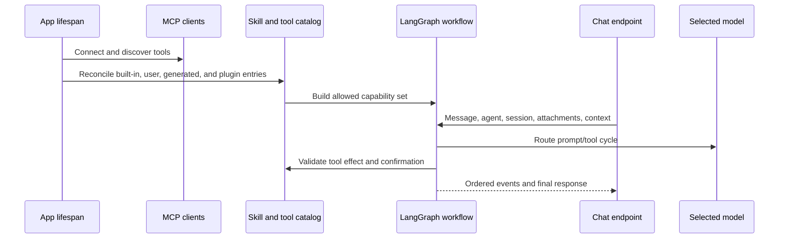

# Agentes de IA, modelos, herramientas y habilidades

## Responsabilidad de la conversación en el frontend

`features/agent` gestiona la composición del chat, las sesiones, las confirmaciones,
las acciones sobre mensajes y la presentación del flujo. Su punto de entrada público
exporta `AgentChat` y el contrato completo de propiedades. La aplicación carga este
punto de entrada dinámicamente; los cuadernos importan el mismo componente dentro
de su módulo de ruta opcional. Ningún consumidor accede a módulos privados del
chat ni fuerza el componente a un tipo más restringido.

Las listas de referencias de contexto se mantienen de solo lectura en toda la
interfaz y se copian únicamente al construir la petición HTTP existente. Así se
preservan los metadatos de origen, el ámbito del cuaderno, las cargas útiles, la
reproducción de eventos del flujo y las claves de persistencia. Los adaptadores
genéricos de HTTP y NDJSON permanecen en `shared/api`; las pruebas que combinan
valoraciones y transporte pertenecen a la funcionalidad del agente, de modo que
el código compartido no dependa de los detalles internos de la interfaz.

## Modelo de capacidades

Gnosi separa modelos, agentes, habilidades y herramientas:

- Modelo: una ruta de proveedor con capacidades, límites, metadatos de coste,
  fiabilidad y credenciales.
- Agente: instrucciones, selección de modelos, política de memoria y puntos de
  control, y habilidades asignadas.
- Habilidad: un paquete de capacidades documentado que aporta instrucciones y
  limita las herramientas compatibles.
- Herramienta: una operación invocable clasificada por efecto y origen.
- Fuente de contexto: Vault, tabla, archivo o material externo seleccionado por
  el usuario que se añade a una conversación con límites explícitos de acceso y
  tamaño.

El conjunto de herramientas de conocimiento del Vault mantiene los objetos
`StructuredTool` de LangChain en el límite de registro y extrae sus funciones
invocables tipadas solo para la composición interna de herramientas. La creación
de páginas se registra a través del responsable canónico del Vault, la búsqueda
del Vault obtiene explícitamente su almacén específico de carga diferida y las
lecturas de rutas y PDF conservan sus restricciones de acceso y los límites
máximos de tamaño definidos por el servidor.

La fuente de datos de Artificial Analysis constituye un límite de comparación
tipado en el servidor. Mantiene privadas las credenciales de la API, valida cada
respuesta paginada, completa solo los metadatos ausentes del catálogo, conserva
las métricas verificadas de la caché y recurre a una caché antigua o a models.dev
indicando explícitamente la procedencia.

## Flujo de inicio y solicitud


```mermaid
sequenceDiagram
    participant Start as App lifespan
    participant MCP as MCP clients
    participant Catalog as Skill and tool catalog
    participant Graph as LangGraph workflow
    participant Chat as Chat endpoint
    participant Model as Selected model
    Start->>MCP: Connect and discover tools
    Start->>Catalog: Reconcile built-in, user, generated, and plugin entries
    Catalog->>Graph: Build allowed capability set
    Chat->>Graph: Message, agent, session, attachments, context
    Graph->>Model: Route prompt/tool cycle
    Graph->>Catalog: Validate tool effect and confirmation
    Graph-->>Chat: Ordered events and final response
```

Las importaciones históricas de Agent siguen disponibles mediante fachadas
acotadas de compatibilidad, mientras que el paquete de dominio gestiona la
correspondencia y el almacenamiento del contexto, el despacho de herramientas
propias, los contratos de evidencias y citas, el estado del flujo, las
confirmaciones, las sesiones y la composición de rutas. Las rutas del catálogo
y la gobernanza de agentes siguen el mismo patrón en el dominio de configuración,
sin cambiar el orden de las rutas ni los identificadores de operación.

El enrutador de modelos resuelve las combinaciones de proveedor y modelo, los
límites de contexto, la compatibilidad con herramientas, los topes de gasto y la
política de alternativas. Las credenciales se obtienen del almacenamiento local
de secretos o de una migración compatible desde variables de entorno, sin
exponerlas al frontend. Los motivos de fallo se registran por separado de las
respuestas al usuario para que los operadores puedan distinguir los tiempos de
espera agotados, el rechazo del proveedor, las credenciales no válidas, el
desbordamiento del contexto y la incompatibilidad de herramientas.

El cliente híbrido heredado sigue disponible para la composición de contenido
social, la redacción de correo y los analizadores antiguos del pipeline mediante
un límite de compatibilidad estrictamente tipado. Restringe los mapas dinámicos
de proveedores YAML, exige una URL concreta del proveedor antes de cualquier
llamada de red, valida las estructuras de respuesta compatibles con OpenAI,
escribe atómicamente su caché basada en el hash de la entrada al modelo bajo el
directorio de datos de cada dispositivo y conserva el comportamiento establecido
de intentar primero la opción principal y después la alternativa, sin exponer
credenciales.

La transcripción local con Whisper expone un protocolo de modelo y una estructura
de resultado tipados; el audio permanece en el dispositivo y la caché del modelo,
descargado bajo demanda, reside bajo `GNOSI_DATA_DIR`, independiente del proveedor.
La importación opcional sin tipar de `faster-whisper` queda confinada a este
adaptador. La conversión de divisas también restringe el JSON remoto y almacenado
en caché antes de calcular presupuestos, conserva las alternativas de tipos reales
antiguos y tipos estáticos, y siempre devuelve un tipo de cambio tipado positivo
en unidades por USD.

El enrutador normaliza los metadatos desconocidos del registro antes de iterarlos,
compara las cuotas de tokens y las ventanas de contexto como enteros y mantiene
su registro de consumo tras límites tipados de ruta, carga y guardado atómicos.
Los topes monetarios distinguen explícitamente entre la ausencia de un tope y un
valor cero. Esto preserva la política existente de proximidad al tope y recurso
a modelos gratuitos, a la vez que permite recuperarse de datos persistidos
malformados usando un registro vacío.

La observabilidad del agente, la reproducción de eventos, los diarios de flujos,
las reservas de turnos, la calidad revisada, la memoria personal y semántica, las
evaluaciones de modelos, la auditoría de capacidades y su estado de funcionamiento
son estado operativo de cada dispositivo. Sus almacenes SQLite/JSON se ubican
directamente mediante `GNOSI_DATA_DIR`; nunca derivan su ubicación de un Vault
ni de un proveedor de nube. Las pruebas inyectan ese mismo mecanismo canónico de
resolución, y las claves de cifrado de los flujos permanecen en el subdirectorio
`secrets` del directorio de datos local.

Los perfiles usan `pinned`: solo el proveedor y modelo configurados. Las opciones antiguas `resilient`, `adaptive` y `decision_engine: jev` ya no seleccionan alternativas para los perfiles. El formulario guarda un único modelo sin alternativas. Las utilidades antiguas siguen cubiertas en `backend/tests/test_agent_model_decisions.py`; la edición de perfiles se prueba en `frontend/src/features/settings/global-settings/AIAgentForm.test.tsx`.

El cliente MCP por stdio valida los objetos en el límite JSON-RPC, tipa
explícitamente las peticiones asíncronas pendientes y enruta las herramientas
mediante una caché que solo se actualiza cuando no encuentra una entrada. Los
catálogos de herramientas malformados fallan localmente sin propagar valores
no validados al entorno de ejecución del agente.

La configuración de IA mantiene las credenciales de proveedores, las marcas de
conexiones eliminadas, el registro de modelos y las rutas de presupuesto y consumo en una
fachada de compatibilidad estrictamente tipada. La generación y corrección del
editor residen en el dominio de configuración de IA, mientras que las cargas
validadas de mapas YAML y los metadatos explícitos de las respuestas heredadas
preservan exactamente los contratos HTTP y OpenAPI existentes.

## Gobernanza de herramientas

Los descriptores de herramientas declaran efectos de lectura, escritura, externos
o destructivos. Las herramientas generadas pasan una validación basada en AST y
se ejecutan en un entorno restringido. El validador bloquea capacidades peligrosas
como escrituras de archivos sin restricciones, acceso al entorno, recorrido
dinámico de atributos con doble guion bajo e importaciones inseguras.

Las acciones que requieren confirmación crean registros pendientes duraderos.
La confirmación vincula al usuario, la sesión, la herramienta, los argumentos,
el efecto y la caducidad; aceptar una acción caducada o alterada no autoriza una
invocación diferente. El mantenimiento hace caducar y elimina los registros
independientemente del tráfico del chat.

Los metadatos versionados de capacidades se restringen a partir de entradas en
forma de modelo o mapa antes de validarse. Los contratos de la versión 2 deniegan
la operación por defecto salvo que las políticas de tiempo de espera, idempotencia,
privacidad, tráfico saliente y resultados duraderos estén completas y sean válidas;
los descriptores heredados de la versión 1 siguen siendo compatibles. La
cancelación cooperativa envuelve cualquier objeto de Python cuya finalización
pueda esperarse de forma asíncrona en un futuro cancelable, de modo que los
adaptadores de proveedores basados en corrutinas
y futuros compartan la misma semántica del token.

## Habilidades y plugins

Las habilidades de ejecución integradas residen en `pipeline/skills/`. Los
paquetes del usuario y de plugins se validan para incorporarlos a un catálogo,
preservando el origen, la activación, la compatibilidad y la distinción entre
campos gestionados y campos del usuario. La reconciliación de plugins es
idempotente: desactivar un plugin suspende su contribución gestionada sin
eliminar las personalizaciones del usuario.

Las traducciones de filas y páginas utilizan la
operación compartida `translation`. Los botones seleccionan el perfil del plugin
de Traducción; las acciones dentro de una conversación heredan el perfil del
agente en ejecución. Este perfil determina el modelo, las políticas y el registro
de actividad. El panel de traducción enlaza a este perfil. Los argumentos
históricos de DeepL y Softcatalà se mantienen por compatibilidad, pero se ignoran;
ya no hay enrutamiento por pares de idiomas ni alternativa con marcadores.

La reconciliación de plugins también puede ejecutarse antes de componer las
rutas de FastAPI. Deriva el directorio `.gnosi` del contexto canónico del Vault
activo y lee el estado mediante `backend/domains/configuration/plugin_state.py`;
nunca importa una ruta del Vault solo para resolver rutas de archivo o
configuración. Antes de que exista el almacén compartido de todo el proceso, el
mismo normalizador y escritor atómico se ejecutan bajo un bloqueo de inicialización;
después de la composición, la reconciliación reutiliza el almacén compartido y
los bloqueos de modificación.

La fachada heredada de memoria Chroma mantiene la carga diferida y el tipado
estricto para preservar la compatibilidad de importación. Importarla crea solo
el directorio de almacenamiento configurado; no carga modelos de representaciones
vectoriales. Cuando faltan estas representaciones, las lecturas devuelven
resultados vacíos y las escrituras fallan explícitamente, mientras que la memoria
personal canónica sujeta a gobernanza permanece en el servicio SQLite con ámbito
delimitado del dominio Agent.

## Contexto y memoria

El estado de la conversación se delimita por agente y sesión. El orden de los
mensajes en la interfaz utiliza identificadores estables, no solo la hora de
llegada. Los adjuntos y las fuentes de contexto validan rutas, tamaño, tipo de
archivo y ámbito del espacio de trabajo o Vault. Las fuentes externas grandes
usan representaciones que permiten búsquedas en lugar de insertar texto en bruto
sin límite en cada turno.

El punto de control duradero sigue siendo el registro de auditoría completo,
pero las entradas enviadas al proveedor utilizan una proyección acotada. Los
mensajes anteriores del usuario y las respuestas finales del asistente permanecen
como memoria de conversación, mientras que se omiten los grupos históricos de
llamadas a herramientas y sus cargas útiles en bruto. El turno actual conserva
los grupos completos del protocolo de llamada y resultado, y la proyección
conversacional agregada tiene un límite estricto de caracteres incluso cuando
el modelo seleccionado anuncia una ventana de contexto mucho mayor.

La memoria personal revisada es un almacén local separado y explícito, delimitado
por Vault y agente. Los usuarios pueden crear, editar, desactivar, hacer caducar
y eliminar hechos o preferencias con historial de revisiones en Configuración.
La recuperación es léxica y se limita a cinco elementos; la entrada al modelo
etiqueta el resultado como datos que no pueden cambiar políticas, herramientas
ni autorizaciones. Los puntos de control de conversación y las asociaciones de
vocabulario mantienen sus ciclos de vida separados.

La navegación del Vault aporta contexto de página, tabla y vista activa limitado
al turno. El servidor amplía un panel con una sola vista incrustada a la vista
canónica de la tabla, reaplica sus filtros y ordenación y expone una consulta
exacta y acotada de filas con recuento y paginación. Las lecturas exactas de páginas
y tablas son llamadas a herramientas construidas por el servidor; tras obtener
un resultado completo, la síntesis se ejecuta sin herramientas vinculadas para
que un modelo propenso a usarlas no repita la llamada hasta alcanzar el límite
de recursión del grafo.

La petición canónica de Recursos de autoría propia también se enruta en el
servidor. Gnosi ejecuta la vista guardada de autoría exactamente una vez y da
formato a su recuento y lista acotada de registros directamente a partir del
resultado sujeto a gobernanza. Esta vía no llama al modelo después de que la
herramienta termine con éxito. Las peticiones que requieren interpretación o
generación continúan mediante la síntesis normal del modelo.

El mismo contrato determinista se aplica ahora a inventarios arbitrarios de
Vaults adjuntos, en lugar de limitarse a temas o tablas individuales. Antes de
seleccionar herramientas, el servidor clasifica la operación como conversación,
consulta, inventario, análisis o acción sujeta a gobernanza. Las peticiones de
inventario reciben un examen estructurado exhaustivo con recuento exacto,
identificadores canónicos de registros, resolución de tipos a partir del registro
vigente, agrupación por tipo, metadatos de procedencia seleccionados y paginación
por desplazamiento. El tema es un dato de la consulta: añadir un tema o una tabla
nueva no añade una rama de intención. La primera página y las siguientes se
formatean directamente a partir del resultado de la herramienta sujeto a
gobernanza, sin llamar al modelo.

El modo de petición también impide que el adjunto predeterminado de Conocimiento
desvíe tareas no relacionadas. El modo de conversación no lee fuentes ni vincula
herramientas pasivas. Las peticiones explícitas de correo, calendario, contactos,
Reader, tiempo meteorológico, web, Notion o Zotero omiten las herramientas
predeterminadas del Vault salvo que esa misma petición también nombre un objeto
del Vault; la habilidad asignada pertinente sigue disponible.

Cada petición lleva ahora al grafo un plan universal de turno efectivo. El plan
combina el modo de operación, los dominios de datos explícitos, los descriptores
vigentes de ejecución, las evidencias requeridas, los permisos sujetos a controles,
la condición local o remota del proveedor, la estrategia de ejecución y la de
respuesta. Es un estado propio de la petición que sobrescribe los datos de los
puntos de control de turnos anteriores. El nodo Brain cruza la selección normal
de ejecución con los nombres de herramientas del plan, de modo que los metadatos
mostrados al usuario describen las herramientas realmente disponibles y no una
clasificación meramente orientativa.

La privacidad también se delimita por petición. El plan distingue el procesamiento
local, las evidencias privadas procesadas por el modelo remoto configurado, las
lecturas externas y la conversación ordinaria. Los datos del Vault adjunto no se
consideran utilizados cuando una petición explícita de correo, Reader, Notion,
web u otro dominio excluye sus herramientas. La interfaz informa solo de esta
situación y del número de fuentes; los cuerpos de las fuentes, las entradas al
modelo, los secretos y el razonamiento oculto nunca se incluyen en los metadatos
de transparencia.

Las respuestas finales del modelo pasan por un verificador determinista. Comprueba
únicamente los resultados de herramientas del turno actual y la política de
efectos, bloquea afirmaciones de que una acción sujeta a gobernanza se completó
sin un resultado satisfactorio de la herramienta, bloquea respuestas dependientes
de fuentes que omitieron evidencias obligatorias, registra los fallos de
herramientas como limitaciones y emite recuentos de evidencias y herramientas.
Las respuestas de inventario usan el mismo verificador aunque su texto lo genere
el servidor. La verificación nunca invoca un segundo modelo.

Las respuestas dependientes de fuentes también incluyen citas de afirmaciones
validadas por el servidor. Los resultados de herramientas definen los únicos
identificadores de fuente válidos para el turno actual. Los inventarios
deterministas vinculan cada línea enumerada con su registro canónico del Vault y
las afirmaciones sobre recuentos agregados, agrupación, paginación y método con
el manifiesto exacto del resultado de la herramienta. La síntesis del modelo puede
emitir marcadores `[[cite:SOURCE_ID]]`; el verificador retira los marcadores válidos
de la prosa visible, rechaza los identificadores ausentes de las evidencias del
turno actual y señala como limitación una fundamentación incompleta. El chat
presenta la correspondencia acotada entre afirmaciones y fuentes con enlaces
seguros a Vault, Reader o HTTP(S), y nunca persiste fragmentos ni rutas del sistema
de archivos como metadatos de citas.
Cada fuente citada también incluye una huella breve de versión derivada de su
revisión, etag, fecha de actualización o manifiesto exacto de herramienta del
turno actual. La interfaz distingue entre versiones exactas y versiones basadas
solo en la identidad, sin exponer cuerpos de fuentes ni secretos de conectores.

La búsqueda del Vault utiliza una clasificación híbrida determinista: términos
léxicos multilingües expandidos, mayor peso de títulos exactos y de roles de índice,
y la puntuación vectorial reconstruible. Los resultados se almacenan brevemente
en caché solo por Brain, consulta y k; la caché es acotada y no conserva entradas
al modelo ni cuerpos de fuentes sin límite. Los fragmentos devueltos se delimitan
como evidencias no confiables y se señalan las instrucciones que parecen intentos
de inyección; las instrucciones de Brain tratan cada fuente, conector, adjunto y
resultado web como datos, no como instrucciones.

Los inventarios exhaustivos reutilizan los índices de documentos analizados y
de enlaces persistidos localmente. Los identificadores de relación se amplían
con los títulos de destino indexados, de modo que un registro vinculado a un
proyecto o fuente coincidente siga siendo localizable sin volver a abrir cada
documento sincronizado en la nube. Las escrituras normales de Gnosi actualizan
estos índices; el mantenimiento periódico de índices reconcilia las ediciones
externas. Los registros ausentes de la caché recurren a una lectura directa
acotada. La búsqueda semántica de los k mejores resultados sigue siendo la vía
de descubrimiento de evidencias para consultas y análisis, y nunca se presenta
como un inventario completo.

Las cargas útiles de inventario también informan de la antigüedad de construcción
del índice de enlaces, la cobertura de caché, las lecturas directas alternativas
y el estado de uso de datos antiguos mientras se revalidan. Un índice antiguo o
ausente solicita una reconciliación en segundo plano sujeta a controles sin
retrasar la respuesta; el mensaje conserva la limitación en lugar de dar a
entender que el índice acaba de reconstruirse.

El análisis de una colección completa de Reader se admite como operación en
segundo plano mediante la fachada de trabajos de capacidades independiente del
proveedor. El servidor crea la llamada a la herramienta de trabajos de forma
determinista, devuelve un identificador de trabajo con el espacio de nombres
`reader:` y expone en los detalles del mensaje su estado, la disponibilidad del
resultado, la reanudación tras un fallo o interrupción y la cancelación
cooperativa. La misma fachada puede ampliarse a otros proveedores duraderos
gestionados por el dominio de origen; las peticiones no compatibles permanecen
en primer plano y nunca se presentan como trabajo duradero.

Las herramientas de Reader para el agente exigen un Vault activo concreto antes
de analizar o persistir páginas, exponen cargas útiles de ámbito tipadas y
conservan un decorador identidad solo para entornos mínimos sin LangChain. Las
lecturas y modificaciones de artículos restringen los descriptores ORM heredados
en un único límite y preservan los nombres, efectos y respuestas serializadas
de las herramientas.
Las herramientas de contexto de Reader adjunto aplican la misma protección y
reutilizan un único Vault resuelto para autorizar el acceso al estado y recuperar
resultados, evitando que el contexto cambie entre Vaults durante una llamada a
herramienta. La envoltura de contenido no confiable y los límites de salida no
cambian.
Los proveedores y despachadores de colas registran contratos versionados que
declaran el tipo de trabajo, la idempotencia, la concesión temporal, los
presupuestos de intentos y llamadas al modelo, y el comportamiento de resultados,
reanudación y cancelación. Los tipos de trabajo desconocidos fallan de forma
visible en lugar de entrar en una rama fija del ejecutor.

Los trabajos de Reader persisten una política de recuperación acotada junto a
sus puntos de control. Un tiempo de espera agotado transitorio, un fallo temporal
de red o servicio, o un límite de frecuencia llevan a un estado de espera de
reintento cancelable con demoras exponenciales limitadas. Los intentos y las
llamadas al modelo consumen presupuestos persistidos separados antes de realizar
cualquier llamada nueva. Un temporizador en un hilo de servicio gestiona los
reintentos normales dentro del proceso; la reconciliación de listas y estados de
trabajos inicia un reintento vencido tras reiniciar el backend. Los fallos
permanentes, cancelados, malformados o con presupuesto agotado permanecen en un
estado terminal visible. La reanudación manual utiliza los mismos presupuestos
y, por tanto, no puede eludir el límite del bucle.

Los demás turnos de solo lectura tienen un presupuesto independiente de tres
resultados: si el modelo sigue solicitando herramientas, la siguiente invocación
de Brain recibe las evidencias acumuladas sin herramientas vinculadas y debe
sintetizar la respuesta. Así, el límite de recursión del grafo sigue siendo una
red de seguridad final y no un mecanismo normal de control del flujo.

El plan universal también incluye un presupuesto operativo inmutable para cada
turno: el tiempo máximo de espera HTTP y los máximos de llamadas al modelo,
llamadas a herramientas y resultados de lectura. Los turnos de conversación
reciben un presupuesto breve sin herramientas; los de consulta e inventario,
presupuestos de lectura acotados; y los análisis y acciones sujetas a gobernanza,
un presupuesto mayor pero finito. El grafo aplica estos valores antes de la
siguiente invocación al proveedor o a una herramienta, y el flujo expone los
mismos valores y si se alcanzó algún límite. Un presupuesto de cero herramientas
es una declaración de modo, no una forma de eludir autorizaciones: las lecturas
de contexto obligatorias construidas por el servidor siguen su vía explícita.
Las herramientas dinámicas de contexto no se seleccionan para una pregunta
general salvo que el usuario haya aportado realmente una fuente de contexto.

Las automatizaciones de capacidades persisten el ámbito, la revisión, la
programación y los presupuestos por ejecución en su propia base de datos SQLite
con migraciones, bajo el directorio canónico de datos local. La reserva de una
ejecución es transaccional, rechaza trabajos superpuestos o que excedan el
presupuesto, recupera concesiones temporales caducadas y registra el estado
terminal incluso si falla la ejecución del agente. La falta de configuración de
datos o un fallo en el ciclo de escritura y lectura de persistencia abortan
explícitamente, en lugar de anunciar una automatización que no se ha almacenado.

ToolNode conserva el entorno completo de las habilidades activas para la ejecución
y las comprobaciones de políticas, mientras que cada invocación del modelo vincula
solo herramientas pasivas de lectura y herramientas sujetas a controles que la
petición actual autoriza explícitamente. Los perfiles automáticos heredados también
limitan las lecturas pasivas a las coincidencias multilingües del dominio de la
petición y a una operación exacta de contexto requerida, con un máximo acotado;
las habilidades con ámbito explícito conservan su conjunto ya reducido de lecturas
asignadas. Las lecturas obligatorias de contexto vinculan solo la herramienta de
origen requerida para su primer paso. Esta vinculación por turno deriva del estado
de la petición y nunca se reutiliza como autorización almacenada en caché.

El chat mide cada respuesta desde el envío de la petición hasta la finalización
del flujo. Un contador en vivo de segundos enteros se sustituye por el tiempo
transcurrido guardado en la respuesta completada. El flujo también informa de las
duraciones de preparación del servidor, enrutamiento, herramientas, modelo,
tiempo residual y total, junto con los recuentos de llamadas al modelo y a
herramientas y de tokens; los detalles del mensaje conservan este desglose
diagnóstico acotado. Cada mensaje visible también permite rebobinar la
conversación: tras confirmarlo, el servidor recorta el punto de control canónico
del ámbito en el límite de un turno completo y devuelve su proyección pública.
El rebobinado cambia solo la memoria de conversación; nunca se presenta como
si hubiera revertido confirmaciones completadas o efectos externos.

Durante la ejecución, el flujo emite un marcador acotado de fase de enrutamiento,
generación por el modelo o ejecución de herramientas. El chat muestra la fase activa
junto al contador de segundos transcurridos y la restablece al terminar el turno.
Los códigos estables de fallos transitorios (`agent_loop_exhausted` y variantes
de tiempo de espera agotado, servicio no disponible y límite de frecuencia)
incluyen metadatos orientativos de recuperación. El cliente ofrece un único
reintento deliberado de la petición original tras la revisión del usuario; el
servidor nunca vuelve a ejecutar automáticamente un turno fallido porque puede
haberse preparado ya una acción sujeta a gobernanza. En cambio, los errores
permanentes de configuración o autorización invitan a editar la petición o la
configuración de ejecución.

El flujo posee un token opaco de cancelación. La acción explícita Cancelar llama
a un punto de acceso autenticado y limitado a ese flujo, y llega al puente de
cancelación asíncrona del proveedor. Una desconexión accidental del navegador o
proxy no cancela el turno acotado ya aceptado: un productor independiente continúa
y sus eventos siguen disponibles para reanudar el flujo. Los flujos de trabajo
almacenados en caché no capturan eventos específicos de una petición, y los tokens
se liberan cuando termina el productor. Los fallos del proveedor utilizan un
cortacircuitos acotado, local al proceso y con clave de proveedor y modelo,
mientras que los errores de autenticación y política siguen siendo terminales.
Además, los descriptores de herramientas exponen un estado de funcionamiento de
bajo coste de consulta —operativa, no disponible o en cuarentena temporal— para
que los identificadores, nombres o manejadores ausentes y los adaptadores que
fallan repetidamente no se anuncien como capacidades ejecutables. Dos fallos
dentro de la ventana acotada de supervisión ponen una herramienta brevemente en
cuarentena; una llamada posterior satisfactoria borra el registro de fallos
consecutivos.

El transporte delimitado por saltos de línea se encapsula en la versión 1 del
protocolo. Cada evento lleva un identificador opaco de flujo, un identificador de
evento, una secuencia monótona, un identificador de traza y, opcionalmente, uno de
turno. Una operación pendiente del proveedor sigue activa mientras se emite una
señal periódica de actividad, de modo que el mantenimiento de la conexión de
transporte no cancele a un proveedor lento pero operativo. El cliente ignora los
números de secuencia duplicados. Los eventos se cifran en un diario local vinculado
al ámbito durante un máximo de una hora, y el navegador reanuda desde su última
secuencia durante todo el tiempo máximo del turno. La reproducción de eventos no
repite ninguna llamada al modelo o a herramientas ni ninguna acción sujeta a
gobernanza; solo vuelve a aplicar la estructura original de cada evento.

Las entradas largas al modelo conservan el punto de control completo como registro
de auditoría, pero añaden a la proyección del proveedor un resumen determinista
acotado de los turnos humanos y del asistente que se han omitido. El resumen
contiene solo fragmentos breves y hashes opacos; nunca arrastra cargas útiles
en bruto de herramientas ni cuerpos de fuentes sin límite.

Cada turno transmitido recibe un `trace_id` opaco que se propaga por la
planificación, la selección de modelos, el estado de funcionamiento de la
ejecución, los mensajes, los errores, las métricas y los eventos de finalización.
Esto proporciona a los registros distribuidos y a la interfaz una única clave de
correlación sin persistir entradas al modelo, credenciales ni texto de fuentes.
La disponibilidad de MCP se almacena brevemente en caché por servidor, y el
comprobante de ejecución incluye instantáneas de proveedores y conectores.

La recuperación de Brain combina la puntuación vectorial reconstruible con
expansión léxica multilingüe que normaliza los acentos, mayor peso de títulos e
índices, caché acotada y evidencias con marcas de posibles inyecciones. Las pruebas
HTTP reales de tablas y papelera son opcionales y se ejecutan en CI contra un
Vault desechable y un puerto separado; la batería hermética siempre apunta a un
puerto cerrado para no modificar accidentalmente el backend nativo de un
desarrollador.

Las filas editables del registro de modelos se completan desde el catálogo
canónico antes de llegar a Configuración o al enrutamiento de ejecución. Las
actualizaciones parciales de presupuesto y configuración se fusionan con los
metadatos existentes de capacidades, ventana de contexto, coste y calidad. Los
cambios de proveedor o modelo invalidan los grafos en caché para que la
compatibilidad con herramientas y las credenciales surtan efecto en el siguiente
turno. La cabecera del chat muestra el modelo seleccionado, el número exacto de
herramientas y motivos que permiten actuar ante cualquier degradación del entorno
de ejecución.

Los detalles del mensaje ofrecen una explicación operativa acotada: modo, ruta,
ejecución en primer o segundo plano, herramientas realmente utilizadas, número de
evidencias, situación de privacidad, estado del verificador, vigencia del índice,
estado del trabajo duradero cuando exista y tiempos. Se trata de un comprobante
de ejecución, no de una cadena de razonamiento.

El mismo comprobante incluye una interpretación semántica depurada de información
sensible —operación, confianza, conceptos y estrategia de recuperación—, la
decisión del intermediario de capacidades —recuentos de herramientas candidatas
y sujetas a controles— y el ámbito del punto de control. Los resúmenes de consultas,
los cuerpos de fuentes, las cargas útiles históricas de herramientas, las entradas
al modelo y el razonamiento oculto se excluyen de los metadatos del cliente.

Las métricas del turno incluyen una estimación en USD basada en el catálogo del
proveedor junto con recuentos de tokens y latencia. El registro persistente de
gastos sigue siendo la fuente de verdad; la estimación es un metadato de
visualización acotado y nunca se utiliza por sí sola como autorización. La batería
de evaluación determinista también comprueba que cada plan respete el límite de
latencia de 120 segundos.

El corpus determinista de `backend/agent/evals/` cubre todos los modos de petición,
los cuatro idiomas de la interfaz, los límites de acceso por dominio, el
procesamiento privado local y remoto, las acciones sujetas a gobernanza y la
admisión de trabajos duraderos de Reader. Se ejecuta antes de la batería de pruebas
del backend en las solicitudes de incorporación pertinentes y todos los días;
cualquier caso fallido termina con un código distinto de cero sin llamar a
proveedores ni gastar tokens.

Los errores de producción y las valoraciones positivas o negativas de las
respuestas del asistente alimentan un ciclo local y autenticado de mejora de
calidad. `POST /api/chat/feedback` acepta solo metadatos operativos acotados y
rechaza explícitamente el contenido de las respuestas. El servidor registra los
errores del flujo con códigos estables. El almacén SQLite local conserva las
identidades de turno, sesión y agente transformadas en hashes, los campos del
plan y del verificador, los nombres de herramientas y los intervalos de tiempo;
no tiene columnas para entradas al modelo, respuestas, fuentes, títulos, rutas,
URL, fragmentos, adjuntos ni cargas útiles en bruto de herramientas. Las
valoraciones negativas y los errores crean o actualizan de forma determinista
candidatos de evaluación sintéticos sin duplicados. Los administradores enumeran,
aceptan, rechazan, reabren y ejecutan estos candidatos mediante
`/api/ai/evals/candidates*`. Los casos locales aceptados permanecen separados del
corpus versionado de CI hasta que un mantenedor los incorpore deliberadamente.

Los administradores también pueden ejecutar una evaluación explícita, con coste,
del modelo real principal asignado a un agente. Utiliza tres entradas sintéticas
multilingües y de esquema, y almacena solo la identidad de la ruta, la puntuación,
la latencia, los recuentos de tokens y los códigos estables de fallo. Las entradas
al modelo y las respuestas nunca se persisten. Las puntuaciones revisadas pueden
influir en el orden de `adaptive`, pero no pueden añadir un modelo permitido ni
una capacidad.

## Calidad adaptativa y descubrimiento de capacidades

El estado de funcionamiento de las herramientas sobrevive a los reinicios del
backend en un almacén SQLite local acotado. Cada capacidad conserva contadores de
éxitos y fallos, una ventana de fallos consecutivos, un estado de cuarentena
temporal y la latencia agregada de invocaciones. La construcción del catálogo de
ejecución lee estas filas en una única instantánea de caché de corta duración,
en lugar de abrir la base de datos por cada herramienta. Una invocación posterior
satisfactoria retira la cuarentena, pero conserva totales acotados del servicio
para el diagnóstico.

La recuperación de inventarios del Vault combina frases exactas, tokens léxicos
normalizados, similitud conservadora de caracteres, metadatos, texto de cuerpos
en caché y relaciones canónicas, manteniendo un examen exhaustivo del ámbito
autorizado. Los usuarios pueden añadir o eliminar asociaciones de vocabulario
revisadas mediante `/api/ai/semantic-associations`. El almacén local transforma
en hash el ámbito del Vault y contiene solo pares de términos acotados y una
identidad del autor transformada en hash; nunca almacena entradas al modelo,
respuestas, cuerpos de fuentes, rutas, credenciales ni texto ejecutable.

El verificador determinista final publica ahora una puntuación de calidad de
respuesta basada en la salida visible, las evidencias requeridas, el éxito de las
herramientas, las afirmaciones fundamentadas de finalización, las citas, la
paginación de inventarios y el tratamiento de contradicciones. Los hechos
estructurados con el mismo registro y campo, pero valores incompatibles en el
turno actual, producen un comprobante de conflicto acotado que contiene nombres
de procedencia, pero no los valores privados. La respuesta visible recibe una
advertencia localizada en lugar de fusionar silenciosamente los hechos. Un corpus
de respuestas que no utiliza proveedores complementa al corpus de enrutamiento
y comprueba estos contratos de respuesta final en CI.

Las evidencias de herramientas y adjuntos se examinan en busca de marcadores de
sustitución de instrucciones, suplantación de autoridad, coacción para usar
herramientas y exfiltración de secretos. Solo categorías acotadas de contaminación
llegan a los metadatos de respuesta; el texto de las fuentes sigue siendo un dato
no confiable y el comprobante siempre registra que la autorización no ha cambiado.
El corpus de respuestas adversariales comprueba este límite.

Cada plan expone un umbral flexible de síntesis anterior al tiempo máximo estricto
del turno. Cuando se alcanza el margen reservado y las evidencias requeridas están
disponibles, Brain retira las herramientas vinculadas y sintetiza el resultado
mejor fundamentado; el flujo emite una fase de plazo límite para que el cliente
pueda mostrar esa transición. Si todavía faltan evidencias requeridas, el requisito
de evidencias sigue prevaleciendo y no se produce una respuesta sin fundamento.

El descubrimiento de capacidades forma parte del plan de turno que se aplica
efectivamente. Para cada dominio explícito informa de una capacidad utilizable,
una capacidad asignada pero sujeta a controles, o una conexión o habilidad
ausente. El descubrimiento no puede instalar programas, conceder permisos ni
autorizar una acción sujeta a controles. Configuración → IA → Calidad muestra,
solo mediante metadatos, recuentos de turnos, intervalos de latencia, resultados
de verificación, errores, candidatos de evaluación, estado persistente de
funcionamiento de capacidades y el editor reversible de vocabulario a través de
`/api/ai/quality/dashboard`.

Los contratos de capacidades pueden optar por la versión 2 del esquema mediante
los metadatos del descriptor. La versión 2 deniega la operación por defecto salvo
que el tiempo de espera, la idempotencia, la privacidad, el tráfico saliente y
el comportamiento de resultados duraderos sean válidos. Las herramientas y
habilidades heredadas de la versión 1 siguen visibles como heredadas o parciales
en Configuración durante su migración; los metadatos de conformidad nunca hacen
que un manejador sea ejecutable.

## Configuración de LLM Wiki

Conocimiento utiliza su perfil de plugin. El parámetro histórico `agent_id` se conserva pero no sustituye el perfil del plugin. El antiguo perfil gestionado `llm-wiki` sigue retirado; el perfil nuevo conserva las instrucciones complementarias de Conocimiento migradas. La configuración enlaza al perfil del plugin y sus habilidades.

El menú secundario Herramientas del Cerebro está en la cabecera de su tabla,
incluidas las tablas dentro de páginas. Ofrece la revisión determinista con
el resumen en la misma vista y propuestas de conexión con IA que actualizan
y abren la bandeja existente. El mantenimiento ya no aparece en los ajustes.

`backend/domains/configuration/llm_wiki.py` valida la tabla Brain, las tablas de
origen, las dimensiones categóricas, los campos de archivo o URL, los valores
fijos y los destinos de relaciones antes de modificar el esquema. Después crea
los roles canónicos y las relaciones de origen, revalida los campos aptos para
índice, persiste atómicamente y actualiza las páginas del sistema mediante
puertos de fachada de resolución tardía.
La fachada de configuración por Vault restringe los mapas de propiedades, fuentes
y dimensiones a objetos tipados, conservando deliberadamente las funciones
invocables de resolución tardía de rutas y tablas de referencia de `vault_routes`;
así, las pruebas con Vaults desechables y las integraciones existentes pueden
sustituir esos puntos históricos de conexión sin duplicar su estado mutable.
Su límite HTTP restringe una sola vez el enrutador heredado de resolución tardía
a `APIRouter`, de modo que los puntos de acceso de designación de Brain y
configuración de LLM Wiki mantengan un tipado estricto sin alterar permisos,
esquemas de cargas útiles, orden de rutas ni salida OpenAPI.
El adaptador de rutas importa directamente los servicios canónicos de
configuración, esquema y registros, evitando consultas a fachadas parcialmente
inicializadas durante el arranque independiente de Agent. Las operaciones de
Vault sustituibles en ejecución siguen siendo puertos explícitos, incluido el
puerto tipado `VaultActionsPort` que utilizan las acciones de procesamiento de Brain.
El límite de procesamiento utiliza el mismo enrutador tipado para la ingesta
duradera, la consulta periódica de estado, las evidencias, el mantenimiento, el
diagnóstico de coherencia, la revisión de sugerencias, el dictado y el aprendizaje del
glosario; los servicios de resolución tardía y los errores HTTP recuperables no
cambian.
La planificación de Brain reintenta los fallos transitorios del proveedor,
incluido HTTP 429, con un máximo de cinco intentos por fragmento, 120 segundos de
espera acumulada y un límite total de 360 segundos por llamada. Cada petición
recibe el tiempo límite restante (como máximo 240 segundos). La espera
exponencial incorpora una variación aleatoria y respeta `Retry-After` en segundos,
las fechas HTTP y `retry-after-ms`; si el período de espera supera el límite
disponible, el intento se detiene en lugar de reintentar antes de tiempo. No se
reintentan los errores de autenticación, de validación ni las cuotas de
facturación explícitamente agotadas, y no se cambia de proveedor automáticamente.
Los errores de conexión y tiempo de espera se reconocen por sus tipos del SDK,
incluidos los envoltorios de LangChain para proveedores compatibles con OpenAI
que usan `httpx2`. Cada reintento reserva su coste dentro del presupuesto de
lectura existente; los cargos anteriores desconocidos siguen reservados. Los
tiempos de espera del SDK usan el mensaje traducido del proveedor que no responde.
El trabajo duradero expone `phase: retrying` durante las esperas. El diálogo de
procesamiento sigue consultando el estado, explica los límites de peticiones y
ofrece un nuevo intento cuando el trabajo se detiene.
Los planes de fragmentos completados se guardan como puntos de recuperación con
el hash exacto del prompt y el fragmento de origen. Un nuevo intento no forzado de
un trabajo con error o parcial reutiliza solo los planes coincidentes, los copia
al nuevo trabajo y continúa con los fragmentos pendientes. Los cambios en la
evidencia de origen o las entradas de planificación invalidan los fragmentos
guardados; el procesamiento forzado explícitamente ignora todos los puntos de
recuperación anteriores. Los trabajos interrumpidos conservan su progreso real y
las notas de origen solo se escriben cuando se completa la planificación.
Cada llamada de ingesta selecciona explícitamente el `agent_id` configurado. Una respuesta del proveedor con `x-ratelimit-limit-req-minute: 0`
detiene los reintentos automáticos, porque esperar no puede reponer un límite de
cero peticiones; la capacidad restante nula con un límite positivo sigue
recibiendo los reintentos habituales. Tras reiniciar el servidor, la consulta de
estado lee el trabajo guardado por su identificador exacto y comprueba la tabla
de origen cuando se indica. Los trabajos en ejecución interrumpidos pasan a
`phase: partial` y conservan el recuento de fragmentos completados. El diálogo
permite una sola petición de estado a la vez, ignora respuestas canceladas y
muestra el progreso por fragmentos; `phase: idle` para un trabajo seguido
detiene las consultas con un error recuperable.

La carga de configuración permite hasta 45 segundos para una respuesta local
lenta. Las respuestas HTTP fallidas se rechazan antes de entrar en la caché
compartida de configuración, de modo que un reintento puede llegar al servidor
recuperado. Los errores del servidor sin detalle utilizan el mensaje traducido
de configuración con un botón de reintento separado. Cargar estos ajustes no
requiere un proveedor de modelos disponible.

`backend/domains/configuration/llm_wiki_schema.py` gestiona por separado la
reparación idempotente de campos de Brain y la consolidación de una relación
canónica de origen, incluidos los alias heredados, los metadatos de páginas y las
vistas contextuales incrustadas.
`backend/domains/configuration/llm_wiki_records.py` normaliza las notas gestionadas
existentes, las etiquetas de origen y los títulos localizados de índices de
recursos, sin gestionar rutas HTTP.
La extracción de fuentes se divide entre `backend/domains/llm_wiki/documents.py`,
para adaptadores tipados de documentos y multimedia, y `origins.py`, para la
identidad determinista de evidencias, la deduplicación y la división en fragmentos.
El servicio histórico sigue siendo una fachada compacta de compatibilidad para
que los contratos de cuadernos y plugins conserven sus símbolos actuales.
Las entradas de los extractores incluyen ahora mapas explícitos de metadatos y
configuración, y atraviesan los auxiliares heredados de adjuntos y datos locales
como valores concretos de `Path`. La importación opcional de `yt-dlp` es el único
adaptador de terceros sin tipar, confinado a un punto; las comprobaciones de URL
públicas, las huellas, el orden de fuentes y la procedencia permanecen estables.
El procesamiento se divide además en `planning.py`, para entradas al modelo,
análisis y planes fundamentados; `dimensions.py`, para la correspondencia de
campos fijos, de origen o por IA; `ingestion.py`, para el flujo bloqueante; y
`writing.py`, para la persistencia idempotente. `index_rendering.py` se encarga de
las páginas gestionadas de recursos, dimensiones y generales, mientras que `search_index.py`
gestiona los índices reconstruibles JSON, FTS5 y vectoriales.
`backend/services/llm_wiki.py` y `backend/services/llm_wiki_indices.py` siguen
siendo fachadas de compatibilidad de resolución tardía, de modo que las
importaciones existentes y los puntos de sustitución dinámica de pruebas o plugins
continúen resolviéndose en el momento de la llamada.
`backend/domains/llm_wiki/legacy_ports.py` restringe los colaboradores de rutas,
tablas, análisis de páginas y persistencia sin introducir importaciones inmediatas
de rutas HTTP. El escritor JSON sigue expuesto por la fachada porque es un punto
histórico sustituible; las vías de reconstrucción y de inserción o actualización
incremental conservan su comportamiento de invalidación de caché.
El mismo puerto de rutas de resolución tardía gestiona la resolución del Vault,
de `.gnosi` y de los datos locales para el glosario personal de dictado, la cola de
conexiones y los trabajos duraderos de Brain, las instantáneas, los manifiestos
y los archivos auxiliares sincronizados de páginas. Los exámenes de colas y el
diagnóstico de coherencia utilizan el puerto de páginas de tabla de resolución tardía,
preservando las sustituciones existentes durante la ejecución.
Ese puerto de entrada sigue devolviendo páginas con tipado dinámico; su contrato
de metadatos sigue siendo una deuda de tipado separada.
La fachada de ingesta utiliza los mismos puertos de resolución tardía para
enumerar páginas de Brain, buscar tablas y actualizar el estado de procesamiento.
Se conserva la sustitución mediante plugins en ejecución, pero las anotaciones
amplias `Any` de estos puertos no demuestran un tipado completo.

El diagnóstico determinista de coherencia de Brain se divide en comprobaciones acotadas
de notas huérfanas, revisiones antiguas, referencias cruzadas ausentes, claves de
procedencia duplicadas, notas gestionadas conservadas, citas de evidencias rotas,
reprocesamiento y desajustes del índice de recursos. La estructura del informe y
los límites de hallazgos permanecen estables y no requieren un proveedor de modelos.

`backend/domains/llm_wiki/lint_contracts.py` define en el punto donde se generan
la proyección normalizada de notas, las ocho categorías de hallazgos, los
recuentos y el informe completo. Son diccionarios ordinarios con tipos estáticos
precisos, no modelos de datos en tiempo de ejecución ni esquemas impuestos a metadatos arbitrarios
almacenados. La ruta HTTP puede añadir totales opcionales de sugerencias; el
diagnóstico puro de coherencia no los emite. El orden de salida, el tratamiento de fechas,
la decodificación de citas y el truncamiento no cambian. El límite heredado de
entrada de páginas y la composición de rutas siguen requiriendo un trabajo de
tipado separado.

Las citas PDF fundamentadas utilizan un límite de persistencia determinista
separado. Resuelve la geometría de las citas con un único documento abierto en
caché por adjunto, inserta o actualiza resaltados gestionados estables en una
sola transacción, conserva las anotaciones manuales y elimina únicamente las
entradas obsoletas gestionadas por Gnosi.

## Invariantes ante fallos y de seguridad

- Un fallo del proveedor no enruta silenciosamente a un modelo más caro o menos
  privado fuera de la política configurada.
- Una herramienta no disponible para el modelo o habilidad seleccionados no
  puede invocarse solo por su nombre.
- Los efectos destructivos o externos requieren la política declarada.
- El código generado no puede acceder a secretos ni al sistema de archivos sin
  restricciones.
- El fallo de un servidor MCP no elimina del catálogo los servidores operativos.
- La salida parcial del modelo no se presenta como una acción confirmada y completada.
- Una salida dependiente de fuentes no puede superar la verificación sin
  evidencias de fuentes del turno actual.
- Los identificadores de citas no pueden resolverse salvo que ese mismo turno
  haya devuelto la fuente exacta.
- Los metadatos de transparencia no pueden contener cuerpos de fuentes, entradas
  al modelo ni cargas útiles en bruto de herramientas.
- La recuperación automática y manual de trabajos no puede superar los
  presupuestos persistidos de intentos o llamadas al modelo.
- La telemetría de calidad no puede aceptar ni conservar el contenido de
  entradas al modelo o respuestas.
- Las evidencias de índices antiguos se etiquetan y se actualizan fuera del
  turno en primer plano.
- Los mensajes de agentes permanecen aislados por agente y sesión entre recargas.
- El enrutamiento adaptativo no puede salir de la lista explícita de modelos
  permitidos del agente seleccionado ni de su límite de confianza local o remoto.
- La contaminación de evidencias y la memoria personal no pueden conceder
  herramientas ni cambiar autorizaciones.

## Enfoque de verificación

Ejecuta las pruebas de enrutamiento de modelos, eliminación de proveedores,
fiabilidad, tiempos de espera, reintentos y resiliencia de MCP, catálogo, ejecución
y API de habilidades, validación de herramientas generadas, límites de acceso al
contexto, condiciones de carrera y caducidad de confirmaciones, orden de mensajes
del chat y flujos del chat en el navegador.

## Entorno universal de ejecución del agente

Gnosi enruta cada turno mediante un contrato acotado e independiente del proveedor.
Antes de seleccionar capacidades, el intérprete semántico normaliza la intención
multilingüe, registra una puntuación de confianza y puede abstenerse cuando una
petición no tiene tema. El resultado se incluye en el plan de turno sin almacenar
la entrada original al modelo.

Las capacidades en segundo plano utilizan la cola duradera SQLite local. Un
trabajo tiene una clave de idempotencia, un presupuesto de intentos, una concesión
temporal y una señal periódica de actividad; una concesión caducada puede
recuperarse tras reiniciar un proceso o cuando hay un segundo ejecutor activo.
El análisis de Reader conserva sus instantáneas JSON y sus puntos de control por
lotes, mientras que la cola es la fuente de verdad para la orquestación.

Cada operación de modelo o herramienta emite un registro de tramo acotado,
correlacionado mediante el `trace_id` del turno. Los nombres de atributos de los
registros tienen una lista de permitidos; quienes los generan no deben colocar
entradas al modelo, fuentes, argumentos ni salidas en bruto del proveedor bajo
esos nombres permitidos. Este filtro no examina textos arbitrarios en busca de
secretos. Las llamadas a herramientas también pasan por validación del tamaño de
argumentos, tiempos de espera de descriptores, límites de salida y la política
existente de roles y confirmación.

La búsqueda de Brain mantiene su caché JSON de compatibilidad y un archivo
auxiliar FTS5. Este archivo reduce los candidatos léxicos antes de la clasificación
híbrida vectorial determinista y expone metadatos de vigencia para el diagnóstico.
Si el archivo auxiliar no está disponible, la caché JSON sigue siendo una
alternativa segura.

Los identificadores explícitos de turno se reservan de forma duradera en el
ámbito del espacio de trabajo, usuario y sesión. Una petición duplicada se
rechaza en lugar de ejecutar dos veces la misma acción o trabajo en segundo plano.
El flujo NDJSON emite eventos `progress` con nodo, fase, tiempo transcurrido y
contadores acotados de llamadas, para que los clientes puedan mostrar el progreso
de forma fluida sin leer entradas internas al modelo.

Los límites de seguridad siguen siendo conservadores: las herramientas generadas
se revalidan al cargarlas, las URL de conectores pueden utilizar la política de
tráfico saliente hacia servidores públicos y las credenciales comunes se ocultan
antes de persistir diagnósticos o mensajes de herramientas. El registro de
herramientas generadas declara su ruta SQLite local solo mediante un límite de
inicialización idempotente; las migraciones y la creación de directorios padre
terminan antes de que cualquier búsqueda, aprobación, rechazo o consulta de
estadísticas pueda abrir la base de datos. Los archivos de origen sincronizados
en la nube permanecen separados de este estado local. La protección de simulación
conserva las firmas de las funciones invocables envueltas, genera identificadores
pendientes resistentes a colisiones y nunca invoca una función de escritura externa
antes de la confirmación. Confirmar y cancelar consumen solo el registro pendiente
al que se dirigen; las operaciones no externas conservan su ejecución normal.

El entorno de ejecución de herramientas generadas también mantiene límites
tipados desde los registros hasta las cachés de carga, los esquemas JSON dinámicos,
los resultados del ciclo de aprendizaje y las funciones de retorno de recursos
del entorno aislado. Las cargas útiles de esquemas no confiables se restringen
antes de crear modelos Pydantic; estas anotaciones documentan el contrato
existente de subprocesos sin debilitar la validación ni trasladar la ejecución al
proceso de la aplicación.
El proveedor del registro de aprobaciones construye directamente instancias
validadas de `ToolDescriptor` y expone una función invocable de carga diferida que
conserva la firma, de modo que la política del catálogo y la carga en ejecución
compartan un único límite de registros tipados. Los manejadores de aprobación y
rechazo también validan sus respuestas de modificación con Pydantic, manteniendo
sin cambios las estructuras históricas de diccionario y OpenAPI.
Las contribuciones de plugins de terceros utilizan el mismo contrato de descriptor
tras restringir los esquemas de manifiestos y resolver el Vault activo mediante
el adaptador de dominio tipado. Sus manejadores siguen siendo funciones invocables
en un entorno aislado de Node con exactamente el subconjunto de permisos declarado;
el tipado no importa el Python de los plugins en FastAPI.
El soporte de herramientas propias de Gnosi también restringe los puertos
restantes de fachadas heredadas para analizar el frontmatter, versionar páginas,
actualizar índices y gestionar revisiones de vistas de tablas. Estos adaptadores
mantienen tipadas las instantáneas de confirmación y las comprobaciones de concurrencia optimista,
sin cambiar sus formatos persistidos.
Las herramientas de administración del Vault consumen esos puertos mediante
firmas explícitas de llamada para registros, filas de tablas, actualización de
metadatos e índices de páginas. El descubrimiento de tablas, las vistas guardadas
de autoría, el filtrado determinista y la reubicación de páginas dentro de los
límites permitidos conservan así su contrato JSON de herramientas existente bajo
un tipado estricto.
Las herramientas de contactos vinculan cada operación a una sesión de gestión
tipada y a un `ContactsService` delimitado por espacio de trabajo. La detección de
duplicados, las actualizaciones acotadas y las fusiones destructivas siguen
cerrando la sesión de forma determinista, mientras que la ausencia del contacto
principal tras una actualización concurrente sigue ahora la vía existente de
resultados de error.
Las herramientas de trabajos independientes del proveedor resuelven un Vault
activo concreto antes de enumerar, estimar, leer, reanudar o cancelar trabajo
duradero. La ausencia de contexto de petición provoca un fallo en este límite del
adaptador, mientras que los identificadores de trabajos con espacio de nombres y
todas las cargas útiles de resultados persistidos permanecen sin cambios.
La construcción de herramientas MCP restringe cada descriptor de terceros y
esquema JSON antes de crear su modelo dinámico de argumentos Pydantic. Los campos
obligatorios y opcionales preservan su semántica anterior de llamada, las entradas
malformadas siguen aisladas y el enrutamiento cualificado por servidor continúa
mediante el cliente MCP existente.
Las herramientas de correo utilizan directamente el contrato de herramientas
LangChain instalado y tipan el límite acotado de serialización de mensajes,
hilos y carpetas exactos. El comportamiento remoto de lectura, marcado con
estrella, respuesta y operaciones por lotes, la restricción por cuenta y los
efectos de confirmación no cambian.
Los demás adaptadores sujetos a gobernanza para traducción, contexto de web
pública, calendario, publicación social, clonación de Notion y planificación de
proyectos utilizan firmas concretas de herramientas y rutas canónicas de dominio.
Las consultas web también hacen explícito el estado de ausencia de respuesta,
que de otro modo sería inalcanzable, tras gestionar un número acotado de
redirecciones; las comprobaciones SSRF, los límites de cargas útiles, la política
de cuentas y los efectos de confirmación no cambian.
Las fuentes de contexto del agente exponen ahora un protocolo tipado de fuentes
consultables para BOE y requieren rutas concretas del Vault activo antes de abrir
el estado de Reader o de planificación. El estado de plugins se lee mediante el
dominio canónico de configuración del Vault, mientras que el pequeño grafo de
compatibilidad LangGraph utiliza un tipo de clave API que contiene secretos sin
cambiar sus respuestas alternativas.
El soporte de ejecución tipa ahora los tokens de contexto de confirmación y exige
el directorio configurado de datos local antes de abrir su base de datos de
auditoría. La memoria y la búsqueda del Vault utilizan sus accesores explícitos a
almacenes de carga diferida, mientras que el JSON del catálogo de modelos, los
identificadores de modelos, la clasificación de fiabilidad y los metadatos de
evaluación se restringen en sus límites de entrada sin alterar las evidencias de
enrutamiento.
Los límites de integración de Notion tipan ahora las respuestas del MCP alojado,
los árboles Markdown, las funciones de retorno de localización de adjuntos y la
configuración de verificación de clones. Una primitiva atómica e idempotente de
eliminación de claves de integración retira las credenciales OAuth caducadas de
forma irrecuperable, en lugar de reintentar repetidamente con un token inutilizable;
los esquemas de clones, los cuerpos de páginas, las vistas y los marcadores de
adjuntos conservan sus formatos.
Las contribuciones centrales de flujos de IA utilizan una especificación interna
tipada para identidad, activación, requisitos de fuentes, herramientas e
instrucciones. Así, la creación de descriptores no puede confundir campos de texto
con secuencias de fuentes o herramientas, mientras que el esquema y el orden del
catálogo publicado permanecen sin cambios.
Los lectores de contexto adjunto preservan ahora directamente los contratos
concretos de cadenas de texto de las envolturas de URL, fuentes externas y
registros internos. Ninguna conversión dinámica de tipos oculta una incompatibilidad
del proveedor en estos límites de contenido no confiable.
Los lectores de caché de inventario conservan los puntos heredados de sustitución
dinámica del Vault mediante un adaptador tipado acotado. Esto preserva la
compatibilidad con plugins y pruebas sin permitir que las funciones invocables
reexportadas dinámicamente se propaguen al dominio del agente.
Los despachadores de páginas y tablas confirmadas aplican la misma regla a los
puntos de modificación del Vault: cada manejador reexportado dinámicamente se
restringe en el lugar de la llamada, mientras que la detección de conflictos, la
notificación de resultados parciales, la reversión y la limpieza en segundo plano
conservan su comportamiento histórico.
El almacenamiento de contexto y el catálogo integrado de LLM Wiki también
restringen localmente sus lectores heredados del Vault. La verificación del ciclo
de vida de plugins vincula un Vault activo concreto, incluso en pruebas aisladas,
antes de resolver la configuración almacenada en el sistema de archivos.
Las herramientas MCP admisibles se materializan como instancias validadas de
`ToolDescriptor` en el límite de contribución, con un origen MCP explícito y un
esquema de entrada normalizado. Las anotaciones de solo lectura y de efectos
destructivos siguen determinando la admisión exactamente igual que antes.
Las evidencias de referencia requieren un Vault activo concreto antes de resolver
o leer rutas, y su punto de conexión a páginas de tabla se restringe localmente.
Las envolturas de evidencias de cuadernos devuelven directamente sus cadenas
tipadas de contenido no confiable en las operaciones de búsqueda, lectura exacta
y análisis completo.
El registro del catálogo integrado mantiene separadas las variables de
descriptores de herramientas y de habilidades, de modo que la validación estática
no pueda arrastrar un tipo de herramienta al bucle posterior de habilidades;
el orden de registro y la revisión resultante del catálogo permanecen estables.

El despachador de ejecución activa ahora la cola duradera al arrancar la aplicación,
de modo que el trabajo de Reader se recupera sin una petición de estado. Las
actualizaciones FTS de Brain son incrementales y llevan una marca explícita de
desactualización. Las herramientas generadas aprobadas se cargan como
intermediarios respaldados por subprocesos con límites de recursos; los esquemas
JSON de descriptores se comprueban antes y después de ejecutar, con compensadores
opcionales revisados para fallos parciales. Un punto de acceso de reproducción
que contiene solo metadatos expone eventos acotados de plan, error, tiempos y
verificación por identificador de traza. Las peticiones ambiguas se detienen en
el intérprete semántico y solicitan el tema ausente en el idioma de la petición
en lugar de adivinar una capacidad.

La verificación utiliza el corpus determinista de turnos universales, las pruebas
específicas de la segunda fase, la batería completa de `backend/tests` y el
control de documentación.

## Contratos de los registros locales de diagnóstico

`agent_observability.py` acepta valores arbitrarios de atributos y un contenedor
mutable de contexto. El `SpanRecord` que produce asocia claves de texto con
primitivas `SpanValue`: cadenas, enteros, números de coma flotante y booleanos.
El contrato no es un esquema rígido de eventos: los atributos permitidos pueden
sobrescribir el estado y la duración. El tipado conserva las conversiones de
valores existentes, el comportamiento de las excepciones y la identidad compartida
de los registros.

El servicio examina las primeras 32 entradas antes de filtrarlas con `SAFE_KEYS`.
Normaliza los espacios en blanco de las cadenas y las limita a 240 caracteres;
los booleanos y valores numéricos conservan su representación existente. Descarta
las claves desconocidas. Filtrar por nombre no equivale a ocultar contenido
sensible: nunca escondas contenido privado bajo una clave permitida de proveedor,
modelo o estado.

El búfer en memoria contiene como máximo 2.000 registros de tramo; una consulta
devuelve como máximo 200 y comparte los diccionarios almacenados. Esto no limita
el tamaño ni la retención del archivo de solo anexado `agent_spans.jsonl`. Un
`OSError` al anexar no bloquea la operación ni descarta el registro en memoria;
las demás excepciones mantienen su propagación normal. Los errores del gestor de
contexto registran la clase de la excepción, no su mensaje.

Las pruebas usan registros desechables, relojes controlados e hilos propios. La
envoltura real de políticas se prueba con un modelo inerte para verificar la
identidad de respuestas y excepciones y la ausencia de contenido sintético de
entradas al modelo o errores en los diagnósticos. Estas comprobaciones no
requieren llamadas a proveedores ni registros reales del usuario.

## Catálogo de recursos y personalización

Los nombres de las herramientas corresponden a operaciones concretas, sin agrupar
operaciones distintas bajo un verbo y dominio genéricos. Las descripciones traducidas
usan el texto original como alternativa. Las instrucciones muestran el contenido
real guardado. Los identificadores técnicos y esquemas se pueden desplegar; la
selección incluye descripciones, origen, efectos, disponibilidad y filtros de búsqueda.

Las habilidades incluidas son inmutables. Personalizar abre un borrador editable
que no escribe hasta Guardar. El servidor verifica la revisión de origen y guarda
la identidad, versión, instrucciones y herramientas originales en `derived_from`.
Las ediciones posteriores conservan esta procedencia y las actualizaciones del
catálogo se comparan sin sobrescribir la versión personal.

Aplicar una habilidad personal a agentes y automatizaciones es una acción explícita.
Las asignaciones usan revisiones recién consultadas y conservan las habilidades
obligatorias. Primero se asigna la habilidad a los agentes y después se actualizan
las automatizaciones seleccionadas; se conservan los cambios completados y se
comunican los errores. Si otra automatización sigue usando el original, se mantiene
asignado. Cancelar el borrador no modifica el catálogo ni las asignaciones.

## Comparativa de modelos y parámetros verificados

La comparativa muestra primero el modelo y la valoración de sus perfiles, seguidos del coste mensual estimado y el fabricante, y después inteligencia, contexto, precios de entrada/salida, modos, parámetros, velocidad, latencia y puntuaciones especializadas. Los títulos compactos conservan unidades y texto completo emergente; los filtros se alinean con sus campos, Modos se cierra al pulsar fuera y los tokens mensuales separan los miles. El pie queda libre de la barra horizontal.

Los parámetros se expresan en miles de millones, distinguiendo totales y activos en modelos MoE. Los filtros admiten estado conocido/no publicado/pendiente y límites de tamaño total. Los modos usan AND explícito por defecto u OR. Los metadatos estáticos revisados siguen disponibles si el servidor no proporciona datos enriquecidos.

`backend/services/model_parameters.py` enriquece las respuestas desde una caché local, sin consultas de red al mostrar la comparativa. La tarea `refresh_model_parameters` aparece una sola vez en el centro de control, activa cada 1440 minutos y condicionada a `ai-platform`. Cada ejecución comprueba como máximo 40 identidades distintas con un presupuesto de 120 segundos comprobado entre modelos; cada consulta tiene un tiempo límite. Un cursor persistente reanuda los lotes siguientes.

Solo se aceptan organizaciones oficiales autorizadas de Hugging Face, identidades inequívocas y campos explícitos de parámetros. Los datos verificados conservan fuente y fecha. Si una fuente falla o no coincide, se preservan los valores anteriores; la ausencia nunca se convierte automáticamente en «No publicados». Los modelos ambiguos o no compatibles quedan pendientes de revisión manual. La sustitución de la caché es atómica. Las pruebas cubren extracción, ambigüedad, conservación de datos, lotes, registro de la tarea, metadatos remotos y filtros.

Las columnas monetarias, el filtro de precio máximo de entrada y el límite mensual utilizan la moneda configurada. Los precios de comparación y el gasto registrado proceden de USD y utilizan el tipo de cambio proporcionado antes de filtrar o comprobar el presupuesto. El filtro de modelos incompletos utiliza el interruptor compartido de la aplicación.

## Cobertura de herramientas de las funcionalidades

La revisión de septiembre de 2026 añade 29 herramientas asignables a habilidades
y agentes. Reutilizan los servicios y las validaciones de la aplicación. Cuatro
habilidades nuevas agrupan cuadernos, búsqueda bibliográfica, galería y actividad;
cinco herramientas amplían planificación. No se asignan automáticamente a agentes.

| Área | Cobertura |
| --- | --- |
| Vault, tablas, etiquetas, comentarios, enlaces y papelera | Herramientas existentes para consultas y cambios con permisos. |
| Correo, contactos y calendarios | Herramientas existentes limitadas a cuentas configuradas, con confirmaciones para cambios externos. |
| Lector y trabajos de análisis | Herramientas existentes para fuentes, extracción, análisis, progreso, cancelación y reanudación. |
| Cuadernos | 10 herramientas para consultar cuadernos y fuentes, buscar y citar una revisión concreta, crear cuadernos privados, añadir Recursos, renombrar y actualizar o cancelar la indexación. El contexto adjunto mantiene su selección de fuentes. |
| Búsqueda bibliográfica y Recursos | 8 herramientas para listar fuentes y búsquedas, iniciar búsquedas acotadas, leer resultados, importar uno con control de duplicados y consultar revisiones sistemáticas. Los registros de Recursos siguen accesibles mediante las herramientas de tablas. |
| Galería | 3 herramientas para listar ubicaciones, buscar por nombre/tipo/etiquetas y editar etiquetas y descripciones. |
| Centro de control | 3 herramientas para consultar automatizaciones propias, resultados y servicios programados en el espacio personal. |
| Planificación | 5 herramientas para listar versiones de referencia, crear/editar calendarios laborales, recursos y asignaciones, y eliminar un elemento con confirmación y control de dependencias. Se conservan las herramientas de calendario, carga, desviaciones, trabajo real y recurrencias. |
| Cerebro, memoria, publicación social, traducción y Notion | Cubiertos por las contribuciones internas y de plugins existentes. |
| Reuniones, documentos y grafo | Los lectores de fuentes internas, páginas/PDF y las operaciones de enlaces cubren la información guardada. La captura en directo, los dispositivos y la disposición visual del grafo permanecen en la interfaz. |

Las herramientas comprueban identidad, espacio, rol y Vault de la conversación.
Las consultas requieren lectura; los cambios, edición y la política de confirmación
correspondiente. Los cuadernos conservan controles de propiedad y revisión. Al
desactivar un plugin, sus herramientas permanecen visibles pero no disponibles,
incluso en habilidades personalizadas.

Las búsquedas académicas exigen fuentes concretas habilitadas y disponibles;
nunca amplían una selección incorrecta a todas las fuentes. El catálogo omite
credenciales y configuración de transporte. La importación y consulta de revisiones
requieren el Vault principal personal porque los servicios existentes resuelven
Recursos allí; otros Vaults se rechazan antes del acceso. Hay que consultar el
progreso de búsquedas e indexaciones para confirmar su finalización.

Los nombres y las descripciones están traducidos a los cuatro idiomas. Credenciales,
concesión de permisos, aprobaciones, instalación de plugins y dispositivos siguen
en la interfaz. Las pruebas usan datos simulados sin búsquedas externas ni proveedores.

## Asistente principal y perfiles opcionales

Los nombres de las habilidades asignadas enlazan a sus fichas desplegadas en el catálogo. Abrir una habilidad conserva el editor del asistente y los valores del formulario sin guardar; volver a la pestaña Asistente recupera el mismo borrador. Seguir el enlace no cambia la asignación de la habilidad. Las asignaciones utilizan los interruptores accesibles compartidos; las habilidades obligatorias siguen bloqueadas y las asignaciones no disponibles se pueden retirar.

Las lecturas simultáneas del catálogo esperan a que termine el registro de las extensiones integradas. Se permiten las lecturas recursivas del mismo hilo para evitar ciclos de importación, pero otros hilos no pueden obtener un catálogo parcial sin las habilidades del Cerebro.

## Aprendizaje de conversaciones y memoria editable

El panel de aprendizaje del chat privado agrupa instrucciones de proyecto, fuentes seleccionadas y referencias de resultados. Las peticiones explícitas como «Recuerda que…» crean recuerdos con origen identificable; las citas y referencias ambiguas no. Los recuerdos están aislados por espacio de conocimiento, asistente y usuario, con ámbitos adicionales de proyecto o habilidad. Configuración → IA → Memoria permite buscar, filtrar, editar, activar, fijar caducidad y eliminar. Las actualizaciones rechazan revisiones antiguas. Eliminar un proyecto desvincula las conversaciones y desactiva sus recuerdos.

La extracción de habilidades utiliza la conversación privada guardada y el modelo configurado del asistente seleccionado. El usuario revisa el procedimiento, los criterios, los ejemplos sintéticos y las plantillas antes de guardarlos en el catálogo existente. La asignación es una acción explícita de administración. La prueba con un segundo caso no ejecuta herramientas: una revisión separada del modelo aporta evidencias para cada criterio y el usuario decide si conserva el ejemplo. No certifica acciones externas ni la veracidad de los resultados.

Los paquetes JSON `gnosi-skill-v1` incluyen instrucciones, dependencias, criterios, ejemplos y recursos de texto. La importación valida el tamaño y los nombres antes de revisarlos; no guarda ni asigna automáticamente. La exportación excluye recuerdos personales e historial de conversación. La ejecución incorpora los criterios y recursos sin ampliar permisos. La migración aditiva `personal_memory_0002` conserva los recuerdos y crea los vínculos privados de proyecto y conversación.

Validación: `backend/tests/test_agent_learning.py` comprueba captura, propiedad, ámbitos, caducidad, revisiones, paquetes y errores de las pruebas. Las pruebas de interfaz comprueban el modo de lectura, la conservación del ámbito, las peticiones de aprendizaje y los avisos sin duplicados.

## Lectura contextual de fuentes

El botón de la fuente y el chat utilizan el mismo trabajo persistente de procesamiento y la skill asignada `plugin.llm-wiki.process-source`. El trabajo fija el perfil seleccionado, el modelo y las instrucciones efectivas. Si falta la skill o el perfil está desactivado, falla explícitamente. La skill dirige la interpretación, la atribución, las peticiones de evidencia y la revisión; la aplicación controla los presupuestos, las citas, el guardado y los índices.

La lectura utiliza fragmentos estructurales con contexto vecino, mapas de sección y un mapa global jerárquico. La extracción y la revisión pueden solicitar pasajes originales distantes. Se justifica el tratamiento de cada fragmento principal y las notas propuestas se revisan con una visión conjunta antes de guardarlas. La cobertura y las citas literales acreditan la procedencia, pero no garantizan la corrección semántica. Los puntos de recuperación solo se reutilizan cuando coinciden la fuente y las entradas de ejecución; los planes antiguos sin revisión se invalidan. El diálogo muestra el progreso y las observaciones de la lectura.

## Idioma de las instrucciones

Las instrucciones se guardan y ejecutan exactamente como las escribe el usuario, en cualquier idioma. El catálogo muestra el texto original. Si hace falta traducirlo, usad una herramienta externa y revisad el texto antes de pegarlo en el editor.

La configuración muestra la última versión personal y sus asignaciones dentro de la misma tarjeta. Restaurar el original requiere confirmación y recupera las instrucciones, herramientas y activación originales antes de guardarlas automáticamente. Validar comprueba la definición y la disponibilidad de las herramientas; no ejecuta la habilidad ni evalúa la calidad del resultado.


## Ejecución del Agente principal

La IA funcional utiliza un ejecutor compartido con perfiles explícitos. Los botones y programaciones de plugins resuelven el perfil del plugin; las conversaciones utilizan el perfil seleccionado. Se mantienen las habilidades, la memoria delimitada, el registro de consumo, la reparación de formato acotada y los puntos de reanudación.

Actividad muestra identificadores de ejecución, cancelación y las reanudaciones compatibles. La migración versionada copia la configuración, retira solo el perfil Brain gestionado, preserva los perfiles personales y traslada las instrucciones de Conocimiento a una habilidad complementaria. Las rutas de Conocimiento y las antiguas comparten implementación y permisos; Notion sigue siendo opcional.


## Perfiles y conversaciones

Crea perfiles en **Perfiles adicionales (avanzado)**. En el chat, abre el selector junto al nombre del asistente y elige el **Perfil de la conversación**. El cambio se aplica a las peticiones siguientes y conserva el historial. Cada conversación recuerda su perfil. **Usar por defecto**, en Configuración, establece el perfil para conversaciones nuevas y acciones de la app; no cambia los chats existentes.

Cada perfil tiene un único LLM. Para usar otro modelo, elige otro perfil o edita su modelo. No hay selección automática ni modelos alternativos en caso de fallo. Si se elimina el perfil o el modelo no está disponible, elige otro perfil desde el chat. Para eliminar el predeterminado, establece otro primero. Desactiva el plugin de IA para desactivar la IA.


La identidad del historial se mantiene en `agent_id` y `session_id`. El campo opcional `profile_id` elige el perfil de ejecución, guardado por el navegador como `profileId` por conversación. Cambiar de perfil conserva los mensajes, adjuntos, recuperación del flujo y retroceso vinculados al mismo historial. Los argumentos de confirmación guardados por el servidor conservan el perfil original. Las conversaciones nuevas usan el predeterminado actual; las habilidades programadas usan el perfil de su plugin. Un perfil ausente o desactivado produce un error explícito.

## Perfiles de los plugins

Cada plugin de IA tiene un perfil editable en la misma lista que los personales, con el nombre del plugin que lo utiliza. Puedes editar el modelo, las instrucciones, las fuentes y las habilidades, y elegirlo explícitamente como principal. Esto no cambia qué perfil utilizan las acciones del plugin. Desactivar el plugin suspende su bot y conserva la configuración. Si falta el modelo o una habilidad necesaria, la acción lo indica sin sustituir el perfil. Las ejecuciones iniciadas mantienen la configuración con la que comenzaron.


## Valoración orientativa — weighted_catalog_v1

Orientación, no certificación: mínimo 60/100 y 60% de datos, con requisitos por rol. Inteligencia, código y capacidad agéntica se comparan con el catálogo actual; contexto y velocidad saturan en 200.000 tokens y 100 tokens/s. Latencia y precio puntúan con 1/(1+x/2). El precio usa una mezcla fija de 4 tokens de entrada por 1 de salida; no es el coste real de una tarea. No se deducen citas, catalán ni fiabilidad a partir del contexto.


Los pesos están en `backend/services/model_role_suitability.py`. Los benchmarks se ordenan en el catálogo sin filtrar, con igualdad para empates y 0,5 para un modelo único; no son probabilidades de calidad. Se requiere inteligencia, capacidad agéntica y herramientas para Directivo; inteligencia y herramientas para Todoterreno; inteligencia y contexto para Documentalista (mínimo 100k); inteligencia para Perito; inteligencia y herramientas o salida estructurada para Administrativo; texto, precio y velocidad para Peón. Los datos ausentes reducen cobertura y los requisitos ausentes impiden recomendar. Las limitaciones explícitas prevalecen sobre la puntuación. El tamaño no se usa como indicador de capacidad. El perfil antiguo queda por compatibilidad. La recarga recalcula también la caché.

La columna Uso muestra solo el perfil seleccionado y su porcentaje; ordenarla compara esa puntuación, con valores desconocidos al final. Coste estimado y Fabricante aparecen después. Sin filtro, ordenar Uso compara la mejor puntuación disponible de cada modelo.

El panel Pruebas de perfiles y estrategias de la comparativa permite elegir agentes habilitados y autorizar cada ejecución con consumo real. Las pruebas por rol usan 2–3 casos sintéticos con validadores deterministas. La comparación aplica los mismos tres casos a Todoterreno, Directivo siempre activo y Directivo con rutas; incluye dos rutas conocidas y la resolución de fuentes contradictorias con dependencias. Compara aciertos, llamadas, intervenciones evitables y coste; los datos ausentes no cuentan como cero. Es un laboratorio aislado que reutiliza la selección económica, sin herramientas de negocio. No certifica completamente el idioma, la recuperación extensa ni el uso real de herramientas.

Cada resultado conserva versión, fecha, modelo, proveedor y comprobaciones por caso dentro del usuario y Vault originales. Las valoraciones con datos suficientes combinan 50% catálogo y 50% prueba sintética; las limitaciones y carencias generales siguen visibles. Refresca la comparativa después de consultar los resultados. La prueba tiene un límite global de 24 llamadas y hasta 512 tokens de salida por llamada; comparar las tres estrategias hace 17 llamadas. Las trazas de estas pruebas guardan solo metadatos. Cancélalas desde Actividad. No cambian los modelos asignados.

Las propuestas de conservación muestran habilidades reutilizables, diferencias de cobertura y modelo respecto a agentes existentes y ejecuciones completadas. No confunden completar una ejecución con verificar todos los criterios particulares. Las instrucciones permanentes parten de una plantilla de habilidades registradas, sin copiar el encargo; el usuario puede revisarlas. Aceptar permite incorporar el nuevo perfil personal al equipo. Una configuración equivalente existente evita una propuesta duplicada. Rechazar impide repetir la misma propuesta.

Implementación: `backend/services/agent_role_evaluations.py` · `backend/services/agent_team_retention.py` · `frontend/src/features/settings/AI/AgentEvaluationLab.tsx`

Para resolver un tamaño desconocido, selecciona **Pendiente de verificar** en la columna Parámetros. **Consulta la fuente oficial** busca una coincidencia de versión exacta en las fichas de los fabricantes compatibles. Si la fuente no responde o no hay coincidencia, el dato sigue pendiente. También puedes registrar los miles de millones totales y activos, o una ausencia de publicación revisada, con una fuente HTTPS y la confirmación explícita de haber comprobado el modelo exacto. Los datos revisados manualmente conservan su procedencia y fecha; no encontrar una cifra no demuestra que no esté publicada. El servidor no visita los enlaces introducidos.

Seleccionar un perfil ordena por adecuación estimada. Los candidatos con datos insuficientes solo aparecen con Incluir incompletos activado; la búsqueda y los demás filtros no activan esta opción. Comparar todos los candidatos activa explícitamente los incompletos y conserva el perfil y el volumen de tokens. No es necesario ejecutar pruebas para elegir un modelo.

Los precios por proveedor son independientes del precio del benchmark. El proveedor seleccionado determina la estimación mensual, las columnas de precio de entrada/salida, el filtro de precio y la ordenación. Con todos los proveedores, cada par diferente de proveedor y tarifa aparece por coste mensual de tokens creciente; los desconocidos van al final. Las rutas de la comparativa en caché se actualizan con el catálogo actual. Las tarifas ausentes y los ceros antiguos no verificados son desconocidos, no gratuitos. El coste local por tokens excluye hardware y energía; las estimaciones excluyen cuotas fijas e impuestos. La velocidad y la adecuación siguen siendo datos generales del modelo.

La coincidencia de modelos conserva la variante plus y no elimina sufijos de tamaño como mini o small para encontrar una ruta de proveedor.

La activación rechaza tarifas desconocidas antes de habilitar el proveedor o guardar el registro; actualizar el catálogo puede resolver los precios ausentes.


El contexto y las capacidades se muestran por proveedor, incluyendo modos de entrada y salida, uso de herramientas y razonamiento. Las declaraciones ausentes quedan desconocidas, también los valores antiguos de contexto por defecto. Los filtros de proveedor, la ordenación de contexto y los filtros combinados de precio, contexto y modos usan datos de la oferta; una misma oferta debe cumplir todas las condiciones. El contexto se ordena por el máximo conocido del proveedor seleccionado, con los desconocidos al final. Los benchmarks y las valoraciones de roles siguen siendo evidencias generales del modelo.

La coincidencia del registro usa rutas exactas de proveedor/modelo, nunca nombres ni fragmentos. El filtro de activación y los alias respetan el proveedor seleccionado. Los filtros Directivo y Polivalente excluyen rutas que declaran no admitir herramientas. La activación conserva cada oferta de proveedor/modelo y verifica la ruta seleccionada. Los cambios de la comparativa se guardan en serie y releen el registro persistente antes de guardar, preservando cambios intermedios de modelos y presupuesto. Recuperar métricas de la caché recalcula las valoraciones de rol con los datos recuperados.

Los guardados de la comparativa incluyen una revisión optimista del registro: un guardado obsoleto recibe HTTP 409 en lugar de sobrescribir cambios de otra ventana. Actualizar evita las cachés de benchmarks y proveedores, conservando la procedencia alternativa si falla. Las variantes que comparten una ruta ejecutable son vistas informativas de una única oferta: la activación y los alias afectan a la oferta compartida, y el formulario explica que no configura el razonamiento ni reproduce las condiciones de las evaluaciones. Sin puntuación significa que no hay puntuación numérica de rol; las limitaciones y puntuaciones bajas tienen etiquetas distintas. La vista compacta muestra el contexto máximo y el precio mínimo de cada columna, como la ordenación. Las cabeceras exponen aria-sort, se anuncia el recuento filtrado y la inspección de parámetros rellena los datos existentes sin indicar un guardado.


## Configuración de asistentes y participación en el equipo

Cada perfil tiene una única ficha siempre visible con su configuración, la elección explícita del principal y la participación en el equipo. El principal coordina; los demás perfiles reciben encargos, piden ayuda, combinan ambas funciones o trabajan solos. Cambiar el principal transfiere el estado del equipo y retira al nuevo principal de las asignaciones de ejecución. No crea agentes ni reactiva una colaboración desactivada.

Las selecciones completas de participación, asignaciones y permisos temporales se guardan automáticamente. Los cambios incompletos permanecen en el formulario, indican qué falta y no sustituyen la última configuración completa. Retirar al último destinatario desactiva la colaboración y los permisos para pedir ayuda. Los interruptores con nombres permiten seleccionar varios modelos, habilidades y destinatarios; las listas vacías explican cómo añadirlos. La coordinación solo se añade al activar el equipo. La edición de perfiles incorpora el estado más reciente del equipo para preservar cambios simultáneos de participación.

El área de lectura de configuración admite el foco del teclado. Las teclas de desplazamiento funcionan desde el texto y los interruptores individuales; los campos editables, selectores y controles compuestos conservan sus interacciones.

## Recomendaciones de modelos y ciclo de vida de los plugins

Cada ficha visible recomienda un papel de modelo según el principal, las operaciones del plugin, las habilidades conocidas y sus copias, las especialidades y las rutas. Gana el papel de mayor exigencia; las tareas desconocidas reciben orientación Todoterreno. Es una recomendación, no una puntuación del modelo ni un cambio de ruta o permisos.

Tras un cambio de plugin se invalidan las cachés de configuración y se avisa al chat y al formulario. Solo se fusionan los campos de ciclo de vida y los perfiles nuevos, preservando las ediciones locales. Los perfiles suspendidos quedan ocultos y no pueden ejecutar tareas; se retiran de los destinatarios y rutas activas. Si se suspende el principal o el último destinatario, se detiene la colaboración. El principal no se reemplaza automáticamente. Se descartan respuestas tardías tras cerrar los ajustes o cambiar de vault.

## Nivel de razonamiento

Los perfiles guardan `reasoning_effort` opcional. El editor consulta las opciones exactas de OpenRouter con `GET /api/ai/model-reasoning`: sin metadatos no ofrece opciones, null explícito admite los niveles de la pasarela y el razonamiento obligatorio excluye `none`. La caché se guarda fuera del vault e incluye una alternativa verificada de Luna para el primer uso sin conexión. El guardado rechaza opciones incompatibles. Las fábricas del modelo predeterminado y del flujo solo propagan el nivel cuando proveedor y modelo coinciden con el perfil. El razonamiento explícito de OpenRouter y el predeterminado de Luna usan Responses sin estado, `store=false`, historial completo y razonamiento cifrado entre llamadas de herramientas. Se conservan los valores predeterminados de los demás modelos.

## Ayuda opcional del equipo

El permiso de colaboración ya no intercepta todos los flujos. Primero se resuelve el modelo del perfil seleccionado, incluido el nivel de razonamiento, y después se ofrece `request_team_help` como llamada de control opcional en chat y operaciones estructuradas. Las herramientas nativas y el transporte JSON validado comparten contrato. El trabajo habitual no añade llamadas de encaminamiento. La delegación debe ser la única llamada y preceder la ejecución de herramientas; la reparación de formato no puede pedir ayuda. El coordinador conserva la entrada del turno actual, la configuración fijada, las confirmaciones, la cancelación y el límite total de llamadas. Los ejecutores no pueden encadenar ayuda ni devolver el encargo al solicitante. El catálogo del plan incluye las especialidades de los miembros. La reparación y la reanudación solo usan el equipo si hay una petición de ayuda o plan guardado; de lo contrario mantienen el asistente original. La migración no activa permisos de equipo.

Los metadatos de razonamiento de solo lectura están en `backend/domains/configuration/ai/model_metadata_routes.py`; el enrutador de configuración de IA los incluye en `/api/ai/model-reasoning`, con el mismo contrato público. Así se respeta el límite de tamaño de los archivos del proyecto.

## Progreso de los recursos en segundo plano

Al cerrar el diálogo de procesamiento queda una tarjeta compacta, no modal, en la esquina inferior derecha. Muestra el título del recurso, la fase, los fragmentos y el progreso disponible, y permite reabrir los detalles sin iniciar otro trabajo. El almacén global de tareas mantiene los inicios pendientes y las consultas de seguimiento sin solapamientos, tanto desde filas de tabla como desde un recurso abierto, aunque se cambie de página. Los resultados completados o interrumpidos permanecen hasta descartarlos; reintentar retoma el trabajo guardado. El seguimiento se reinicia al cambiar de Vault o de cuenta e ignora respuestas antiguas. Este estado de sesión de la interfaz no persiste al recargar la aplicación.

## Formato de las operaciones estructuradas

Las operaciones estructuradas de OpenRouter envían su contrato de salida al proveedor, con modo de esquema estricto para contratos detallados y modo de objeto JSON para objetos genéricos. La selección de ruta exige compatibilidad con los parámetros y conserva las preferencias del proveedor y el razonamiento. Las herramientas nativas opcionales usan contratos de función estrictos; las herramientas JSON alternativas restringen su envoltorio y validan localmente la respuesta extraída. Los demás proveedores mantienen la validación local. La lectura dirigida de fuentes transmite el esquema de acciones, incluido el tipo explícito de la acción.

Que el proveedor acepte la petición no demuestra que cumpla el contrato: las validaciones locales de esquema y contenido siguen siendo obligatorias, con el intento de reparación limitado existente. Se puede recuperar un objeto o una lista JSON completos seguidos únicamente de un delimitador final repetido, sin modificar ningún campo; se rechazan valores adicionales, prosa, cierres incoherentes y contenido incompleto. La comprobación de citas, la cobertura de fuentes y la validación de notas se mantienen. La validez estructural no garantiza exactitud factual ni una redacción idéntica entre ejecuciones.

Si el planificador de un equipo opcional rechaza el contexto antes de llamar al modelo o ejecutar tareas, la operación estructurada puede continuar con el modelo original dentro del mismo plazo y límite de llamadas. Se conservan la petición completa y la respuesta a la solicitud de ayuda; la delegación rechazada queda registrada y no desvía la reanudación hacia la fase fallida del equipo. Los errores de permisos, las cancelaciones y los errores posteriores a la existencia de un plan siguen deteniendo la ejecución. Reanudar el procesamiento interrumpido desde la barra de la página aprovecha el progreso guardado, también después de reiniciar la aplicación, sin forzar una ejecución nueva.

La planificación y replanificación de equipos validan los ejecutores, el orden de las dependencias y la tarea de resultado antes de completar la fase o iniciar las tareas. Los errores de coherencia entran en el proceso habitual de reparación, con un máximo de dos llamadas de planificación dentro del presupuesto total existente. Una segunda respuesta inválida hace fallar la fase sin ejecutar sus tareas. Los planes completados recuperados de la caché también se validan antes de reutilizarlos.

La lectura dirigida restringe los campos de cada acción, incluidas las notas, la cobertura y las citas. Valida las referencias a la fuente, la cobertura completa y las citas exactas antes de aceptar o guardar una acción, para que la reparación limitada conserve juntas las evidencias originales y la respuesta rechazada. La validación previa no modifica el estado de lectura. Cada paso incluye los identificadores exactos de los fragmentos y el número de pasajes principales, y una identidad de paso impide reutilizar una respuesta idéntica entre iteraciones distintas.

Las fases del equipo heredan el tiempo de espera de la operación principal y siguen limitadas por su plazo existente. Una reparación delegada recibe la entrada y los datos originales junto con la respuesta rechazada y el error de validación, para poder comprobar las evidencias al corregir la respuesta.

La validación de lectura comunica conjuntamente los errores independientes de cobertura y citación, identificando la posición de las notas y citas sin reproducir el texto de la fuente. Así, el único intento de reparación permitido puede corregir todas las incoherencias conocidas con la evidencia original, en lugar de descubrir solo el siguiente error después de cada intento. Los planes inválidos no hacen avanzar el estado de lectura.

Las reparaciones de referencias de la lectura dirigida devuelven cambios limitados por un esquema para las notas rechazadas y la cobertura. Se conservan la petición original, la memoria global, las notas afectadas y los pasajes originales de referencia. Solo pueden cambiar los campos de referencia enumerados; los títulos, cuerpos, orden y campos no afectados de las notas se copian intactos del borrador. Las rutas duplicadas, ausentes o no autorizadas se rechazan localmente. El perfil original realiza esta reparación dentro del límite de tres llamadas al modelo del paso de lectura y de su plazo original, sin delegaciones adicionales. La acción reconstruida debe superar el esquema original y la validación completa de evidencias antes de guardarse o entrar en la caché.

Antes de iniciar cualquier delegación, las peticiones de ayuda inválidas o repetidas de una operación estructurada se rechazan conjuntamente. Los registros de llamada quedan resueltos como no ejecutados, y el asistente original puede responder directamente con la petición completa dentro del límite de reparación y del plazo existentes. No se ejecuta ningún encargo al equipo ni ninguna herramienta combinada. Cada paso de lectura también incluye el estado de lectura y de guardado de cada fragmento enumerado, incluso después de reanudar, para que el recuento no oculte qué planes siguen pendientes.

La lectura de fuentes largas conserva el plazo ampliado y limitado durante la selección posterior de acciones, la revisión de planes recuperados y la reanudación, aunque la petición actual sea breve. El tamaño de la fuente determina el tiempo disponible; se mantienen los límites de contexto, el presupuesto finito de reintentos, la cancelación y la validación.

Cada paso de lectura dirigida muestra los indicadores de revisión y el número de notas de los planes guardados, junto con la acción y el fragmento que produjeron el último resultado. Estos hechos de progreso guardados prevalecen sobre afirmaciones contradictorias de la memoria de trabajo del modelo; la memoria permanece intacta e incluye el paso en que se registró cuando está disponible. El indicador de revisión recoge la declaración del lector, no la corrección semántica. Los puntos de reanudación antiguos siguen siendo compatibles. Cada paso permite un máximo de tres llamadas al modelo para que, después de corregir la sintaxis JSON, todavía se puedan reparar una vez solo las referencias, sin ampliar el plazo de la operación ni permitir otra delegación. Si esta reparación falla, puede utilizar la llamada restante con el mismo contrato inmutable de cambios y el mismo plazo; al agotarlos, el paso se detiene sin guardar el plan inválido.

Las reglas de las propiedades de las notas de lectura permanecen en la configuración del plugin Cerebro: copiar un campo del recurso, usar un valor fijo, deducirlo con IA o dejarlo vacío. La skill clasifica cada nota solo entre las etiquetas existentes proporcionadas. Cada campo configurado con IA aparece explícitamente en el esquema de respuesta y debe figurar en cada nota; ambas vías de lectura rechazan omisiones, campos desconocidos, valores inventados y varios valores en un campo de valor único antes de guardar. Una lista explícitamente vacía es válida cuando la evidencia no justifica ninguna categoría. La aplicación resuelve las etiquetas y aplica las reglas de copia y valor fijo. Instalar esta corrección no reclasifica las notas existentes. Los Tags configurados ignoran la lista antigua de etiquetas libres, también cuando la clasificación se abstiene explícitamente o el valor copiado del recurso está vacío.

## Inventarios exactos, pruebas verificables y resultados de error

Los predicados exactos de campos conservan el valor solicitado en `property_filters`; las palabras de la orden no se usan como búsqueda de texto libre. Las relaciones se resuelven dentro de las tablas de destino autorizadas por ID o título exacto único. Los títulos ambiguos, destinos sin acceso e inventarios incompletos no pueden producir un cambio parcial con `bulk_update_rows`. Las asignaciones validan la definición real del campo y las opciones permitidas, conservando el cero numérico y el booleano falso. Esta vía mantiene las comprobaciones habituales de confirmación y permisos.

Las pruebas de aprendizaje conservan el criterio original y su orden. Cada fragmento devuelto debe aparecer en la entrada o salida proporcionadas; se rechazan las comprobaciones malformadas y los fragmentos inventados. Los datos que faltan para la prueba se muestran junto al resultado. Esto acredita la procedencia de los fragmentos y la validez del contrato, pero no demuestra que el juicio del modelo sea correcto.

Los errores traducidos del chat conservan un código estable y `content_language`; los detalles privados de las excepciones no se presentan como respuesta. Un servicio no disponible antes del workflow termina con `has_response=false` y `message_count=0`. La interfaz conserva el idioma y el tiempo límite efectivo del backend. La recuperación es una acción manual explícita, sin reintento automático. Una sola tarea productora mantiene la fuente viva durante todo su ciclo para conservar el contexto de ejecución y la limpieza de cancelación durante los heartbeats.
La configuración muestra una sola personalización vigente por habilidad original, elegida según la modificación más reciente del paquete. La edición guarda en el mismo paquete; crear una segunda personalización de la misma fuente devuelve un conflicto en lugar de duplicarla. Restaurar el original pide confirmación antes de sustituir instrucciones, herramientas y activación; guarda en la misma habilidad personal y conserva las asignaciones.

## Consumo multiproveedor y gasto del mes actual

Configuración → Plugins → IA → Consumo muestra solo el uso de Gnosi con todos los proveedores configurados y selecciona inicialmente los últimos siete días. Los intervalos, agrupaciones y filtros incluyen proveedor, modelo, agente, actividad, origen y perfil de modelo. Gráficos, totales, peticiones paginadas y exportación CSV comparten los filtros. La identidad del modelo incluye proveedor e identificador de modelo; el total de un agente suma sus llamadas entre rutas.

`backend/services/ai_usage_ledger.py` guarda metadatos de peticiones en SQLite sin prompts ni respuestas. `backend/services/ai_usage_transport.py` captura el consumo antes de validar o transformar respuestas en transportes SDK, callbacks y streaming. Cada llamada conserva la ruta real, atribución, tokens, duración, estado y tarifas del momento; los cambios posteriores de configuración no reescriben costes históricos. El coste informado por el proveedor tiene prioridad, incluido el cero explícito; si falta, se estima con la tarifa de la ruta. Las tarifas desconocidas permanecen desconocidas y los modelos locales tienen coste monetario de tokens cero. Los identificadores de llamada evitan duplicados, incluidos intentos fallidos y flujos con consumo parcial.

`backend/services/ai_usage_dashboard.py` ofrece `/api/ai/usage/dashboard`, `/api/ai/usage/requests` y `/api/ai/usage/export` con los permisos de espacio de trabajo existentes. Los importes decimales en USD se convierten a la moneda de Settings con la procedencia del tipo de cambio. El consumo desconocido, parcial y estimado se diferencia del cero y de los errores de carga. Los totales mensuales JSON existentes se copian e importan una vez, conservando proveedor, modelo e importe sin inventar fechas de peticiones ni agentes. Solo aparecen en intervalos que cubren el mes completo; el detalle de peticiones comienza con la activación del registro.

El control de gasto del mes actual utiliza el mismo registro y suma todos los proveedores independientemente de las fechas y filtros del dashboard. Muestra el límite configurado, el importe consumido y el presupuesto restante en la moneda de Settings. Un límite cero o vacío significa sin límite. Los controles de agentes y equipos rechazan nuevas llamadas al alcanzar el límite solo cuando el bloqueo está activado. Con el bloqueo desactivado, los modelos de pago y las peticiones opcionales de selección de modelo siguen siendo admisibles por encima del límite. Las rutas automáticas, adaptativas, resilientes y manuales comparten esta política; un límite cero o ausente no bloquea ningún selector. La disponibilidad, las cuotas de tokens, los límites de contexto y los presupuestos individuales de lectura siguen vigentes. `backend/tests/test_ai_consumption.py` cubre la separación de proveedores, calidad del coste, streaming, idempotencia, migración, moneda y coherencia del mes actual con los filtros; las pruebas de agentes y equipos cubren el bloqueo activado y desactivado.


Los filtros de igualdad entre comillas conservan el título literal del recurso en catalán, español, inglés y francés, incluidos `donde` y `où`. Las asignaciones explícitas como `set estat to "En revisió"` o `définis estat sur "En revisió"` utilizan el inventario completo verificado y requieren confirmación antes de escribir. Las instrucciones negadas o explicativas no autorizan actualizaciones. Estos flujos deterministas no acreditan la idoneidad del modelo.

Una petición explícita de no utilizar herramientas se aplica al turno actual en catalán, español, inglés y francés. Elimina lecturas obligatorias de contexto, herramientas de escritura autorizadas y ayuda del equipo del plan efectivo y de las herramientas del modelo, también en perfiles dirigidos. El material citado no impone esta restricción. Las respuestas del modelo aún necesitan una revisión factual independiente.

Las peticiones para listar las propiedades o los campos de una tabla consultan su esquema autorizado, con tipos, opciones y relaciones, sin buscar registros. También funcionan con tablas vacías.

## Lectura de libros con límites y reparación de referencias

La lectura dirigida limita cada fragmento de trabajo a 4.096 tokens estimados. El presupuesto de entrada incluye la envoltura de la operación, el esquema de salida repetido, los mensajes serializados y las instrucciones de sistema. El límite predeterminado de acciones crece hasta al menos cuatro acciones por fragmento más dieciséis; se conservan los límites explícitos más pequeños. La división mantiene todos los pasajes originales, el contexto vecino, la búsqueda y recuperación entre fragmentos y la memoria global guardada del lector.

Cada `knowledge.process-source.phase` devuelve una acción con el ejecutor fijado. La aplicación valida, ejecuta y guarda esa acción antes de solicitar otra. Esta operación no incorpora la herramienta de ayuda de equipo ni amplía el límite de llamadas para equipos; las otras operaciones conservan la coordinación opcional y todas mantienen la autorización, la validación de evidencias y las trazas centralizadas.

La reparación de referencias vincula cada ruta permitida con el esquema de su campo: identificador de fuente, citas o cobertura. La validación local impone la misma correspondencia cuando se omiten enumeraciones de rutas muy grandes. Los cambios inválidos pueden volver a solicitarse dentro del máximo existente de tres llamadas al modelo y del plazo original, conservando el borrador, las evidencias y las rutas permitidas. Los títulos, cuerpos, orden y campos no afectados de las notas permanecen intactos. Solo una acción que supera el esquema original y toda la validación de evidencias puede aumentar los planes guardados; los puntos de reanudación compatibles conservan los planes completados y la memoria de lectura.

La aplicación entrega automáticamente el siguiente original pendiente, eliminando una llamada al modelo que solo servía para solicitar su lectura. Las acciones explícitas de lectura, búsqueda, recuperación e índice siguen disponibles. Cada petición incluye como máximo ocho entradas cercanas del índice, con su posición y total; la acción de índice recupera otros intervalos. El esquema de acciones no se repite como un segundo contrato de salida dentro de la petición de lectura.

Cada plan guardado incluye una memoria global actualizada y limitada que recoge el argumento acumulado, los matices, las contradicciones y las conexiones entre fragmentos. La memoria y los planes solo avanzan después de validar el esquema y las evidencias. Los puntos de reanudación antiguos con planes guardados y memoria vacía reconstruyen la síntesis a partir de todas las notas guardadas, en grupos limitados, antes de continuar; las notas originales permanecen intactas. La reanudación desde la fila de la tabla envía force=false para trabajos interrumpidos, y una fecha de procesamiento anterior no impide recuperar el punto de reanudación. El reprocesamiento explícito de un trabajo completado sigue utilizando force=true.

Al reanudar, los puntos interrumpidos anteriores del mismo recurso se comparan con la identidad exacta de las fuentes y del ejecutor y se elige el conjunto de planes compatible más avanzado. Un reinicio explícito crea un límite de linaje que las reanudaciones posteriores no pueden cruzar.

La reconstrucción de memoria global antigua utiliza el presupuesto de memoria global (como máximo 8.000 tokens estimados y una octava parte del contexto de entrada), en lugar del presupuesto más corto del resumen de un fragmento. La petición de síntesis y la validación utilizan las mismas unidades de tokens estimados.

Cada operación de lectura dirigida reserva como máximo 16.384 tokens de salida para su único resultado acotado, incluidas las reparaciones de formato y de evidencias. Las demás operaciones mantienen los ajustes del proveedor. Así se evita reservar los 65.536 tokens predeterminados del proveedor por cada fragmento o síntesis de memoria, sin cambiar la identidad del punto de reanudación.

El consumo de OpenRouter conserva el identificador de generación y la estimación original por separado. Cuando el transporte omite el coste facturado, una consulta limitada de metadatos GET en segundo plano obtiene total_cost de la generación y actualiza la misma llamada como reported, sin añadir llamadas ni contadores de tokens. Los importes ausentes, inválidos o no disponibles mantienen su etiqueta de estimado o desconocido; una consulta fallida no inventa coste cero ni interrumpe la operación del modelo. El panel de consumo, el presupuesto y el CSV leen el importe conciliado.

La lectura dirigida admite `plan.memory_updates` con cambios exactos `old`/`new` como alternativa compatible a devolver toda `plan.memory`. Un `old` vacío añade texto; otro anclaje debe coincidir exactamente una vez. La memoria no mencionada se conserva localmente. Los cambios son atómicos: anclajes ausentes o ambiguos, memoria vacía, límites de contexto o citas/cobertura inválidas impiden guardar el plan y avanzar. Cada paso sigue recibiendo la memoria global completa. Las peticiones dejan de repetir descripciones de acciones ya presentes en el esquema. Los checkpoints y planes anteriores conservan su identidad y contenido.


El procesamiento de libros incorpora un límite persistente de 0,50 USD, editable en el diálogo de confirmación. Cada llamada reserva un importe conservador antes de llegar al proveedor: entrada serializada, salida máxima y margen del 10% sobre la tarifa, sin descuentos de caché. Los precios desconocidos o las salidas sin límite bloquean la llamada. Los reintentos internos del SDK se desactivan; las reparaciones y los reintentos gobernados reservan individualmente. Una llamada fallida o con coste solo estimado mantiene la reserva. Los costes reales del transporte o los metadatos de la generación coincidente de OpenRouter la liquidan atómicamente. Una pausa conserva el progreso; reanudar reutiliza el presupuesto y el consumo acumulado. Aumentar explícitamente el límite requiere otra petición de procesamiento. En checkpoints antiguos sin presupuesto, el límite nuevo cubre el trabajo pendiente y excluye el gasto histórico.

Una comprobación previa de solo lectura estima todo el proceso: pasajes originales, instrucciones y esquemas repetidos, memoria global, reconstrucción de memoria antigua, notas, revisión final y margen limitado de reparación. Muestra la ruta elegida, el número exacto de planes compatibles, llamadas previstas y cotas conservadoras de tokens. La estimación no es una factura fija: búsquedas adicionales, notas más largas o cambios de tarifa pueden afectar el consumo. Una petición con el identificador de estimación vuelve a verificar fuente, ejecución, precio, tamaño de lotes y progreso guardado; una estimación caducada no inicia un trabajo de pago.

La entrega automática agrupa hasta cuatro fragmentos existentes, reduciendo llamadas repetidas sin cambiar su identidad. El límite de contexto puede reducir el lote. Cada lote devuelve un plan separado por fragmento y una actualización de memoria global. Se validan identificadores, clasificación, cobertura completa y citas literales antes de guardar ningún plan. La reparación de referencias solo modifica los campos permitidos del plan fallido; los otros planes y todos los cuerpos de las notas quedan intactos. Se mantienen la lectura individual, las búsquedas y la recuperación de planes. La regresión sin coste de 191 fragmentos reanuda 166 planes originales con siete lotes y una acción final, preservando los originales; esto no demuestra la calidad semántica ni la facturación real de un libro.


La comprobación previa también indica los fragmentos guardados incompatibles con la fuente o los ajustes actuales. Los dos diálogos y las peticiones con identificador de estimación bloquean esa reanudación, conservando los checkpoints en vez de pagar silenciosamente otra lectura. Volver a procesar explícitamente sigue siendo una acción distinta de reanudar.


## Pruebas de funciones del bot y evidencia reutilizable

El selector del bot deriva las funciones de las habilidades asignadas y obligatorias, su ascendencia canónica, las operaciones y las rutas explícitas del equipo. Las habilidades personales desconocidas quedan sin clasificar. La vista de decisión lee evidencias guardadas sin llamadas al proveedor; las capacidades y tarifas de la oferta exacta y los umbrales editables del catálogo siguen siendo requisitos. Se priorizan las muestras comprobadas y revisadas, y después el coste. Las puntuaciones del catálogo son referencias generales, no medidas de acierto en la tarea.

Los candidatos inactivos ofrecen Configurar para probar, que abre la configuración de su oferta exacta. Una vez activados, el panel de pruebas se abre automáticamente con los pasos para revisar el límite de gasto y autorizar las llamadas. Los candidatos activos ofrecen Probar modelo. Abrir el panel o activar el modelo no ejecuta las muestras ni lo asigna al bot. La batería predeterminada contiene casos originales para las doce funciones: lotes de correo, extracción de facturas, un ensayo con cambio de tesis y evidencia contradictoria, recuperación, diagnóstico de código, planificación de dependencias, análisis fundamentado, traducción con elementos protegidos, redacción, cambios de calendario, cribado bibliográfico y síntesis de reuniones. Antes de gastar pueden consultarse la fuente, tarea y datos esperados. Son casos representativos redactados para la prueba, sin documentos personales ni ejecución del bot en producción. La batería básica anterior sigue disponible por API. Ninguna batería ejecuta herramientas de negocio ni código arbitrario generado, ni acredita la comprensión de un libro entero.

Se requiere autorización explícita y presupuesto positivo (0,05 USD predeterminados, convertidos a la moneda configurada; máximo 1 USD). La vista previa reserva un máximo conservador para los casos pendientes. Las muestras usan razonamiento predeterminado y hasta 1024 tokens de salida; las básicas conservan 512. Se mantienen el transporte auditado, las reservas duraderas y la ausencia de reintentos automáticos del SDK. Cada caso guarda el resultado, veredicto automático, fecha original, tiempo y coste comunicado, estimado o desconocido. Los errores de transporte, cancelación, cargos desconocidos y salida truncada detienen las llamadas posteriores sin confundir un resultado no concluyente con baja calidad.

Las comprobaciones automáticas verifican datos y estructura, sin valorar la calidad del texto. Los resultados abiertos requieren aceptación o rechazo humano tras revisar fidelidad, cobertura, claridad y utilidad respecto a la fuente. Los comentarios y fechas se guardan en el mismo informe, sin llamadas al modelo. Una revisión pendiente no cuenta como evidencia completa. Un rechazo descarta la oferta para las funciones correspondientes. La aceptación humana no puede anular errores de datos. Se exige acceso de propietario o administrador y no pueden modificarse evidencias ajenas ni informes en ejecución.

La reutilización exige el mismo usuario, espacio de trabajo, vault, proveedor/modelo exacto, versión de batería y modo de inferencia. La versión incorpora una huella de instrucciones, datos esperados y requisitos de revisión; un juego modificado no puede reutilizar evidencias antiguas. Los resultados ya no caducan automáticamente: 30 días es un aviso de antigüedad, no una medida de validez ni un motivo de repetición de pago. La reutilización conserva las fechas originales. El proveedor puede revisar silenciosamente el modelo; el aviso permite decidir una repetición explícita si hace falta. Solo se ejecutan casos pendientes salvo que el usuario pida repetirlos. Resultados y revisiones se aprovechan entre bots con funciones comunes. Las pruebas y revisiones no asignan ni activan modelos. Se rechazan pruebas simultáneas de la misma oferta.

```text
GET  /api/agent/runs/task-evaluation-suite
GET  /api/agent/runs/task-evaluations
POST /api/agent/runs/task-evaluations/preview
POST /api/agent/runs/task-evaluations
POST /api/agent/runs/task-evaluations/{report_id}/review
version: hash of work samples; bot_tasks_v1 for basic
mode: work_default_1024; diagnostic_default_512 for basic
request: agent_id, provider, model, tasks, budget_usd, authorize_model_calls, retest, suite
storage: agent_team_artifacts / task_evaluation
```


## Banco público compartido de muestras de trabajo

El banco vive en `ismigar/ismigar.github.io`, dentro de `data/model-evaluations/`, y se publica en `https://gnosi.temenosismael.org/data/model-evaluations/index.json` tras fusionar la PR del sitio. Empieza vacío. Gnosi lo consulta sin credenciales, cookies, contexto privado ni llamadas a modelos; no hay subida automática ni integración con el Worker privado del growth-dashboard. La app vuelve a validar el juego original completo, campos permitidos, hashes, parámetros acotados, fechas y veredictos automáticos. Desactiva redirecciones HTTP y proxies de entorno, limita respuesta y caché a 4 MB, espacia actualizaciones y conserva una copia validada sin conexión. Un banco inválido o no disponible no bloquea las pruebas locales.

La reutilización compara modelo/proveedor exactos, versión del juego, modo, revisiones del cliente y validador, endpoint canónico, versión del SDK LangChain OpenAI, razonamiento predeterminado y límite de salida. Inicialmente cubre endpoints estándar de OpenRouter, OpenAI, DeepSeek y Mistral; endpoints propios y ejecuciones antiguas sin parámetros registrados siguen locales. El proveedor identifica la pasarela configurada, sin certificar criptográficamente su despliegue interno. Cada caso requiere las últimas observaciones concordantes de al menos dos personas diferentes de GitHub, revisadas mediante acreditaciones de PR del repositorio. Los textos abiertos requieren además revisión humana aceptada y aprobación del mantenedor. Repeticiones de la misma cuenta no aportan independencia. Desacuerdos e incidencias no concluyentes requieren comprobación local, sin descartar automáticamente el modelo. La evidencia propia tiene prioridad. Se muestran origen y número de observaciones, y puede desactivarse la reutilización o repetirse los casos. Se marca la antigüedad sin caducidad; el caso representativo es la más antigua de las últimas observaciones participantes para no ocultar apoyo antiguo con una aportación nueva.

El resumen separa aciertos automáticos, fallos e incidencias no concluyentes, y muestra origen del coste y mediana/rango de coste y tiempo. No sustituye tarifas actuales ni acredita la cuota del usuario, comprensión de un libro completo o herramientas de producción. Las copias compartidas guardadas se contrastan con el banco actual y no cuentan como nuevas ejecuciones locales; una retirada o pérdida de consenso invalida la reutilización al recibir el banco actualizado.

La exportación es de solo lectura y acotada al propietario/administrador: revisar campos permitidos, descargar localmente y decidir si aportar mediante PR. Solo se exportan resultados nuevos de muestras originales con parámetros registrados. Se omiten identidades del bot y ejecución, rutas del vault, credenciales, notas de revisión, fuentes personales y casos reutilizados. Incluye respuestas públicas, modelo/proveedor/ajustes, fechas, costes con origen y veredictos; la interfaz exige inspección y explica que estos campos serán públicos al publicarlos. Los mantenedores vinculan la aportación al autor de la PR, revisan textos abiertos, ejecutan el validador portable y regeneran el índice. La app no llama a modelos ni publica externamente al exportar.

## Razonamiento de lectura limitado y costes de respuestas truncadas

Las fases de lectura conservan el límite de salida de 16.384 tokens. Cuando el bot no tiene un nivel de razonamiento explícito, solicitan esfuerzo bajo solo si el modelo exacto de OpenRouter declara que lo admite. Las preferencias explícitas del perfil o transporte tienen prioridad; las capacidades desconocidas y los demás proveedores se mantienen. La petición conserva la ruta elegida, el esquema de salida y los requisitos del proveedor, y queda registrada en la traza. No cambia ningún ajuste guardado del bot ni invalida los planes de fragmentos validados. Reduce el riesgo de consumir toda la salida en razonamiento, pero no garantiza completar el libro dentro del presupuesto.

Si el análisis de una respuesta estructurada falla por el límite de salida, la contabilidad lee el consumo de la respuesta contenida en la excepción antes de registrar la llamada fallida. El coste comunicado liquida la reserva de esa llamada, incluido el razonamiento facturado; si falta el coste, sigue desconocido y reservado. No se añaden reintentos ocultos ni aumentos del presupuesto. El diálogo distingue el agotamiento por razonamiento de una respuesta truncada, conserva el progreso y muestra los detalles técnicos plegables con ajuste de línea. Las reservas históricas sin evidencia de facturación no se liberan silenciosamente.

## Reparación de referencias de todo el lote

Antes de validar las evidencias, el lector puede recuperar un resumen criptográfico omitido del identificador de un segmento solo cuando el prefijo exacto de origen y secuencia se resuelve inequívocamente entre los segmentos proporcionados y ya leídos. No adivina identificadores ajenos, sustituye un resumen erróneo ni altera citas, texto de notas, clasificación o memoria global. Las referencias canónicas se guardan y se registra el recuento de normalizaciones. La cobertura, la coincidencia literal de citas y la atribución primaria siguen comprobándose sin cambios; esta corrección de transporte conserva las identidades de los checkpoints existentes.

Ahora un lote recoge los errores de referencias de todos los planes antes de solicitar su reparación limitada. El contrato de parches identifica cada plan y campo afectado; el restaurador local exige las rutas permitidas y los tipos de cada plan incluso cuando una gramática grande del proveedor omite enumeraciones. Cada plan rechazado incluye sus originales primarios, también si tanto el identificador como la cita son erróneos. Las notas válidas y la memoria compartida permanecen inmutables, y el lote solo se guarda cuando todos los planes superan la validación. Las reparaciones mantienen el límite de tres llamadas, el plazo y el presupuesto; no añaden reinicios automáticos ni reintentos ilimitados. El diálogo del recurso resume el rechazo de evidencias en el idioma configurado y deja los diagnósticos en el desplegable de detalles técnicos.

Cuando una acción de lectura tiene una estructura completa pero contiene valores de clasificación inválidos, el reparador comprueba también las citas y la cobertura en el mismo paso. Una copia privada utiliza valores vacíos solo para detectar otros errores; nunca se guarda ni se devuelve. Un único parche debe proporcionar todos los campos de clasificación rechazados y las correcciones de referencias. Se conservan las clasificaciones válidas, el texto y el orden de las notas y la memoria global, y la acción restaurada completa pasa las validaciones originales de esquema y evidencias. El JSON incompleto u otros errores de estructura siguen utilizando la reparación limitada de la respuesta completa. Así, una corrección de sintaxis seguida de errores de clasificación y citas puede caber dentro del mismo límite de tres llamadas, sin ampliar el plazo ni el presupuesto.

La misma reparación limitada también recoge actualizaciones inválidas o mal ubicadas de la memoria global. Un lote puede proponer cambios de memoria dentro de cada plan aunque el contrato exige una única actualización compartida; esos cambios siguen visibles en el borrador rechazado y requieren un parche explícito de memoria consolidada. Una copia privada conserva la memoria actual solo para detectar conjuntamente todos los errores de clasificación, cobertura y citas. Nunca se guarda. El parche restaurado debe elegir una síntesis completa o cambios secuenciales exactos, nunca ambas opciones; los textos de sustitución inexistentes o ambiguos siguen siendo errores. Las demás notas y campos válidos permanecen intactos. No cambian el límite de llamadas, el presupuesto, el plazo ni la identidad del punto de reanudación. El diálogo traduce el error de edición de memoria y conserva el diagnóstico en los detalles desplegables.


### Recuperación limitada de lotes y tiempo de espera medido

Cuando el proveedor trunca un lote entregado automáticamente después de emitir tokens de respuesta, el lector reduce a la mitad la entrega pendiente, como máximo de cuatro a dos y a uno. El agotamiento solo de razonamiento, las lecturas explícitas, las evidencias inválidas y los errores de presupuesto no activan esta recuperación. Un fallo con un solo fragmento detiene el proceso. El máximo reducido se guarda en el checkpoint y se respeta después de reiniciar, también al reanudar un fallo anterior por límite de salida. La estimación previa utiliza y explica el mismo máximo reducido. Cada llamada intentada sigue reservando contra el presupuesto durable original; ningún límite aumenta. Se conservan los fragmentos inmutables, las citas exactas, los planes guardados y la memoria global. Se adapta la entrega por lotes sin cambiar identidades ni recortar notas. Las pruebas locales cubren recuperación, reinicio, reducción manual, estimación sin planes guardados, conservación de todas las evidencias y parada por presupuesto durante la recuperación; no demuestran que un libro real termine.

Los diagnósticos de reparación estructurada identifican el campo y la restricción incorrectos sin repetir todo el esquema JSON ni el documento rechazado dentro del diagnóstico. Para las acciones del lector se validan los argumentos de la acción elegida, evitando errores engañosos de otra alternativa. Las instrucciones de entrega automática distinguen explícitamente los pasajes ya aportados de las lecturas posteriores. Se mantienen la validación, la comprobación de evidencias y el límite de reparaciones.

Las recomendaciones muestran el tiempo reciente medido de las muestras y, para tareas de libro, las duraciones y fallos disponibles de los pasos de lectura real con el mismo proveedor y modelo. El tiempo por paso incluye correcciones, no mezcla trabajos padre ni otras operaciones y no se extrapola a la duración del libro porque varían lotes y contextos. Solo representa la actividad reciente devuelta por la API. Entre candidatos que han superado todas las pruebas de las tareas seleccionadas, la opción equilibrada minimiza el coste estimado multiplicado por el tiempo medio de muestra únicamente si todos los candidatos comprobados tienen mediciones positivas y recientes del mismo juego vigente, modo y casos solicitados. En caso contrario conserva el orden por coste e indica las mediciones ausentes. La opción más económica sigue ordenada por coste. Las evidencias antiguas de calidad se reutilizan, pero no cuentan como mediciones actuales de velocidad. Las mediciones son orientativas y pueden proceder de muestras compartidas; las cargas de trabajo y del proveedor pueden cambiar.

## Lectura de fuentes dirigida por la aplicación

La ruta actual de procesamiento de fuentes utiliza `semantic_reading.py`. Gnosi programa una visión global de la fuente, la interpretación ordenada, un mapa conjunto de todas las notas propuestas y la revisión con evidencia original antes de guardar. El modelo ya no elige acciones del flujo, copia identificadores de fuente ni reescribe la memoria de trabajo. El lector dirigido por acciones y sus contratos descritos en otros apartados de esta página son rutas de compatibilidad antiguas, no el lector de producción.

La skill original `plugin.llm-wiki.process-source` está escrita en inglés y define la metodología intelectual: notas de lectura atómicas y sustantivas, atribución, evidencia exacta, matices, clasificación y conexiones fundamentadas con conocimiento existente. El bot de Conocimiento define la finalidad y los criterios del usuario. El código controla lotes, identidades de fuente, progreso, checkpoints, recuperación de contexto, presupuesto, validación, secciones y almacenamiento. Las fuentes siguen siendo datos no fiables. Las notas permanentes siguen requiriendo aprobación humana.

Cada interpretación devuelve resultados ordenados de los pasajes con ideas, citas exactas y propiedades semánticas. La aplicación los vincula a las fuentes primarias ya conocidas y los campos configurados. Las citas deben coincidir exactamente con el original; las citas contextuales ambiguas y las notas sin cita primaria no superan la validación. Cada pasaje primario tiene notas o un motivo de omisión. La reparación parcial solicita únicamente corregir interpretaciones de pasajes inválidas y conserva los pasajes válidos y las observaciones. Cada fase gobernada permite dos llamadas al modelo, mantiene su plazo y reservas de gasto y no puede delegar.

Ventanas de texto más amplias contribuyen a un mapa jerárquico del argumento, incluido el final. Los pasajes vecinos y la recuperación léxica entre todos los originales aportan contexto a la interpretación. Las notas previas, temas, preguntas y contradicciones se guardan como datos estructurados del checkpoint y se seleccionan las entradas pertinentes para continuar leyendo. Todas las notas y observaciones contribuyen al mapa conjunto. La revisión examina todas las notas propuestas con evidencia original y ambos mapas y devuelve correcciones puntuales; las notas intactas se conservan localmente. Las citas exactas acreditan procedencia, no corrección semántica. La recuperación léxica y los mapas generados pueden perder matices y no sustituyen el juicio humano.

Los checkpoints `semantic-state` conservan mapas, planes validados, observaciones y revisiones terminadas. Para reutilizarlos deben coincidir la política de ejecución, los fragmentos originales, los campos configurados, el título y el idioma. Si solo cambia el índice de conocimiento, se conservan los borradores basados en la fuente y los mapas ya pagados, pero todas las notas deben revisarse de nuevo con los candidatos de conexión actuales; las revisiones anteriores no los validan. Los checkpoints antiguos de acciones se conservan pero no pueden importarse silenciosamente tras cambiar la skill; la estimación previa muestra la incompatibilidad y exige reprocesamiento explícito. Ninguna actualización inicia la lectura, cambia el modelo ni aumenta el límite de gasto. La estimación incluye visión global, interpretación, síntesis conjunta y revisión; el volumen de notas y las reparaciones son estimaciones, mientras que el presupuesto persistente existente controla cada llamada real.

Las regresiones sin conexión cubren la entrega completa de una fuente larga, la revisión conjunta, las correcciones de atribución, la vinculación de citas exactas, los tipos de propiedades, la reparación parcial, la reducción de lotes por límite de salida, la reutilización de checkpoints y las interrupciones. Validan la orquestación y las invariantes, no la comprensión de un libro completo por un modelo real.

Los mapas del argumento y las síntesis conjuntas de notas se solicitan como texto plano limitado, sin esquema de salida JSON. Gnosi los serializa en los checkpoints. Las respuestas vacías, las envolturas JSON, los bloques de código y los mapas que superan la capacidad de contexto reservada se rechazan dentro del límite existente de dos llamadas. La interpretación y la revisión mantienen los contratos estructurados estrictos y la validación de evidencias. Esto evita pagar por reparar la puntuación JSON alrededor de la prosa; no certifica la calidad semántica del mapa.

Los mapas completos de fuentes que superan el objetivo de 2.000 tokens se conservan en los checkpoints. El mapa global del argumento y el mapa conjunto de notas que se repiten en el contexto deben caber en un máximo de 2.000 tokens estimados (menos con contextos pequeños). Cada reducción devuelve una síntesis completa más breve de todas las entradas y permite como máximo dos llamadas supervisadas. Un borrador completo demasiado largo se guarda y se comprime enviando solo ese borrador; una síntesis truncada se solicita una vez más a partir de los mapas de entrada completos y nunca se ramifica en más ventanas de síntesis. Un segundo fallo detiene el proceso conservando el progreso. Los checkpoints de reducción versionados incluyen la política de ejecución fijada, el título, el idioma y el material exacto; los grupos completados sobreviven a una interrupción. El cálculo previo valora los mapas de fuentes realmente guardados para la primera reducción y solo los mapas de navegación limitados en el contexto repetido. Los originales, las citas exactas, las comprobaciones de atribución y la revisión de todas las notas siguen siendo autoritativos; un mapa más corto no acredita la integridad semántica.

El objetivo más breve solicitado en el segundo intento de reducción deja margen; la aceptación sigue utilizando la misma capacidad del mapa. Una respuesta completa entre ese objetivo y la capacidad es válida. La reanudación también convierte los borradores completos compatibles que ya caben en checkpoints de resultado sin otra llamada al modelo, incluidos los guardados por reintentos anteriores más estrictos. Los borradores vacíos, incompletos, incompatibles o todavía demasiado largos no pueden eludir la validación. No se recorta ningún texto de la fuente y se mantienen el presupuesto y el máximo de dos llamadas.

La interpretación y la revisión conjunta seleccionan identificadores locales de citas entre fragmentos numerados que cubren íntegramente los originales suministrados, desde la primera respuesta del modelo. Gnosi restaura el texto exacto antes de las mismas comprobaciones de esquema, pasaje principal y citas; una corrección de sintaxis utiliza las mismas opciones. El presupuesto de entrada incluye el catálogo numerado y los espacios en blanco permanecen unidos a las evidencias originales. Las reparaciones de interpretación incluyen diagnósticos por nota y conservan los pasajes válidos y la memoria semántica. La caché de la operación conserva el contrato validado de selección, mientras que los checkpoints de lectura mantienen citas literales, por lo que el trabajo completado compatible se puede reutilizar. Las evidencias solo de contexto, ambiguas, vacías o inventadas siguen siendo inválidas. El máximo de dos llamadas y el presupuesto no cambian. Los errores de citas utilizan el mensaje de evidencias traducido existente y conservan los detalles técnicos.

Las interpretaciones utilizan entradas con clave `passage_N`; la revisión utiliza entradas `note_N` con una sustitución o null para conservar el original. Cada entrada exige `primary_quote_ids` no vacíos, enumerados exclusivamente a partir de su fuente. Los `context_quote_ids` adicionales no pueden sustituir la evidencia principal. Las reparaciones parciales imponen las mismas restricciones. Las definiciones compartidas de los campos limitan el tamaño del esquema. La validación local rechaza pasajes desplazados y citas de otra fuente antes de vincularlos; los planes de lectura guardados siguen siendo compatibles.

La versión 2 de la identidad de lectura normaliza las claves de los diccionarios y el orden del índice de conocimiento. Los límites de conocimiento y catálogos de relaciones se aplican después de una ordenación estable, de modo que una recarga no puede seleccionar un subconjunto arbitrario diferente. Los componentes de la identidad se guardan para el diagnóstico; el orden de las fuentes, el texto, las clasificaciones y la política de ejecución siguen siendo relevantes. Los mapas de prosa completos tienen una identidad propia basada en el material exacto, el título, el idioma y la política de ejecución fijada, independiente de la clasificación y el contexto de conocimiento. Se pueden reutilizar aunque sea necesario regenerar las notas provisionales. Las cachés de mapas antiguos requieren evidencia explícita de una respuesta completa del proveedor antes de migrarlas.

Las operaciones de mapas de prosa reservan como máximo 8.192 tokens de salida. Los metadatos nativos del límite de salida rechazan el texto incompleto antes de guardarlo como mapa completo o reparar su formato enviando de nuevo toda la fuente. Solo pueden dividirse las ventanas de fuentes originales y de entrada de notas conjuntas que contengan texto de respuesta; las ventanas hermanas completas y las decisiones de división sobreviven a una interrupción. La síntesis jerárquica nunca divide una salida truncada y debe reducirse en un número finito de niveles. El progreso de la visión general avanza al completar las ventanas de fuentes; estos mapas son distintos de los fragmentos de notas extraídos.

El diálogo de procesamiento descubre una tarea persistente activa o interrumpida al abrirse antes de habilitar un inicio de pago. Abrir una página de fuente recupera las tareas interrumpidas en el monitor de la esquina, también después de recargar, sin sugerir que se han completado. Recuperar el estado no inicia ninguna tarea, no emite una notificación de éxito ni marca notas como creadas. Una confirmación inactiva abierta comprueba si se ha iniciado trabajo externamente y se vincula sin iniciarlo de nuevo. El almacén compartido mantiene el seguimiento al cerrar o navegar; el descubrimiento es cancelable, no solapa peticiones ni sustituye un inicio local pendiente. Las tareas históricas completadas no bloquean un nuevo procesamiento explícito. El diálogo muestra fase, porcentaje y errores de conexión o síntesis traducidos, con los detalles técnicos disponibles. Las notas solo se guardan después de completar la interpretación de las fuentes y la revisión fundamentada.

Durante la interpretación, el contexto auxiliar recurrente tiene límites independientes de la ventana del modelo: los originales recuperados utilizan como máximo 8.000 tokens estimados, las notas relacionadas 6.000 y las observaciones 4.000, con límites proporcionalmente inferiores en modelos pequeños. Se conservan los pasajes principales completos, los vecinos, los mapas globales y la validación exacta de citas. Las peticiones semánticas estructuradas mantienen el esquema en el contrato de la operación y del proveedor sin otra copia dentro del texto de lectura; las reparaciones parciales utilizan el mismo transporte. Una respuesta JSON extensa que termina antes de completarse hace que el lector divida solo el lote pendiente, en lugar de pedir una reescritura completa. El lote puede pasar de cuatro fragmentos a dos y después a uno; los errores de un solo fragmento detienen la lectura. Cada nuevo intento sigue reservando su coste dentro del presupuesto original del libro. Los planes validados, las identidades de las fuentes, los mapas completos y el linaje de los puntos de control siguen siendo reutilizables. Las peticiones más pequeñas no garantizan una latencia determinada del proveedor. La navegación de enlaces se limita a las ocho notas existentes mejor clasificadas dentro de 4.000 tokens estimados, sin modificar el índice de conocimiento guardado.

Los grupos independientes de revisión con evidencias originales se ejecutan ahora de dos en dos como máximo mediante `semantic_review_execution.py`. La interpretación conserva el orden. Cada grupo mantiene los mismos originales completos, mapa global, mapa conjunto de notas, esquema y validación que la ejecución secuencial. Las copias separadas del contexto de ejecución heredan el espacio autenticado, la cancelación del proceso padre y las mismas reservas atómicas del presupuesto del libro. Un único coordinador guarda cada grupo válido, incluso si el otro falla, y aplica las correcciones en el orden de la fuente. Los grupos demasiado grandes que fallan se reducen sin repetir los grupos vecinos guardados. Una reserva bloqueada por la otra llamada puede reintentarse cuando la tanda haya avanzado; una tanda sin progreso se pausa. El transporte estructurado solicita únicamente un formato JSON compacto y conserva los textos, las notas, las explicaciones, los matices y las evidencias seleccionadas. Las identidades de los puntos de control siguen siendo compatibles; las respuestas con sangría también son válidas. Las reproducciones locales secuenciales, paralelas y de respuestas registradas comprueban la equivalencia del contexto y los datos, pero no garantizan juicios idénticos del modelo ni una aceleración concreta de todo el libro.

Las citas seleccionadas en la revisión conservan huellas de la fuente generadas por la aplicación junto con el texto copiado exactamente. La vinculación comprueba tanto la huella como la presencia literal en los originales suministrados, de modo que un texto repetido no puede cambiar silenciosamente de atribución. El catálogo compartido de revisión incluye los pasajes principales y de apoyo de todas las notas; las pruebas seleccionadas de otras notas siguen disponibles durante la validación y se guardan con el plan revisado. Los puntos de control antiguos conservan el ámbito de pruebas original de cada nota. Las fuentes desconocidas, el texto reescrito, las selecciones desalineadas y las sustituciones sin pruebas de su pasaje principal siguen fallando; no se descarta ninguna cita ni corrección sustantiva para completar una revisión.

La recuperación de la revisión también reconoce un objeto JSON cortado dentro de una cadena o al final de la entrada, aunque el proveedor indique una finalización normal y solo devuelva un prefijo corto. Reduce a la mitad el grupo pendiente dentro del mismo presupuesto, en lugar de pagar otra reescritura completa; un fallo con una sola nota detiene el proceso. Las revisiones antiguas interrumpidas con ese error exacto del parser se reanudan con un tamaño guardado menor. Las divisiones se detienen en los límites de los intervalos ya validados, también con tamaños impares, para que ninguna parte de un grupo vecino completado vuelva a revisarse. No se acepta ni se completa localmente ninguna respuesta incompleta.


### Aceptación de la calidad de lectura

Una respuesta completa del proveedor no es un veredicto de calidad. La revisión conjunta incluye pasajes originales adyacentes completos entre páginas y diagnósticos explícitos de la prosa. Los enlaces numéricos internos sin resolver, las notas al pie sin definición y la mezcla corrupta de alfabetos sin respaldo rechazan todo el lote revisado, incluidas las notas sin cambios. La respuesta declara los defectos pendientes; si los hay, el proceso se detiene antes de publicar y conserva las interpretaciones y los mapas pagados. Las revisiones y los planes reducidos anteriores no pueden eludir este contrato de aceptación versionado. Las comprobaciones mecánicas no certifican la verdad semántica.

El resaltado del PDF exige encontrar la cita completa, con coordenadas de los caracteres originales y normalización únicamente de los espacios de maquetación. Admite citas cortas; las coincidencias repetidas requieren identificar el pasaje original. Se rechazan las coincidencias de solo el principio y se eliminan los resaltados gestionados que ya no se pueden verificar cuando el adjunto está disponible. Las páginas que solo contienen imágenes y las ambigüedades no resueltas siguen siendo errores explícitos, sin inventar coordenadas. Los procesos terminados con observaciones muestran un aviso de revisión en lugar de un indicador de éxito sin reservas; las observaciones repetidas se muestran una sola vez.


La versión 2 de la revisión de calidad también proporciona al revisor las
observaciones anteriores de la extracción. Los avisos originales se conservan
en los puntos de reanudación y el historial del plan revisado; los avisos actuales
indican las limitaciones que todavía detecta la revisión. Los avisos de pasajes
sin notas revisables siguen pendientes. La tarea y el manifiesto de la fuente
distinguen una revisión terminada de su aceptación: cualquier aviso pendiente
de lectura, extracción o citas mantiene `reviewed` en falso y `quality_status`
en `needs_review`. No se borran avisos silenciosamente para obtener un éxito.

Las exclusiones de la política también se aplican durante la revisión conjunta.
El revisor puede excluir una nota con una justificación explícita basada en la
fuente si el pasaje queda fuera de la política activa o no permite una nota
sustantiva. La aplicación conserva el pasaje en la cobertura y el contexto,
guarda el motivo, rechaza posiciones inválidas o repetidas y retiene el borrador
original y el punto de reanudación. Las notas gestionadas ya publicadas quedan
obsoletas, pero se conservan su texto y las ediciones manuales. No se permite
descartar ideas sustantivas para evitar corregirlas. La versión 3 de calidad
invalida decisiones de revisión anteriores y reutiliza borradores y mapas.

La revisión de calidad versión 4 limita cada lote a sus notas y conserva los
dos mapas globales como orientación falible. El revisor puede pedir páginas
originales completas o búsquedas en la lengua de la fuente para una nota concreta
mediante `evidence_requests`, con un máximo de dos rondas. Las búsquedas devuelven
pasajes enteros dentro del límite, sin acortar los originales; las páginas
explícitas deben caber completas o el lote se detiene. Las correcciones
provisionales no publican notas ni eluden las comprobaciones finales de prosa,
citas o problemas pendientes. Cada ronda se guarda y reutiliza tanto en
reintentos de presupuesto del mismo trabajo como al reanudarlo. Las revisiones
correctas conservan las huellas de los originales adicionales, que vuelven a
validarse antes de reutilizarlos. Se invalidan las revisiones anteriores, pero
se conservan los borradores y los mapas. La estimación con reparaciones incluye
estas rondas opcionales y sus reparaciones de formato; todas las llamadas
comparten el límite acumulado del libro.

El formato enviado al proveedor omite la restricción de unicidad de listas no admitida para las peticiones de evidencia; la validación canónica sigue rechazando localmente los números de página duplicados.

La revisión de calidad versión 5 pasa los defectos semánticos pendientes por el
validador de salida gobernado. La única llamada correctiva existente recibe el
problema concreto y puede corregir notas, explicar una exclusión prevista por la
política o pedir originales. No obtiene más intentos de reparación de formato,
y los resultados pendientes siguen impidiendo la publicación. Las claves de fase
versionadas evitan que las respuestas anteriores aceptadas con defectos eludan
este límite de corrección; las interpretaciones originales se pueden reutilizar.

Los metadatos de facturación de OpenRouter pueden seguir indisponibles después de terminar una respuesta. La confirmación, que solo consulta metadatos, se reintenta tras 2, 10, 30, 120 y 300 segundos, con un máximo de seis GET en total. Dos trabajadores en segundo plano comparten una cola limitada a 128 confirmaciones pendientes; la espera de los reintentos no ocupa trabajadores ni bloquea consultas nuevas, y no se duplica una llamada ya pendiente. Solo un importe confirmado por el proveedor y con la misma identidad liquida una reserva. Al agotarse los reintentos, el coste sigue pendiente; no se repite la llamada al modelo, no se anula un cargo desconocido ni se aumenta el límite del libro.

La interpretación y sus reparaciones limitadas conservan ahora la huella inmutable de la fuente de cada cita seleccionada, igual que la revisión. Restaurar el texto no puede descartar una selección inequívoca porque las mismas palabras aparezcan también en otro párrafo. El recorrido de reparación parcial conserva tanto los caracteres originales como la fuente seleccionada; las sustituciones de fuente sin respaldo y los originales modificados siguen siendo inválidos. Los puntos de control literales antiguos siguen siendo compatibles, pero las citas contextuales ambiguas sin procedencia se rechazan en lugar de atribuirlas por conjetura.

Antes de la interpretación, cada segmento primario guardado hereda el nombre del documento de su fragmento padre. La petición, el conjunto completo de evidencias y la vinculación de citas utilizan la misma vista de la fuente; no se presupone que los segmentos guardados dupliquen el nombre del documento. La regresión del lector completo comprueba este traspaso, además de la restauración de citas individuales.

La revisión de calidad versión 6 comprueba la geometría de las citas del PDF antes de revisar y antes de aceptar cada lote corregido, con índices de página compartidos y acceso serializado a PDFium. Las citas que no pueden localizarse o son ambiguas generan indicaciones precisas de corrección, preservando el contenido sustantivo de la nota. Los avisos de revisión siguen el mismo proceso de corrección limitada que los problemas pendientes: la atribución y la incertidumbre matizada de la fuente deben quedar en las notas y en la valoración, mientras que los defectos de lectura pendientes impiden la aceptación. Las observaciones previas de los pasajes excluidos se conservan en el punto de control de auditoría y no reaparecen sin revisar como avisos finales. Se reutilizan las interpretaciones y los mapas; las revisiones anteriores se repiten con el nuevo control de calidad.

Una escritura terminada con problemas de calidad pendientes se muestra como un proceso parcial que puede reanudarse, también para los registros históricos tras reiniciar la aplicación. El estado, la estimación y la ejecución reutilizan los mismos puntos de control y el presupuesto acumulado sin exigir un reinicio forzado; se conserva el registro de auditoría guardado.
