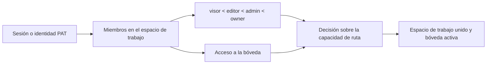

# Autenticación, espacios de trabajo y compartir

## Modos de funcionamiento

`personal` modo es la experiencia local predeterminada de un solo usuario. La autenticación se evita a menos que la política efectiva lo requiera. `org` El modo requiere identidad y membresía de espacio de trabajo. Las implementaciones expuestas pueden forzar la autenticación independientemente de la etiqueta de modo amigable.

La puerta de acceso selecciona el inicio de sesión o la aplicación de interfaz de usuario, pero toda la autorización se aplica en dependencias y servicios de backend.

## Autenticación de sesión y token

El acceso por correo electrónico/contraseña verifica un hash de contraseña y emite un JWT firmado en una cookie HttpOnly, SameSite=Lax. Los clientes de API aceptados también pueden enviar un `Authorization` token portador. Tokens de acceso personal usan un formato opaco separado; sólo se almacenan un prefijo de pantalla y hash SHA-256.

El secreto de la firma debe ser fuerte en los despliegues expuestos. El motor se niega a comenzar con el retroceso del desarrollo público cuando el despliegue efectivo requiere protección.

La frontera de rutas de autenticación está estrictamente tipada y conserva los
esquemas de respuesta congelados. Los descriptores Column de SQLAlchemy legacy
solo se restringen en la frontera ORM; la reclamación de cuentas, la rotación de
contraseña, el perfil y las cookies mantienen su validación y transacciones.

## Modelo de autorización

Los roles proporcionan capacidades de línea base ordenadas. VaultAccess estrecha u concede acceso a una bóveda registrada. Un espacio de trabajo, usuario o ID de bóveda proporcionado por petición nunca se confía sin resolver la identidad y membresías autenticadas.

Workspace bootstrap es seguro para las primeras solicitudes simultáneas, por lo que no se crean espacios de trabajo, usuarios o membresías por defecto duplicados. Los marcadores de posición y las cuentas automáticas están marcadas explícitamente; el registro no puede reclamarlas por correo electrónico como una prueba de identidad débil.

La resolución del contexto del espacio de trabajo mantiene estable la
dependencia pública de FastAPI, mientras funciones separadas gestionan la
membresía, el filtrado de bóvedas accesibles, la ruta de almacenamiento y las
capacidades. Así, las decisiones de autorización quedan explícitas sin cambiar
cabeceras, códigos de estado ni el comportamiento de la bóveda activa.

## Participación del público

Un enlace de acciones es una fila opaca que une página, espacio de trabajo, bóveda, creador, permiso, caducidad y revocación. `/s/:token` está intencionadamente fuera de la shell de interfaz autenticada. El solucionador de backends público utiliza la identidad de almacén almacenada porque una solicitud anónima no tiene cookie o cabecera activa.

La revocación es suave por lo que el sistema conserva un registro de auditoría. Los enlaces caducados o revocados no revelan contenido de página. La resolución de bienes públicos hereda el mismo alcance de la acción en lugar de aceptar una ruta arbitraria.

## API pública

Las rutas autenticadas por PAT aplican visores token más la autorización normal de espacio de trabajo/vault. El texto plano Token se muestra sólo en la creación. La revocación impide su uso futuro sin necesidad de eliminar su fila de auditoría.

## Invariantes

- Identidad, membresía del espacio de trabajo, rol, acceso a bóveda y operación solicitada
todos participan en la autorización.
- Las cookies son HttpOnly; la interfaz no necesita leer el JWT.
- Los hashes de contraseña y token son valores de un solo sentido.
- Un cliente suministrado `X-User-ID` no puede convertirse en una creación de cuentas o privilegio
El camino de escalada.
- El contenido de la versión pública se limita al alcance de la página/vault almacenados.
- La comodidad en modo personal no puede debilitar una implementación de multiusuario expuesta.

## Enfoque de verificación

Ejecute pruebas de acceso a la puerta central, la bandera de ejecución, cuenta, marcador de posición, caso de correo electrónico, contraseña, PAT, superficie pública, carrera de espacio de trabajo, membresía y compartir. El navegador QA comprueba el inicio de sesión/logout, actualizaciones de cuenta, conmutación de espacio de trabajo y acceso anónimo a compartir en una sesión limpia.
