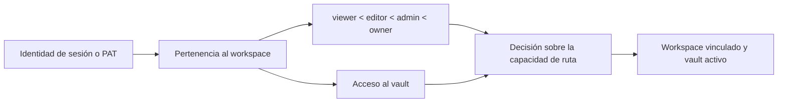

# Autenticación, espacios de trabajo y contenido compartido

## Modos de funcionamiento

El modo `personal` ofrece por defecto una experiencia local de un solo usuario. La autenticación se omite salvo que la política efectiva la exija. El modo `org` requiere una identidad y pertenencia a un workspace. Los despliegues expuestos pueden exigir autenticación independientemente del nombre del modo.

El control del frontend selecciona el inicio de sesión o la interfaz de la aplicación, pero toda la autorización se aplica en las dependencias y servicios del backend.

El shell importa el formulario de inicio de sesión desde la entrada pública de
`features/auth`. La validación de inicio de sesión y registro, la gestión de
sesiones y el control de políticas del backend conservan su comportamiento.
Los ajustes de cuenta y workspace siguen separados del formulario; trasladar
su punto de entrada no autoriza el acceso a un workspace.

La feature de contenido compartido expone su página de solo lectura mediante
una entrada pública de carga diferida. La ruta `/s/:token` permanece fuera del
control de autenticación y del shell de la aplicación. Trasladar esta pantalla
no amplía el acceso: el backend sigue resolviendo el token y los enlaces
caducados o inválidos conservan su presentación de errores.

La resolución del workspace valida las raíces configuradas del proyecto y de
los vaults antes de cualquier inicialización o selección de rutas. La
inicialización personal resiste condiciones de carrera y confirma la membresía
que prevalece tras un conflicto de unicidad; el modo organización restringe los
roles y las capacidades JSON antes de construir el contexto de la petición.
Si faltan montajes, solo se utilizan alternativas donde la compatibilidad del
modo personal lo permite explícitamente; nunca se inventa un vault de organización.

## Autenticación de sesión y token

El inicio de sesión con correo electrónico y contraseña verifica el hash de la contraseña y emite un JWT firmado en una cookie HttpOnly, SameSite=Lax. Los clientes API admitidos también pueden enviar un token bearer en `Authorization`. Los tokens de acceso personal utilizan un formato opaco independiente; solo se almacenan su hash SHA-256 y un prefijo para mostrarlos.

El secreto de firma debe ser robusto en los despliegues expuestos. El backend se niega a arrancar con el valor público de desarrollo cuando el despliegue efectivo requiere protección.

La frontera de rutas de autenticación está estrictamente tipada y conserva los
esquemas de respuesta congelados. Los modelos de gestión comparten una
`DeclarativeBase` tipada de SQLAlchemy; los descriptores de columna solo se
restringen en la frontera ORM. La reclamación de cuentas, la rotación de
contraseña, el perfil y las cookies mantienen su validación y transacciones.
Los objetos de permisos Pydantic conservan sus valores predeterminados
históricos y la representación OpenAPI exacta.

El servicio de autenticación tipa en sus límites las sesiones de gestión,
los generadores de caché de políticas, la identidad de conexiones HTTP/WebSocket,
la búsqueda de PAT y la decodificación del sujeto JWT. Los stubs de `python-jose`
están fijados en el grupo de dependencias de desarrollo, y la modificación
restante de marcas temporales del ORM heredado se aísla mediante `setattr`
hasta que las declaraciones de columnas migren por completo a `Mapped[]`.

El WebSocket de colaboración importa el mismo servicio tipado de identidad que
HTTP. La política de autenticación, no la disponibilidad de módulos opcionales,
determina si se exige una credencial: el modo personal mantiene su facilidad
de uso, mientras el modo organización y los clientes PAT comparten un resolutor.
Cerrar antes de aceptar la conexión sigue notificando una infracción de política,
y las claves de las salas conservan el espacio de nombres del vault.

## Modelo de autorización

Los roles proporcionan capacidades básicas jerarquizadas. VaultAccess restringe o concede acceso a un vault registrado. Nunca se confía en un identificador de workspace, usuario o vault proporcionado por una petición sin resolver la identidad autenticada y sus membresías.

La inicialización del workspace es segura frente a peticiones iniciales simultáneas y evita duplicar workspaces, usuarios o membresías predeterminados. Las cuentas provisionales y las aprovisionadas automáticamente están marcadas explícitamente; el registro no puede reclamarlas utilizando el correo electrónico como prueba débil de identidad.

La resolución del contexto del espacio de trabajo mantiene estable la
dependencia pública de FastAPI, mientras funciones separadas gestionan la
membresía, el filtrado de vaults accesibles, la ruta de almacenamiento y las
capacidades. Así, las decisiones de autorización quedan explícitas sin cambiar
cabeceras, códigos de estado ni el comportamiento del vault activo.

La identidad del vault, el slug, la ruta heredada opcional y la fecha de creación
utilizan mapeos tipados de SQLAlchemy, conservando las columnas y migraciones
existentes. El middleware canónico restringe un identificador o slug a una cadena
concreta antes de publicar el contexto de la petición. La exportación de plantillas
revalida la ruta heredada nullable en el límite del sistema de archivos y devuelve
la respuesta existente de recurso no encontrado, en lugar de construir un `Path`
a partir de una configuración ausente.

La API de administración de workspaces convierte los roles de membresía heredados
y los descriptores JSON de permisos en valores concretos de respuesta en la frontera
ORM. Las modificaciones de roles y acceso al vault utilizan asignaciones localizadas
compatibles con los descriptores, conservando las comprobaciones de pertenencia,
la normalización de invitaciones y los esquemas de payload existentes.

## Contenido compartido públicamente

Un enlace compartido es una fila opaca que vincula página, workspace, vault, creador, permiso, caducidad y revocación. Por diseño, `/s/:token` está fuera del shell autenticado del frontend. El resolutor público del backend utiliza la identidad del vault almacenada porque una petición anónima no tiene cookie ni cabecera de vault activo.

La revocación es lógica, de modo que el sistema conserva un registro de auditoría. Los enlaces caducados o revocados no revelan contenido de la página. La resolución de recursos públicos hereda el mismo ámbito del enlace compartido en lugar de aceptar una ruta arbitraria.

La frontera de rutas de contenido compartido tipa la serialización, la resolución
de rutas del vault, las modificaciones del ORM y todas las respuestas de los handlers.
Modelos Pydantic con nombre validan los mapeos de llamadas directas antes de
serializarlos; los registros de compatibilidad desactivan explícitamente la
publicación del modelo de respuesta para conservar los esquemas OpenAPI congelados.
Los identificadores almacenados de múltiples vaults se resuelven a rutas concretas
antes de activar el contexto de página; si falta configuración, se conservan la
alternativa recuperable y la respuesta de servicio no disponible existentes.

Los ajustes de identidad del vault utilizan modelos Pydantic separados para las
peticiones y para la lectura de datos heredados. Los campos históricos desconocidos
se conservan en las lecturas, las escrituras atómicas mantienen la estructura del
perfil y las respuestas correctas se validan antes de devolver el contrato de mapeo
que permite acceder directamente a sus claves.

El listado, la creación, el renombrado y la eliminación de múltiples vaults
personales construyen ahora modelos Pydantic de respuesta anidados explícitos.
Los slugs, los valores heredados nullable, la selección activa y los comprobantes
de eliminación conservan su estructura original de diccionario; el confinamiento
de rutas, la protección del vault principal y la limpieza de artefactos no cambian.

## API pública

Las rutas autenticadas mediante PAT aplican los ámbitos del token además de la autorización normal del workspace y del vault. El token en texto plano solo se muestra al crearlo. La revocación impide utilizarlo de nuevo sin eliminar su fila de auditoría.
La fachada pública tipada actualiza las marcas temporales del ORM a través del
límite de descriptores, confina las escrituras Markdown heredadas al vault activo
y dirige los registros configurados del Web Clipper al flujo normal de creación
de páginas. Los resultados de token, ping, página, configuración del clipper y
captura pasan por modelos Pydantic de respuesta con nombre y conservan después
su estructura histórica de diccionario o lista. El registro explícito con
`response_model=None` conserva los esquemas FastAPI byte a byte hasta la PR
coordinada del contrato OpenAPI/cliente.

## Invariantes

- La identidad, la pertenencia al workspace, el rol, el acceso al vault y la operación
  solicitada participan en la autorización.
- Las cookies son HttpOnly; la interfaz no necesita leer el JWT.
- Los hashes de contraseña y token son valores de un solo sentido.
- Un `X-User-ID` proporcionado por el cliente no puede permitir crear cuentas ni escalar privilegios.
- El contenido compartido públicamente se limita al ámbito de página y vault almacenado.
- La comodidad del modo personal no puede debilitar un despliegue multiusuario expuesto.

## Enfoque de verificación

Ejecute las pruebas del control central, del indicador que exige autenticación, de cuentas, cuentas provisionales, mayúsculas y minúsculas del correo electrónico, contraseñas, PAT, interfaces públicas, respuestas tipadas directas, condiciones de carrera del workspace, membresías y contenido compartido. La QA en el navegador comprueba el inicio y cierre de sesión, las actualizaciones de cuenta, el cambio de workspace y el acceso anónimo a enlaces compartidos en una sesión limpia.
