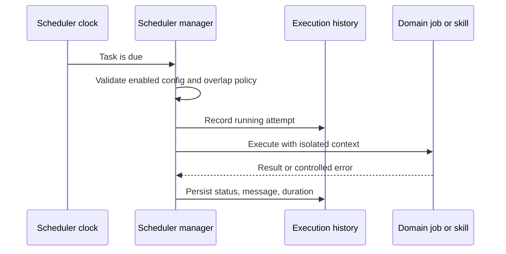

# Automatización y programación

## Responsabilidad

El planificador ejecuta las tareas configuradas, conserva el historial y expone
el estado operativo de sincronización, publicación, ingestión, mantenimiento y
actualización de la planificación.

La funcionalidad de automatizaciones contiene la pantalla del planificador y
la conversión de intervalos. El centro de control contiene el panel operativo,
historial, miembros y diálogos de directivas. Las rutas se cargan bajo demanda;
los adaptadores compartidos preservan identificadores, unidades, permisos y
payloads. Mover una pantalla no habilita tareas ni inicia trabajos.

Los metadatos, el estado persistido y la frontera opcional de notificaciones
tienen contratos tipados. El gestor valida las definiciones heredadas antes de
construir tareas de ejecución y respeta el límite de tamaño del código.

## Modelo de tarea

Cada definición tiene identidad estable, estado habilitado, programación,
operación, configuración y política de ejecución. El historial registra inicio,
finalización, estado, mensaje y duración. Las definiciones se alinean con las
conexiones antes de ejecutarse para evitar integraciones eliminadas o equivocadas.

## Flujo de ejecución

Las operaciones deben ser idempotentes cuando puedan repetirse. El gestor
controla solapamientos según la política de tarea y utiliza contextos nuevos de
base de datos o proveedor. Tras un reinicio, reconcilia la configuración persistida.

El arranque nativo activa el planificador por defecto. Las pruebas deterministas
y los diagnósticos con datos locales pueden establecer `GNOSI_DISABLE_SCHEDULER=1`
para comprobar API e interfaz sin ejecutar integraciones pendientes. Este
interruptor no modifica la configuración guardada.

El gestor conserva ciclo de vida, persistencia, solapamientos e historial;
`task_handlers.py` contiene el despacho y las operaciones grandes, incluido el
mantenimiento, sin acoplarlas al hilo del planificador.

Las notificaciones utilizan una frontera de plataforma independiente del
proveedor. La persistencia en base de datos y Markdown está disponible en todos
los hosts; las alertas nativas de macOS son opcionales. Los logs Markdown viven
bajo `GNOSI_DATA_DIR`, no dentro de un Vault de OneDrive, Google Drive, Nextcloud,
Dropbox u otros proveedores. El fallo de un canal no bloquea los demás. La
antigua ruta de la habilidad de notificaciones es una fachada de compatibilidad.

## Sincronización académica y actualización de revisiones

`academic_repository_sync` es un trabajo persistente y reanudable para índices
OAI locales. Conserva cursor, recuentos, error, cancelación y última sincronización
correcta fuera de la petición. Un administrador inicia la primera recolección;
después, la tarea incremental diaria continúa desde el último punto completo y
aplica las marcas de eliminación OAI.

Las estrategias guardadas pueden programar `academic_review_update`. Cada
ejecución reproduce la estrategia versionada, registra actividad y errores
parciales por fuente y añade solo candidatos con una identidad nueva para esa
revisión. La próxima ejecución se guarda con la configuración de la revisión.

La cola exige una raíz `LOCAL_DATA` explícita y falla antes de abrir SQLite si
falta configuración. Los adaptadores validan los payloads antes del despacho y
rechazan registros sin función ejecutable. La sincronización de contactos pasa
explícitamente base de datos, workspace e integración para evitar confundir
argumentos.

Los trabajos académicos resuelven el Vault activo antes de acceder a literatura.
Sin Vault, registran una omisión estructurada con cero trabajos en vez de
construir `Path(None)`. La recuperación de la cola del Reader comprueba que
existe el documento del trabajo; los registros huérfanos no crean hilos que
fallarán repetidamente.

## Automatizaciones del Vault

Las reglas combinan desencadenantes, condiciones y acciones. Las fórmulas y
rollups se evalúan de forma determinista, no como código arbitrario. Las acciones
externas o destructivas conservan los mismos límites de autorización y
confirmación que las interactivas.

## Trabajo autónomo de calidad

Las tareas programadas pueden diagnosticar, generar informes o aplicar cambios
dentro de su ámbito. La programación no amplía los permisos sobre archivos,
secretos, Git o publicaciones.

## Límite del mantenimiento por dispositivo

`system_maintenance` vacía la caché en memoria de la aplicación y trunca únicamente
el archivo ordinario `logs/gnosi.log`, con un solo enlace físico, bajo el
`GNOSI_DATA_DIR` canónico, solo si es el `LOG_FILE` configurado.
Conserva el inodo para que el logger siga escribiendo.
Ni los directorios ni el archivo pueden ser enlaces simbólicos. Si la ruta no es
válida o la plataforma no ofrece operaciones seguras relativas a un directorio,
omite la limpieza de disco.

No limpia código fuente, bytecode, logs configurados en otras ubicaciones,
buzones privados del workspace, bases de datos, secretos, documentos del Vault
ni carpetas sincronizadas. Los contadores heredados de buzón, temporales y
bytecode se conservan con valor cero. Retirar checkouts antiguos es una operación
separada y revisada del workspace, no una tarea programada de la aplicación.

## Generación diaria de audio

El servicio de pódcast del Reader selecciona modelo e idioma con contratos
tipados, limita los trabajadores TTS por frase y sustituye el MP3 atómicamente.
Captura el Vault seleccionado antes de comenzar y rechaza el inicio sin Vault activo.

## Invariantes

- Las tareas deshabilitadas o inválidas no se ejecutan.
- Cada ejecución tiene un resultado persistente en el historial.
- Los reintentos no duplican efectos externos sin una estrategia de idempotencia.
- Eliminar o reasignar conexiones actualiza las programaciones dependientes.
- Las zonas horarias tienen semántica explícita.
- Las excepciones no interrumpen el bucle del planificador.
- Los trabajos no reutilizan sesiones de base de datos de una petición.
- Cancelar una recolección OAI conserva el cursor para reanudarla.
- Repetir una revisión no duplica resultados ya identificados.

## Verificación

Compruebe configuración, conexiones, intervalos, historial, solapamientos, zonas
horarias, reintentos, reanudación y cancelación OAI, marcas de eliminación,
detección de nuevos resultados y confinamiento del mantenimiento. Ejecute también
las pruebas de automatización de Playwright y una integración representativa de
principio a fin con datos sintéticos o una cuenta de pruebas.
