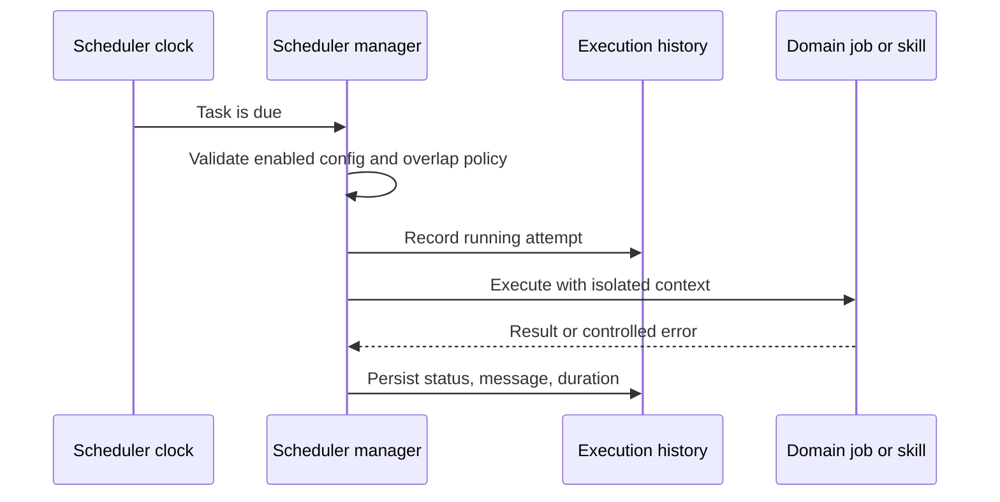

# Automatización y programación

## Responsabilidad

El planificador ejecuta tareas recurrentes y de una sola toma configuradas, registra el historial, expone el estado operativo y coordina trabajos de dominio como sincronización, publicación, ingestión, mantenimiento y actualización de planificación.

Los metadatos de tarea, el estado de ejecución persistido y la frontera
opcional de notificaciones están tipados estrictamente en módulos dedicados. El
gestor se mantiene bajo el guardrail de tamaño y valida los diccionarios de
tareas heredados antes de construir tareas de ejecución.

## Modelo de tareas

Una definición de tarea tiene identidad estable, estado, programación, operación, configuración y política de ejecución habilitados. Los registros de historial de tareas comienzan, completan, estado, mensaje y duración. Las definiciones y configuraciones de conexión se alinean antes de la ejecución, por lo que un trabajo no puede usar accidentalmente una integración eliminada o diferente.

## Flujo de ejecución

Las funciones de tareas deben ser idempotentes cuando sea posible la repetición. El administrador protege las instancias superpuestas de acuerdo a la política de tareas y utiliza nuevos contextos de base de datos o proveedores.

El gestor conserva el ciclo de vida del planificador, la persistencia, el
control de solapamientos y el historial. `task_handlers.py` contiene la política
de despacho y las tareas operativas grandes, incluido el mantenimiento acotado.
Así la ejecución es reutilizable y tipada sin acoplarla al hilo planificador.

## Sincronización académica y actualizaciones de revisión

`academic_repository_sync` es un trabajo duradero y resumible para los índices locales de OAI. Su cursor, cuentas, error, estado de cancelación y última sincronización exitosa se mantienen fuera del proceso de solicitud. Un administrador inicia explícitamente la primera cosecha; después de que se complete, la programación incremental diaria se reanuda desde el último punto de control completado del repositorio y aplica lápidas OAI.

Las estrategias de revisión guardadas también pueden programar `academic_review_update` Una ejecución reproduce la estrategia verificada, registra la actividad exacta por fuente y errores parciales, y registra sólo candidatos cuya identidad determinista es nueva en esa revisión. La siguiente ejecución persiste con la configuración de revisión en lugar de mantenerse sólo por el proceso de planificador.

## Automatización de bóvedas

Las reglas de automatización de saltos combinan disparadores, condiciones y acciones. Las fórmulas de campo derivadas y las rollups son una evaluación determinista, no una ejecución arbitraria de código. Las acciones externas o destructivas utilizan los mismos límites de autorización y confirmación como acciones interactivas.

## Trabajo de calidad autónomo

Los bucles de mantenimiento y calidad son tareas operativas limitadas. Pueden diagnosticar, generar informes o aplicar cambios dentro de su ámbito declarado. No obtienen un sistema de archivos más amplio, secreto, Git o autoridad editorial porque están programados.

## Generación diaria de audio

El servicio de pódcast del Reader utiliza selección tipada de modelo e idioma,
trabajadores TTS acotados por frase y sustitución atómica del MP3. La generación
en segundo plano captura explícitamente el Vault seleccionado y no se inicia si
no hay ninguno activo, evitando que la salida use una ruta local ambigua.

## Invariantes

- Las tareas deshabilitadas o inválidas no se ejecutan.
- Una tarea tiene un resultado histórico duradero.
- Los reintentos no duplican los efectos externos sin una estrategia de idempotencia.
- La eliminación o reasignación de conexiones actualiza los horarios dependientes.
- La programación utiliza semántica explícita de zona horaria.
- Las excepciones de trabajo están aisladas del bucle de programadores.
- La labor de fondo no reutiliza las sesiones de base de datos con alcance de solicitud.
- Una cosecha OAI cancelada mantiene su cursor duradero y puede ser reanudada.
- Las actualizaciones de revisión programadas son idempotentes para el mismo trabajo deduplicado.

## Enfoque de verificación

Prueba la resiliencia de configuración, alineación de conexiones, planificación de horarios, historial de tareas, prevención de solapamientos, zonas horarias, reintento/idempotencia, reanudación y cancelación de OAI, lápidas y revisión de detección de nuevos resultados, además del explorador de automatización de Playwright. Una integración programada representativa debe correr de extremo a extremo contra un dispositivo seguro o cuenta de prueba.
