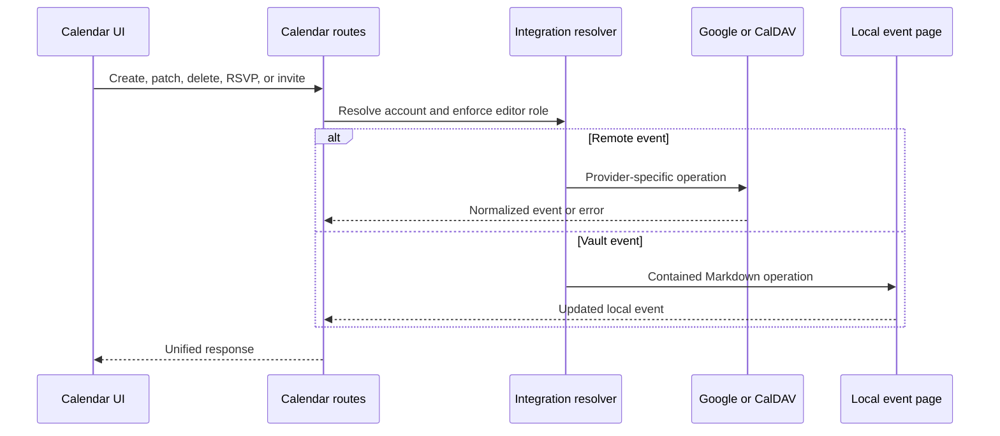

# Calendario y reuniones

## Responsabilidad

Calendario agrega los eventos locales del vault y los de las cuentas conectadas de Google Calendar y CalDAV. Permite seleccionar calendarios, crear, leer, actualizar y eliminar eventos, enviar invitaciones, responder a ellas (RSVP), consultar disponibilidad, geocodificar, gestionar recordatorios y eventos ocultos, exportar ICS, grabar reuniones, transcribirlas y generar notas con IA.

El frontend `features/calendar/`, estrictamente tipado, gestiona la página de
calendario, la selección de fuentes, la búsqueda, la coordinación de recurrencias
y los diálogos de la página. Su entrada pública conserva el límite original de
carga diferida. Los componentes de renderizado del calendario que también consumen
Vault y Mail siguen compartidos fuera de la feature de ruta; no cambian los
adaptadores de proveedores, los observadores de recordatorios ni los payloads de eventos.

`features/meetings/` gestiona la grabadora flotante, su controlador de captura y
subida, y la presentación de recordatorios. Su entrada pública difiere de forma
independiente los módulos de grabación y recordatorios. El shell los monta con
los mismos controles de plugins; el traslado no cambia los permisos de grabación,
las consultas periódicas, la navegación ni los payloads.

La frontera HTTP está tipada estrictamente y conserva el contrato de respuesta
existente. La normalización de etiquetas de Photon, el rechazo de URL, la
validación de resultados y la deduplicación pertenecen al dominio de
geocodificación de Calendar, no al módulo de rutas; los payloads de proveedores
se validan en esa frontera de adaptación.

El servicio híbrido de proveedores está estrictamente tipado y mantiene Google
como un adaptador junto al CalDAV genérico. La detección de cuentas CalDAV admite
Nextcloud, iCloud, Fastmail, Radicale y servidores compatibles mediante URL
configuradas, sin comportamiento ligado al proveedor de almacenamiento.

La copia opcional de Google al vault restringe los payloads de calendarios y
eventos antes de acceder al sistema de archivos, exige un vault configurado,
utiliza los identificadores de eventos del proveedor como nombres de archivo
estables y confina las carpetas de cuenta y calendario bajo `Calendar/External`.
Se omiten los elementos sin identidad y cada carpeta de calendario elimina
únicamente las filas Markdown obsoletas dentro de la ventana de sincronización acotada.

## Agregación de eventos

La capa de rutas resuelve el contexto del workspace y las integraciones seleccionadas, y normaliza los eventos de proveedores y los eventos Markdown locales en una respuesta común. Los identificadores de proveedor conservan su cuenta y calendario de origen; un identificador aislado no garantiza la unicidad global necesaria para modificar un evento.

Los eventos ocultos se registran en una capa local superpuesta. Ocultar un evento no lo elimina del proveedor. Volver a mostrarlo elimina esa marca local, de modo que la siguiente agregación lo incluya de nuevo.

## Flujo de mutación

## Recordatorios y notas de reunión

Los ajustes de recordatorios determinan la antelación y el comportamiento. La recopilación combina los próximos eventos y deduplica las peticiones concurrentes para evitar recordatorios duplicados. El observador del frontend muestra los recordatorios activos y permite ir al calendario o descartarlos.

La persistencia de recordatorios restringe su estado JSON a ajustes explícitos,
claves de notificaciones ya emitidas y objetos de recordatorios activos. El
análisis temporal acepta valores de proveedores en un único límite, las etiquetas
de asistentes se normalizan a cadenas y la salida de IA se convierte antes de
almacenarse. El bloqueo de todo el ciclo y la fusión con el estado recién leído
siguen resolviendo las condiciones de carrera entre planificador y API.

La grabación de reuniones sube audio de tamaño acotado a un flujo de trabajo en segundo plano. Las consultas periódicas de estado distinguen grabación, transcripción, resumen, creación de notas, finalización y fallo. Las notas generadas se escriben mediante operaciones seguras del vault y conservan el contexto del evento y de la fuente. El servicio en segundo plano normaliza el resultado de la ruta heredada del vault a un mapeo concreto antes de leer el identificador de la página creada; los handlers dinámicos de compatibilidad no atraviesan el límite tipado del trabajo. Las respuestas de grabación y consulta de estado pasan por modelos Pydantic específicos, pero siguen devolviendo los mismos diccionarios directamente indexables que utilizan los llamadores existentes.

## Invariantes

- La identidad del evento del proveedor incluye el contexto de cuenta y calendario.
- Las escrituras de calendario requieren un contexto con permisos de editor.
- Los eventos locales identificados por ruta permanecen dentro del vault activo.
- La ocultación es local y reversible; la eliminación utiliza el proveedor autoritativo.
- Los recordatorios resisten condiciones de carrera y no se duplican para el mismo evento y ventana temporal.
- La ausencia de proveedores de transcripción o IA hace fallar el trabajo de la reunión, no el calendario.
- La salida del ICS utiliza zonas horarias normalizadas y no expone credenciales privadas.

## Enfoque de verificación

Pruebe el confinamiento de rutas locales, la normalización de eventos, las recurrencias, los eventos ocultos, las condiciones de carrera de recordatorios, la selección de cuentas, las zonas horarias y los flujos de creación, edición y eliminación con Playwright. La QA de reuniones debe grabar o subir un archivo de prueba, observar el estado en segundo plano y verificar la página resultante del vault.
