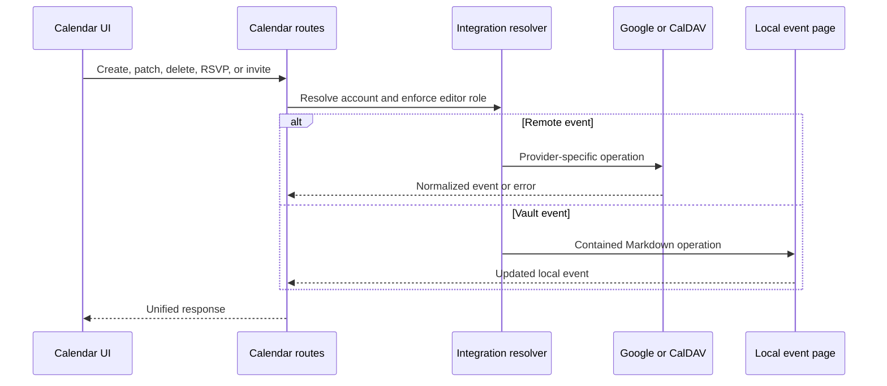

# Calendario y reuniones

## Responsabilidad

El calendario agrega eventos locales de Vault con cuentas conectadas de Google Calendar y CalDAV. Soporta selección de calendario, CRUD de eventos, invitaciones, RSVPs, consultas libres/ocupadas, geocodificación, recordatorios, estado de evento oculto, exportación de ICS, grabación de reuniones, transcripción y notas generadas por IA.

## Agregación de eventos

La capa de ruta resuelve el contexto del espacio de trabajo y las integraciones seleccionadas, luego normaliza los eventos del proveedor y los eventos locales de Markdown en una respuesta compartida. Los identificadores del proveedor permanecen emparejados con su origen de cuenta/calendario; un ID por sí solo no es lo suficientemente único a nivel mundial para la mutación.

Los eventos ocultos son registros de superposición local. Ocultar no elimina un evento del proveedor. Desobstruir elimina la superposición para que la siguiente agregación lo incluya de nuevo.

## Flujo de mutación

Los eventos de día completo de Google utilizan una fecha de finalización exclusiva, mientras que el formulario de Gnosi presenta el último día de forma inclusiva. La conversión se realiza una sola vez en el límite del proveedor: las peticiones añaden un día antes de escribir en Google y las respuestas restan uno antes de renderizar. Las ocurrencias de cumpleaños se actualizan mediante su evento recurrente maestro; las fechas gestionadas por Google Contacts permanecen bajo el control del proveedor, mientras que los campos compatibles, como el título, todavía se pueden actualizar.

## Recordatorios y notas de reunión

Los ajustes de recordatorio seleccionan el tiempo de entrega y el comportamiento. La colección combina los eventos próximos y deduplica las solicitudes concurrentes para que no se creen recordatorios duplicados. El frontend watcher muestra recordatorios activos y puede navegar al calendario o descartarlos.

La grabación de reuniones se carga en un flujo de trabajo de fondo. Las encuestas de estado separan la grabación, transcripción, resumen, creación de notas, finalización y fallo. Las notas generadas se escriben a través de operaciones seguras de la bóveda y conservan el contexto de evento/fuente.

## Invariantes

- La identidad del evento del proveedor incluye el contexto de cuenta y calendario.
- Los finales exclusivos de los eventos de día completo nunca llegan al modelo inclusivo de la interfaz.
- Las fechas de cumpleaños gestionadas por los contactos se conservan al actualizar eventos recurrentes.
- Calendar escribe requiere un contexto con capacidad de editor.
- Los eventos locales basados en el sendero permanecen dentro de la bóveda activa.
- La ocultación es local y reversible; la eliminación utiliza el proveedor autorizado.
- Los recordatorios son seguros para la carrera y no se duplican para la misma ventana/evento.
- Falta transcripción o proveedores de IA fallan el trabajo de reunión, no el calendario.
- La salida del ICS utiliza zonas horarias normalizadas y no expone credenciales privadas.

## Enfoque de verificación

Prueba la contención de rutas locales, normalización de eventos, recurrencia, estado oculto, carreras de recordatorios, selección de cuentas, zonas horarias y Playwright crea/editar/eliminar flujos. Meeting QA debe grabar o subir un dispositivo, observar el estado de fondo y verificar la página de Vault resultante.
