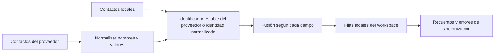

# Contactos

## Responsabilidad

Contactos proporciona una libreta de direcciones local y normalizada a partir de registros manuales y fuentes conectadas de Google, CardDAV y otros servicios compatibles. Ofrece búsqueda y autocompletado de destinatarios y asistentes a Correo y Calendario.

El frontend `features/contacts/`, estrictamente tipado, gestiona la página de la
libreta de direcciones, el catálogo de integraciones y los componentes de lista,
detalle y formulario. La composición de la aplicación consume su entrada pública
de carga diferida; los adaptadores API compartidos siguen siendo independientes
de la pantalla. El traslado conserva la identidad de las fuentes, los campos de
contacto y el comportamiento de sincronización sin mantener componentes duplicados
en sus rutas anteriores.

Las rutas HTTP y la frontera de proveedores de sincronización están tipadas
estrictamente. Las credenciales de integración se validan antes de construir
un proveedor Google o CardDAV, y los contadores y errores heterogéneos de
sincronización mantienen un contrato explícito sin cambiar el payload público.

## Modelo de datos

Un contacto tiene una identidad local estable, workspace, tipo, nombre visible, correo electrónico y teléfono principales, campos de organización, notas, campos estructurados multivalor de correos, teléfonos y direcciones, identificadores de proveedor, fuente, foto, etiquetas, marcas temporales y estado de sincronización.
El modelo SQLAlchemy utiliza declaraciones `Mapped[]` en todas las columnas y
en su relación con el workspace; las asignaciones de servicios, rutas y
sincronización se comprueban así contra el esquema persistido. Los modelos
Pydantic de petición y respuesta conservan sus valores predeterminados históricos
y la representación OpenAPI idéntica byte a byte.

Los payloads específicos de cada proveedor se normalizan antes de fusionarse. El procesamiento de vCard une las líneas de continuación, decodifica valores y escapa separadores sin cambiar los datos del usuario.

## Sincronización y fusión

La regla crítica de fusión es conservar la información añadida exclusivamente en local. Una sincronización remota puede actualizar valores gestionados por el proveedor, pero no debe vaciar etiquetas, notas, valores añadidos manualmente ni la identidad de otro proveedor porque el payload actual los omita. La política de eliminación depende del proveedor y no se infiere de una lista parcial.

## Uso entre dominios

Correo busca contactos para seleccionar destinatarios y enlazar entidades. Calendario busca contactos para seleccionar asistentes. Estos consumidores reciben datos de presentación normalizados y no acceden a credenciales de proveedores ni a payloads de sincronización sin procesar.

## Invariantes

- Cada consulta y modificación se limita a un workspace.
- Los identificadores remotos pertenecen al espacio de nombres de su proveedor o fuente.
- Las sincronizaciones repetidas no crean duplicados para el mismo registro del proveedor.
- El enriquecimiento local sobrevive a la actualización del proveedor.
- Los campos multivalor preservan etiquetas de tipo y valores preferidos.
- La eliminación de un contacto y su eliminación remota son efectos independientes
  salvo que se seleccione una política bidireccional explícita.

## Enfoque de verificación

Ejecute las pruebas de fusión, unión de líneas y escape de vCard, normalización de proveedores, comparación de correo electrónico sin distinguir mayúsculas y minúsculas, y workspaces. Playwright verifica la lista, el detalle, la creación y edición, la búsqueda y la navegación entre áreas sin depender de una cuenta real de proveedor.
