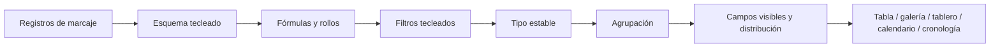

# Opiniones de base de datos y planificación de proyectos

## Modelo estructurado de conocimientos

Una base de datos Gnosi es un esquema y una capa de vista sobre páginas, normalmente enraizada en una carpeta Vault. La materia frontal de la página contiene valores de registro. Los datos del registro definen tipos de campos, configuraciones de vistas, fórmulas, versiones, relaciones, opciones, configuración de visualización y acciones.

Al menos una vista principal es una invariante. Rutas de inicio y de reparación en tiempo de lectura restauran cuando el legado o la interrupción escribe dejan una tabla sin una vista válida.

## Fechas de auditoría del sistema

Cada tabla tiene propiedades de solo lectura para la fecha de creación y la
última modificación. Las tablas nuevas localizan sus nombres según el idioma
de la petición o el idioma actual de la interfaz configurado en Settings, y
mantienen ambas propiedades al final del esquema. La creación de un registro
asigna los dos valores; los guardados posteriores conservan la creación y
actualizan la modificación.

La migración idempotente solo reconoce los tipos de sistema explícitos y los
nombres heredados conocidos, de modo que los demás campos `date` y los
metadatos internos `created_at` o `last_edited_at` no se modifican. Los clones
deterministas de Notion pueden recuperar los timestamps autoritativos mediante
los UUID configurados de base de datos y página, sin comparar títulos. El
índice completo de Notion se recupera antes de escribir y se crea una copia de
seguridad de cada registro o archivo Markdown modificado.

## Higiene de los nombres de tablas y vistas

Los nombres de las tablas y de las vistas guardadas del registro se normalizan
al cargar y al escribir. Se eliminan los emojis y símbolos pictográficos
decorativos, pero se conservan los acentos y la puntuación significativa. La
vista principal bloqueada siempre tiene exactamente el nombre de su tabla
propietaria, y el marcador `is_main` sigue siendo la autoridad.

## Jerarquía de navegación de las tablas

La barra lateral del Vault presenta cada tabla como un nodo padre con dos grupos
hijos independientes: `Contenido` contiene los registros de la tabla y `Vistas`
contiene las vistas guardadas. Ambos grupos aparecen contraídos por defecto,
igual que los nodos de tabla y las secciones de navegación de primer nivel, para
que una tabla con muchos registros o vistas siga siendo fácil de consultar.
Expandir un grupo no debe expandir implícitamente el otro; cada sección conserva
su propio estado persistente y todas las etiquetas pasan por el catálogo de
localización del frontend.

## Ver tubería

Los valores tipográficos deben compararse como su tipo de campo declarado. La entrada de texto por sí sola no puede representar cada valor de filtro; los campos fecha, casilla de verificación, número, relación, selección y multivalor se normalizan a través de operadores con conocimiento de campo.

La evaluación de campo derivado tiene un orden explícito. Fórmulas que dependen de valores brutos que se ejecutan antes de las rerollups que se resuelven las relaciones agregadas, y fórmulas dependientes sin permitir que los ciclos se repitan indefinidamente. Las representaciones de backend y frontend deben acordar la veracidad de la casilla de verificación, porcentajes, valores vacíos e identificadores de opciones.

Los criterios de ordenación de las vistas guardadas se aplican en el orden de
la lista mediante una comparación estable de múltiples claves. Los valores
vacíos siempre quedan después de los valores informados, tanto en orden
ascendente como descendente, igual que en las vistas importadas de Notion. Las
vistas del frontend y las instantáneas Markdown del backend comparten esta
regla para que el orden de los registros no diverja.

Cuando `VaultDashboard` renderiza una pestaña de tabla, pasa las funcionalidades habilitadas del registro de la tabla a través de `VaultViewBody` hasta `VaultTable`. Por tanto, la pestaña de tabla, la tabla independiente, el panel dividido y la vista incrustada exponen las mismas acciones de fila configuradas. Si se omite esta cadena de propiedades, la acción queda oculta aunque el registro y la API la devuelvan como habilitada.

## Evolución del esquema y condición

Las revisiones de esquemas protegen a un cliente de guardar una lista de campos más antigua sobre una más reciente. Renombrar un campo actualiza filtros, tipos, fórmulas, acciones y referencias de vista guardada. Renombrar una tabla detecta colisiones de nombres de archivos de carpetas planas antes de mover contenido.

Las registros se escriben atómicamente y se actualizan después de cambios en los metadatos por lotes. Las instantáneas en cacheado se invalidan cuando cambian los registros de origen o la revisión del esquema.

## Planificación de proyectos

La planificación consume campos de tareas estructurados y produce un horario autorizado en lugar de duplicar la lógica de programación en la interfaz de usuario. El motor normaliza dependencias, calendarios, duraciones, limitaciones, recursos, plazos, progreso y dirección de programación. Luego calcula fechas, holgura, tareas críticas, advertencias y asignaciones de recursos.

La interfaz representa el resultado y los controles de edición. No recomputa de forma independiente la semántica de ruta crítica. Los horarios en cacheado están keyed por estado de entrada relevante y viven en datos locales, no en los registros de origen de la bóveda.

## Comportamiento de fallo

- Las fórmulas no válidas devuelven un error de campo controlado en lugar de abortar el
respuesta de la tabla.
- Las relaciones rotas siguen siendo visibles como valores no resueltos cuando es posible.
- Las vistas perdidas desencadenan una reparación determinista de la vista principal.
- Los ciclos de planificación, las limitaciones imposibles o los calendarios que faltan producen
diagnósticos y resultados parciales cuando sea seguro.
- Una revisión de esquema obsoleta devuelve un conflicto y requiere recarga/fusión.

## Enfoque de verificación

Prueba de paridad de filtro tecleado, conflictos de revisión de esquemas, renombrados de campos y tablas, orden de fórmulas/rollups, sincronización de relaciones, clasificación de instantáneas, acciones de catálogo de opciones, restricciones de programación, rutas críticas y renderizado del panel E2E.
