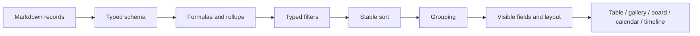

# Vistas de bases de datos y planificación de proyectos

## Modelo de conocimiento estructurado

Una base de datos de Gnosi es una capa de esquema y vistas sobre páginas,
normalmente situada en una carpeta del Vault. El frontmatter de cada página
contiene los valores del registro. Los datos del registro de configuración
definen los tipos de campo, las configuraciones de vistas, las fórmulas, los
rollups, las relaciones, las opciones, los ajustes de visualización y las acciones.

Cada Vault activo se asocia a un único motor SQLite almacenado localmente y a
una fábrica de sesiones tipada. El registro de motores utiliza la ruta del
Vault como clave, emplea una base declarativa tipada de SQLAlchemy, ejecuta la
migración del esquema antes de la primera conexión y libera las conexiones del
pool al eliminar el Vault. Los archivos SQLite permanecen fuera del
almacenamiento del Vault sincronizado con la nube.

La existencia de al menos una vista principal es una invariante. Los mecanismos
de reparación al iniciar y al leer la restauran cuando las escrituras heredadas
o interrumpidas dejan una tabla sin una vista válida.

## Creación de grupos de bases de datos

El botón Crea una DB de la pantalla de bienvenida y el control Añadir base de
datos de la barra lateral comparten una única acción. Ambos crean un grupo en
el registro mediante `/api/vault/databases`, actualizan el registro y dejan
intactos los documentos de página. Se eliminan los espacios sobrantes del
nombre; cancelar o dejarlo vacío no escribe nada, y una petición fallida
conserva el diálogo del grupo para volver a intentarlo.

Una tabla es un objeto distinto, creado dentro de un grupo seleccionado con
su vista principal. La API de páginas sigue admitiendo las páginas antiguas
marcadas con `is_database: true`; la acción de bienvenida no las convierte,
elimina ni reinterpreta automáticamente.

## Fechas de auditoría del sistema

Cada tabla tiene propiedades de creación y última modificación de solo lectura.
Las tablas nuevas traducen sus etiquetas según el idioma de la solicitud o el
idioma actual de la interfaz en Ajustes, y mantienen ambas propiedades al final
del esquema. La creación de un registro establece ambos valores; los guardados
posteriores conservan la fecha de creación y actualizan la de modificación.

La migración idempotente reconoce únicamente tipos de sistema explícitos y
etiquetas heredadas conocidas, por lo que no modifica los campos `date` ajenos
a estos ni los metadatos internos `created_at` o `last_edited_at`. Los clones
deterministas de Notion pueden completar las marcas de tiempo de auditoría
autoritativas mediante la correspondencia de UUID de bases de datos y páginas
configurados, sin buscar coincidencias por título. El índice completo de Notion
se obtiene antes de escribir, y se crea una copia de seguridad de cada archivo
de registro de configuración o Markdown que se modifica.

## Normalización de nombres de tablas y vistas

Las etiquetas de tablas y vistas guardadas del registro de configuración se
normalizan al cargar y al escribir. Se eliminan los emojis decorativos y los
símbolos pictográficos, pero se conservan los acentos y los signos de puntuación
significativos. La vista principal bloqueada siempre tiene exactamente el
mismo nombre que la tabla a la que pertenece, y su marcador `is_main` sigue
siendo la referencia autoritativa.

## Jerarquía de navegación de las tablas

La barra lateral del Vault presenta cada tabla como un nodo padre con dos grupos
de hijos independientes: `Content` contiene los registros de la tabla y `Views`
contiene sus vistas guardadas. Ambos grupos están contraídos por defecto, al
igual que los nodos de tabla y las secciones de navegación de primer nivel, de
modo que una tabla con muchos registros o vistas siga siendo fácil de recorrer
visualmente. Expandir un grupo no debe expandir implícitamente el otro; cada
sección mantiene su propio estado persistido y todas las etiquetas pasan por
el catálogo de traducciones del frontend.

## Flujo de procesamiento de las vistas

`VaultTable.tsx` delega en el controlador y la composición visual tipados de
`vault-table`. El adaptador de tablas compartido de `VaultViewBody` conserva la
identidad de los arrays de filas válidos, las extensiones de metadatos desconocidas
y los callbacks de selección. La edición de celdas, la navegación con teclado,
las filas virtualizadas y las actualizaciones de opciones del esquema permanecen
en módulos separados con pruebas de regresión. `SchemaConfigModal.tsx` delega la
edición del esquema y el guardado automático en `schema-config`, conservando los
ID de campo, los colores de las opciones y los valores predeterminados. Estos
cambios internos no alteran las vistas guardadas ni los metadatos portátiles de
las páginas.

Los valores tipados deben compararse según el tipo declarado de su campo. Una
entrada de texto por sí sola no puede representar todos los valores de filtro;
los campos de fecha, casilla de verificación, número, relación, selección y
valores múltiples se normalizan mediante operadores específicos para cada tipo
de campo.

La evaluación de campos derivados sigue un orden explícito. Las fórmulas que
dependen de valores sin procesar se ejecutan antes que los rollups que agregan
relaciones, y las fórmulas dependientes se resuelven sin permitir que los ciclos
provoquen una recursión indefinida. Las representaciones del backend y del
frontend deben coincidir en la interpretación booleana de las casillas de
verificación, los porcentajes, los valores vacíos y los identificadores de opciones.

Los campos virtuales calculados durante la lectura utilizan proyecciones del
grafo y contextos de cálculo tipados. Las aristas estructurales excluyen los
nodos no resueltos y los de propuestas semánticas; los tipos de las métricas de
NetworkX se acotan al entrar en la caché compartida, mientras que los valores de
grado, nodo central, nodo huérfano y progreso inverso de tareas exponen resultados
primitivos estables. La clave canónica del frontmatter sigue siendo el nombre de
la propiedad en el registro de configuración, sin convertirlo en slug.

El comportamiento canónico de las bases de datos se divide por responsabilidad.
`tables/rules/` se encarga de evaluar fórmulas, rollups, búsquedas y
automatizaciones; `tables/catalogs/`, de la normalización de opciones, los roles
semánticos y el catálogo global de estados; y los pequeños módulos de
`vault/views/`, de la sintaxis de las instantáneas, su materialización, los
filtros, la ordenación y las uniones. Las importaciones históricas de
`rule_engine.py`, `option_catalogs.py` y `view_snapshot.py` siguen siendo fachadas
ligeras de compatibilidad, incluidos los puntos de sustitución para pruebas de
rutas y decoración de relaciones resueltos en el momento de uso.

La capa HTTP de tablas consume directamente esos contratos estrictos de
colecciones, ciclo de vida, esquemas, opciones, vistas y rutas confinadas. Ya no
vuelve a convertir los tipos de sus resultados, de modo que cada módulo de dominio
sigue siendo el único responsable de su tipo de retorno, mientras que el inventario
histórico plano de rutas y el documento OpenAPI permanecen sin cambios.

El grafo transitorio de composición de tablas ahora inyecta listas concretas de
opciones, definiciones de uniones tipadas y un rematerializador de Markdown
compatible con el protocolo. El adaptador conserva la decoración heredada
resuelta en el momento de uso y rechaza los resultados de instantáneas que no
sean texto, en lugar de permitir que lleguen a la persistencia.

`tables/formula_recalculation.py` serializa por tabla los cambios entre registros.
Las solicitudes concurrentes se agrupan en una pasada pendiente; se recalcula
cada fila visible, se escribe el Markdown modificado y se actualizan el índice
de páginas y la caché de respuestas únicamente después de que las escrituras
se completen correctamente.

Los criterios de ordenación de las vistas guardadas se aplican en el orden del
array mediante una comparación estable de varias claves. Los valores vacíos de
las propiedades siempre van después de los valores no vacíos, tanto en orden
ascendente como descendente, conforme a la semántica de las vistas importadas de
Notion. Las vistas del frontend y las instantáneas Markdown del backend utilizan
la misma regla para evitar discrepancias en el orden de los registros.

Cuando `VaultDashboard` muestra una pestaña de tabla, transmite las funcionalidades
habilitadas en el registro de configuración de la tabla a `VaultTable` a través
de `VaultViewBody`. Por tanto, la pestaña de tabla, la tabla independiente, el
panel dividido y la vista incrustada ofrecen las mismas acciones de fila
configuradas. Omitir esa cadena de props oculta una acción incluso cuando el
registro de configuración y la API indican correctamente que está habilitada.

## Evolución del esquema y concurrencia

Las revisiones del esquema protegen al cliente frente al guardado de una lista
de campos antigua sobre otra más reciente. Renombrar un campo actualiza filtros,
criterios de ordenación, fórmulas, acciones y referencias de vistas guardadas.
Al renombrar una tabla, se detectan las colisiones de nombres de archivo en
carpetas planas antes de mover el contenido.

Los registros de configuración se escriben de forma atómica y se actualizan tras
los cambios de metadatos por lotes. Las instantáneas en caché se invalidan cuando
cambian los registros de origen o la revisión del esquema.

Las rutas de vistas por página validan la raíz del registro de configuración, la
tabla de origen, el campo de filtro y la identidad de la página en disco antes
de modificar nada. Su ciclo de lectura, modificación y escritura comparte el
bloqueo canónico del registro y actualiza la caché de la fachada después de un
guardado atómico; la sincronización opcional de secciones de Obsidian sigue
siendo un adaptador tipado que actúa en la medida de lo posible. El identificador
estable `view_id` tiene prioridad sobre los encabezados al insertar o actualizar,
de modo que las vistas incrustadas en paralelo no puedan sobrescribirse entre sí.
Los resultados de lectura, inserción o actualización y eliminación pasan por
modelos Pydantic específicos antes de devolver los mismos diccionarios heredados;
el esquema de solicitud y el documento OpenAPI congelado no cambian.

Las ediciones masivas de campos, la promoción de Zotero Extra y la aplicación
de plantillas comparten un servicio tipado de modificación de páginas. Cada
destino se procesa de forma aislada, comprueba un ETag opcional, actualiza el
índice de páginas tras escribir e informa de omisiones, conflictos y errores
sin interrumpir las filas restantes.

Los editores de propiedades de página utilizan controles específicos para cada
tipo de campo. Los campos `select` y `status` se muestran como selectores de una
sola opción; los catálogos de estados son estrictos y no permiten crear ni
eliminar opciones directamente desde el control. La cuadrícula de la tabla y el
panel de propiedades de página deben conservar el mismo tipo de campo y la
misma semántica de opciones.

Los valores de estado introducidos por reglas de acción se persisten de forma
idempotente a través del dominio de tablas. Los fallos del registro de configuración
se anotan en el log, pero nunca hacen que la regla que los originó se convierta
en una acción de usuario fallida.
La capa de reglas puras resuelve los campos por ID, nombre actual o alias,
evalúa los requisitos previos declarados sin interpretar la ausencia de datos
como una denegación, conserva la clave del frontmatter que ya se utiliza y crea
de forma determinista las opciones de estado que faltan. Las reglas de botones
siguen siendo distintas de las automatizaciones activadas por cambios.

La capa HTTP de planificación está tipada de forma estricta y conserva su
contrato OpenAPI congelado. La resolución del Vault activo falla explícitamente
si no hay ninguno seleccionado, y la materialización de recurrencias consume
de forma acotada los iteradores de ocurrencias RRULE, conservando los
identificadores estables de tareas y las comprobaciones de ETag.

## Planificación de proyectos

El frontend con tipado estricto de `features/planning/` es responsable de la
página de planificación y de sus pruebas de comportamiento, a través de un punto
de entrada público de carga diferida. El componente que representa la línea
temporal sigue siendo compartido con las vistas del Vault. La asignación de
responsabilidad sobre la ruta no altera las solicitudes de programación, la
creación de líneas base, los registros de trabajo ni la aprobación explícita de
propuestas de nivelación.

La planificación consume campos de tareas estructurados y produce un cronograma
autoritativo, en lugar de duplicar la lógica de programación en la interfaz.
El motor normaliza dependencias, calendarios, duraciones, restricciones, recursos,
fechas límite, progreso y dirección de programación. Después calcula fechas,
holguras, tareas críticas, advertencias y asignaciones de recursos.

El motor determinista ahora separa la normalización de datos, la programación
hacia delante de una tarea, el diagnóstico de restricciones, la indexación de
sucesores, la pasada hacia atrás para calcular holguras, la ubicación ALAP y la
serialización de los datos de salida. Esto mantiene inmutables los datos
persistidos y conserva los cronogramas parciales y los diagnósticos ante errores
recuperables del grafo.

El planificador que agrupa solicitudes mantiene el análisis y guardado de Markdown
y las comprobaciones de ETag detrás de un puerto acotado del Vault, resuelto en
el momento de uso, con registros de origen tipados para cada escritura candidata.
Valida la estructura del estado de los plugins antes de leer los ajustes y solo
escribe los límites automáticos cuyo ETag de origen no ha cambiado. El historial
de tarifas de recursos y los valores específicos que sustituyen a los de las
asignaciones se acotan por tipo en la capa de almacenamiento de planificación,
por lo que los cálculos de asignación y nivelación mantienen un tipado estricto
sin modificar los números persistidos ni la semántica del cronograma.

Las duraciones de los períodos conservan tanto su valor numérico como la unidad
configurada (`hours`, `days` o `years`). Los años naturales se suman como
desplazamientos de años del calendario, lo que hace que un año inicial más ocho
años llegue al año final correspondiente, incluidos los años negativos. El editor
de propiedades elimina los campos redundantes de fechas reales, recalcula el
final siempre que cambia el inicio, la duración o un predecesor y utiliza un
selector múltiple con búsqueda para los predecesores. Los valores heredados de
`durationDays` siguen disponibles por compatibilidad con registros antiguos e
instantáneas de cronogramas.

El frontend muestra el resultado y los controles de edición. No recalcula por
su cuenta la semántica del camino crítico. Los cronogramas en caché utilizan
como clave el estado de entrada relevante y se almacenan en los datos locales,
no en los registros de origen del Vault.

## Comportamiento ante fallos

- Las fórmulas no válidas devuelven un error controlado del campo en lugar de
  interrumpir la respuesta de la tabla.
- Las relaciones rotas siguen visibles como valores no resueltos cuando es posible.
- La ausencia de vistas activa una reparación determinista de la vista principal.
- Los ciclos de planificación, las restricciones imposibles o la ausencia de
  calendarios generan diagnósticos y resultados parciales cuando es seguro hacerlo.
- Una revisión del esquema desactualizada devuelve un conflicto y requiere
  recargar o fusionar los cambios.

## Aspectos que verificar

Comprobar la paridad de los filtros tipados, los conflictos de revisión del
esquema, los cambios de nombre de campos y tablas, el orden de evaluación de
fórmulas y rollups, la sincronización de relaciones, la ordenación de instantáneas,
las acciones de los catálogos de opciones, las restricciones de programación,
los caminos críticos y la representación de los paneles mediante pruebas E2E.
