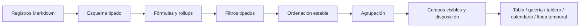

# Vistas de bases de datos y planificación de proyectos

## Modelo de conocimiento estructurado

Una base de datos de Gnosi es una capa de esquema y vistas sobre páginas,
normalmente situada en una carpeta del Vault. El frontmatter de cada página
contiene los valores del registro. Los datos del registro de configuración
definen los tipos de campo, las configuraciones de vistas, las fórmulas, los
rollups, las relaciones, las opciones, los ajustes de visualización y las acciones.

Cada Vault activo se asocia a un único motor SQLite almacenado localmente y a
una fábrica de sesiones tipada. El registro de motores utiliza la ruta del
Vault como clave, emplea una base declarativa tipada de SQLAlchemy, ejecuta la
migración del esquema antes de la primera conexión y libera las conexiones del
pool al eliminar el Vault. Los archivos SQLite permanecen fuera del
almacenamiento del Vault sincronizado con la nube.

La existencia de al menos una vista principal es una invariante. Los mecanismos
de reparación al iniciar y al leer la restauran cuando las escrituras heredadas
o interrumpidas dejan una tabla sin una vista válida.

## Creación de grupos de bases de datos

El botón Crea una DB de la pantalla de bienvenida y el control Añadir base de
datos de la barra lateral comparten una única acción. Ambos crean un grupo en
el registro mediante `/api/vault/databases`, actualizan el registro y dejan
intactos los documentos de página. Se eliminan los espacios sobrantes del
nombre; cancelar o dejarlo vacío no escribe nada, y una petición fallida
conserva el diálogo del grupo para volver a intentarlo.

Una tabla es un objeto distinto, creado dentro de un grupo seleccionado con
su vista principal. La API de páginas sigue admitiendo las páginas antiguas
marcadas con `is_database: true`; la acción de bienvenida no las convierte,
elimina ni reinterpreta automáticamente.

## Fechas de auditoría del sistema

Cada tabla tiene propiedades de creación y última modificación de solo lectura.
Las tablas nuevas traducen sus etiquetas según el idioma de la solicitud o el
idioma actual de la interfaz en Ajustes, y mantienen ambas propiedades al final
del esquema. La creación de un registro establece ambos valores; los guardados
posteriores conservan la fecha de creación y actualizan la de modificación.

La migración idempotente reconoce únicamente tipos de sistema explícitos y
etiquetas heredadas conocidas, por lo que no modifica los campos `date` ajenos
a estos ni los metadatos internos `created_at` o `last_edited_at`. Los clones
deterministas de Notion pueden completar las marcas de tiempo de auditoría
autoritativas mediante la correspondencia de UUID de bases de datos y páginas
configurados, sin buscar coincidencias por título. El índice completo de Notion
se obtiene antes de escribir, y se crea una copia de seguridad de cada archivo
de registro de configuración o Markdown que se modifica.

## Normalización de nombres de tablas y vistas

Las etiquetas de tablas y vistas guardadas del registro de configuración se
normalizan al cargar y al escribir. Se eliminan los emojis decorativos y los
símbolos pictográficos, pero se conservan los acentos y los signos de puntuación
significativos. La vista principal bloqueada siempre tiene exactamente el
mismo nombre que la tabla a la que pertenece, y su marcador `is_main` sigue
siendo la referencia autoritativa.

## Jerarquía de navegación de las tablas

La barra lateral del Vault presenta cada tabla como un nodo padre con dos grupos
de hijos independientes: `Content` contiene los registros de la tabla y `Views`
contiene sus vistas guardadas. Ambos grupos están contraídos por defecto, al
igual que los nodos de tabla y las secciones de navegación de primer nivel, de
modo que una tabla con muchos registros o vistas siga siendo fácil de recorrer
visualmente. Expandir un grupo no debe expandir implícitamente el otro; cada
sección mantiene su propio estado persistido y todas las etiquetas pasan por
el catálogo de traducciones del frontend.

## Flujo de procesamiento de las vistas

`VaultTable.tsx` delega en el controlador y la composición visual tipados de
`vault-table`. El adaptador de tablas compartido de `VaultViewBody` conserva la
identidad de los arrays de filas válidos, las extensiones de metadatos desconocidas
y los callbacks de selección. La edición de celdas, la navegación con teclado,
las filas virtualizadas y las actualizaciones de opciones del esquema permanecen
en módulos separados con pruebas de regresión. `SchemaConfigModal.tsx` delega la
edición del esquema y el guardado automático en `schema-config`, conservando los
ID de campo, los colores de las opciones y los valores predeterminados. Estos
cambios internos no alteran las vistas guardadas ni los metadatos portátiles de
las páginas.

```mermaid
flowchart LR
    Pages["Registros Markdown"] --> Schema["Esquema tipado"]
    Schema --> Derived["Fórmulas y rollups"]
    Derived --> Filter["Filtros tipados"]
    Filter --> Sort["Ordenación estable"]
    Sort --> Group["Agrupación"]
    Group --> Projection["Campos visibles y disposición"]
    Projection --> Table["Tabla / galería / tablero / calendario / línea temporal"]
```

Los valores tipados deben compararse según el tipo declarado de su campo. Una
entrada de texto por sí sola no puede representar todos los valores de filtro;
los campos de fecha, casilla de verificación, número, relación, selección y
valores múltiples se normalizan mediante operadores específicos para cada tipo
de campo.

La evaluación de campos derivados sigue un orden explícito. Las fórmulas que
dependen de valores sin procesar se ejecutan antes que los rollups que agregan
relaciones, y las fórmulas dependientes se resuelven sin permitir que los ciclos
provoquen una recursión indefinida. Las representaciones del backend y del
frontend deben coincidir en la interpretación booleana de las casillas de
verificación, los porcentajes, los valores vacíos y los identificadores de opciones.

Los campos virtuales calculados durante la lectura utilizan proyecciones del
grafo y contextos de cálculo tipados. Las aristas estructurales excluyen los
nodos no resueltos y los de propuestas semánticas; los tipos de las métricas de
NetworkX se acotan al entrar en la caché compartida, mientras que los valores de
grado, nodo central, nodo huérfano y progreso inverso de tareas exponen resultados
primitivos estables. La clave canónica del frontmatter sigue siendo el nombre de
la propiedad en el registro de configuración, sin convertirlo en slug.

El comportamiento canónico de las bases de datos se divide por responsabilidad.
`tables/rules/` se encarga de evaluar fórmulas, rollups, búsquedas y
automatizaciones; `tables/catalogs/`, de la normalización de opciones, los roles
semánticos y el catálogo global de estados; y los pequeños módulos de
`vault/views/`, de la sintaxis de las instantáneas, su materialización, los
filtros, la ordenación y las uniones. Las importaciones históricas de
`rule_engine.py`, `option_catalogs.py` y `view_snapshot.py` siguen siendo fachadas
ligeras de compatibilidad, incluidos los puntos de sustitución para pruebas de
rutas y decoración de relaciones resueltos en el momento de uso.

La capa HTTP de tablas consume directamente esos contratos estrictos de
colecciones, ciclo de vida, esquemas, opciones, vistas y rutas confinadas. Ya no
vuelve a convertir los tipos de sus resultados, de modo que cada módulo de dominio
sigue siendo el único responsable de su tipo de retorno, mientras que el inventario
histórico plano de rutas y el documento OpenAPI permanecen sin cambios.

El grafo transitorio de composición de tablas ahora inyecta listas concretas de
opciones, definiciones de uniones tipadas y un rematerializador de Markdown
compatible con el protocolo. El adaptador conserva la decoración heredada
resuelta en el momento de uso y rechaza los resultados de instantáneas que no
sean texto, en lugar de permitir que lleguen a la persistencia.

`tables/formula_recalculation.py` serializa por tabla los cambios entre registros.
Las solicitudes concurrentes se agrupan en una pasada pendiente; se recalcula
cada fila visible, se escribe el Markdown modificado y se actualizan el índice
de páginas y la caché de respuestas únicamente después de que las escrituras
se completen correctamente.

Los criterios de ordenación de las vistas guardadas se aplican en el orden del
array mediante una comparación estable de varias claves. Los valores vacíos de
las propiedades siempre van después de los valores no vacíos, tanto en orden
ascendente como descendente, conforme a la semántica de las vistas importadas de
Notion. Las vistas del frontend y las instantáneas Markdown del backend utilizan
la misma regla para evitar discrepancias en el orden de los registros.

Cuando `VaultDashboard` muestra una pestaña de tabla, transmite las funcionalidades
habilitadas en el registro de configuración de la tabla a `VaultTable` a través
de `VaultViewBody`. Por tanto, la pestaña de tabla, la tabla independiente, el
panel dividido y la vista incrustada ofrecen las mismas acciones de fila
configuradas. Omitir esa cadena de props oculta una acción incluso cuando el
registro de configuración y la API indican correctamente que está habilitada.

## Ámbito de la búsqueda

Las búsquedas de tabla se aplican a la vista actual por defecto. El selector
puede ampliar una consulta no vacía a toda la tabla de origen, incluidos los
registros excluidos por los filtros o las uniones de la vista, sin modificar
la vista guardada. Limpiar la consulta restaura el ámbito y los filtros de la
vista actual. Si no hay resultados, un mensaje explica el ámbito activo y
ofrece buscar en toda la tabla.

Las vistas incrustadas utilizan el mismo buscador compartido para los registros
y los recuentos. Se recargan mediante la API compartida del vault cuando se
guarda otra página o la ventana recupera el foco. La búsqueda se mantiene durante
la actualización, sin reutilizar una caché de tabla de cinco minutos.

## Evolución del esquema y concurrencia

Las revisiones del esquema protegen al cliente frente al guardado de una lista
de campos antigua sobre otra más reciente. Renombrar un campo actualiza filtros,
criterios de ordenación, fórmulas, acciones y referencias de vistas guardadas.
Al renombrar una tabla, se detectan las colisiones de nombres de archivo en
carpetas planas antes de mover el contenido.

Los registros de configuración se escriben de forma atómica y se actualizan tras
los cambios de metadatos por lotes. Las instantáneas en caché se invalidan cuando
cambian los registros de origen o la revisión del esquema.

Las rutas de vistas por página validan la raíz del registro de configuración, la
tabla de origen, el campo de filtro y la identidad de la página en disco antes
de modificar nada. Su ciclo de lectura, modificación y escritura comparte el
bloqueo canónico del registro y actualiza la caché de la fachada después de un
guardado atómico; la sincronización opcional de secciones de Obsidian sigue
siendo un adaptador tipado que actúa en la medida de lo posible. El identificador
estable `view_id` tiene prioridad sobre los encabezados al insertar o actualizar,
de modo que las vistas incrustadas en paralelo no puedan sobrescribirse entre sí.
Los resultados de lectura, inserción o actualización y eliminación pasan por
modelos Pydantic específicos antes de devolver los mismos diccionarios heredados;
el esquema de solicitud y el documento OpenAPI congelado no cambian.

Las ediciones masivas de campos, la promoción de Zotero Extra y la aplicación
de plantillas comparten un servicio tipado de modificación de páginas. Cada
destino se procesa de forma aislada, comprueba un ETag opcional, actualiza el
índice de páginas tras escribir e informa de omisiones, conflictos y errores
sin interrumpir las filas restantes.

Los editores de propiedades de página utilizan controles específicos para cada
tipo de campo. Los campos `select` y `status` se muestran como selectores de una
sola opción; los catálogos de estados son estrictos y no permiten crear ni
eliminar opciones directamente desde el control. La cuadrícula de la tabla y el
panel de propiedades de página deben conservar el mismo tipo de campo y la
misma semántica de opciones.

Los valores de estado introducidos por reglas de acción se persisten de forma
idempotente a través del dominio de tablas. Los fallos del registro de configuración
se anotan en el log, pero nunca hacen que la regla que los originó se convierta
en una acción de usuario fallida.
La capa de reglas puras resuelve los campos por ID, nombre actual o alias,
evalúa los requisitos previos declarados sin interpretar la ausencia de datos
como una denegación, conserva la clave del frontmatter que ya se utiliza y crea
de forma determinista las opciones de estado que faltan. Las reglas de botones
siguen siendo distintas de las automatizaciones activadas por cambios.

La capa HTTP de planificación está tipada de forma estricta y conserva su
contrato OpenAPI congelado. La resolución del Vault activo falla explícitamente
si no hay ninguno seleccionado, y la materialización de recurrencias consume
de forma acotada los iteradores de ocurrencias RRULE, conservando los
identificadores estables de tareas y las comprobaciones de ETag.

## Planificación de proyectos

El frontend con tipado estricto de `features/planning/` es responsable de la
página de planificación y de sus pruebas de comportamiento, a través de un punto
de entrada público de carga diferida. El componente que representa la línea
temporal sigue siendo compartido con las vistas del Vault. La asignación de
responsabilidad sobre la ruta no altera las solicitudes de programación, la
creación de líneas base, los registros de trabajo ni la aprobación explícita de
propuestas de nivelación.

La planificación consume campos de tareas estructurados y produce un cronograma
autoritativo, en lugar de duplicar la lógica de programación en la interfaz.
El motor normaliza dependencias, calendarios, duraciones, restricciones, recursos,
fechas límite, progreso y dirección de programación. Después calcula fechas,
holguras, tareas críticas, advertencias y asignaciones de recursos.

El motor determinista ahora separa la normalización de datos, la programación
hacia delante de una tarea, el diagnóstico de restricciones, la indexación de
sucesores, la pasada hacia atrás para calcular holguras, la ubicación ALAP y la
serialización de los datos de salida. Esto mantiene inmutables los datos
persistidos y conserva los cronogramas parciales y los diagnósticos ante errores
recuperables del grafo.

El planificador que agrupa solicitudes mantiene el análisis y guardado de Markdown
y las comprobaciones de ETag detrás de un puerto acotado del Vault, resuelto en
el momento de uso, con registros de origen tipados para cada escritura candidata.
Valida la estructura del estado de los plugins antes de leer los ajustes y solo
escribe los límites automáticos cuyo ETag de origen no ha cambiado. El historial
de tarifas de recursos y los valores específicos que sustituyen a los de las
asignaciones se acotan por tipo en la capa de almacenamiento de planificación,
por lo que los cálculos de asignación y nivelación mantienen un tipado estricto
sin modificar los números persistidos ni la semántica del cronograma.

Las duraciones de los períodos conservan tanto su valor numérico como la unidad
configurada (`hours`, `days` o `years`). Los años naturales se suman como
desplazamientos de años del calendario, lo que hace que un año inicial más ocho
años llegue al año final correspondiente, incluidos los años negativos. El editor
de propiedades elimina los campos redundantes de fechas reales, recalcula el
final siempre que cambia el inicio, la duración o un predecesor y utiliza un
selector múltiple con búsqueda para los predecesores. Los valores heredados de
`durationDays` siguen disponibles por compatibilidad con registros antiguos e
instantáneas de cronogramas.

El frontend muestra el resultado y los controles de edición. No recalcula por
su cuenta la semántica del camino crítico. Los cronogramas en caché utilizan
como clave el estado de entrada relevante y se almacenan en los datos locales,
no en los registros de origen del Vault.

## Comportamiento ante fallos

- Las fórmulas no válidas devuelven un error controlado del campo en lugar de
  interrumpir la respuesta de la tabla.
- Las relaciones rotas siguen visibles como valores no resueltos cuando es posible.
- La ausencia de vistas activa una reparación determinista de la vista principal.
- Los ciclos de planificación, las restricciones imposibles o la ausencia de
  calendarios generan diagnósticos y resultados parciales cuando es seguro hacerlo.
- Una revisión del esquema desactualizada devuelve un conflicto y requiere
  recargar o fusionar los cambios.

## Aspectos que verificar

Comprobar la paridad de los filtros tipados, los conflictos de revisión del
esquema, los cambios de nombre de campos y tablas, el orden de evaluación de
fórmulas y rollups, la sincronización de relaciones, la ordenación de instantáneas,
las acciones de los catálogos de opciones, las restricciones de programación,
los caminos críticos y la representación de los paneles mediante pruebas E2E.

## Genogramas

El [plugin Genogramas](genograms.md), opcional por Vault, añade tablas familiares enlazadas, vistas SVG y exportación local a SVG/PNG/PDF, sin servicios externos ni IA.

## Lectura en galería y configuración de vistas

La configuración de las vistas incrustadas parte de los valores efectivos que ya se muestran y conserva filtros, ordenación y apariencia mientras carga el catálogo. Las consultas fallidas permiten reintentar y no pueden guardar valores por defecto. Las tarjetas de galería admiten ancho completo y altura según el contenido, con un único desplazamiento de página. Espacio entra en el grupo desplegado; Izquierda vuelve a la cabecera y lo pliega, mientras que Esc sale de la navegación de registros. Las comprobaciones de uso de vistas pasan por `asyncio.to_thread`, conservan el contexto del vault y mantienen las lecturas de archivos de la nube fuera del bucle HTTP. Las regresiones cubren la carga del modal, las respuestas tardías del catálogo, el foco del teclado y el hilo de comprobación de uso.

Todos los tipos de vista incrustada ofrecen una política de altura guardada en General: limitada (hasta el 70% de la ventana y después desplazamiento interno) o según el contenido (se desplaza la página). La opción sigue la pestaña activa y funciona con vistas compartidas del registro y secciones locales. Las vistas existentes mantienen el comportamiento anterior; los feeds crecen con el contenido y los demás tipos tienen altura limitada por defecto. Las tarjetas de galería de ancho completo no tienen altura mínima y las notas cortas quedan compactas. La tabla sigue gestionando el desplazamiento horizontal y las columnas fijas de tabla y lista. El límite de altura se puede ajustar del 1 al 100% de la ventana (70% por defecto) y se conserva al cambiar de modo. `heightPercent` se valida al cargar y guardar y se aplica como límite relativo a la altura de la ventana.

Las propiedades de las páginas utilizan el tipo de campo registrado para los controles e iconos. Las casillas conservan ambos estados booleanos y el cero numérico permanece visible. Las ediciones guardan números y booleanos sin convertirlos en texto. Al leer, los identificadores estables de los campos tienen prioridad sobre los nombres antiguos y se guardan con el nombre actual. Los resultados de fórmulas y agregaciones utilizan los evaluadores compartidos; los campos derivados y los valores de auditoría son de solo lectura. El bloqueo de página o el rol de lector también desactiva las fechas vacías, los períodos y los selectores. El texto enriquecido conserva los saltos de línea y las propiedades Zotero ofrecen la misma acción de apertura que las celdas de la tabla.

La página mantiene el orden de los campos guardado en la configuración de la tabla, también en la navegación con teclado y las vistas previas compactas. El campo de título no se duplica como propiedad local. Gestionar campos muestra por separado las propiedades exclusivas de la página, con sus valores, y permite eliminarlas de esta página sin modificar el esquema de la tabla. Las eliminaciones locales se guardan inmediatamente, recuperan su valor si fallan y conservan las ediciones pendientes de propiedades.

El modal de vista siempre muestra la tabla de origen. Si una vista nueva se abre sin una tabla activa, permite seleccionarla y habilita los campos, filtros, criterios de ordenación y agrupaciones correspondientes. Las vistas con una tabla configurada conservan ese origen.

La acción Añadir vista de una vista incrustada permite crear una vista nueva o añadir una existente de la misma tabla. Las vistas existentes se añaden como pestañas sin duplicarlas ni modificar su configuración; las pestañas ya visibles no aparecen en el selector. La pestaña seleccionada y las vistas añadidas se conservan al reabrir la página. Las vistas nuevas heredan la tabla de origen de la vista incrustada.

Los selectores de agrupación incluyen todos los tipos de campos registrados o descubiertos. Galería, tabla/lista y Kanban conservan cero y falso, separan y deduplican valores múltiples, resuelven identificadores estables y títulos y mantienen separados los valores vacíos. Las relaciones muestran nombres sin fusionar identificadores distintos; los valores estructurados tienen claves canónicas y etiquetas legibles. Fórmulas y rollups usan los evaluadores compartidos y las casillas tienen etiquetas traducidas. El arrastre de Kanban se limita a campos de texto editables para no corromper números, fechas o resultados calculados. La ayuda de las pestañas se oculta mientras el menú está abierto.

Los campos numéricos comparten la visualización del progreso en páginas, tablas, galería, Kanban y feed. La configuración del campo permite elegir número, barra o anillo de progreso. Los porcentajes y los porcentajes de casillas marcadas muestran una barra por defecto; el cero es visible y los valores vacíos siguen vacíos. El dibujo se limita a 0–100 sin modificar el valor guardado y admite porcentajes calculados con el símbolo de porcentaje. El máximo configurable admite valores fraccionarios (0,5 sobre 1 es el 50%) y valores expresados sobre 100.

### Catálogos de estados propios de cada tabla

Los campos de estado conservan sus opciones salvo que `config.catalog_ref` los
vincule explícitamente a un catálogo compartido. Los vínculos existentes al
catálogo global `status` siguen siendo válidos. Seleccionar el catálogo propio
del campo en el editor de esquema copia las opciones compartidas sin modificar
otras tablas. El editor guarda este cambio antes de renombrar o eliminar
valores. El mantenimiento de catálogos, los editores de registros y la
persistencia de reglas respetan la referencia explícita; las opciones locales
no se fusionan automáticamente con el catálogo global.
Pruebas: `backend/tests/test_status_catalog_isolation.py` y
`frontend/src/features/vault/schema/schema-config/SchemaConfigOptions.test.tsx`.

El guardado del esquema conserva las opciones, referencias, valores predeterminados, grupos y vínculos de conectores en el `config` canónico del campo. Un catálogo propio de estados vacío se guarda como `options: []`; los estados básicos solo inicializan catálogos inexistentes y no se restauran después de eliminarlos. Se mantiene la inicialización de los estados requeridos por las funciones de traducción o publicación activadas.

## Cronograma interactivo de registros

El cronograma de registros utiliza límites del calendario traducidos, una columna de títulos fija y ajustable, fases plegables y una vista del proyecto adaptada a la ventana. Arrastra una barra para mover la tarea, un extremo para ajustar sus fechas o el punto de conexión final hasta una sucesora para crear una dependencia de final a inicio. El controlador guarda el período o los campos de inicio y final con el mismo callback de metadatos de la tabla, conserva el progreso y las dependencias del período y reconoce las columnas de relación de predecesoras. La programación incluye registros ocultos por filtros, rechaza ciclos y propaga ramas convergentes según la predecesora que termina más tarde. Cada registro guarda conjuntamente la dependencia y las fechas resultantes; las operaciones fallidas restauran los cambios completados cuando es posible e informan de restauraciones incompletas. Deshacer restaura los campos modificados durante la sesión de la vista. Los cronogramas incrustados mantienen sus controles de zoom y navegación y gestionan su límite de desplazamiento. Las flechas mueven la barra enfocada, Mayúsculas+flecha ajusta el final y Escape cancela el arrastre.

El pie del cronograma está fuera del desplazamiento vertical de las filas y permanece visible al desplazar la página que lo contiene. La barra horizontal persistente se sincroniza con el cronograma en ambos sentidos, incluidos los controles de navegación y el arrastre de tareas.

El selector de escala ofrece día, semana, mes y año; la vista anual alinea años completos con columnas mensuales. Las tareas principales pueden contraer y recuperar todas las subtareas anidadas.

Haz clic en una línea de dependencia, o enfócala y pulsa Intro/Suprimir, para abrir el diálogo de eliminación compartido. La confirmación elimina únicamente esa predecesora del período o la relación, conserva las fechas y los detalles de las otras conexiones, actualiza la tabla y permite deshacer. Los cronogramas de solo lectura no ofrecen esta acción.

## Títulos visibles y filtros expuestos

Las vistas guardadas tienen un `displayTitle` opcional independiente del `name`
del catálogo. Los selectores de inserción mantienen el nombre largo; los títulos
y pestañas de las vistas insertadas usan el título corto cuando está definido,
con los títulos y nombres anteriores como alternativa. El campo funciona en
todos los tipos de vista y se conserva en el registro, las secciones locales,
las copias y el guardado automático del diálogo.

La acción Renombrar, incluido el doble clic en una pestaña insertada, modifica
solo `displayTitle` y parte del título visible actual. El nombre del catálogo
se edita en Configurar. La vista principal permite este cambio de presentación
y mantiene el bloqueo de eliminación.

Cada regla puede activar `exposed: true`. Su control de valor, adaptado al tipo
de campo, y un interruptor aparecen encima de las vistas insertadas y de tabla.
Los cambios pertenecen a la instancia montada y a la configuración de la página
o pestaña activa; nunca al registro guardado. Restablecer recupera los valores
guardados. Se mantienen los grupos AND/OR y las reglas fijas; los grupos
desactivados se eliminan sin convertir las ramas OR en coincidencias.
La búsqueda en toda la tabla desactiva temporalmente los controles. El recuento
usa los mismos filtros temporales que los resultados. Guardar cambios de diseño
conserva los filtros originales. Cero, falso y los límites de período se
conservan durante la serialización.

La cobertura de regresión incluye `exposedFilters.test.ts`, `PageViewModal.test.tsx`,
`DbViewEmbed.test.tsx`, `TablePane.test.tsx` y
`backend/tests/test_exposed_view_configuration.py`.

La pestaña General del diálogo de vistas insertadas ofrece controles para subir y bajar las pestañas fijadas, incluida la vista ancla. El ancla permanece visible y no se puede desmarcar. El diálogo muestra las vistas fijadas en el orden guardado antes de las disponibles, y el bloque muestra las pestañas en ese mismo orden. Las preferencias del bloque se guardan por página y vista ancla en el almacenamiento local del navegador; las pestañas del registro solo aportan los valores predeterminados cuando no hay ninguna preferencia del bloque. Al reabrir o recargar se conservan tanto el orden elegido como las vistas desmarcadas.

Los tableros Kanban insertados gestionan el límite de altura y el desplazamiento en ambos ejes. La barra horizontal queda dentro del área limitada para que todas las columnas sean accesibles; los tableros con altura según el contenido crecen sin límite vertical.

## Navegación con teclado y celdas de hoja de cálculo

Enfoca una vista de registros y pulsa Intro para entrar en sus registros; Esc vuelve al marco de la vista. Las flechas mueven entre registros. Las vistas basadas en lienzo muestran el registro actual en una franja de navegación con teclado. Los editores y diálogos conservan su gestión del teclado.

Las tablas y listas muestran filas numeradas y columnas con letra y nombre. Las flechas mueven entre celdas; Mayúsculas+flecha selecciona un intervalo. Intro o F2 edita una celda, y Esc cancela la edición antes de salir de la cuadrícula. Copiar y pegar transfiere intervalos rectangulares; una celda copiada puede rellenar las filas seleccionadas, también las no consecutivas. Ctrl/Cmd+D o el botón de rellenar copia la primera fila seleccionada hacia abajo, conserva las referencias relativas de las fórmulas e informa de los errores al guardar.

Las celdas de texto y número aceptan fórmulas que empiezan por `=`, como `=SUM(B1:B3)` o `=[Amount]*2`. La barra de fórmulas muestra la expresión guardada y la celda muestra el resultado. Las referencias siguen el orden de filas y columnas de la vista actual; las referencias con nombre apuntan a campos del mismo registro. Las referencias absolutas como `$B$1` quedan fijas al copiar. Se admiten aritmética, comparaciones, concatenación y funciones básicas de agregación, redondeo y condiciones, con alias traducidos. La evaluación tiene límites, detecta ciclos y no ejecuta código dinámico. Es un subconjunto de fórmulas propio de la vista, sin compatibilidad completa con libros Excel; las fórmulas del esquema se calculan independientemente y son de solo lectura.

Selecciona un intervalo arrastrando o con Mayúsculas+clic; Ctrl/Cmd+clic añade o quita celdas individuales. Pegar un único valor rellena todas las celdas seleccionadas editables, también las no adyacentes, sin cambiar las celdas intermedias. También funcionan los eventos nativos de pegado, y los títulos siguen el contrato de actualización del título. Los cambios se agrupan en una petición por registro; si un registro falla, recupera los valores anteriores en pantalla.

Las tablas incrustadas definen una cuadrícula no editable dentro del editor de texto enriquecido. La selección con el ratón ignora los ancestros editables fuera de la cuadrícula, transfiere el foco a ella y permite ampliar o reducir el intervalo de celdas con Mayúsculas+flechas antes de pegar; los editores de celda conservan la selección de texto.

Las celdas seleccionadas de la tabla muestran un fondo opaco con el color de acento mezclado con la superficie del tema y un contorno interior en cada celda. Un contorno más grueso distingue la celda activa. El mismo estilo cubre los títulos fijos, los intervalos rectangulares y las selecciones separadas en los temas claro y oscuro.

Las cabeceras de tabla separan las acciones del estado de ordenación. Un clic ordena por el campo y alterna ascendente/descendente; un doble clic selecciona toda la columna de la vista actual, también los registros más allá del primer lote cargado, sin cambiar el orden. Solo el campo ordenado muestra una flecha indicativa del sentido. Intro o Espacio ordenan una cabecera enfocada; Mayúsculas+Intro selecciona su columna. El arrastre utiliza un tirador separado. El orden se muestra localmente antes del guardado opcional en serie, funciona sin una función de guardado, respeta los cambios externos posteriores y recupera el orden guardado si falla. Las fechas del sistema se pueden seleccionar y copiar, pero siguen siendo de solo lectura.