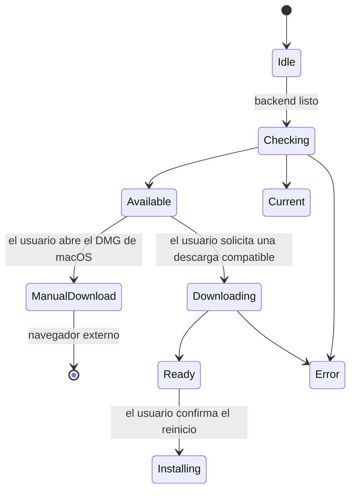

# Clientes de escritorio y complementarios

## Responsabilidades y modos de desarrollo

Electron empaqueta el frontend de React y el backend de Python en una sola
aplicación de escritorio. Su proceso principal controla el proceso hijo del
backend, las ventanas, el protocolo de la aplicación, el estado de las
actualizaciones y las acciones privilegiadas. El proceso de renderizado usa una
API de precarga limitada, nunca acceso sin restricciones a Node.js o al sistema
de archivos.

El desarrollo nativo en el navegador y el desarrollo con Electron tienen
puntos de entrada distintos:

| Modo | Frontend | Responsable del backend |
| --- | --- | --- |
| Navegador nativo | Vite en `http://localhost:5173` | `pnpm dev` desde la raíz inicia Vite y uvicorn |
| Desarrollo con Electron | Vite iniciado por separado en `http://localhost:5173` | `pnpm desktop:dev` inicia su propio proceso hijo de uvicorn en el puerto 5002 |
| Electron empaquetado | Frontend incluido en `app://gnosi/index.html` | `python/cervell_backend` incluido en el paquete, o `cervell_backend.exe` en Windows |

No ejecutes el backend nativo junto con el desarrollo de Electron: el
supervisor de escritorio no adoptará otro proceso que ocupe el puerto 5002.
El modo de desarrollo de Electron no inicia Vite ni solicita la recarga de
uvicorn. Inícialo con `uv run --frozen --no-sync pnpm desktop:dev` después de
sincronizar el entorno de Python, para que `python3`, o `python` en Windows,
se resuelva dentro de ese entorno. El origen de confianza para desarrollo es
HTTP localhost:5173; configura `VITE_DEV_HTTPS=false` para esa sesión de Vite.
Una sesión HTTPS del complemento de Word es una configuración distinta, no un
origen intercambiable con el del cliente de escritorio.

El [README de escritorio](https://github.com/ismigar/Gnosi/blob/main/desktop/README.md)
contiene las instrucciones de configuración y recuperación. Los enlaces de los
menús con React y el aviso de actualización pertenecen a
`frontend/src/app/desktop/`; la presentación de las notas de versión pertenece
a la funcionalidad del centro de control. Reorganizar estas responsabilidades
internas no debe cambiar los nombres IPC, las acciones de actualización ni los
destinos de descarga.

## Inicio, ventanas e IPC

Antes de abrir Chromium o iniciar servicios, `profile-startup.js` obtiene el
bloqueo de instancia única y prepara el perfil existente. Un conflicto o un
estado de recuperación ambiguo detiene el inicio; no autoriza a borrar archivos.

Cada inicio del backend proporciona un valor nuevo de `GNOSI_DESKTOP_INSTANCE`.
El supervisor exige que su propio proceso hijo siga activo y que la respuesta
de estado sea satisfactoria, completa y de tamaño limitado, con la cabecera
`x-gnosi-desktop-instance` correspondiente. Esa cabecera permite relacionar la
respuesta con el proceso; no autentica al usuario ni cambia el JSON público de
estado. Los tiempos de espera agotados, las redirecciones, las respuestas mal
formadas, la salida prematura del proceso y las respuestas HTTP 200 ajenas hacen
fallar el inicio y provocan la terminación y recogida del proceso hijo propio.
Si falta el ejecutable empaquetado, nunca se recurre al Python del sistema.

Nueva ventana, Ajustes, la activación desde el Dock y la visualización diferida
de ventanas no pueden eludir la espera a que el backend esté listo ni el cierre.
Cerrar la última ventana de macOS no cierra la aplicación; salir de ella detiene
su backend. En otras plataformas, cerrar todas las ventanas cierra la aplicación.
Los mensajes de error de inicio están disponibles en inglés, catalán, español
y francés antes de que cargue React; los detalles técnicos quedan en los registros.

Las ventanas principales usan `contextIsolation: true`, `sandbox: true` y
`nodeIntegration: false`. Solo el marco principal actual de una ventana
registrada, situada en el origen de confianza de desarrollo o del paquete,
puede invocar IPC privilegiado. La navegación y las redirecciones no pueden
conservar ese puente en otro origen. Los enlaces HTTP(S) solicitados en una
ventana nueva se abren externamente.

El rellenado de formularios solo acepta una URL inicial HTTPS sin credenciales
y fija su origen exacto antes de cargarla. Los controles de navegación y
redirección se instalan antes de iniciar la carga; se bloquean los destinos sin
cifrar y los de otro origen. La URL final de `webContents` se comprueba de nuevo
inmediatamente antes de cada inyección del perfil sintético, de modo que el
contenido redirigido no recibe ningún byte del perfil.

El protocolo del paquete sirve los recursos del frontend y actúa como proxy de
`/api/` hacia el backend local. Valida el componente de autoridad de la URL de
la aplicación, impide salir de los directorios permitidos y usa el almacén de
cookies de la sesión en lugar de reenviar las cabeceras de cookies sin procesar
del proceso de renderizado. Conserva este comportamiento al modificar el
enrutamiento o los adaptadores de transmisión en continuo.

Los ocho gestores extraídos tienen contratos de solicitud y respuesta comprobados.
El rellenado de formularios reside en `ipc-handlers.js`, ya incluido en el paquete;
el proceso principal aporta la fábrica nativa de ventanas y el registro de mensajes.
La validación del emisor sigue precediendo al acceso al payload y a la apertura
de una ventana independiente y aislada sin puente de precarga. La validación de
URL, el orden de eventos, la serialización del perfil y el programa inyectado
no cambian y cuentan con pruebas diferenciales sintéticas. El programa dentro de
la cadena no se comprueba estáticamente. Esto no acredita el comportamiento en
webs reales, el tipado completo del proceso principal, la aceptación de
instaladores ni la autorización de destinos arbitrarios para formularios.
Las suscripciones de
precarga devuelven funciones de cancelación idempotentes; los métodos de
eliminación compatibles siguen disponibles para procesos de renderizado antiguos.

## Datos locales y recuperación del perfil

El backend empaquetado selecciona el primer valor no vacío en este orden:
`GNOSI_DATA_DIR`, `GNOSI_LOCAL_DATA`, `LOCAL_DATA_DIR` y, por último, el
directorio `userData` existente de Electron. Establece la variable canónica y
conserva cualquier alias de compatibilidad existente. La alternativa de
escritorio no coincide necesariamente con el valor predeterminado de Python
nativo para la plataforma y no traslada una instalación antigua. Usa rutas
absolutas para las configuraciones explícitas y conserva tanto el perfil de
Electron como cualquier directorio de datos independiente del backend antes
de actualizar.

El nombre de paquete con ámbito `@gnosi/desktop` se vuelve a asociar al nombre
histórico de ejecución `gnosi`; se siguen usando las ubicaciones explícitas de
perfil y sesión. El identificador del paquete sigue siendo
`com.gnosi.cervell-digital`.

La protección de perfiles conserva los directorios obsoletos `databases` como
bytes opacos en `.<profile-name>.gnosi-electron-recovery/databases.saved`,
junto a cada perfil. Los movimientos atómicos sin reemplazo y los diarios de
operaciones impiden sobrescribir un destino existente. Se comprueban los
perfiles separados de datos de usuario y de sesión. Las operaciones primitivas
del sistema de archivos no compatibles, los módulos nativos ausentes, las
rutas de datos solapadas o los diarios ambiguos detienen el inicio. Se conservan
los bytes, no la funcionalidad WebSQL eliminada. No restaures ese árbol con el
nombre antiguo mientras se ejecute una versión más reciente de Electron ni
borres los diarios para forzar el inicio.

Para los esquemas de cookies conocidos 19–22, la migración prepara únicamente
la base de datos de cookies, valida su integridad, esquema, número de filas y
un resumen criptográfico de los datos proyectados que respeta su representación
en bytes, y activa después el esquema 23 antes de que Chromium la abra.
El original exacto se conserva en
`.Cookies.gnosi-cookie-recovery/original.sqlite`, junto a `Cookies`.
Si el almacén es desconocido, está dañado, presenta conflictos o usa un cifrado
personalizado, la operación se bloquea por seguridad. No se copia el perfil
completo, no se intenta adivinar una clave de descifrado ni se recurre a texto
sin cifrar.

La reversión explícita de cookies exige que los clientes estén detenidos y que
la migración hacia delante se haya completado. Conserva las cookies más recientes
en `rollback.current.sqlite`, restaura un original verificado mediante su propio
diario de operaciones e impide repetir automáticamente la migración. Conserva
todos los archivos de recuperación hasta la aceptación; nunca fuerces los
números de versión del esquema ni borres bases de datos de cookies. El README
describe la recuperación tras interrupciones y las pruebas aisladas de la
secuencia antigua → destino → destino. El éxito con datos de prueba no demuestra
la migración real de perfiles, del almacén de secretos del sistema operativo ni
de la base de datos de la aplicación en otra máquina.

## Actualizaciones y acciones del usuario

`update-policy.js` selecciona la instalación manual en macOS y la vía de descarga
e instalación automáticas en otras plataformas. En desarrollo, la búsqueda de
actualizaciones está desactivada. En producción, se comprueban después de un
inicio correcto, pero tanto `autoDownload` como `autoInstallOnAppQuit` son
falsos: la disponibilidad de una versión o el cierre de la aplicación no inicia
una instalación no solicitada.

En macOS, la acción explícita abre la URL del DMG oficial correspondiente a la
arquitectura. El empaquetado actual usa firma ad hoc; el reinicio con instalación
automática sigue desactivado hasta disponer de una configuración estable y
revisada de Developer ID y notarización. Superar la verificación de `codesign`
no basta para aceptar el sistema de actualización. Del mismo modo, la política
de Windows/Linux no demuestra que la instalación funcione con todos los formatos
de artefacto; prueba el destino realmente instalado.

El proceso principal conserva el último estado de actualización para los
procesos de renderizado que se suscriban tarde. Las comprobaciones en segundo
plano no abren el historial de versiones. El usuario lo abre explícitamente
desde el Centro de control; los cambios de versión no lo abren durante el inicio.

## Herramientas y límites del empaquetado

El espacio de trabajo fija Node 22.22.2 y pnpm 11.19.0. Las dependencias de
escritorio fijan actualmente Electron 43.4.1, electron-builder 26.15.3 y
ASAR 4.3.0. El entorno de ejecución de Node integrado en Electron es distinto
del usado para compilar el espacio de trabajo. El comando explícito
`install:runtime` instala su binario; no habilites todos los scripts de
instalación de dependencias para solucionar la ausencia del entorno de ejecución.

Compila el frontend antes de empaquetar la aplicación de escritorio.
`build-python.sh` exige exactamente Python 3.11, acepta `GNOSI_PYTHON_CMD`
cuando se configura explícitamente y crea un entorno temporal único usando el
`uv.lock` congelado de la raíz y el grupo de dependencias `desktop`. Genera
una especificación de PyInstaller, valida el análisis y el paquete, copia el
resultado verificado en `desktop/dist-python/` y ejecuta la prueba básica
aislada del backend empaquetado. No usa un archivo de requisitos independiente
ni el entorno existente del desarrollador.

La política de recursos lee el código fuente sin importar la aplicación.
Conserva los recursos de Alembic, las instrucciones del agente, las skills de
traducción dinámica, los plugins de ejemplo y los estilos bibliográficos.
Rechaza recursos ausentes, modificados, no revisados o inseguros, en lugar de
incluir recursivamente vaults, bases de datos, configuración, secretos o
herramientas generadas. El hook `afterPack` comprueba el ASAR real y los recursos
de Python antes de la firma. Los recursos gráficos pertenecen a
`desktop/assets/`; los paquetes generados, a `desktop/dist/` y
`desktop/dist-python/`.

| Destino configurado | Arquitectura del ejecutor | Instaladores y artefactos de actualización |
| --- | --- | --- |
| macOS arm64 | macOS ARM64 en infraestructura propia | `Gnosi-<version>-arm64.dmg`, ZIP, `latest-mac.yml` |
| macOS x64 | macOS X64 en infraestructura propia | `Gnosi-<version>-x64.dmg`, ZIP, `latest-mac.yml` |
| Linux arm64 | Linux ARM64 en infraestructura propia | AppImage, DEB, `latest-linux-arm64.yml` |
| Windows x64 | Windows X64 en infraestructura propia | `Gnosi-<version>-Setup.exe`, `latest.yml` |

La arquitectura del backend congelado debe coincidir con la de destino. Los
destinos macOS no deben empaquetar silenciosamente ambas arquitecturas con un
único backend nativo del equipo de compilación. Linux pasa `--arm64`; Windows
usa NSIS x64. Estos trabajos no fijan una versión de macOS ni cubren Linux x64
o Windows arm64. Los dos trabajos de macOS se ejecutan en serie; Windows espera
a macOS, mientras Linux puede ejecutarse en paralelo. La concurrencia se limita
por referencia Git, no mediante un bloqueo global que garantice la capacidad
del equipo anfitrión.

Windows recibe una excepción a la política de ejecución de PowerShell limitada
al trabajo y prepara Git antes de obtener el código cuando hace falta; no
debilites la política de toda la máquina. La compilación del backend pasa entre
comillas los argumentos del intérprete, usa estructuras de entornos virtuales
temporales específicas de cada plataforma e intenta limpiarlos en la medida
de lo posible. El manifiesto de Python restringe actualmente `cryptography`
para macOS x86_64 a la serie 48.x; la invocación actual de uv no impone la
instalación exclusiva de binarios. Verifica la procedencia de los paquetes wheel
y su ABI en el ejecutor real, sin dar por hecha esa restricción ni sustituir
su Python/OpenSSL.

Todos los scripts de compilación de escritorio, incluidos los alias de la raíz
`package:desktop` y `build:desktop`, desactivan la publicación de
electron-builder con `--publish never`. Preparan artefactos locales; no
certifican ni publican una versión.

## Preparación de versiones y distribución exclusiva de candidatos

El historial incluido en la aplicación está en
`frontend/src/features/control-center/releases/releases.json`.
Los manifiestos de la raíz, del frontend y del escritorio, los metadatos de
Python, los archivos de bloqueo, las notas localizadas y el registro de cambios
deben coincidir antes del lanzamiento. `sync-release-version.cjs` prepara las
cuatro entradas antes de escribir únicamente sus campos de versión. Las
entradas ilegibles, las asignaciones no compatibles y los duplicados ambiguos
fallan antes de cualquier escritura. Conserva las versiones dentro de objetos
JSON, los comentarios y los finales de línea; una versión idéntica no reescribe
ningún archivo. El localizador TOML admite `[project].version` entre comillas
en una sola línea, pero no valida todo el TOML. La actualización del archivo
de bloqueo todavía debe validar el proyecto Python. Las escrituras separadas
no son una transacción resistente a interrupciones: un fallo de entrada/salida
o una interrupción puede dejar cambios parciales. Revisa las diferencias con
la base registrada de la rama de preparación antes de reintentar. Siguen siendo
necesarias la validación del catálogo y del registro de cambios y la revisión
de los archivos de bloqueo actualizados.

`desktop/release.sh` prepara versiones y artefactos locales. No crea etiquetas
ni publica versiones. Usa una rama explícita de preparación y excluye los
cambios ajenos a ella. Las nuevas correcciones de empaquetado requieren una
nueva etiqueta revisada, no publicar código distinto bajo una etiqueta antigua.
Añade enlaces de descarga por plataforma solo cuando existan realmente los
artefactos públicos inmutables correspondientes.

`desktop/release-version.js` es el límite compartido de versión de lanzamiento
para el actualizador y el recopilador de artefactos. Usa la implementación
SemVer fijada con `electron-updater`, acepta metadatos de compilación canónicos
y rechaza espacios adyacentes, prefijos `v` y versiones no válidas o no
canónicas. La política de actualización y el empaquetado no deben introducir
un segundo analizador.

`Build Release Candidate` comprueba que la etiqueta solicitada existe y que,
al resolverla hasta su commit, coincide exactamente con el `github.sha` extraído,
tanto en envíos de etiquetas como en ejecuciones manuales. Las entradas mal
formadas, las etiquetas ausentes, los destinos que no son commits o las
discrepancias detienen el proceso antes de instalar dependencias. La herramienta
de identidad usa Git local y no mueve referencias ni descarga referencias por
sí sola. La protección de etiquetas remotas sigue siendo un requisito aparte.

A continuación, el flujo invoca la CI existente en el mismo commit sin heredar
secretos. Las compilaciones por arquitectura requieren que la CI finalice
correctamente. Incluye documentación, frontend, backend, pruebas básicas nativas
y compilaciones de imágenes Docker. La documentación de las PR se comprueba
contra su base exacta; los candidatos comprueban los catálogos actuales y todos
los portales de idioma en modo estricto en su propio SHA, no mediante una revisión
ficticia del impacto de una PR.

La recopilación descarga únicamente los cuatro artefactos de arquitectura
designados, excluyendo los candidatos anteriores al repetir una ejecución.
Instala las dependencias bloqueadas del recopilador con los scripts de ciclo
de vida desactivados, comprueba la versión, las referencias y las huellas
SHA-512, rechaza los archivos ausentes o en conflicto y combina los dos
manifiestos de actualización de macOS. La generación de índices, la
presentación de las notas de versión y la subida del candidato se realizan
después de la validación.

El artefacto final de Actions es `candidate-<tag>-<sha>-<attempt>` y se conserva
durante cinco días. Contiene instaladores, metadatos de actualización, índices
y notas de versión. No es un almacenamiento confidencial y nunca debe contener
datos de usuario ni secretos. El flujo tiene permisos de solo lectura sobre
el repositorio y no crea borradores en GitHub, no publica versiones ni modifica
artefactos públicos existentes o canales de actualización.

La distribución pública sigue desactivada hasta completar la aceptación del
modo nativo, Docker, los instaladores y las actualizaciones desde 2.x, y revisar
por separado una vía de publicación. Un candidato correcto no autoriza a
publicar 3.0.0.

## Clientes web y ofimáticos

El capturador web envía `POST /api/public/clip` con un token de acceso personal
y lee la configuración de los campos solicitados y del destino desde
`GET /api/public/clip/config`. El backend elige el vault de destino; la
extensión no obtiene acceso arbitrario al sistema de archivos. Su token y la
URL del backend se guardan en el almacenamiento local de la extensión. El
empaquetado para navegadores y la aceptación en sus tiendas son independientes
de la aceptación del instalador de escritorio.

El panel de tareas de Word está en `frontend/public/word-addin/` y usa Office.js.
Sus llamadas a la API usan el origen del panel y un token bearer configurado
explícitamente; que un endpoint público responda correctamente no demuestra
que el acceso a las citas esté autorizado. El origen HTTPS del manifiesto y el
certificado de confianza deben coincidir con su despliegue. Las herramientas de
`extensions/office/word-cite/` modifican referencias del documento o paquete,
o la plantilla de Word del usuario, para mantener el panel de forma opcional.
Son modificaciones explícitas de documentos o configuración, no una acción
normal del inicio de Gnosi.

El cliente de LibreOffice es un gestor de protocolo Python/UNO que usa
`urllib` de la biblioteca estándar. Lee `api_token` de su propia configuración
o de `GNOSI_API_TOKEN`; no des por hecho que comparte la sesión del navegador.
Ambos clientes usan los endpoints de formato de citas del vault y el
procesamiento Pandoc/CSL del backend. El formato sensible al contexto necesita
las claves del documento en orden, incluidas las citas repetidas. La
actualización de Writer recorre tablas anidadas; los encabezados y pies de
página aportan claves bibliográficas, pero la actualización ordenada no los
reescribe. El comportamiento de la aplicación ofimática anfitriona debe
probarse en la aplicación compatible real, no deducirse de pruebas de recorrido
con datos simulados.

## Aceptación y resolución de problemas

La prueba básica del backend empaquetado exige una respuesta de estado HTTP 200
de tamaño limitado con `status: ok`, `mode: FastAPI` y una identidad nueva de
la prueba en `gnosi_mode`. Usa rutas desechables de datos y vaults, desactiva
la automatización operativa y recoge su proceso hijo tanto si tiene éxito como
si falla. `GNOSI_VALIDATION_ROOT` valida todos los selectores y bloquea los
archivos de entorno locales y compartidos y el acceso al almacén de
credenciales. La generación de OpenAPI usa el mismo aislamiento. Nunca
establezcas esta opción en el desarrollo normal ni en aplicaciones instaladas.

Los contratos comprobados en el código fuente, los entornos anfitriones simulados
y una ejecución de FastAPI desde el código fuente no demuestran que funcione
un instalador con el backend congelado ni una actualización real. Antes de
distribuir públicamente, verifica en cada destino real la instalación, el primer
inicio, el IPC, la conservación de cookies y perfiles, la integridad de la base
de datos, la vía de actualización y la recuperación, además de los flujos
autenticados del navegador y el inicio y la persistencia de Docker. El éxito
local en macOS no puede certificar otro destino.

| Síntoma | Qué revisar a continuación | Qué no hacer |
| --- | --- | --- |
| El desarrollo con Electron se queda en blanco | Origen HTTP de Vite, PATH del entorno Python congelado y registro de inicio del backend propio | Iniciar un segundo backend en el puerto 5002 |
| La protección del perfil detiene el inicio | Error exacto, rutas originales y de recuperación, clientes detenidos | Borrar diarios de operaciones, cookies o datos antiguos |
| Falta el backend empaquetado | Resultado de PyInstaller y política de recursos finales | Recurrir al Python del sistema |
| macOS ofrece un DMG | Política actual de instalación manual y arquitectura | Considerar la verificación de firma como aceptación de la actualización automática |
| Office puede consultar el estado, pero las citas fallan | Token bearer, origen de la API y respuesta real del recurso protegido | Desactivar la autenticación para ocultar un fallo del cliente |

Ejecuta las pruebas de contratos de escritorio del repositorio, la comprobación
estricta de IPC, la validación documental y los comandos pertinentes de pruebas
básicas aisladas. Inspecciona la salida y los registros del navegador y del
escritorio, no solo los códigos de salida. Mantén separadas las evidencias
de las plataformas de destino y las pruebas sintéticas.
