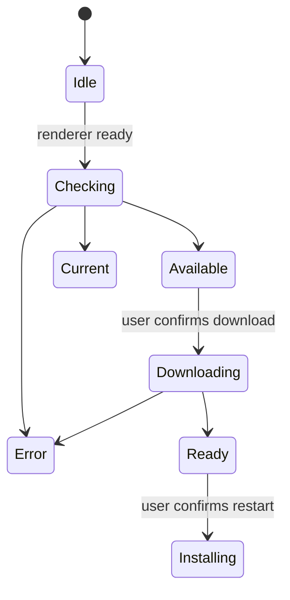

# Cliente de escritorio y acompañantes

## Escritorio electrónico

El proceso principal es propietario de backend startup, proceso de limpieza, ciclo de vida de las ventanas, rutas de recursos empaquetadas, cheques de actualización, descargas, instalación y acciones privilegiadas de escritorio. El renderizador recibe una API de precarga estrecha en lugar de acceso directo a Node.js.

El motor Python empaquetado debe estar listo antes de que el renderizador trate la aplicación como utilizable. Los fallos de inicio se presentan con diagnósticos y la limpieza evita procesos de backend huérfanos después de que la ventana sale.

## Actualizar máquina de estado

Las comprobaciones están deshabilitadas en el desarrollo. Las descargas nunca comienzan simplemente porque existe una versión. El proceso principal almacena el estado del actualizador más reciente para que un renderizador que se suscribe tarde pueda recuperarlo a través de IPC.

Los artefactos de lanzamiento incluyen instaladores y metadatos de actualización para macOS, Windows y Linux. La preparación de la versión mantiene alineados los frontend y los manifiestos de Electron; las etiquetas se crean sólo a partir de la revisión `main` se compromete.

## Preparación de versiones

`frontend/src/content/releases.json` es el historial canónico de versiones
incluido en el paquete. El sincronizador mantiene idénticas las versiones del
manifiesto del frontend, del manifiesto de Electron y de la entrada del
frontend en el lockfile del monorepo. Una entrada estable preparada antes de
publicarse omite expresamente `downloadUrl`; este campo solo se añade cuando
existen la etiqueta inmutable y los artefactos de cada plataforma.

Antes de crear la etiqueta, la PR de release debe superar la validación del
frontend, los tests backend, la QA nativa en el navegador y la puerta de
documentación de ingeniería. Después del merge, el workflow de sincronización
debe llevar el commit revisado al repositorio público, donde debe superar el
release readiness. Finalmente, el workflow de release crea un borrador y los
artefactos de macOS, Windows y Linux se revisan antes de publicarlo.

## Cortapapeles web

La extensión del navegador extrae el título de la página actual, URL, contenido seleccionado o legible, y metadatos soportados, luego envía una solicitud limitada a la API de Gnosi. El motor realiza autenticación, desinfección, deduplicación y Vault escribe. La extensión no recibe acceso arbitrario al sistema de archivos Vault.

## Clientes de citación de libreOffice y Word

La extensión LibreOffice registra un controlador de protocolo y llama a los puntos finales de citación de Gnosi desde el proceso de oficina. El ayudante de Word mantiene el estado de tarea/panel/adición requerido para acceder al mismo servicio local. Ambos clientes tratan la inserción de citación y la actualización de bibliografía como mutaciones explícitas de documentos.

Las API específicas de la oficina se aíslan detrás de ayudantes de traversal e inserción para que las pruebas puedan falsificar el UNO o agregar límite sin requerir la aplicación completa de la oficina para cada prueba de unidad.

## Invariantes

- El código de renderizador no tiene capacidad ilimitada de Node.js o sistema de archivos.
- IPC expone operaciones nombradas con entradas validadas.
- Actualizar la descarga y la instalación requieren acciones explícitas del usuario.
- Los caminos de recursos combinados difieren de los caminos de desarrollo y se resuelven en
tiempo de ejecución.
- Los clientes acompañantes autentican el motor y permanecen dentro de su estrecho
captura o alcance de citación.
- Los borradores de la versión se inspeccionan antes de su publicación.

## Enfoque de verificación

Ejecute comprobaciones de sintaxis/construcción de electrones, pruebas de humo de backend empaquetados, pruebas de estado del actualizador, validación de compilación de extensiones, pruebas de transmisión de citas y CI de la plataforma.
