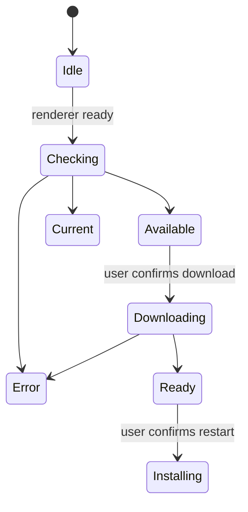

# Cliente de escritorio y acompañantes

## Escritorio electrónico

El proceso principal es propietario de backend startup, proceso de limpieza, ciclo de vida de las ventanas, rutas de recursos empaquetadas, cheques de actualización, descargas, instalación y acciones privilegiadas de escritorio. El renderizador recibe una API de precarga estrecha en lugar de acceso directo a Node.js.

El motor Python empaquetado debe estar listo antes de que el renderizador trate la aplicación como utilizable. Los fallos de inicio se presentan con diagnósticos y la limpieza evita procesos de backend huérfanos después de que la ventana sale.

## Actualizar máquina de estado

Las comprobaciones están deshabilitadas en el desarrollo. Las descargas nunca comienzan simplemente porque existe una versión. El proceso principal almacena el estado del actualizador más reciente para que un renderizador que se suscribe tarde pueda recuperarlo a través de IPC.

Los artefactos de lanzamiento incluyen instaladores y metadatos de actualización para macOS, Windows y Linux. La preparación de la versión mantiene alineados los frontend y los manifiestos de Electron; las etiquetas se crean sólo a partir de la revisión `main` se compromete.

El workflow privado de release empaqueta macOS Intel y Apple Silicon en jobs
separados de una matriz. Cada job se ejecuta sobre la arquitectura
correspondiente de macOS 15 y construye un único backend nativo con PyInstaller
antes de invocar electron-builder para el mismo objetivo. Así se evita copiar
un ejecutable Python nativo del host dentro de la aplicación de la otra
arquitectura. Los runners de release están fijados en lugar de usar
`macos-latest`, cuya migración a macOS 26 cambió la creación del DMG a APFS y
rompió la fase de montaje y personalización de electron-builder.
Cada job de release también pasa explícitamente al constructor del backend el
comando Python proporcionado por `actions/setup-python`. Esto mantiene las
extensiones binarias y las bibliotecas OpenSSL recopiladas sobre un único ABI
de intérprete y evita que un Python más nuevo del runner sustituya el entorno
de release.
Como `cryptography` 49 y posteriores ya no publican wheels macOS x86_64, el
paquete Intel usa la última línea universal2 compatible (`48.0.1`) y las demás
plataformas conservan el requisito actual. El instalador del backend congelado
exige una distribución binaria de `cryptography`: debe fallar en lugar de
compilar contra un OpenSSL del runner que pueda colisionar con la biblioteca
recopilada por PyInstaller.

La lista de archivos del constructor de Electron es un límite explícito del
runtime. El hook multiplataforma `afterPack` inspecciona el `app.asar` final y
rechaza un paquete que omita el proceso principal, el preload, el módulo del
menú nativo, el iniciador del backend o la política de actualización. Esta comprobación del artefacto
instalado complementa las pruebas de código fuente e impide que un árbol de
fuentes válido produzca una aplicación que falle antes de abrir la primera
ventana.

La ruta del backend empaquetado resuelve el propio ejecutable de PyInstaller en
macOS y Linux, y su equivalente `.exe` en Windows. El proceso principal ejecuta
directamente ese archivo resuelto y no lo trata como otro nivel de directorio.
La construcción limpia instala los requisitos canónicos del runtime E2E,
incluidas las dependencias de proveedores y API, e inicia el ejecutable
congelado como prueba de humo multiplataforma antes de continuar con el paquete
de escritorio.

El proceso de escritorio instalado define `GNOSI_LOCAL_DATA` dentro de la
carpeta de datos de aplicación del usuario que proporciona Electron, salvo que
exista una sobrescritura explícita. Así los paquetes nativos no usan la ruta
exclusiva de Docker `/app/data`. La comprobación de arranque consulta el endpoint
público `/api/health` y no queda bloqueada por un endpoint protegido. El backend
congelado desactiva el observador de recarga de archivos de Uvicorn; el
desarrollo nativo desde código fuente conserva la recarga.

## Preparación de versiones

`frontend/src/content/releases.json` es el historial canónico de versiones
incluido en el paquete. El sincronizador mantiene idénticas las versiones del
manifiesto del frontend, del manifiesto de Electron y de la entrada del
frontend en el lockfile del monorepo. Una entrada estable preparada antes de
publicarse omite expresamente `downloadUrl`; este campo solo se añade cuando
existen la etiqueta inmutable y los artefactos de cada plataforma.
Como la versión del manifiesto del frontend es un límite de escritorio de alto
impacto, cada pull request de preparación de una release también actualiza este
contrato revisado y sus espejos localizados, aunque el patch no cambie el
comportamiento en tiempo de ejecución.
La validación del changelog normaliza los finales de línea antes de compararlos,
de modo que un checkout Windows con CRLF equivalente no haga fallar el gate de
empaquetado multiplataforma.

Antes de crear la etiqueta, la PR de release debe superar la validación del
frontend, los tests backend, la QA nativa en el navegador y la puerta de
documentación de ingeniería. Después del merge, el workflow de sincronización
debe llevar el commit revisado al repositorio público, donde debe superar el
release readiness. El workflow del repositorio privado es el único propietario
de las etiquetas oficiales, los artefactos multiplataforma, los catálogos
firmados, las notas y el borrador del repositorio público. El workflow de
escritorio sincronizado al repositorio público solo se ejecuta manualmente, por
lo que puede validar el empaquetado sin competir con un build oficial. Los
artefactos de macOS, Windows y Linux se revisan antes de publicarlos.

## Cortapapeles web

La extensión del navegador extrae el título de la página actual, URL, contenido seleccionado o legible, y metadatos soportados, luego envía una solicitud limitada a la API de Gnosi. El motor realiza autenticación, desinfección, deduplicación y Vault escribe. La extensión no recibe acceso arbitrario al sistema de archivos Vault.

## Clientes de citación de libreOffice y Word

La extensión LibreOffice registra un controlador de protocolo y llama a los puntos finales de citación de Gnosi desde el proceso de oficina. El ayudante de Word mantiene el estado de tarea/panel/adición requerido para acceder al mismo servicio local. Ambos clientes tratan la inserción de citación y la actualización de bibliografía como mutaciones explícitas de documentos.

Las API específicas de la oficina se aíslan detrás de ayudantes de traversal e inserción para que las pruebas puedan falsificar el UNO o agregar límite sin requerir la aplicación completa de la oficina para cada prueba de unidad.

## Invariantes

- El código de renderizador no tiene capacidad ilimitada de Node.js o sistema de archivos.
- IPC expone operaciones nombradas con entradas validadas.
- Actualizar la descarga y la instalación requieren acciones explícitas del usuario.
- Los caminos de recursos combinados difieren de los caminos de desarrollo y se resuelven en
tiempo de ejecución.
- Los clientes acompañantes autentican el motor y permanecen dentro de su estrecho
captura o alcance de citación.
- Los borradores de la versión se inspeccionan antes de su publicación.

## Enfoque de verificación

Ejecute comprobaciones de sintaxis/construcción de electrones, pruebas de humo de backend empaquetados, pruebas de estado del actualizador, validación de compilación de extensiones, pruebas de transmisión de citas y CI de la plataforma.
